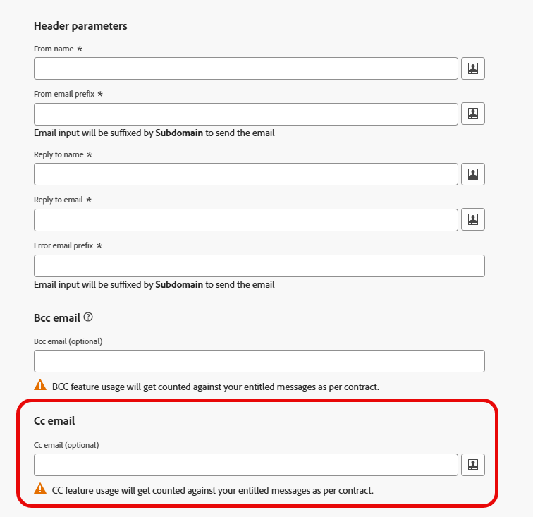

# Een CC-veld toevoegen aan e-mailberichten {#cc-email-field}

>[!CONTEXTUALHELP]
>id="ajo_admin_config_cc"
>title="Een CC-e-mailadres definiëren"
>abstract="U kunt een zichtbaar CC-veld (koolstofkopie) toevoegen aan e-mailberichten die worden verzonden met deze kanaalconfiguratie. Voer een vast e-mailadres in of gebruik personalisatie (profielkenmerk of contextvariabele). Houd er rekening mee dat CC-gebruik wordt geteld bij het berichtvolume waarvoor je recht hebt."

>[!AVAILABILITY]
>
>Deze functie is beschikbaar voor alle klanten met beperkte beschikbaarheid. Neem contact op met uw Adobe-vertegenwoordiger voor toegang.

U kunt een zichtbaar CC-veld (carbon copy) toevoegen aan e-mails die door [!DNL Journey Optimizer] via uw reizen en campagnes worden verzonden. Deze facultatieve eigenschap wordt gevormd op het [&#x200B; niveau van de kanaalconfiguratie &#x200B;](channel-surfaces.md), naast de parameters van de e-mailkopbal en BCC e-mailoptie.

>[!CAUTION]
>
>Het gebruik van de CC-functie wordt meegeteld bij het aantal berichten waarvoor u een licentie hebt. Schakel deze alleen in waar u zichtbare CC-ontvangers nodig hebt. Controleer uw contract op volumes met licentie.

Als [&#x200B; BCC &#x200B;](archiving-support.md#bcc-email), wordt het gebied van CC bedoeld om een exemplaar van e-mail naar een extra adres te verzenden. Het verschilt echter op de volgende manieren van BCC:

* Het CC e-mailadres is zichtbaar voor de primaire ontvanger, zodat de primaire ontvanger kan zien wie wordt gekopieerd en wie om voor follow-up te contacteren kent.
* In tegenstelling tot BCC, steunt het de e-mailgebied van CC verpersoonlijking, die u toelaat om één kanaalconfiguratie voor vele scenario&#39;s te gebruiken, en het exemplaar naar de juiste persoon per ontvanger (b.v. hun relatiemanager) te verzenden. Voor API-getriggerde campagnes, staat dit u toe om het adres relevant voor een specifieke gebeurtenis of een transactie te CC.

>[!NOTE]
>
>Als u exemplaren moet houden waar het adres niet aan de ontvanger voor archiverings of nalevingsdoeleinden zichtbaar moet zijn, gebruik [&#x200B; BCC &#x200B;](archiving-support.md#bcc-email) in plaats van CC.

## CC-e-mail inschakelen {#enable-cc}

Om de **[!UICONTROL CC email]** optie toe te laten, vorm het gebied van CC in de [&#x200B; configuratie van het e-mailkanaal &#x200B;](../email/email-settings.md).

U kunt elk extern adres opgeven in de juiste indeling, behalve een e-mailadres dat is gedefinieerd voor een subdomein dat is gedelegeerd aan Adobe. Bijvoorbeeld, als u *marketing.luma.com* subdomain aan Adobe delegeerde, wordt om het even welk adres als *abc@marketing.luma.com* verboden.

>[!CAUTION]
>
>U kunt slechts één e-mailadres definiëren. Zorg ervoor dat het CC-adres voldoende ontvangstcapaciteit heeft om alle e-mails op te slaan die met de huidige kanaalconfiguratie worden verzonden.
>
>Meer aanbevelingen worden vermeld in [&#x200B; deze sectie &#x200B;](#cc-recommendations-limitations).

Het veld **[!UICONTROL CC email]** accepteert drie typen waarden:

* A **hardcoded waarde**, die een vast e-mailadres kan zijn.

* A **profielattributen**, zoals het e-mailadres van de relatiemanager beschikbaar in het profiel.

* A **contextafhankelijke attributen** - deze waarde kan **slechts in API-teweeggebrachte campagnes** worden gebruikt. Deze wordt opgehaald uit de API-payload die de contextvariabele `context.channel.email.ccvalues` met de CC-adreswaarde moet bevatten.

  >[!WARNING]
  >
  >Wanneer CC gebruikend a **contextvariabele** wordt geplaatst, wordt het gesteund slechts in **API-teweeggebrachte campagnes**. Als u die kanaalconfiguratie in een reis of een actiecampagne gebruikt, wordt e-mail verzonden naar de primaire ontvanger slechts; geen exemplaar wordt verzonden naar het adres van CC.

Om het even welke [&#x200B; gehechtheid &#x200B;](../email/pdf-attachments.md) inbegrepen in het bericht wordt verzonden naar zowel de primaire ontvanger als het adres van CC.

Als de CC-waarde ongeldig is of ontbreekt tijdens het verzenden (bijvoorbeeld een lege contextvariabele), wordt de CC-kopie overgeslagen; de primaire ontvanger ontvangt de e-mail nog steeds.

Als er meerdere waarden zijn voor het CC-veld (bijvoorbeeld wanneer u een profielkenmerk of expressie gebruikt die naar meerdere adressen wordt omgezet), wordt alleen de eerste waarde gebruikt voor het verzenden van de e-mail.

## CC-e-mail bewerken in bestaande kanaalconfiguraties {#cc-edit}

Als u [&#x200B; een e-mailconfiguratie &#x200B;](channel-surfaces.md#edit-channel-surface) uitgeeft en het gebied van CC toevoegt of verandert, kunt u slechts gebruiken:

* A **hardcoded** het e-mailadres van CC, of
* A **contextvariabele** (voor API-teweeggebracht gebruik).

>[!CAUTION]
>
>Wanneer het uitgeven van een bestaande configuratie van het e-mailkanaal, kunt u geen nieuwe [&#x200B; profielattributen &#x200B;](../personalization/personalization-build-expressions.md#sources) aan het **[!UICONTROL CC email]** gebied toevoegen. U moet a [&#x200B; nieuwe kanaalconfiguratie &#x200B;](channel-surfaces.md#create-channel-surface) tot stand brengen.

## Aanbevelingen en beperkingen {#cc-recommendations-limitations}

* **Entitlement:** het gebruik van CC wordt geteld naar uw recht berichtvolume. Gebruik CC alleen waar u zichtbare CC-ontvangers nodig hebt. Controleer uw contract op volumes met licentie.

* **Privacy en naleving:** om uw privacynaleving te verzekeren, moeten de e-mails van CC door een systeem worden verwerkt geschikt om veilig persoonlijk identificeerbare informatie (PII) op te slaan wanneer toepasselijk. Aangezien de berichten gevoelige of privé gegevens, zoals PII kunnen bevatten, zorg ervoor het adres van CC correct is en de toegang tot berichten veilig.

* **Inbox beheer:** Uw inbox die voor CC wordt gebruikt zou behoorlijk voor ruimte en levering moeten worden beheerd. Als de postbus bellen retourneert, worden sommige e-mails mogelijk niet ontvangen.

* **de timing van de Levering:** de Berichten kunnen aan het CC e-mailadres vóór de doelontvangers worden geleverd. De berichten van CC kunnen ook worden verzonden alhoewel de originele berichten [&#x200B; kunnen hebben die &#x200B;](../reports/suppression-list.md#delivery-failures) worden teruggestuurd.

* **het Melden:** opent, klikt, en andere overeenkomst van de ontvangers van CC is inbegrepen in e-mail rapporteringsmetriek. Aldus, om het even welk opent of klikt van de ontvangers van CC zal misberekeningen in [&#x200B; rapporten &#x200B;](../reports/report-gs-cja.md) veroorzaken.

* **Spam:** Markeer geen berichten als spam in CC inbox, aangezien het alle andere e-mails zal beïnvloeden die naar dit adres worden verzonden.

* **Leverbaarheid:** Gebruik CC in lijn met uw verzendende praktijken en ontvankelijke verwachtingen. Het bovenmatige gebruik van CC kan bevrediging beïnvloeden; volg [&#x200B; best practices van de leverbaarheid &#x200B;](../reports/deliverability.md) en uw contracttermijnen.

>[!CAUTION]
>
>Klik niet de unsubscribe verbinding in de e-mail die naar het adres van CC wordt verzonden aangezien u onmiddellijk **aan** ontvanger van e-mail zult opzeggen.
