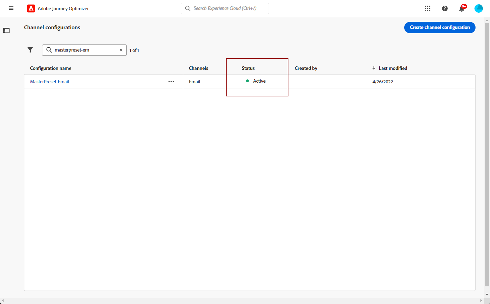
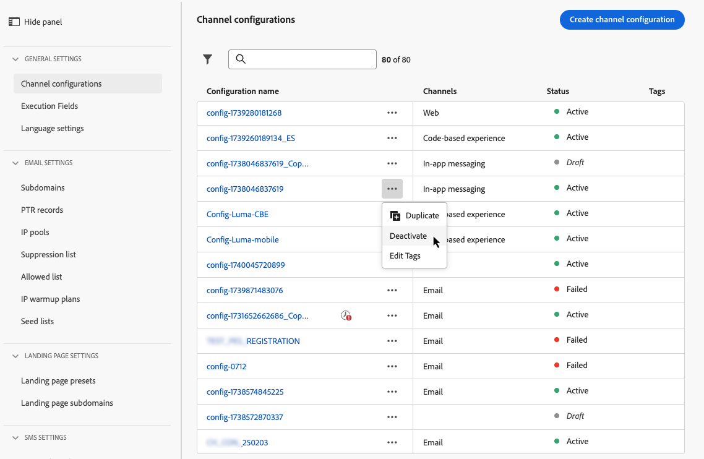

# Kanaaloppervlakken instellen {#set-up-channel-surfaces}

>[!CONTEXTUALHELP]
>id="ajo_admin_channel_surfaces"
>title="Kanaaloppervlak"
>abstract="Een kanaaloppervlakte is een configuratie die door een Beheerder van het Systeem is bepaald. Het bevat alle technische parameters voor het verzenden van het bericht, zoals headerparameters, subdomein, mobiele apps, enzovoort."

Met [!DNL Journey Optimizer]kunt u kanaaloppervlakken instellen (d.w.z. voorinstellingen voor berichten) die alle technische parameters definiëren die vereist zijn voor uw berichten: e-mailtype, e-mail en naam van de afzender, mobiele apps, SMS-configuratie en meer.

>[!CAUTION]
>
> * U moet beschikken over de [Voorinstellingen voor berichten beheren](../administration/high-low-permissions.md#administration-permissions) toestemming.
>
> * U moet de opdracht [E-mailconfiguratie](../email/get-started-email-config.md), [Pushconfiguratie](../push/push-configuration.md), [SMS-configuratie](../sms/sms-configuration.md) en [Directe-mailconfiguratie](../direct-mail/direct-mail-configuration.md) stappen voordat u kanaaloppervlakken maakt.

Zodra de kanaaloppervlakten zijn gevormd, zult u hen kunnen selecteren wanneer het creëren van berichten van een reis of een campagne.

<!--
➡️ [Learn how to create and use email surfaces in this video](#video-presets)
-->

## Een kanaaloppervlak maken {#create-channel-surface}

>[!CONTEXTUALHELP]
>id="ajo_admin_message_presets_header"
>title="Instellingen voor kanaaloppervlak"
>abstract="Wanneer u een kanaaloppervlak instelt, selecteert u het kanaal waarop het van toepassing is en definieert u alle technische parameters die nodig zijn voor het verzenden, zoals het e-mailtype, de naam van de afzender, mobiele apps, de configuratie van SMS en meer."

>[!CONTEXTUALHELP]
>id="ajo_admin_message_presets"
>title="Instellingen voor kanaaloppervlak"
>abstract="Om acties zoals e-mails van een reis of een campagne te kunnen tot stand brengen, moet u eerst een kanaaloppervlakte creëren die alle technische montages bepaalt die voor uw berichten worden vereist. U moet beschikken over de machtiging Voorinstellingen voor berichten beheren om kanaaloppervlakken te maken, bewerken en verwijderen."

>[!CONTEXTUALHELP]
>id="ajo_surface_marketing_action"
>title="Een marketingactie selecteren"
>abstract="Kies een marketingactie op het oppervlak om een beleid voor toestemming aan het bericht te koppelen."

Ga als volgt te werk om een kanaaloppervlak te maken:

1. Toegang krijgen tot de **[!UICONTROL Channels]** > **[!UICONTROL Branding]** > **[!UICONTROL Channel surfaces]** en klik vervolgens op **[!UICONTROL Create channel surface]**.

   

1. Voer een naam en beschrijving (optioneel) voor het oppervlak in en selecteer vervolgens het kanaal of de kanalen die u wilt configureren.

   

   >[!NOTE]
   >
   > Namen moeten beginnen met een letter (A-Z). Het mag alleen alfanumerieke tekens bevatten. U kunt ook het onderstrepingsteken gebruiken `_`, punt`.` en afbreekstreepje `-` tekens.

1. Als u **[!UICONTROL Email]** kanaal, configureert u uw instellingen zoals beschreven in [deze sectie](../email/email-settings.md).

   

1. Voor de **[!UICONTROL Push Notification]** kanaal, selecteer minstens één platform -  **iOS** en/of **Android** - en de mobiele toepassingen die voor elk platform moeten worden gebruikt.

   

   >[!NOTE]
   >
   >Raadpleeg voor meer informatie over het configureren van uw omgeving voor het verzenden van pushberichten de [deze sectie](../push/push-gs.md).

1. Voor de **[!UICONTROL SMS]** kanaal, uw montages bepalen zoals gedetailleerd in [deze sectie](../sms/sms-configuration.md#message-preset-sms).

   

   >[!NOTE]
   >
   >Voor meer over hoe te om uw milieu te vormen om de berichten van SMS te verzenden, verwijs naar [deze sectie](../sms/sms-configuration.md).

<!--
1. Select a **[!UICONTROL Marketing action]** to associate consent policies to the messages using this surface. All consent policies associated with that marketing action are leveraged in order to respect the preferences of your customers. [Learn more](../action/consent.md#marketing-actions)

    >[!NOTE]
    >
    >Consent policies are currently only available for organizations that have purchased the **Healthcare Shield** and **Privacy and Security Shield** add-on offerings. [Learn more](https://experienceleague.adobe.com/docs/events/customer-data-management-voices-recordings/governance/healthcare-shield.html){target="_blank"}

    

    >[!NOTE]
    >
    >You can only select one marketing action.-->

1. Zodra alle parameters zijn gevormd, klik **[!UICONTROL Submit]** ter bevestiging. U kunt het kanaaloppervlak ook opslaan als concept en de configuratie later hervatten.

   

   >[!NOTE]
   >
   >U kunt niet doorgaan met het maken van het e-mailoppervlak terwijl de geselecteerde IP-pool zich onder [editie](ip-pools.md#edit-ip-pool) (**[!UICONTROL Processing]** status) en is nooit gekoppeld aan het geselecteerde subdomein. [Meer informatie](#subdomains-and-ip-pools)
   >
   >Sparen de oppervlakte als ontwerp en wacht tot de IP pool heeft **[!UICONTROL Success]** status om het maken van het oppervlak te hervatten.

1. Nadat het kanaaloppervlak is gemaakt, wordt het in de lijst weergegeven met de **[!UICONTROL Processing]** status.

   Tijdens deze stap, zullen verscheidene controles worden uitgevoerd om te verifiëren dat het behoorlijk is gevormd. <!--The processing time is around **48h-72h**, and can take up to **7-10 business days**.-->

   >[!NOTE]
   > Wanneer u een e-mailoppervlak maakt voor een subdomein, varieert de verwerkingstijd zoals hieronder beschreven:
   >
   > * Voor **nieuwe subdomeinen** kan het proces voor het maken van het eerste kanaaloppervlak **10 min tot 10 dagen**.
   > * Voor **niet-productie sandboxen** of als het geselecteerde subdomein **reeds gebruikt** in een ander goedgekeurd kanaaloppervlak neemt het proces slechts tot **3 uur**.

   Deze controles omvatten configuratie en technische tests die door het team van de Adobe worden uitgevoerd:

   * SPF-validatie
   * DKIM-validatie
   * MX-recordvalidatie
   * Controle IPs voegend op lijst van gewenste personen
   * Helo host check
   * Verificatie van IP-pool
   * A/PTR-record, t/m/res-subdomeinverificatie
   * FBL-registratie (deze controle wordt alleen uitgevoerd wanneer voor een bepaald subdomein een e-mailoppervlak wordt gemaakt)

   >[!NOTE]
   >
   >Als de controles niet succesvol zijn, leer meer over de mogelijke mislukkingsredenen in [deze sectie](#monitor-channel-surfaces).

1. Als de controles zijn voltooid, krijgt het kanaaloppervlak de **[!UICONTROL Active]** status. Het is klaar om te worden gebruikt om berichten te leveren.

   

## Kanaaloppervlakken controleren {#monitor-channel-surfaces}

Al uw kanaaloppervlakken worden weergegeven in het dialoogvenster **[!UICONTROL Channels]** > **[!UICONTROL Channel surfaces]** -menu. Er zijn filters beschikbaar waarmee u door de lijst kunt bladeren (kanaal, gebruiker, status).

Na het maken kunnen kanaaloppervlakken de volgende statussen hebben:

* **[!UICONTROL Draft]**: Het kanaaloppervlak is opgeslagen als een concept en is nog niet verzonden. Open het om de configuratie te hervatten.
* **[!UICONTROL Processing]**: Het kanaaloppervlak is verzonden en wordt door verschillende verificatiestappen gecontroleerd.
* **[!UICONTROL Active]**: De kanaaloppervlakte is geverifieerd en kan worden geselecteerd om berichten te maken.
* **[!UICONTROL Failed]**: Een of meer controles zijn mislukt tijdens de controle van het kanaaloppervlak.
* **[!UICONTROL Deactivated]**: Het kanaaloppervlak wordt gedeactiveerd. U kunt er geen nieuwe berichten mee maken.

Als het maken van een kanaaloppervlak mislukt, worden de details van elke mogelijke oorzaak van een fout hieronder beschreven.

Als één van deze fouten voorkomt, contacteer [Klantenservice Adoben](https://helpx.adobe.com/nl/enterprise/admin-guide.html/enterprise/using/support-for-experience-cloud.ug.html){target="_blank"} om hulp te krijgen.

* **Validatie van SPF is mislukt**: SPF (het Kader van het Beleid van de Afzender) is een e-mailauthentificatieprotocol dat toestaat om erkende IPs te specificeren die e-mails van een bepaald subdomein kunnen verzenden. De de bevestigingsmislukking van SPF betekent dat de IP adressen in het SPF- verslag niet de IP adressen aanpassen die voor het verzenden van e-mails naar de brievenbusleveranciers worden gebruikt.

* **DKIM-validatie mislukt**: DKIM (DomainKeys Identified Mail) staat de ontvangende server toe om te verifiëren dat het ontvangen bericht door de echte afzender van het bijbehorende domein werd verzonden en dat de inhoud van het oorspronkelijke bericht niet op zijn manier werd veranderd. DKIM-validatiefout betekent dat de ontvangende mailservers de authenticiteit van de berichtinhoud en de koppeling met het verzendende domein niet kunnen verifiëren.:

* **Validatie van MX-record mislukt**: MX (Mail eXchange) fout bij de validatie van records betekent dat de mailservers die verantwoordelijk zijn voor het accepteren van binnenkomende e-mails namens een bepaald subdomein niet correct zijn geconfigureerd.

* **Leverbaarheidsconfiguraties zijn mislukt**: De configuratiefout van de leveringsconfiguratie kan door om het even welke volgende redenen gebeuren:
   * Voegend op lijst van gewenste personen van toegewezen IPs
   * Ongeldig `helo` name
   * E-mails die worden verzonden van IPs buiten degenen die in de IP pool van de overeenkomstige oppervlakte worden gespecificeerd
   * Kan geen e-mails naar postvakken van belangrijke ISP&#39;s verzenden

## Een kanaaloppervlak bewerken {#edit-channel-surface}

Volg onderstaande stappen om een kanaaloppervlak te bewerken.

>[!NOTE]
>
>U kunt de **[!UICONTROL Push notification settings]**. Als een kanaaloppervlakte slechts voor het Push- berichtkanaal wordt gevormd, is het niet editable.

1. Klik in de lijst op de naam van een kanaaloppervlak om het te openen.

   

1. Bewerk de eigenschappen naar wens.

   >[!NOTE]
   >
   >Als een kanaaloppervlak de **[!UICONTROL Active]** status, de **[!UICONTROL Name]**, **[!UICONTROL Select channel]** en **[!UICONTROL Subdomain]** velden worden grijs weergegeven en kunnen niet worden bewerkt.

1. Klikken **[!UICONTROL Submit]** om uw wijzigingen te bevestigen.

   >[!NOTE]
   >
   >U kunt het kanaaloppervlak ook opslaan als concept en de update later hervatten.

Als de wijzigingen eenmaal zijn ingediend, doorloopt het kanaaloppervlak een validatiecyclus die vergelijkbaar is met de validatiecyclus die op dat moment wordt uitgevoerd [een kanaaloppervlak maken](#create-channel-surface). De verwerkingstijd van de editie kan maximaal **3 uur**.

>[!NOTE]
>
>Als u alleen de **[!UICONTROL Description]**, **[!UICONTROL Email type]** en/of **[!UICONTROL Email retry parameters]** in velden, wordt de update onmiddellijk uitgevoerd.

### Details bijwerken {#update-details}

Voor kanaaloppervlakken met de **[!UICONTROL Active]** kunt u de details van de update controleren. Dit doet u als volgt:

Klik op de knop **[!UICONTROL Recent update]** wordt weergegeven naast de naam van het actieve oppervlak.

<!--You can also access the update details from an active channel surface while update is in progress.-->

Op de **[!UICONTROL Recent update]** op het scherm, kunt u informatie zoals de updatestatus, en de lijst van gevraagde veranderingen zien.

<!---->

### Statussen bijwerken {#update-statuses}

Een update van een kanaaloppervlak kan de volgende statussen hebben:

* **[!UICONTROL Processing]**: De update van het kanaaloppervlak is verzonden en wordt door verschillende verificatiestappen uitgevoerd.
* **[!UICONTROL Success]**: De bijgewerkte kanaaloppervlakte is geverifieerd en kan worden geselecteerd om berichten te maken.
* **[!UICONTROL Failed]**: Een of meer controles zijn mislukt tijdens de updateverificatie van het kanaaloppervlak.

Elke status wordt hieronder beschreven.

#### Verwerking {#surface-processing}

Er zullen verschillende controles op de aflevering worden uitgevoerd om na te gaan of de oppervlakte correct is bijgewerkt.

>[!NOTE]
>
>Als u alleen de **[!UICONTROL Description]**, **[!UICONTROL Email type]** en/of **[!UICONTROL Email retry parameters]** in velden, wordt de update onmiddellijk uitgevoerd.

De verwerkingstijd kan maximaal **3 uur**. Meer informatie over de controles die zijn uitgevoerd tijdens de validatiecyclus in [deze sectie](#create-channel-surface).

Als u een oppervlak bewerkt dat al actief was:

* Zijn status blijft behouden **[!UICONTROL Active]** tijdens het validatieproces.

* De **[!UICONTROL Recent update]** wordt naast de naam van het oppervlak in de lijst met kanaaloppervlakken weergegeven.

* Tijdens het bevestigingsproces, gebruiken de berichten die gebruikend dit oppervlak worden gevormd nog de oudere versie van de oppervlakte.

>[!NOTE]
>
>U kunt een kanaaloppervlak niet wijzigen terwijl de update wordt uitgevoerd. U kunt nog steeds op de naam klikken, maar alle velden worden grijs weergegeven. De wijzigingen worden pas doorgevoerd als de update is gelukt.

#### Succes {#success}

Zodra het validatieproces is voltooid, wordt de nieuwe versie van het oppervlak automatisch gebruikt in alle berichten die dit oppervlak gebruiken. Het kan echter zijn dat u moet wachten:
* een paar minuten voordat het wordt verbruikt door de eenheidspublicaties,
* tot de volgende batch voor het oppervlak effectief is in batchberichten.

#### Mislukt {#failed}

Als het validatieproces mislukt, wordt de oudere versie van het oppervlak nog steeds gebruikt.

Meer informatie over mogelijke oorzaken van fouten vindt u in [deze sectie](#monitor-channel-surfaces).

Als de update mislukt, wordt het oppervlak opnieuw bewerkbaar. U kunt op de naam van de component klikken en de instellingen bijwerken die moeten worden hersteld.

## Een kanaaloppervlak deactiveren {#deactivate-a-surface}

Als u een **[!UICONTROL Active]** kanaaloppervlak niet beschikbaar om nieuwe berichten te maken, kunt u het deactiveren. De berichten over reizen die momenteel op dit oppervlak worden gebruikt, zullen echter niet worden beïnvloed en blijven werken.

>[!NOTE]
>
>U kunt een kanaaloppervlak niet deactiveren terwijl een update wordt verwerkt. U moet wachten tot de update is gelukt of mislukt. Meer informatie over [kanaaloppervlakken bewerken](#edit-channel-surface) en op de [updatestatus](#update-statuses).

1. Open de lijst met kanaaloppervlakken.

1. Voor het actieve oppervlak van uw keuze klikt u op **[!UICONTROL More actions]** knop.

1. Selecteer **[!UICONTROL Deactivate]**.

   

>[!NOTE]
>
>Gedeactiveerde kanaaloppervlakken kunnen niet worden verwijderd om problemen te voorkomen tijdens reizen waarbij deze oppervlakken worden gebruikt om berichten te verzenden.

U kunt een gedeactiveerd kanaaloppervlak niet rechtstreeks bewerken. U kunt het bestand echter wel dupliceren en de kopie bewerken om een nieuwe versie te maken die u kunt gebruiken om nieuwe berichten te maken. U kunt de toepassing ook opnieuw activeren en wachten tot de update is gelukt om deze te bewerken.

<!--
## How-to video{#video-presets}

Learn how to create channel surfaces, how to use them and how to delegate a subdomain and create an IP pool.

>[!VIDEO](https://video.tv.adobe.com/v/334343?quality=12)
-->
