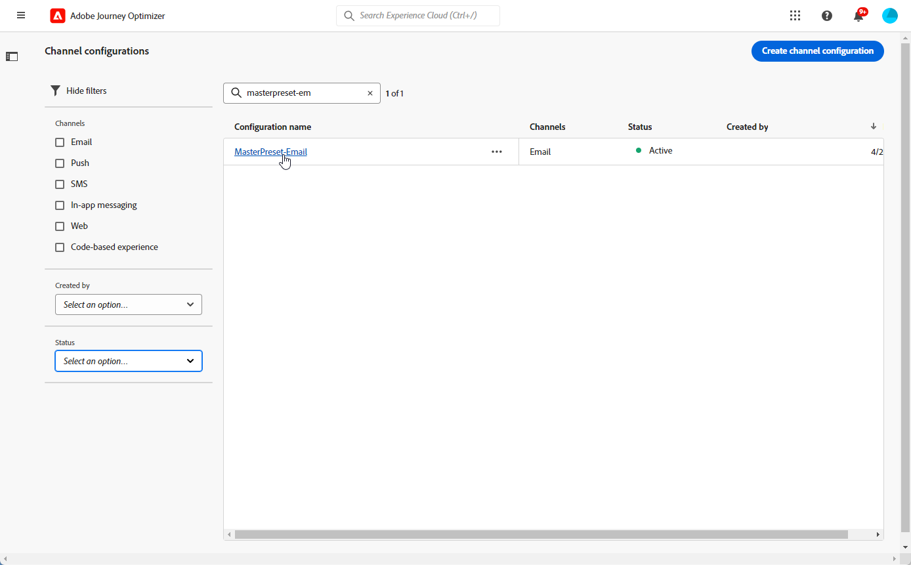

# Kanaalconfiguraties instellen {#set-up-channel-surfaces}

>[!CONTEXTUALHELP]
>id="ajo_admin_channel_surfaces"
>title="Kanaalconfiguratie"
>abstract="Een kanaalconfiguratie is een configuratie die door een Beheerder van het Systeem is bepaald. Het bevat alle technische parameters voor het verzenden van het bericht, zoals headerparameters, subdomein, mobiele apps, enzovoort."

>[!CONTEXTUALHELP]
>id="ajo_admin_marketing_action"
>title="Handeling"
>abstract="Kies de acties van de Marketing om toestemmingsbeleid met de berichten te verbinden gebruikend deze opstelling. Alle toestemmingsbeleid met betrekking tot de marketing actie zal worden gebruikt om de voorkeur van uw klanten te respecteren."

Met [!DNL Journey Optimizer] kunt u kanaalconfiguraties instellen (d.w.z. voorinstellingen voor berichten) die alle technische parameters definiëren die vereist zijn voor uw berichten: e-mailtype, e-mail en naam van de afzender, mobiele apps, SMS-configuratie en meer.

>[!CAUTION]
>
> * Om kanaalconfiguraties tot stand te brengen, uit te geven en te schrappen, moet u [ hebben berichten vooraf instelt ](../administration/high-low-permissions.md#administration-permissions) toestemming beheren.
>
> * U moet de [ E-mailconfiguratie ](../email/get-started-email-config.md), [ Push configuratie ](../push/push-configuration.md), [ configuratie van SMS ](../sms/sms-configuration.md), [ in-app configuratie ](../in-app/inapp-configuration.md), [ op code-Gebaseerde configuratie ](../code-based/code-based-configuration.md), [ configuratie van het Web ](../web/web-configuration.md) en [ Directe postconfiguratie ](../direct-mail/direct-mail-configuration.md) stappen alvorens kanaalconfiguraties tot stand te brengen.

Zodra de kanaalconfiguraties zijn gevormd, zult u hen kunnen selecteren wanneer het creëren van berichten van een reis of een campagne.

U kunt de instelling van het geleide kanaal ook gebruiken om kanaalinstallatie in één keer te automatiseren en te valideren, waardoor het proces om aan de slag te gaan met Journey Optimizer sneller verloopt. [Meer informatie](set-mobile-config.md)

<!--
➡️ [Learn how to create and use email configurations in this video](#video-presets)
-->

## Een kanaalconfiguratie maken {#create-channel-surface}

>[!CONTEXTUALHELP]
>id="ajo_admin_message_presets_header"
>title="Kanaalconfiguratie-instellingen"
>abstract="Wanneer u een kanaalconfiguratie instelt, selecteert u het kanaal waarop de configuratie van toepassing is en definieert u alle technische parameters die voor het verzenden zijn vereist, zoals het e-mailtype, de naam van de afzender, mobiele apps, de configuratie van SMS en meer."

>[!CONTEXTUALHELP]
>id="ajo_admin_message_presets"
>title="Kanaalconfiguratie-instellingen"
>abstract="Om acties zoals e-mails van een reis of een campagne te kunnen tot stand brengen, moet u eerst een kanaalconfiguratie tot stand brengen die alle technische montages bepaalt die voor uw berichten worden vereist. U moet beschikken over de machtiging Voorinstellingen voor berichten beheren om kanaalconfiguraties te maken, bewerken en verwijderen."

>[!CONTEXTUALHELP]
>id="ajo_surface_marketing_action"
>title="Een marketingactie selecteren"
>abstract="Kies een marketing actie in de configuratie om een toestemmingsbeleid met het bericht te associëren."

Ga als volgt te werk om een kanaalconfiguratie te maken:

1. Open het menu **[!UICONTROL Channels]** > **[!UICONTROL General settings]** > **[!UICONTROL Channel configurations]** en klik op **[!UICONTROL Create channel configuration]** .

   

1. Voer een naam en beschrijving (optioneel) voor de configuratie in en selecteer vervolgens het kanaal dat u wilt configureren.

   

   >[!NOTE]
   >
   > Namen moeten beginnen met een letter (A-Z). Het mag alleen alfanumerieke tekens bevatten. U kunt ook onderstrepingsteken `_` -, punt `.` - en afbreekstreepjes `-` gebruiken.

1. Als u aangepaste of basislabels voor gegevensgebruik aan de configuratie wilt toewijzen, kunt u **[!UICONTROL Manage access]** selecteren. [ leer meer over de Controle van de Toegang van het Niveau van Objecten (OLAC) ](../administration/object-based-access.md).

1. Selecteer het kanaal.

1. Selecteer **[!UICONTROL Marketing action]**(s) om het toestemmingsbeleid aan de berichten te associëren gebruikend deze configuratie. Alle toestemmingsbeleid verbonden aan de marketing actie wordt gebruikt om de voorkeur van uw klanten te respecteren. [Meer informatie](../action/consent.md#surface-marketing-actions)

   >[!NOTE]
   >
   >Het beleid van de toestemming is momenteel slechts beschikbaar voor organisaties die het **Bevel van de Gezondheidszorg** en **Privacy en het 3} toe:voegen-op dienstenaanbod van het Schild van de Veiligheid hebben gekocht.**

   

1. Nadat alle parameters zijn geconfigureerd, klikt u op **[!UICONTROL Submit]** om te bevestigen. U kunt de kanaalconfiguratie als ontwerp ook bewaren en zijn configuratie later hervatten.

   

   >[!NOTE]
   >
   >U kunt niet met de verwezenlijking van de e-mailconfiguratie te werk gaan terwijl de geselecteerde IP pool onder [ uitgave ](ip-pools.md#edit-ip-pool) (**[!UICONTROL Processing]** status) is, en nooit met geselecteerde subdomain is geassocieerd. [Meer informatie](#subdomains-and-ip-pools)
   >
   >Sparen de configuratie als ontwerp en wacht tot de IP pool de **[!UICONTROL Success]** status heeft om configuratieverwezenlijking te hervatten.

1. Nadat de kanaalconfiguratie is gemaakt, wordt deze in de lijst weergegeven met de status **[!UICONTROL Processing]** .

   Tijdens deze stap, zullen verscheidene controles worden uitgevoerd om te verifiëren dat het behoorlijk is gevormd. <!--The processing time is around **48h-72h**, and can take up to **7-10 business days**.-->

   >[!NOTE]
   > Wanneer u een e-mailconfiguratie voor een subdomein maakt, varieert de verwerkingstijd zoals hieronder beschreven:
   >
   > * Voor **nieuwe subdomeinen**, kan het proces om de eerste kanaalconfiguratie tot stand te brengen **10 min aan 10 dagen** nemen.
   > * Voor **niet productiestanddozen**, of als geselecteerde subdomain **reeds** in een andere goedgekeurde kanaalconfiguratie wordt gebruikt, neemt het proces slechts tot **3 uren**.

   Deze controles omvatten configuratie en technische tests die door het team van Adobe worden uitgevoerd:

   * SPF-validatie
   * DKIM-validatie
   * MX-recordvalidatie
   * Controle IPs voegend op lijst van gewenste personen
   * Helo host check
   * Verificatie van IP-pool
   * A/PTR-record, t/m/res-subdomeinverificatie
   * FBL-registratie (deze controle wordt alleen uitgevoerd wanneer voor een bepaald subdomein een e-mailconfiguratie wordt gemaakt)

   >[!NOTE]
   >
   >Als de controles niet succesvol zijn, leer meer over de mogelijke mislukkingsredenen in [ deze sectie ](#monitor-channel-surfaces).

1. Wanneer de controles succesvol zijn, krijgt de kanaalconfiguratie de **[!UICONTROL Active]** status. Het is klaar om te worden gebruikt om berichten te leveren.

   

## Kanaalconfiguraties controleren {#monitor-channel-surfaces}

Alle kanaalconfiguraties worden weergegeven in het menu **[!UICONTROL Channels]** > **[!UICONTROL Channel configurations]** . Er zijn filters beschikbaar waarmee u door de lijst kunt bladeren (kanaal, gebruiker, status).

Na het maken kunnen kanaalconfiguraties de volgende statussen hebben:

* **[!UICONTROL Draft]**: De kanaalconfiguratie is opgeslagen als concept en is nog niet verzonden. Open het om de configuratie te hervatten.
* **[!UICONTROL Processing]**: De kanaalconfiguratie is verzonden en voert verschillende verificatiestappen uit.
* **[!UICONTROL Active]**: De kanaalconfiguratie is geverifieerd en kan worden geselecteerd om berichten te maken.
* **[!UICONTROL Failed]**: een of meer controles zijn mislukt tijdens de verificatie van de kanaalconfiguratie.
* **[!UICONTROL Deactivated]**: De kanaalconfiguratie wordt gedeactiveerd. U kunt er geen nieuwe berichten mee maken.

### Foutredenen voor kanaalconfiguratie {#channel-config-failure}

Wanneer een kanaalconfiguratie mislukt, worden de details van elke mogelijke oorzaak van een fout hieronder beschreven.

Als één van deze fouten voorkomt, contacteer [ de Zorg van de Klant van Adobe ](https://helpx.adobe.com/nl/enterprise/admin-guide.html/enterprise/using/support-for-experience-cloud.ug.html){target="_blank"} om hulp te krijgen.

* **ontbroken bevestiging SPF**: SPF (het Kader van het Beleid van de Afzender) is een e-mailauthentificatieprotocol dat toestaat om erkende IPs te specificeren die e-mail van een bepaald subdomein kan verzenden. De de bevestigingsmislukking van SPF betekent dat de IP adressen in het SPF- verslag niet de IP adressen aanpassen die voor het verzenden van e-mails naar de brievenbusleveranciers worden gebruikt.

* **ontbroken bevestiging van DKIM**: DKIM (DomainKeys Identified Mail) staat de ontvankelijke server toe om te verifiëren dat het ontvangen bericht door de echte afzender van het bijbehorende domein werd verzonden en dat de inhoud van het originele bericht niet op zijn manier werd veranderd. DKIM-validatiefout betekent dat de ontvangende mailservers de authenticiteit van de berichtinhoud en de koppeling met het verzendende domein niet kunnen verifiëren.:

* **MX ontbroken verslagbevestiging**: MX (Exchange van de Post) fout van de verslagbevestiging betekent dat de postservers verantwoordelijk voor het goedkeuren van binnenkomende e-mails namens bepaald subdomain niet correct worden gevormd.

* **Ontbroken configuraties van de Leverbaarheid**: De mislukking van de configuraties van de levering kan om het even welke volgende redenen gebeuren:
   * Voegend op lijst van gewenste personen van toegewezen IPs
   * Ongeldige naam `helo`
   * E-mails die worden verzonden van IPs buiten degenen die in de IP pool van de overeenkomstige configuratie worden gespecificeerd
   * Kan geen e-mails naar postvakken van belangrijke ISP&#39;s verzenden

## Een kanaalconfiguratie bewerken {#edit-channel-surface}

Volg onderstaande stappen om een kanaalconfiguratie te bewerken.

>[!NOTE]
>
>U kunt de **[!UICONTROL Push notification settings]** niet bewerken. Als een kanaalconfiguratie slechts voor het Push berichtkanaal wordt gevormd, is het niet editable.

1. Klik in de lijst op de naam van een kanaalconfiguratie om deze te openen.

   

1. Bewerk de eigenschappen naar wens.

   >[!NOTE]
   >
   >Als een kanaalconfiguratie de **[!UICONTROL Active]** status heeft, worden de velden **[!UICONTROL Name]** , **[!UICONTROL Select channel]** en **[!UICONTROL Subdomain]** grijs weergegeven en kunnen deze niet worden bewerkt.

1. Klik op **[!UICONTROL Submit]** om uw wijzigingen te bevestigen.

   >[!NOTE]
   >
   >U kunt de kanaalconfiguratie ook opslaan als concept en de update later hervatten.

Zodra de veranderingen worden voorgelegd, zal de kanaalconfiguratie door een bevestigingscyclus gelijkend op op op zijn plaats gaan wanneer [ creërend een kanaalconfiguratie ](#create-channel-surface). De tijd van de diaverwerking kan tot **3 uren** vergen.

>[!NOTE]
>
>Als u alleen de velden **[!UICONTROL Description]** , **[!UICONTROL Email type]** en/of **[!UICONTROL Email retry parameters]** bewerkt, wordt de update onmiddellijk uitgevoerd.

### Details bijwerken {#update-details}

Voor kanaalconfiguraties met de status **[!UICONTROL Active]** kunt u de details van de update controleren. Dit doet u als volgt:

Klik op het pictogram **[!UICONTROL Recent update]** dat naast de naam van de actieve configuratie wordt weergegeven.

<!--You can also access the update details from an active channel configuration while update is in progress.-->

Op het scherm **[!UICONTROL Recent update]** kunt u informatie zien zoals de updatestatus en de lijst met aangevraagde wijzigingen.

<!---->

### Statussen bijwerken {#update-statuses}

Een kanaalconfiguratieupdate kan de volgende statussen hebben:

* **[!UICONTROL Processing]**: De update van de kanaalconfiguratie is verzonden en wordt door verschillende verificatiestappen uitgevoerd.
* **[!UICONTROL Success]**: De bijgewerkte kanaalconfiguratie is geverifieerd en kan worden geselecteerd om berichten te maken.
* **[!UICONTROL Failed]**: een of meer controles zijn mislukt tijdens de update-verificatie van de kanaalconfiguratie.

Elke status wordt hieronder beschreven.

#### Verwerking {#surface-processing}

Verscheidene leveringscontroles zullen worden uitgevoerd om te verifiëren dat de configuratie behoorlijk is bijgewerkt.

>[!NOTE]
>
>Als u alleen de velden **[!UICONTROL Description]** , **[!UICONTROL Email type]** en/of **[!UICONTROL Email retry parameters]** bewerkt, wordt de update onmiddellijk uitgevoerd.

De verwerkingstijd kan tot **3 uren** vergen. Leer meer over de controles die tijdens de bevestigingscyclus in [ worden uitgevoerd deze sectie ](#create-channel-surface).

Als u een configuratie bewerkt die al actief was:

* De status blijft **[!UICONTROL Active]** zolang het validatieproces wordt uitgevoerd.

* Het pictogram **[!UICONTROL Recent update]** wordt weergegeven naast de naam van de configuratie in de lijst met kanaalconfiguraties.

* Tijdens het bevestigingsproces, gebruiken de berichten die gebruikend deze configuratie worden gevormd nog de oudere versie van de configuratie.

>[!NOTE]
>
>U kunt een kanaalconfiguratie niet wijzigen terwijl de update bezig is. U kunt nog steeds op de naam klikken, maar alle velden worden grijs weergegeven. De wijzigingen worden pas doorgevoerd als de update is gelukt.

#### Succes {#success}

Zodra het bevestigingsproces succesvol is, wordt de nieuwe versie van de configuratie automatisch gebruikt in alle berichten die deze configuratie gebruiken. Het kan echter zijn dat u moet wachten:

* een paar minuten voordat het wordt verbruikt door de eenheidspublicaties,
* tot de volgende partij voor de configuratie om in partijberichten efficiënt te zijn.

#### Mislukt {#failed}

Als het validatieproces mislukt, wordt de oudere versie van de configuratie nog steeds gebruikt.

Leer meer over de mogelijke mislukkingsredenen in [ deze sectie ](#monitor-channel-surfaces).

Als de update mislukt, kan de configuratie opnieuw worden bewerkt. U kunt op de naam van de component klikken en de instellingen bijwerken die moeten worden hersteld.

## Een kanaalconfiguratie deactiveren {#deactivate-a-surface}

Als u een kanaalconfiguratie van **[!UICONTROL Active]** niet beschikbaar wilt maken om nieuwe berichten te maken, kunt u deze deactiveren. <!--However, journeys' messages currently using this configuration will not be affected and will continue working.-->

U kunt een kanaalconfiguratie in de volgende gevallen niet deactiveren:

* Als er naar wordt verwezen door een live reis. Als u probeert een configuratie die nog wordt gebruikt, te deactiveren tijdens een live reis, treedt er een fout op. Om een kanaalconfiguratie te deactiveren, zorg ervoor dat alle levende reizen die deze configuratie gebruiken worden gesloten of tegengehouden. [ leer hoe te om een reis ](../building-journeys/end-journey.md) te beëindigen

* Terwijl een update van de kanaalconfiguratie verwerkt. U moet wachten tot de update is gelukt of mislukt. Leer meer over [ het uitgeven kanaalconfiguraties ](#edit-channel-surface) en over de [ updatestatus ](#update-statuses).

Volg onderstaande stappen om een kanaalconfiguratie te deactiveren.

1. Open de lijst met kanaalconfiguraties.

1. Klik op de knop **[!UICONTROL More actions]** voor de actieve configuratie van uw keuze.

1. Selecteer **[!UICONTROL Deactivate]**.

   

>[!NOTE]
>
>Gedetactiveerde kanaalconfiguraties kunnen niet worden verwijderd om problemen te voorkomen tijdens reizen waarbij deze configuraties worden gebruikt om berichten te verzenden.

U kunt een gedeactiveerde kanaalconfiguratie niet rechtstreeks bewerken. U kunt het bestand echter wel dupliceren en de kopie bewerken om een nieuwe versie te maken die u kunt gebruiken om nieuwe berichten te maken. U kunt de toepassing ook opnieuw activeren en wachten tot de update is gelukt om deze te bewerken.

## Tags toevoegen aan een kanaalconfiguratie {#channel-config-tags}

1. Open de lijst met kanaalconfiguraties.

1. Klik op de knop **[!UICONTROL More actions]** voor de actieve configuratie van uw keuze.

1. Klik op **[!UICONTROL Edit Tags]**.

1. Selecteer Adobe Experience Platform-tags in de lijst om uw kanaalconfiguratie te categoriseren voor een verbeterde zoekopdracht. [ Leer hoe te met Verenigde Markeringen ](../start/search-filter-categorize.md#tags) te werken

   

1. Zodra u markeringen aan uw kanaalconfiguraties toewees, kunt u [ filter ](../start/search-filter-categorize.md#filter-on-tags) hen op markeringen.

## Hoe kan ik-video{#video-presets}

Leer welke kanaalconfiguraties zijn en hoe deze in Adobe Journey Optimizer worden gebruikt.

>[!VIDEO](https://video.tv.adobe.com/v/3433124/?learn=on)
