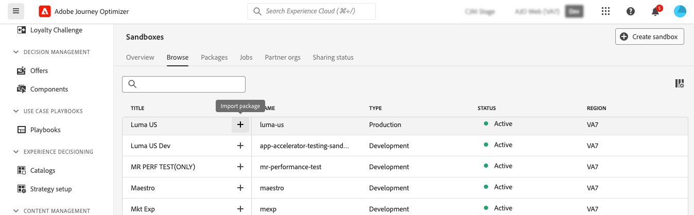

# Objecten exporteren naar een andere sandbox {#copy-to-sandbox}

U kunt objecten zoals reizen, aangepaste handelingen, inhoudssjablonen of fragmenten over meerdere sandboxen kopiëren met behulp van de opties voor exporteren en importeren van pakketten. Een pakket kan uit één object of uit meerdere objecten bestaan. Alle objecten die in een pakket zijn opgenomen, moeten afkomstig zijn uit dezelfde sandbox.

Op deze pagina wordt het gebruik-hoofdlettergebruik voor Sandbox-gereedschappen in de context van Journey Optimizer beschreven. Voor meer informatie over de eigenschap zelf, verwijs naar de het toolceregids van de zandbak van Adobe Experience Platform [&#x200B; &#x200B;](https://experienceleague.adobe.com/docs/experience-platform/sandbox/ui/sandbox-tooling.html#abobe-journey-optimizer-objects){target="_blank"}.

>[!NOTE]
>
>Deze eigenschap vereist de volgende toestemmingen van het **beleid Sandbox** vermogen: beheer zandbakken (of zandbakken van de Mening) en beheer pakketten. [Meer informatie](../administration/ootb-permissions.md)

Het kopieerproces wordt uitgevoerd via een pakketexport en importeren tussen de bron- en doelsandboxen. Hier volgen de algemene stappen voor het kopiëren van een reis van de ene naar de andere sandbox:

1. [&#x200B; voeg het voorwerp toe om als pakket in de bronzandbak &#x200B;](#export) uit te voeren
1. [Het pakket publiceren](#publish)
1. [Het pakket importeren in de doelsandbox](#import)

>[!NOTE]
>
>Voor het migreren van de voorwerpen van het besluitvormingsbeheer aan Beslissing, gebruik specifieke [&#x200B; Beslissende Migratie API &#x200B;](../experience-decisioning/decisioning-migration-api.md) die geautomatiseerde gebiedsdeelresolutie en terugschroeven van prijzen specifiek voor de migratie van beslissingsentiteiten wordt ontworpen.

## Geëxporteerde objecten en aanbevolen werkwijzen {#objects}

Journey Optimizer staat het exporteren van reizen, aangepaste handelingen, inhoudssjablonen, fragmenten en andere objecten naar een andere sandbox toe. In de volgende secties vindt u informatie en tips en trucs voor elk type object.

### Algemene beste praktijken {#global}

* Wanneer u een object kopieert, worden afhankelijkheden (zoals geneste fragmenten, reisdoelgroepen of handelingen) correct bijgewerkt in het bovenliggende object, zodat de doelsandbox correct wordt toegewezen.

* Als een geëxporteerd object profielpersonalisatie bevat, controleert u of het juiste schema in de doelsandbox aanwezig is om problemen met de personalisatie te voorkomen.

* Landingspagina&#39;s worden momenteel niet ondersteund voor migratie tussen sandboxen. Wanneer u een reis naar een andere zandbak kopieert, zullen om het even welke verwijzingen naar landende pagina&#39;s in uw reis of e-mailinhoud nog naar originele (bron) zandbak landende pagina IDs richten. Na de migratie moet u alle verwijzingen naar bestemmingspagina&#39;s in uw reis en e-mailinhoud handmatig bijwerken om de juiste bestemmingspagina-id&#39;s van de doel-sandbox (doel) te gebruiken. Zie [&#x200B; het landen pagina&#39;s &#x200B;](../landing-pages/create-lp.md) creëren en publiceren.

+++ Journeys

* **gekopieerde gebiedsdelen** - wanneer het uitvoeren van een reis, naast de reis zelf, kopieert Journey Optimizer ook de meeste voorwerpen de reis van afhangt: publiek, douaneacties, schema&#39;s, gebeurtenissen en acties. Voor meer details op gekopieerde voorwerpen, verwijs naar de het hulpmiddelengids van Adobe Experience Platform [&#x200B; zandbak &#x200B;](https://experienceleague.adobe.com/docs/experience-platform/sandbox/ui/sandbox-tooling.html#abobe-journey-optimizer-objects){target="_blank"}.

* **Geadviseerde de Handmatige bevestiging** - wij waarborgen niet dat alle verbonden elementen aan de bestemmingszandbak worden gekopieerd. Wij adviseren ten zeerste dat u een grondige controle uitvoert, bijvoorbeeld alvorens een reis te publiceren. Zo kunt u elk mogelijk ontbrekend object identificeren.

* **wijze van het Ontwerp en uniciteit** - de gekopieerde voorwerpen in de doelzandbak zijn uniek en er is geen risico om bestaande elementen te beschrijven. Zowel de reis als alle berichten binnen de reis worden in de ontwerpmodus overgenomen. Hierdoor kunt u een grondige validatie uitvoeren voordat deze wordt gepubliceerd in de doelsandbox.

* **Meta-gegevens** - het exemplaarproces kopieert slechts over de meta-gegevens over de reis en de voorwerpen in die Reis. Er worden geen profiel- of gegevenssetgegevens gekopieerd als onderdeel van dit proces.

* **de acties van de Douane**

   * Wanneer het uitvoeren van douaneacties, worden de configuratie URL en de parameters van de lading gekopieerd over. Om veiligheidsredenen worden de verificatieparameters echter niet gekopieerd en vervangen door &quot;GEHEIM INSERT HIER&quot;. De waarden van de de verzoekkopbal en van de vraagparam van de constante worden van het verzoek ook vervangen door &quot;INSERT SECRET HERE&quot;.

     Dit zijn onder andere de aangepaste handelingen voor speciale doeleinden ([!DNL Adobe Campaign Standard] , [!DNL Campaign Classic] , [!DNL Marketo Engage] ).

   * Als u tijdens het importeren de optie &#39;Bestaande gebruiken&#39; selecteert voor een aangepaste handeling, moet de aangepaste actie die u selecteert, gelijk zijn aan de aangepaste bronactie (dus dezelfde configuratie, parameters, enzovoort) wanneer u een reis naar een andere sandbox kopieert. Anders bevat de nieuwe reiskopie fouten die niet op het canvas kunnen worden opgelost.

* **gegevensbronnen, gebiedsgroepen en gebeurtenissen** - wanneer het kopiëren van een reis die gebeurtenissen, gegevensbronnen, of gebiedsgroepen gebruikt, controleert het de invoerproces automatisch of de componenten met de zelfde naam en het type reeds in de doelzandbak bestaan. Een eenheidsgebeurtenis wordt bijvoorbeeld vervangen door een eenheidsgebeurtenis in de doelsandbox met dezelfde naam. Hetzelfde geldt voor bedrijfsgebeurtenissen, aangepaste gegevensbronnen en zowel op API- als op schema gebaseerde veldgroepen die worden gebruikt tijdens reizen. Als een eenheidsgebeurtenis van een bronsandbox dezelfde naam heeft als een doelsandbox voor een bedrijfsgebeurtenis, wordt deze niet gekopieerd of gemaakt. Dit geldt ook voor alle andere componenten.

+++

+++ Campagnes

Campagnes worden samen met alle punten gekopieerd met betrekking tot het profiel, het publiek, het schema, de gealigneerde berichten, en afhankelijke voorwerpen. Nochtans, worden de volgende punten **niet** gekopieerd:

* Meertalige varianten en taalinstellingen
* Bedrijfsvoorschriften,
* Tags,
* Labels voor gegevensgebruik en etiketten voor handhaving (DULE).

Zorg er bij het kopiëren van campagnes voor dat het hieronder vermelde object in de doelsandbox wordt gevalideerd om verkeerde configuraties te voorkomen:

* **configuraties van het Kanaal**: De configuraties van het kanaal worden gekopieerd samen met campagnes. Nadat de campagnes worden gekopieerd, moeten de kanaalconfiguraties manueel in de doelzandbak worden geselecteerd.
* **de varianten en montages van de Experimentatie van de Experimentatie**: De experimentele varianten en de montages zijn inbegrepen in het proces van het campagneexemplaar. Valideer deze instellingen in de doelsandbox na het importeren.
* **Verenigde beslissing**: Het beleid van het besluit en de besluitvormingspunten worden gesteund voor de uitvoer en de invoer. Zorg ervoor dat aan beslissingen gerelateerde afhankelijkheden correct worden toegewezen in de doelsandbox.

+++

+++ Beslissing

* De objecten hieronder moeten aanwezig zijn in de doelsandbox voordat u beslissingsobjecten kopieert:

   * Profielkenmerken die worden gebruikt voor Decisioning-objecten
   * De veldgroep aangepaste aanbiedingskenmerken,
   * De schema&#39;s van gegevensstromen die voor de Attributen van de Context over Regels, het Rangschikken of het Kappen worden gebruikt.

* Sandbox-kopie voor rangschikkingsformules met AI-modellen wordt momenteel niet ondersteund.

* Bij het kopiëren van een campagne worden de beslissingsitems (aanbiedingen) niet automatisch gekopieerd. Kopieer deze afzonderlijk met de optie Toevoegen aan pakket.

* Als een besluitvormingsbeleid een selectiestrategie heeft, moeten de beslissingspunten afzonderlijk worden toegevoegd. Als het handboek/fallback beslissingspunten heeft, worden zij automatisch toegevoegd als directe gebiedsdelen.

* Wanneer het kopiëren van Beslissende entiteiten, zorg ervoor u besluitvormingspunten **vóór** om het even welk ander voorwerp kopieert. Als u bijvoorbeeld eerst een verzameling kopieert en de nieuwe sandbox geen aanbiedingen bevat, blijft die nieuwe verzameling leeg.

* Wanneer het kopiëren van entiteiten met gebiedsdelen (b.v., schema, segmenten), &quot;creeer Nieuw&quot;tegen de entiteit om het te schrappen en de &quot;Bestaande&quot;optie van het Gebruik voor afhankelijke artefacten te openbaren. De extra gebiedsdelen kunnen vereisen herhalend deze stap verder onderaan de hiërarchie.

  Voorbeeld: tijdens het invoeren van een campagne, om een gegevensstroomschema in een regel opnieuw te gebruiken, klik &quot;creeer Nieuw&quot;tegen BESLUIT_STRATEGY, dan opnieuw op BESLUITEN_REGELS, om de &quot;Bestaande&quot;optie van het Gebruik voor het gegevensstroomschema te openbaren.

* Voor entiteiten die afhankelijk zijn van een databasecontextschema, moet u ervoor zorgen dat de gegevensstroom vooraf wordt gemaakt en een bestaand schema voor die gegevensstroom selecteren.

* Als u tijdens het importeren rechtstreeks op &quot;Voltooien&quot; klikt, worden alle afhankelijkheden opnieuw gemaakt.

+++

+++ Contentsjablonen

* Bij het exporteren van een inhoudssjabloon worden ook alle geneste fragmenten gekopieerd.

* Het exporteren van inhoudssjablonen kan soms leiden tot fragmentduplicatie. Als twee sjablonen bijvoorbeeld hetzelfde fragment delen en in afzonderlijke pakketten worden gekopieerd, moeten beide sjablonen hetzelfde fragment opnieuw gebruiken in de doelsandbox. Als u dubbel werk wilt voorkomen, selecteert u de optie &quot;Bestaande gebruiken&quot; tijdens het importproces. [&#x200B; leer hoe te om een pakket &#x200B;](#import) in te voeren

* Om dubbel werk verder te vermijden, wordt aanbevolen inhoudssjablonen in één pakket te exporteren. Dit zorgt ervoor dat het systeem deduplicatie efficiënt beheert.

+++

+++ Fragmenten

* Fragmenten kunnen met uitvoering meerdere statussen hebben, zoals Live, Concept en Live. Wanneer u een fragment exporteert, wordt de laatste conceptstatus ervan naar de doelsandbox gekopieerd.

* Bij het exporteren van een fragment worden ook alle geneste fragmenten gekopieerd.

+++

## Objecten toevoegen als pakket {#export}

Als u objecten naar een andere sandbox wilt kopiëren, moet u ze eerst als een pakket in de bronsandbox toevoegen. Voer de volgende stappen uit:

1. Navigeer naar de inventaris waar het eerste object dat u wilt kopiëren, is opgeslagen, zoals de lijst met ritten. Klik het **Meer acties** pictogram (de drie punten naast de objecten naam) en klik **toevoegen aan pakket**.

   

1. In **voeg aan pakket** venster toe, kies als u het voorwerp aan een bestaand pakket wilt toevoegen of een nieuw pakket creëren:

   

   * **Bestaand pakket**: selecteer het pakket van het drop-down menu.
   * **creeer een nieuw pakket**: type de pakketnaam. U kunt ook een beschrijving toevoegen.

1. Herhaal deze stappen om alle objecten toe te voegen die u met het pakket wilt exporteren.

## Het te exporteren pakket publiceren {#publish}

Als uw pakket klaar is om te worden geëxporteerd, voert u de volgende stappen uit om het te publiceren:

1. Navigeer aan **[!UICONTROL Administration]** > **[!UICONTROL Sandboxes]** menu, selecteer de **Pakketten** tabel.

1. Open het pakket u wilt uitvoeren, de voorwerpen selecteren u wilt uitvoeren en **publiceren** klikken.

   In dit voorbeeld willen wij een reis, een inhoudsmalplaatje en een fragment uitvoeren.

   

1. De status van de publicatie van het pakket volgen via het tabblad **[!UICONTROL Jobs]** . Selecteer een taak in de lijst en klik op de knop **[!UICONTROL View import details]** voor meer informatie over een taak.

   

## Het pakket importeren in de doelsandbox {#import}

Nadat het pakket is gepubliceerd, moet u het importeren in de doelsandbox. Voer de volgende stappen uit:

1. Navigeer naar het menu **[!UICONTROL Sandboxes]** en selecteer de tab **[!UICONTROL Browse]** .

1. Zoek naar de zandbak waar u het pakket wilt invoeren, dan klik + pictogram naast zijn naam.

   

   >[!NOTE]
   >
   >Alleen sandboxen binnen uw organisatie zijn beschikbaar.

1. Op het **zandbak van het Doel** gebied, controleer dat de correcte doelzandbakken wordt geselecteerd en selecteer het pakket om van de **[!UICONTROL Package name]** drop-down lijst in te voeren. Klik **daarna**.

   

1. Controleer de pakketobjecten en afhankelijkheden. Dit is de lijst met objecten die aan het pakket zijn toegevoegd, samen met andere objectritten zijn afhankelijk van bijvoorbeeld soorten publiek, schema&#39;s, gebeurtenissen of handelingen.

   Voor elk object kunt u een nieuw object maken of een bestaand object in de doelsandbox gebruiken. Zo voorkomt u bijvoorbeeld fragmentduplicatie die kan optreden bij het importeren van inhoudssjablonen met behulp van algemene fragmenten.

   

1. Klik de **Afwerking** knoop, in de hoger-juiste hoek beginnen het pakket aan de doelzandbak te kopiëren. Het kopiëren is afhankelijk van de complexiteit van de objecten en het aantal objecten dat moet worden gekopieerd.

1. Klik op de importtaak om het kopieerresultaat te bekijken:

   * Klik de **Geïmporteerde voorwerpen van de Mening** knoop om elk individueel gekopieerd voorwerp te tonen.
   * Klik de **de invoerdetails van de Mening** knoop om de invoerresultaten voor elk voorwerp te controleren.

   

1. Open de doelsandbox en voer een grondige controle uit van alle gekopieerde objecten.
