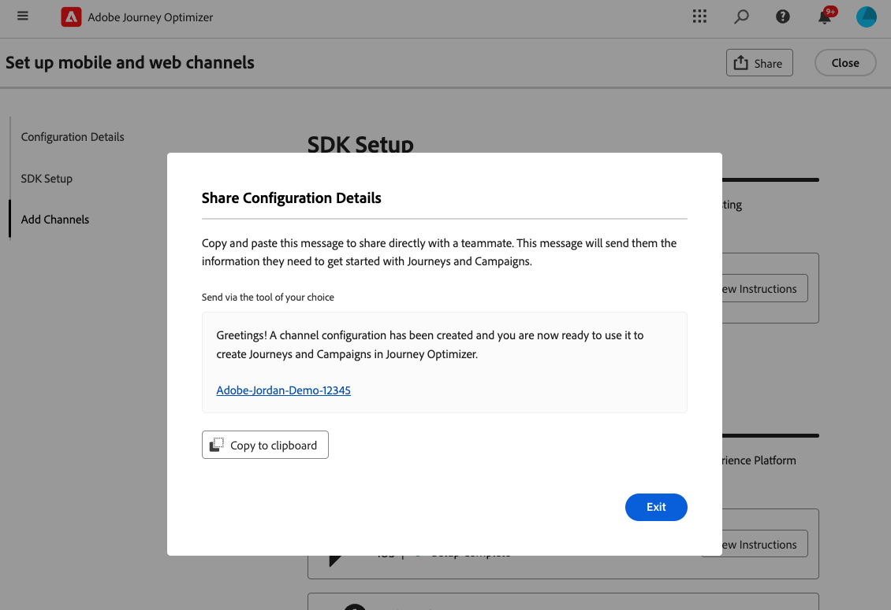
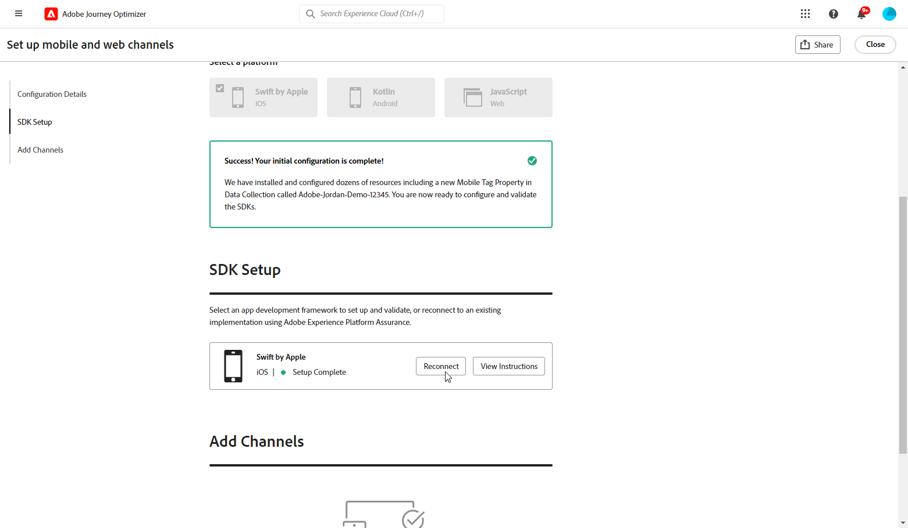

# Een kanaalinstelling maken {#set-mobile-ios}

>[!CONTEXTUALHELP]
>id="ajo_mobile_web_setup_javascript_code"
>title="Javascript-code"
>abstract="De tag head bevat essentiële metagegevens en bronnen die worden geladen vóór de hoofdinhoud van uw webpagina. Door code in deze sectie te plaatsen, zorgt u ervoor dat deze op de juiste manier vroeg wordt geïnitialiseerd en uitgevoerd, zodat uw webpagina efficiënt kan worden geladen en uitgevoerd. Door code aan de kopsectie toe te voegen, helpt u de structuur, de prestaties en de algemene gebruikerservaring van uw site te verbeteren."

>[!CONTEXTUALHELP]
>id="ajo_mobile_web_setup_push_token"
>title="De apparaattoken ophalen"
>abstract="Om ervoor te zorgen dat het pushtoken van het apparaat correct wordt gesynchroniseerd met uw Adobe Experience Platform-profiel, moet u de volgende code in uw toepassing opnemen. Deze integratie is van essentieel belang voor het onderhouden van up-to-date communicatiemogelijkheden en het garanderen van een naadloze gebruikerservaring."

>[!CONTEXTUALHELP]
>id="ajo_mobile_web_setup_push_xcode"
>title="De toepassing starten vanuit Xcode"
>abstract="Start eerst de toepassing met Xcode om uw pushtoken te verkrijgen. Nadat de toepassing is gestart, start u deze opnieuw om te controleren of het validatieproces is voltooid. Adobe geeft vervolgens uw pushtoken op als onderdeel van de validatieresultaten. Dit token is essentieel voor het inschakelen van pushmeldingen en wordt weergegeven zodra de installatie is gevalideerd."

>[!CONTEXTUALHELP]
>id="ajo_mobile_web_push_certificate_fcm"
>title="Een pushcertificaat opgeven"
>abstract="Sleep het .json-bestand met de persoonlijke sleutel en zet het neer. Dit bestand bevat verificatiegegevens die vereist zijn voor een veilige integratie en communicatie tussen uw toepassing en de server."

>[!CONTEXTUALHELP]
>id="ajo_mobile_web_setup_push_certificate"
>title="Een pushcertificaat opgeven"
>abstract="Het .p8-sleutelbestand bevat een persoonlijke sleutel die wordt gebruikt om uw app te verifiëren bij Apple-servers voor beveiligde pushberichten. U kunt deze sleutel van de pagina Certificates, Identifiers, en Profielen in uw ontwikkelaarsaccount verkrijgen."

>[!CONTEXTUALHELP]
>id="ajo_mobile_web_setup_push_key_id"
>title="Sleutel-id"
>abstract="Sleutelidentiteitskaart, een 10 karakterkoord dat tijdens de verwezenlijking van p8 authentificatiesleutel wordt toegewezen, kan onder het **lusje van Sleutels** op de Certificaten, de Herkenningstekens, en de pagina van Profielen in uw ontwikkelaarrekening worden gevonden."

>[!CONTEXTUALHELP]
>id="ajo_mobile_web_setup_push_team_id"
>title="Team-id"
>abstract="Identiteitskaart van het Team, een koordwaarde wordt gebruikt om uw team te identificeren, kan onder het **Lidmaatschap** lusje in uw ontwikkelaarsrekening worden gevestigd die."

Deze instelling vereenvoudigt de snelle configuratie van marketingkanalen, waardoor alle essentiële bronnen gemakkelijk beschikbaar zijn in de Experience Platform-, Journey Optimizer- en Data Collection-apps. Hierdoor kan uw marketingteam snel beginnen met het maken van campagnes en reizen.

1. Klik op de **[!UICONTROL Begin]** -kaart op de Journey Optimizer-startpagina **[!UICONTROL Set up mobile and web channels]** .

   

1. Maak een **[!UICONTROL New]** -configuratie.

   Als u reeds bestaande configuraties hebt, kunt u verkiezen om één te selecteren, of een nieuwe configuratie tot stand te brengen.

   

1. Voer een **[!UICONTROL Name]** in voor de nieuwe configuratie en selecteer of maak de **[!UICONTROL Datastream]** . Deze **[!UICONTROL Name]** wordt gebruikt voor elke automatisch gemaakte bron.

1. Als uw organisatie meerdere gegevensstromen heeft, selecteert u een van de bestaande opties. Als u geen DataStream hebt, zal automatisch worden gecreeerd voor u.

1. Selecteer het platform en klik op **[!UICONTROL Auto-create resources]** .

1. Om het installatieproces te stroomlijnen, worden de noodzakelijke middelen automatisch gecreeerd om u te helpen begonnen worden. Dit omvat het maken van een nieuwe **[!UICONTROL Mobile Tag Property]** en het installeren van extensies.

[Meer informatie over automatisch gegenereerde bronnen](set-mobile-config.md#auto-create-resources)

1. Nadat de bronnen zijn gegenereerd, volgt u de instructies in de gebruikersinterface om SDK&#39;s en kanalen in te stellen en te valideren.

1. Nadat u de configuratie hebt voltooid, deelt u de automatisch gegenereerde **[!UICONTROL Channel Configuration]** met de teamleden die verantwoordelijk zijn voor het maken van reizen en campagnes.

   {zoomable="yes"}

1. U kunt nu verwijzen naar de interface **[!UICONTROL Channel Configuration]** in de dialoogvensters Camera&#39;s en Journaal, zodat u een naadloze verbinding tot stand kunt brengen tussen de instellingen en het uitvoeren van gerichte reizen en campagnes voor uw publiek.

## Een mobiele bestaande configuratie wijzigen {#reconnect}

Nadat u de configuratie hebt gemaakt, kunt u deze op elk gewenst moment eenvoudig opnieuw bekijken om extra kanalen toe te voegen of verdere aanpassingen aan te brengen die aan uw behoeften voldoen

1. Klik op de **[!UICONTROL Begin]** -kaart op de Journey Optimizer-startpagina **[!UICONTROL Set up mobile and web channels]** .

   

1. Selecteer **[!UICONTROL Existing]** en kies de bestaande **[!UICONTROL Tag property]** in de vervolgkeuzelijst.

   

1. Wanneer u uw bestaande configuratie opent, moet u opnieuw verbinding maken met Adobe Assurance. Klik in het menu SDK Setup op **[!UICONTROL Reconnect]** .

   

1. Selecteer het apparaat in de vervolgkeuzelijst **[!UICONTROL Available devices]** en klik op **[!UICONTROL Connect]** .

   {zoomable="yes"}

1. U kunt uw configuratie nu naar wens bijwerken.
