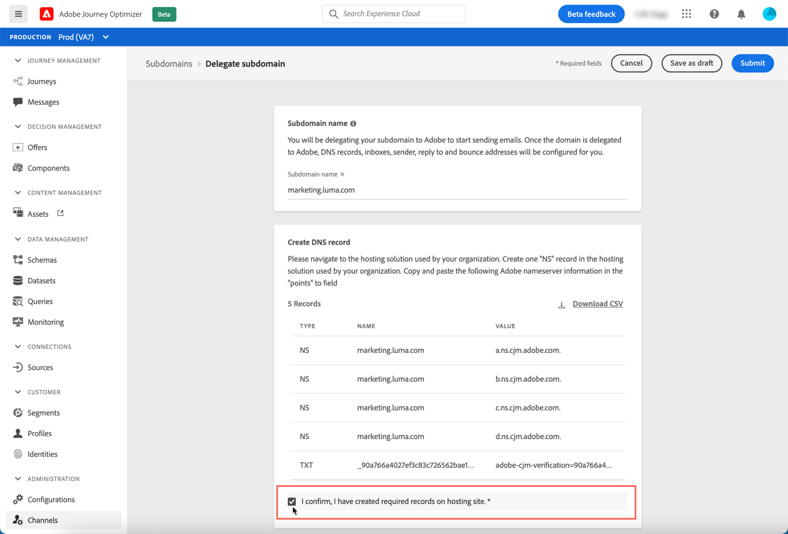

# Een subdomein delegeren

Domeinnaamdelegatie is een methode die de eigenaar van een domeinnaam toestaat (technisch: een DNS-zone) om een onderverdeling ervan te delegeren (technisch gezien: een DNS-zone eronder, die een subzone kan worden genoemd) aan een andere entiteit. In feite, als klant, als u de streek &quot;example.com&quot;behandelt, kunt u subzone &quot;marketing.example.com&quot;aan Adobe afvaardigen.

Door een subdomein voor gebruik met [!DNL Journey Optimizer] te delegeren, kunnen de cliënten op Adobe vertrouwen om de DNS infrastructuur te handhaven die wordt vereist om aan industrie-standaardleveringsvereisten voor hun e-mailmarketing verzendende domeinen te voldoen, terwijl het blijven DNS voor hun interne e-maildomeinen handhaven en controleren.

[!DNL Journey Optimizer] staat u toe om uw subdomeinen aan Adobe direct van de productinterface volledig te delegeren. Door dit te doen, zal Adobe berichten als beheerde dienst kunnen leveren door alle aspecten van DNS te controleren en te handhaven die voor het leveren, het teruggeven en het volgen van e-mailcampagnes worden vereist.

>[!NOTE]
>
>Door gebrek, [!DNL Journey Optimizer] staat het vergunningscontract u toe om tot 10 subdomeinen te delegeren. Neem contact op met uw Adobe als u deze beperking wilt verhogen.
>
>Het gebruik van CNAMEs voor subdomain delegatie wordt momenteel niet gesteund door Journey Optimizer.

Voer de volgende stappen uit om een nieuw subdomein te delegeren:

1. Open het menu **[!UICONTROL Channels]** / **[!UICONTROL Subdomains]** en klik vervolgens op **[!UICONTROL Delegate subdomain]**.

   

1. Geef de naam op van het subdomein dat u wilt delegeren.

   

   >[!CAUTION]
   >
   >Het delegeren van een ongeldig subdomein aan Adobe is niet toegestaan. Zorg ervoor u een geldig subdomein ingaat dat door uw organisatie, zoals marketing.yourcompany.com wordt bezeten.
   >
   >Subdomeinen van meerdere niveaus, zoals email.marketing.yourcompany.com, worden momenteel niet ondersteund.

1. De lijst van records die in uw DNS-serverweergaven moeten worden geplaatst. Kopieer deze records één voor één of download een CSV-bestand en navigeer vervolgens naar uw domeinhostingoplossing om de overeenkomende DNS-records te genereren.

1. Zorg ervoor dat alle DNS verslagen in uw domein het ontvangen oplossing zijn geproduceerd. Als alles behoorlijk wordt gevormd, controleer de doos &quot;I bevestig...&quot;, dan klik **[!UICONTROL Submit]**.

   

   >[!NOTE]
   >
   >U kunt de verslagen tot stand brengen en de subdomeinconfiguratie voorleggen later op het gebruiken van **[!UICONTROL Save as draft]** knoop. Vervolgens kunt u de subdomeindelegatie hervatten door deze te openen vanuit de lijst met subdomeinen.

1. Nadat de subdomeindelegatie is verzonden, wordt het subdomein in de lijst weergegeven met de status **[!UICONTROL Processing]**. Raadpleeg [deze sectie](access-subdomains.md) voor meer informatie over de status van subdomeinen.

   

   Voordat u dat subdomein kunt gebruiken om berichten te verzenden, moet u wachten tot Adobe de vereiste controles uitvoert. Dit kan maximaal 3 uur in beslag nemen. Meer informatie vindt u in [deze sectie](#subdomain-validation).

1. Zodra de controles succesvol zijn, krijgt subdomain de **[!UICONTROL Success]** status. Het is klaar om te worden gebruikt om berichten te leveren.

   <!-- later on, users will be notified in Pulse -->

   

## Subdomeinvalidatie {#subdomain-validation}

De onderstaande controles en acties worden uitgevoerd totdat het subdomein is geverifieerd en kunnen worden gebruikt om berichten te verzenden.

>[!NOTE]
>
>Deze stappen worden uitgevoerd door Adobe en kunnen tot 3 uur duren.

1. **Pre-validate**: Adobe controleert of het subdomein is gedelegeerd aan Adobe DNS (NS-record, SOA-record, Zone-instelling, eigendomsrecord). Als de pre-bevestigingsstap ontbreekt, is een fout teruggekeerd samen met de overeenkomstige reden, anders gaat Adobe naar de volgende stap.

1. **Vorm DNS voor het domein**:

   * **MX-record**: E-mailuitwisselingsrecord - E-mailserverrecord dat binnenkomende e-mailberichten verwerkt die naar het subdomein zijn verzonden.
   * **SPF-record**: Het verslag van het Kader van het Beleid van de afzender - maakt een lijst van IPs van de postservers die e-mail van subdomain kunnen verzenden.
   * **DKIM-record**: DomainKeys Identified Mail standard record - Gebruikt versleuteling met een openbare en persoonlijke sleutel om het bericht te verifiëren zodat spoofing wordt voorkomen.
   * **A**: Standaard IP-toewijzing.

1. **URL&#39;s voor bijhouden en spiegelen** maken: als het domein email.example.com is, zal het tracking/mirror domein data.email.example.com zijn. Het wordt beveiligd door het SSL-certificaat te installeren.

1. **Voorziening CDN CloudFront**: als CDN nog niet is ingesteld, plaatst Adobe deze voor de imsorg.

1. **CDN-domein** maken: als het domein email.example.com is, zal het domein CDN cdn.email.example.com zijn.

1. **CDN SSL-certificaat** maken en koppelen: Adobe maakt het CDN-certificaat voor het CDN-domein en koppelt het certificaat aan het CDN-domein.

1. **Voorwaartse DNS** maken: als dit eerste subdomain is dat u delegeert, zal Adobe voorwaartse DNS tot stand brengen die wordt vereist om PTR verslagen - voor elk van uw IPs tot stand te brengen.

1. **PTR-record** maken: PTR-record, ook wel omgekeerd DNS-record genoemd, wordt vereist door de ISP&#39;s, zodat deze de e-mails niet als spam markeren. Gmail adviseert ook hebbend PTR verslagen voor elk IP. Adobe leidt PTR verslagen slechts tot wanneer u eerste subdomain, één voor elk IP, alle IPs delegeert die aan eerste subdomain richten. Bijvoorbeeld, als IP *192.1.2.1* is en subdomain *email.example.com* is, zal het PTR verslag zijn: *192.1.2.1 PTR r1.email.example.com*. U kunt de PTR-record achteraf bijwerken en naar het nieuwe gedelegeerde domein verwijzen.
