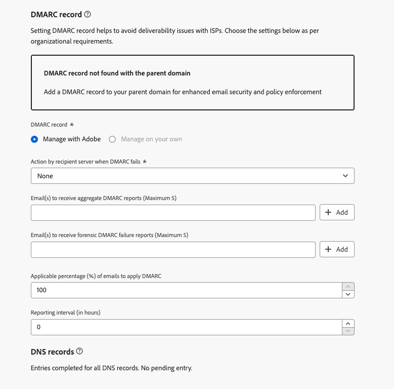

# DMARC-record {#dmarc-record}

>[!CONTEXTUALHELP]
>id="ajo_admin_dmarc_record"
>title="DMARC-record instellen"
>abstract="DMARC is een methode van de e-mailauthentificatie die domeineigenaars toestaat om hun domein tegen onbevoegd gebruik te beschermen en leveringskwesties met brievenbusleveranciers te vermijden. Google en Yahoo vereisen als onderdeel van hun afdwingbare best practices in de branche dat u een DMARC-record hebt voor elk domein dat u gebruikt om e-mail naar hen te verzenden."

## Wat is DMARC? {#what-is-dmarc}

DMARC, die staat voor **Op domein-gebaseerde Authentificatie van het Bericht, Rapportering, en Conformiteit**, is een methode voor e-mailverificatie waarmee domeineigenaars hun domein kunnen beschermen tegen ongeoorloofd gebruik. Door een duidelijk beleid aan e-mailleveranciers/ISPs aan te bieden, helpt het kwaadwillige acteurs verhinderen e-mails te verzenden die beweren van uw domein te zijn. Dit kan de kans verkleinen dat legitieme e-mailberichten als spam of afgewezen worden gemarkeerd en de e-mailleverbaarheid verbeteren.

DMARC biedt ook rapportering over berichten die authentificatie ontbreken, samen met controle over de behandeling van e-mails die geen bevestiging DMARC overgaan. Afhankelijk van de geïmplementeerde [DMARC-beleid](#dmarc-policies), kunnen deze e-mails worden gecontroleerd, in quarantaine geplaatst of geweigerd. Met deze functies kunt u acties uitvoeren om mogelijke fouten te beperken en aan te pakken.

<!--To help you prevent deliverability issues by allowing ISPs to authenticate your sending domains - while gaining visibility and control over mail that fail this authentication, [!DNL Journey Optimizer] will soon be supporting the DMARC technology directly in its administration interface.-->

Om u te helpen leveringsproblemen verhinderen terwijl het verkrijgen van controle over post die authentificatie ontbreekt, [!DNL Journey Optimizer] De DMARC-technologie zal binnenkort rechtstreeks in de beheerinterface worden ondersteund. [Meer informatie](#implement-dmarc)

### Hoe werkt DMARC? {#how-dmarc-works}

SPF en DKIM worden allebei gebruikt om een e-mail met een domein te associëren en samen te werken om e-mail voor authentiek te verklaren. DMARC neemt deze één stap verder en helpt spoofing te verhinderen door het domein aan te passen dat door DKIM en SPF wordt gecontroleerd.

>[!NOTE]
>
>In Journey Optimizer zijn SPF en DKIM geconfigureerd voor u.

Om DMARC over te gaan, moet een bericht SPF of DKIM overgaan:

* SPF (het Kader van het Beleid van de Afzender) helpt verifiëren dat het e-mailbericht uit een erkende bron door het IP van de verzendende server adres tegen een lijst van erkende IP adressen voor het domein te controleren komt.
* DKIM (DomainKeys Identified Mail) voegt een digitale handtekening toe aan e-mailberichten, zodat de ontvanger de integriteit en authenticiteit van het bericht kan verifiëren.

Als beide of een van deze niet-verificatie wordt uitgevoerd, mislukt DMARC en wordt het e-mailbericht verzonden volgens het geselecteerde DMARC-beleid.

<!--DMARC requires alignment between the 'From" and 'Return-Path' address.-->

### DMARC-beleid {#dmarc-policies}

Als een e-mail DMARC-verificatie mislukt, kunt u beslissen welke actie op dat bericht wordt toegepast. DMARC heeft drie beleidsopties:

* Monitor (p=none): instrueert de postbusprovider/ISP om te doen wat zij normaal aan het bericht zouden doen.
* Quarantine (p=quarantaine): Instrueert de brievenbusleverancier/ISP om post te leveren die geen DMARC tot spam of junk omslag van de ontvanger overgaat.
* Weigeren (p=weiger): Instrueert de brievenbusleverancier/ISP om post te blokkeren die DMARC niet overgaat resulterend in een stuit.

>[!NOTE]
>
>Leer hoe u het DMARC-beleid instelt met [!DNL Journey Optimizer] in [deze sectie](#set-up-dmarc).

## DMARC-vereiste bijwerken {#dmarc-update}

Google en Yahoo zullen als onderdeel van hun afdwingbare best practices in de branche eisen dat u een **DMARC-record** voor elk domein dat u gebruikt om e-mail naar hen te verzenden. Deze nieuwe eis begint op **1 februari 2024**.

Meer informatie over Google en Yahoo&#39;s vereisten in [deze sectie](https://experienceleague.adobe.com/docs/deliverability-learn/deliverability-best-practice-guide/additional-resources/guidance-around-changes-to-google-and-yahoo.html?lang=en#dmarc%3A){target="_blank"}.

>[!CAUTION]
>
>Als Gmail en Yahoo niet aan deze nieuwe eis voldoen, zullen e-mails naar de map spam landen of geblokkeerd raken. [Meer informatie](https://experienceleague.adobe.com/docs/deliverability-learn/deliverability-best-practice-guide/additional-resources/guidance-around-changes-to-google-and-yahoo.html#how-will-this-impact-me-as-a-marketer%3F){target="_blank"}

Daarom beveelt de Adobe u ten zeerste aan de volgende maatregelen te nemen:

* Zorg ervoor dat u **DMARC-record** instellen voor **alle subdomeinen die u al hebt gedelegeerd** naar Adobe in [!DNL Journey Optimizer]. [Meer informatie](#check-subdomains-for-dmarc)

* Wanneer **het delegeren van om het even welk nieuw subdomain** aan Adobe, zult u spoedig kunnen **DMARC instellen** rechtstreeks **in de [!DNL Journey Optimizer] beheerinterface**. [Meer informatie](#implement-dmarc)

## DMARC implementeren in [!DNL Journey Optimizer] {#implement-dmarc}

Starten bij **30 januari 2024** de [!DNL Journey Optimizer] De beleidsinterface zal u aan opstellingsDMARC verslag voor alle subdomeinen toestaan die u reeds hebt gedelegeerd of aan Adobe delegeert. De gedetailleerde stappen worden hieronder beschreven.

### Controleer uw bestaande subdomeinen voor DMARC {#check-subdomains-for-dmarc}

Om ervoor te zorgen dat u DMARC- verslagopstelling voor alle subdomeinen hebt hebt die u binnen hebt gedelegeerd [!DNL Journey Optimizer]volgt u de onderstaande stappen.

1. Toegang krijgen tot de **[!UICONTROL Administration]** > **[!UICONTROL Channels]** > **[!UICONTROL Subdomains]** en klik vervolgens op **[!UICONTROL Set up subdomain]**.

1. Controleer voor elk gedelegeerd subdomein het **[!UICONTROL DMARC Record]** kolom. Als er geen record is gevonden voor een bepaald subdomein, wordt een waarschuwing weergegeven.

   

   >[!CAUTION]
   >
   >Om aan het nieuwe vereiste van Gmail en Yahoo te voldoen, en leveringsproblemen met hoogste ISPs te vermijden, wordt het geadviseerd aan opstellingsDMARC verslag voor alle gedelegeerde subdomeinen. [Meer informatie](dmarc-record-update.md)

1. Selecteer een subdomein waaraan geen DMARC-record is gekoppeld en vul het veld in **[!UICONTROL DMARC record]** volgens de behoeften van uw organisatie. De stappen voor het invullen van de DMARC-recordvelden worden beschreven in [deze sectie](#implement-dmarc).

1. Houd rekening met de volgende twee opties:

   * Als u een subdomeinset bewerkt met [CNAME](delegate-subdomain.md#cname-subdomain-delegation), moet u het DNS verslag voor DMARC in uw het ontvangen oplossing kopiëren om de passende DNS verslagen te produceren.

     

     Controleer of het DNS-record is gegenereerd in uw domeinhostingoplossing en schakel het selectievakje &quot;I confirm...&quot; in.

   * Als u een subdomein bewerkt [volledig gedelegeerd](delegate-subdomain.md#full-subdomain-delegation) aan Adobe, eenvoudig invullen **[!UICONTROL DMARC record]** velden gedetailleerd in [deze sectie](#implement-dmarc). Er is geen verdere actie nodig.

     

1. Sla uw wijzigingen op.

### DMARC instellen voor nieuwe subdomeinen {#set-up-dmarc}

Wanneer het delegeren van nieuwe subdomeinen aan Adobe binnen [!DNL Journey Optimizer], wordt een DMARC-record gemaakt in DNS voor uw domein. Voer de onderstaande stappen uit om DMARC te implementeren.

>[!CAUTION]
>
>Om aan het nieuwe vereiste van Gmail en Yahoo te voldoen, en leveringsproblemen met hoogste ISPs te vermijden, wordt het geadviseerd aan opstellingsDMARC verslag voor alle gedelegeerde subdomeinen. [Meer informatie](dmarc-record-update.md)

<!--If you fail to comply with the new requirement from Gmail and Yahoo to have DMARC record for all sending domains, your emails are expected to land into the spam folder or to get blocked.-->

1. Stel een nieuw subdomein in. [Meer informatie](delegate-subdomain.md)

1. Ga naar de **[!UICONTROL DMARC record]** sectie.

   Als het subdomein een bestaand DMARC-record heeft en als het wordt opgehaald door [!DNL Journey Optimizer]kunt u dezelfde waarden gebruiken als in de interface zijn gemarkeerd, of deze naar wens wijzigen.

   

   >[!NOTE]
   >
   >Als u geen waarden toevoegt, worden de vooraf ingevulde standaardwaarden gebruikt.

1. Bepaal de actie die de ontvankelijke server zal uitvoeren als DMARC ontbreekt. Afhankelijk van de [DMARC-beleid](#dmarc-policies) Selecteer een van de drie opties die u wilt toepassen:

   * **[!UICONTROL None]** (standaardwaarde): Vertelt de ontvanger om geen acties tegen berichten uit te voeren die authentificatie DMARC ontbreken, maar nog e-mailrapporten naar de afzender verzenden.
   * **[!UICONTROL Quarantine]**: Vertelt de ontvangende e-mailserver aan quarantaine-mail die authentificatie DMARC ontbreekt - dit betekent over het algemeen het plaatsen van die berichten in de spam of junk omslag van de ontvanger.
   * **[!UICONTROL Reject]**: Vertelt de ontvanger om (stuit) volledig om het even welke e-mail voor het domein te ontkennen dat authentificatie ontbreekt. Als dit beleid is ingeschakeld, heeft alleen e-mail die is geverifieerd als 100% en die voor uw domein is geverifieerd, een kans bij plaatsing in het postvak.

   >[!NOTE]
   >
   >Als beste praktijken, wordt het geadviseerd om implementatie DMARC langzaam uit te voeren door uw beleid DMARC van te escaleren **Geen**, naar **Quarantine**, naar **Afwijzen** aangezien u inzicht in de potentiële impact van DMARC krijgt.

1. Voeg desgewenst een of meer e-mailadressen van uw keuze toe om aan te geven waar **DMARC-rapporten** over e-mailberichten die [verificatie mislukken](#how-dmarc-works) moet binnen uw organisatie gaan. U kunt maximaal vijf adressen voor elk rapport toevoegen.

   >[!NOTE]
   >
   >Zorg ervoor u echte inbox (niet Adobe) in uw controle hebt waar u die rapporten kunt ontvangen.

   Er zijn twee verschillende rapporten die door ISPs worden geproduceerd die de afzenders door de markeringen RUA/RUF in hun beleid kunnen ontvangen DMARC:

   * **Samengevoegde rapporten** (RUA): Zij bevatten geen PII (Persoonlijk Identificeerbare Informatie) die GDPR-gevoelig zou kunnen zijn.
   * **Rapporten over forensische fouten** (RUF): Deze bevatten GDPR-gevoelige e-mailadressen. Voordat u gaat gebruiken, controleert u intern hoe u omgaat met informatie die compatibel moet zijn met GDPR.

   >[!NOTE]
   >
   >Deze hoogst technische rapporten verstrekken een overzicht van e-mails die voor de gek houden worden geprobeerd. U kunt ze het beste verteren met een hulpprogramma van derden.

1. Selecteer de **toepasselijk percentage** van e-mails voor DMARC.

   Dit percentage is afhankelijk van uw vertrouwen in uw e-mailinfrastructuur en de tolerantie voor valse positieven (legitieme e-mails die als frauduleus worden gemarkeerd). Het is gebruikelijk dat organisaties beginnen met het DMARC-beleid ingesteld op **Geen**, het DMARC-beleidspercentage geleidelijk te verhogen en nauwlettend toe te zien op de impact op legitieme e-mailbezorging.

   >[!NOTE]
   >
   >Werk samen met uw e-mailbeheerders en IT-team om het percentage geleidelijk te verhogen terwijl u vertrouwen krijgt in uw e-mailverificatiepraktijken.

   Als beste praktijk, streven naar een hoog DMARC nalevingspercentage, idealiter dicht bij 100%, om de veiligheidsvoordelen te maximaliseren terwijl het risico van valse positieven minimaliseert.

1. Selecteer een **rapporteringsinterval** tussen 24 en 168 uur. Hiermee kunnen eigenaars van domeinen regelmatig updates ontvangen over de resultaten van e-mailverificatie en de nodige maatregelen nemen om de e-mailbeveiliging te verbeteren.

   <!--The DMARC reporting interval is specified in the DMARC policy published in the DNS (Domain Name System) records for a domain. The reporting interval can be set to daily, weekly, or another specified frequency, depending on the domain owner's preferences.

    The default value (24 hours) is generally the email providers' expectation.-->

<!--

Setting up a DMARC record involves adding a DNS TXT record to your domain's DNS settings. This record specifies your DMARC policy, such as whether to quarantine or reject messages that fail authentication. Implementing DMARC is a proactive step towards enhancing email security and protecting both your organization and your recipients from email-based threats.

DMARC helps prevent malicious actors from sending emails that appear to come from your domain. By setting up DMARC, you can specify how email providers should handle messages that fail authentication checks, reducing the likelihood that phishing emails will reach recipients.

DMARC helps improve email deliverability by providing a clear policy for email providers to follow when encountering messages claiming to be from your domain. This can reduce the chances of legitimate emails being marked as spam or rejected.

DMARC helps protect against email spoofing, phishing, and other fraudulent activities.

It allows you to decide how a mailbox provider should handle emails that fail SPF and DKIM checks, providing a way to authenticate the sender's domain and prevent unauthorized use of the domain for malicious purposes.

## What are the benefits of DMARC? {#dmarc-benefits}

The key benefits or DMARC are as folllows:

* DMARC allows email receivers to easily identify the authentication of emails, which could potentially improve delivery.

* It offers reporting on which messages fail SPF and/or DKIM, enabling senders to gain visibility.

* This increased visibility allows for steps to be taken to mitigate further errors. It gives senders a degree of control over what happens with mail that does not pass either of these authentication methods.

-->

