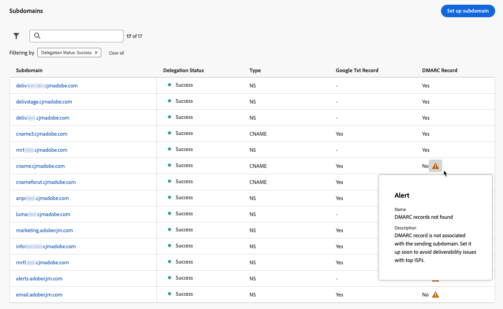

# DMARC-record {#dmarc-record}

>[!CONTEXTUALHELP]
>id="ajo_admin_dmarc_record"
>title="DMARC-record instellen"
>abstract="DMARC is een methode van de e-mailauthentificatie die domeineigenaars toestaat om hun domein tegen onbevoegd gebruik te beschermen en leveringskwesties met brievenbusleveranciers te vermijden.  als deel van hun het handhaven van industrie beste praktijken, Google en Yahoo! beide vereisen dat u een DMARC-record hebt voor elk domein dat u gebruikt om e-mail naar hen te verzenden."

## Wat is DMARC? {#what-is-dmarc}

De op domein-gebaseerde Authentificatie van het Bericht, het Melden, en de Conformiteit (DMARC) is een methode van de e-mailauthentificatie die domeineigenaars toestaat om hun domein tegen onbevoegd gebruik te beschermen. Door een duidelijk beleid aan e-mailleveranciers en dienstverleners van Internet (ISPs) aan te bieden, helpt het kwaadwillige acteurs verhinderen e-mails te verzenden die beweren van uw domein te zijn. Als u DMARC implementeert, verkleint u het risico dat legitieme e-mailberichten worden gemarkeerd als spam of afgewezen, en verbetert u de e-mailleverbaarheid.

DMARC biedt ook rapportage over berichten die niet worden geautoriseerd, en controle over de verwerking van e-mailberichten die niet worden gevalideerd door DMARC. Afhankelijk van het uitgevoerde [ beleid van DMARC ](#dmarc-policies), kunnen deze e-mails worden gecontroleerd, in quarantaine worden geplaatst, of worden verworpen. Met deze functies kunt u acties uitvoeren om mogelijke fouten te beperken en aan te pakken.

[!DNL Journey Optimizer] biedt nu rechtstreeks ondersteuning voor de DMARC-technologie in de beheerinterface, zodat u problemen met de leverbaarheid kunt voorkomen terwijl u controle hebt over e-mail die niet wordt geverifieerd. [Meer informatie](#implement-dmarc)

### Hoe werkt DMARC? {#how-dmarc-works}

SPF en DKIM worden allebei gebruikt om een e-mail met een domein te associëren en samen te werken om e-mail voor authentiek te verklaren. DMARC gaat deze stap verder en helpt spoofing te voorkomen door het domein dat door DKIM en SPF wordt gecontroleerd, aan te passen.

>[!NOTE]
>
>In Journey Optimizer zijn SPF en DKIM geconfigureerd voor u.

Als u DMARC wilt doorgeven, moet een bericht SPF of DKIM doorgeven:

* SPF (het Kader van het Beleid van de Afzender) helpt verifiëren dat het e-mailbericht uit een erkende bron door het IP van de verzendende server adres tegen een lijst van erkende IP adressen voor het domein te controleren komt.
* DKIM (DomainKeys Identified Mail) voegt een digitale handtekening toe aan e-mailberichten, zodat de ontvanger de integriteit en authenticiteit van het bericht kan verifiëren.

Als beide of een van deze niet worden geverifieerd, mislukt DMARC en wordt het e-mailbericht verzonden volgens het door u gekozen DMARC-beleid.

<!--DMARC requires alignment between the 'From" and 'Return-Path' address.-->

### DMARC-beleid {#dmarc-policies}

Als een e-mail niet kan worden geverifieerd via DMARC, kunt u bepalen welke actie op dat bericht wordt toegepast. DMARC heeft drie beleidsopties:

* Monitor (p=none): instrueert de postbusprovider/ISP om te doen wat zij normaal aan het bericht zouden doen.
* Quarantine (p=quarantaine): Instrueert de brievenbusleverancier/ISP om post te leveren die geen DMARC tot de spam of junk omslag van de ontvanger overgaat.
* Weigeren (p=weiger): instrueert de brievenbusleverancier/ISP om post te blokkeren die geen DMARC die in een stuit resulteert overgaat.

>[!NOTE]
>
>Leer hoe te om het beleid van DMARC met [!DNL Journey Optimizer] in [ te plaatsen deze sectie ](#set-up-dmarc).

## DMARC-vereiste bijwerken {#dmarc-update}

Google en Yahoo zijn een onderdeel van hun best practices in de branche. allebei vereisen dat u het verslag van a **DMARC** voor om het even welk domein hebt u gebruikt om e-mail naar hen te verzenden. Dit nieuwe vereiste is beginnend **Februari 1st, 2024** van toepassing.

>[!CAUTION]
>
>Gmail en Yahoo voldoen niet aan deze nieuwe eis! wordt verwacht dat e-mailberichten in de map spam zullen landen of geblokkeerd zullen raken.

Adobe raadt u dan ook ten zeerste aan de volgende maatregelen te nemen:

* Zorg ervoor om **het verslag van DMARC** opstelling voor **alle subdomeinen te hebben die u** aan Adobe in [!DNL Journey Optimizer] reeds hebt gedelegeerd. [ leer hoe ](#check-subdomains-for-dmarc)

* Wanneer **het delegeren van om het even welk nieuw subdomain** aan Adobe, kunt u **opstelling DMARC** direct **in de [!DNL Journey Optimizer] beleidsinterface**. [ leer hoe ](#implement-dmarc)

## DMARC implementeren in [!DNL Journey Optimizer] {#implement-dmarc}

Met de beheerinterface van [!DNL Journey Optimizer] kunt u DMARC-records instellen voor alle subdomeinen die u al hebt gedelegeerd of aan Adobe delegeert. De gedetailleerde stappen worden hieronder beschreven.

### Bestaande subdomeinen controleren op DMARC {#check-subdomains-for-dmarc}

Voer de onderstaande stappen uit om ervoor te zorgen dat u DMARC-recordinstellingen hebt ingesteld voor alle subdomeinen die u in [!DNL Journey Optimizer] hebt gedelegeerd.

1. Open het menu **[!UICONTROL Administration]** > **[!UICONTROL Channels]** > **[!UICONTROL Email settings]** > **[!UICONTROL Subdomains]** en klik op **[!UICONTROL Set up subdomain]** .

1. Controleer de kolom **[!UICONTROL DMARC Record]** voor elk gedelegeerd subdomein. Als er geen record is gevonden voor een bepaald subdomein, wordt een waarschuwing weergegeven.

   

   >[!CAUTION]
   >
   >Om aan het nieuwe vereiste van Gmail en Yahoo! te voldoen, en leveringskwesties met hoogste ISPs te vermijden, wordt het geadviseerd aan opstellingsDMARC verslag voor alle gedelegeerde subdomeinen. [Meer informatie](dmarc-record-update.md)

1. Selecteer een subdomein waaraan geen DMARC-record is gekoppeld en vul de sectie **[!UICONTROL DMARC record]** in op basis van de behoeften van uw organisatie. De stappen om de het verslaggebieden van DMARC te bevolken zijn gedetailleerd in [ deze sectie ](#implement-dmarc).

   <!---->

   >[!NOTE]
   >
   >Afhankelijk van of een DMARC-record wordt gevonden met het bovenliggende domein of niet, kunt u kiezen of u de waarden van het bovenliggende domein wilt gebruiken of dat Adobe de DMARC-record wil beheren. [Meer informatie](#implement-dmarc)

1. Als u een subdomein bewerkt:

   * [ volledig afgevaardigd ](delegate-subdomain.md#set-up-subdomain) aan Adobe, wordt geen verdere actie vereist.

   * Opstelling met [ CNAME ](delegate-subdomain.md#cname-subdomain-setup), moet u het DNS verslag voor DMARC in uw het ontvangen oplossing kopiëren om de passende DNS verslagen te produceren.

     

     Controleer of het DNS-record is gegenereerd in uw domeinhostingoplossing en schakel het selectievakje &quot;I confirm...&quot; in.

1. Sla uw wijzigingen op.

### DMARC instellen voor nieuwe subdomeinen {#set-up-dmarc}

Wanneer u in [!DNL Journey Optimizer] nieuwe subdomeinen delegeert aan Adobe, wordt een DMARC-record gemaakt in DNS voor uw domein. Volg de onderstaande stappen om DMARC te implementeren.

>[!CAUTION]
>
>Om aan het nieuwe vereiste van Gmail en Yahoo! te voldoen, en leveringskwesties met hoogste ISPs te vermijden, wordt het geadviseerd aan opstellingsDMARC verslag voor alle gedelegeerde subdomeinen. [Meer informatie](dmarc-record-update.md)

<!--If you fail to comply with the new requirement from Gmail and Yahoo! to have DMARC record for all sending domains, your emails are expected to land into the spam folder or to get blocked.-->

1. Stel een nieuw subdomein in. [ leer hoe ](delegate-subdomain.md)

1. Ga naar de sectie **[!UICONTROL DMARC record]** .

1. Als een DMARC-record beschikbaar is op het bovenliggende domein dat aan uw subdomein is gekoppeld, worden twee opties weergegeven:

   

   * **[!UICONTROL Manage with Adobe]**: U kunt Adobe de DMARC-record voor uw subdomein laten beheren. Volg de stappen die in [ worden gedetailleerd deze sectie ](#manage-dmarc-with-adobe).

   * **[!UICONTROL Manage on your own]**: <!--This option is selected by default.--> deze optie laat u toe om het verslag van DMARC buiten [!DNL Journey Optimizer] te beheren, gebruikend de waarden van uw ouderdomein. Deze waarden worden weergegeven in de interface, maar u kunt ze niet bewerken.

     {width="80%"}

1. Als er geen DMARC-record wordt gevonden op het bovenliggende domein, is alleen de optie **[!UICONTROL Manage with Adobe]** beschikbaar. Volg de stappen [ hieronder ](#manage-dmarc-with-adobe) aan opstellingsDMARC verslag voor uw subdomain.

   {width="80%"}

### DMARC-record beheren met Adobe {#manage-dmarc-with-adobe}

Als u wilt dat Adobe de DMARC-record voor u beheert, selecteert u de optie **[!UICONTROL Manage with Adobe]** en volgt u de onderstaande stappen.

>[!NOTE]
>
>Indien opgehaald door [!DNL Journey Optimizer] , kunt u dezelfde waarden gebruiken als gemarkeerd in de interface of deze naar wens wijzigen.

{width="80%"}

>[!NOTE]
>
>Als u geen waarden toevoegt, worden de vooraf ingevulde standaardwaarden gebruikt.

1. Definieer de actie die de ontvangende server uitvoert als DMARC mislukt. Afhankelijk van het [ beleid van DMARC ](#dmarc-policies) u wilt toepassen, selecteer één van de drie opties:

   * **[!UICONTROL None]** (standaardwaarde): geeft aan dat de ontvanger geen acties mag uitvoeren tegen berichten die niet voldoen aan de DMARC-verificatie, maar wel e-mailrapporten moet verzenden naar de afzender.
   * **[!UICONTROL Quarantine]**: hiermee wordt aan de ontvangende e-mailserver doorgegeven dat de DMARC-verificatie mislukt. Dit betekent doorgaans dat de berichten in de spam- of junkmap van de ontvanger worden geplaatst.
   * **[!UICONTROL Reject]**: geeft aan dat de ontvanger alle e-mails voor het domein waarvoor de verificatie mislukt, volledig moet weigeren (stuiteren). Als dit beleid is ingeschakeld, heeft alleen e-mail die is geverifieerd als 100% en die voor uw domein is geverifieerd, een kans bij plaatsing in het postvak.

   >[!NOTE]
   >
   >Als beste praktijken, wordt het geadviseerd om de implementatie van DMARC langzaam uit te voeren door uw beleid van DMARC van **te escaleren niets**, aan **quarantaine**, aan **Weigeren** aangezien u inzicht in het potentiële effect van DMARC krijgt.

1. Naar keuze, voeg één of meerdere e-mailadressen van uw keus toe om erop te wijzen waar **DMARC** op e-mail meldt dat [ authentificatie ](#how-dmarc-works) binnen uw organisatie zou moeten ontbreken. U kunt maximaal vijf adressen voor elk rapport toevoegen.

   >[!NOTE]
   >
   >Zorg ervoor dat er een echt Postvak IN (niet Adobe) in de controle staat waar u deze rapporten kunt ontvangen.

   Er zijn twee verschillende rapporten die door ISPs worden geproduceerd die de afzenders door de markeringen RUA/RUF in hun beleid van DMARC kunnen ontvangen:

   * **samengevoegde rapporten** (RUA): Zij bevatten geen PII (Persoonlijk Identificeerbare Informatie) die GDPR-gevoelig zou kunnen zijn.
   * **Forensische mislukkingsrapporten** (RUF): Zij bevatten GDPR-Gevoelige e-mailadressen. Controleer vóór het gebruik intern hoe u omgaat met informatie die compatibel moet zijn met GDPR.

   >[!NOTE]
   >
   >Deze hoogst technische rapporten verstrekken een overzicht van e-mails die voor de gek houden worden geprobeerd. U kunt ze het beste verteren met een hulpprogramma van derden.

1. Selecteer het **toepasselijke percentage** van e-mails voor DMARC.

   Dit percentage is afhankelijk van uw vertrouwen in uw e-mailinfrastructuur en de tolerantie voor valse positieven (legitieme e-mails die als frauduleus worden gemarkeerd). Het is gemeenschappelijk voor organisaties om met het beleid van DMARC te beginnen dat aan **wordt geplaatst niets**, geleidelijk het het beleidspercentage van DMARC te verhogen, en nauwlettend het effect op wettige e-maillevering te controleren.

   >[!NOTE]
   >
   >Werk samen met uw e-mailbeheerders en IT-team om het percentage geleidelijk te verhogen terwijl u vertrouwen krijgt in uw e-mailverificatiepraktijken.

   Als beste praktijk, streven naar een hoog nalevingspercentage van DMARC, idealiter dicht bij 100%, om de veiligheidsvoordelen te maximaliseren terwijl het risico van vals positieven minimaliseert.

1. Selecteer a **rapporterend interval** tussen 24 en 168 uren. Hiermee kunnen eigenaars van domeinen regelmatig updates ontvangen over de resultaten van e-mailverificatie en de nodige maatregelen nemen om de e-mailbeveiliging te verbeteren.

<!--The DMARC reporting interval is specified in the DMARC policy published in the DNS (Domain Name System) records for a domain. The reporting interval can be set to daily, weekly, or another specified frequency, depending on the domain owner's preferences.

The default value (24 hours) is generally the email providers' expectation.

**********

Setting up a DMARC record involves adding a DNS TXT record to your domain's DNS settings. This record specifies your DMARC policy, such as whether to quarantine or reject messages that fail authentication. Implementing DMARC is a proactive step towards enhancing email security and protecting both your organization and your recipients from email-based threats.

DMARC helps prevent malicious actors from sending emails that appear to come from your domain. By setting up DMARC, you can specify how email providers should handle messages that fail authentication checks, reducing the likelihood that phishing emails will reach recipients.

DMARC helps improve email deliverability by providing a clear policy for email providers to follow when encountering messages claiming to be from your domain. This can reduce the chances of legitimate emails being marked as spam or rejected.

DMARC helps protect against email spoofing, phishing, and other fraudulent activities.

It allows you to decide how a mailbox provider should handle emails that fail SPF and DKIM checks, providing a way to authenticate the sender's domain and prevent unauthorized use of the domain for malicious purposes.

## What are the benefits of DMARC? {#dmarc-benefits}

The key benefits or DMARC are as folllows:

* DMARC allows email receivers to easily identify the authentication of emails, which could potentially improve delivery.

* It offers reporting on which messages fail SPF and/or DKIM, enabling senders to gain visibility.

* This increased visibility allows for steps to be taken to mitigate further errors. It gives senders a degree of control over what happens with mail that does not pass either of these authentication methods.

-->
