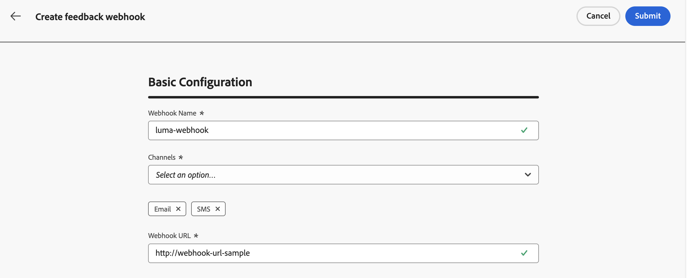

# Feedbackwebsites maken voor door API&#39;s geïnitieerde campagnes {#webhooks}

Met feedbackwebsites kunt u statusupdates in real time ontvangen voor berichten die worden verzonden via door de transactie-API geactiveerde campagnes. Door een webhaak te configureren, kunt u automatisch de resultaten van de levering rechtstreeks aan uw systemen ontvangen, zodat bewaking, registratie en automatische verwerking mogelijk zijn.

U kunt configuraties van webhaken beheren via het menu **[!UICONTROL Administration]** / **[!UICONTROL Channels]** / **[!UICONTROL Feedback webhook settings]** .


>[!NOTE]
>Slechts wordt één webshconfiguratie per **Organisatie + zandbak** combinatie toegestaan.

## Een feedbackwebhaak maken

Voer de volgende stappen uit om een webhaak te maken:

1. Navigeer naar **[!UICONTROL Administration]** / **[!UICONTROL Channels]** / **[!UICONTROL Feedback webhook settings]** .

1. Klik **creëren Terugkoppeling Webhaak**.

1. Geef in de sectie **[!UICONTROL Basic Configuration]** de volgende details op:

   

   * **Naam Webhaak** - ga een beschrijvende naam in om webhaak te identificeren.
   * **Kanalen** - selecteer het (de) kanaal(s) waarvoor deze webhaak (E-mail en/of SMS) zou moeten ontvangen terugkoppelen.
   * **Webhaak URL** - verstrek het eindpunt HTTPS waar terugkoppelt gebeurtenissen moeten worden geleverd.

1. Selecteer in de sectie **[!UICONTROL Authentication]** de verificatiemethode:

   

   * **Geen Authentificatie** - Geen authentificatiekopballen worden toegevoegd.
   * **JWT Authentificatie** - verstrek de vereiste details als uw eindpunt authentificatie JWT vereist.

1. In de **[!UICONTROL Header Parameters]** sectie, vorm extra douanekopballen die met elke Webhaak verzoek moeten worden verzonden.

   

1. Klik op **[!UICONTROL Submit]** om de configuratie op te slaan.

>[!NOTE]
>
>U kunt een webhaak op elk gewenst moment bewerken. U doet dit door het bestand vanuit de voorraad te openen en vervolgens op de knop **[!UICONTROL Edit]** te klikken.

## WebHaak-laadstructuur

Na een berichtuitvoering, verzendt **[!DNL Journey Optimizer]** de volgende nuttige lading naar het gevormde eindpunt.

```
{
  "requestId": "8NoByJneShCdCGRnrGS1t1m3CdA73dhR",
  "imsOrg": "myImsOrg",
  "sandbox": {
    "id": "068abf40-575e-11ea-8512-9b1bfdb82603",
    "name": "prod"
  },
  "channel": "email",
  "eventType": "message.feedback",
  "messageExecution": {
    "messageExecutionID": "HUMA-26362805",
    "messageType": "transactional",
    "campaignID": "16f24a15-7e21-477c-848a-d5695ca7f137",
    "campaignVersionID": "2ca10c10-56dd-4505-87cd-fa5da84e7a5d"
  },
  "messageDeliveryFeedback": {
    "feedbackStatus": {
      "value": "bounce"
    },
    "offers": null,
    "messageExclusion": null,
    "messageFailure": {
      "category": "sync",
      "type": "Ignored",
      "code": "25",
      "reason": "Admin Failure"
    },
    "retryCount": 0
  },
  "identityMap": {
    "email": [
      {
        "id": "john.doe@luma.com",
        "primary": true
      }
    ]
  }
}
```

De webhaak kan de volgende gebeurtenissen vastleggen:

* Verzonden
* Afgeleverd
* Stuiteren (zie voorbeeld hierboven)
* Fouten

Elk inkomend verzoek omvat ook een unieke requestId die terug naar webhaak wordt verzonden.

## Volgende stappen {#next}

Zodra een terugkoppel is gecreeerd, kunt u het toelaten wanneer het vormen van a **transactie API teweeggebrachte campagnepubliek**. Leer meer in deze sectie: [&#x200B; laat webhooks &#x200B;](../campaigns/api-triggered-campaign-audience.md#webhook) toe
