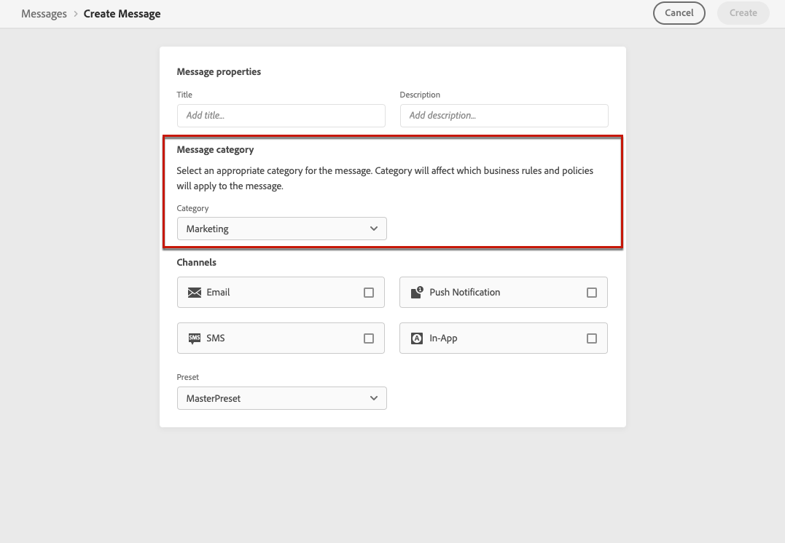

# Regels voor berichtfrequentie {#frequency-rules}

[!DNL Journey Optimizer] Hiermee kunt u bepalen hoe vaak gebruikers een bericht zullen ontvangen of een reis zullen betreden door kanaalregels in te stellen die automatisch overgevraagde profielen uitsluiten van berichten en acties.

Bijvoorbeeld, wilt u uw merk niet meer dan 3 marketing berichten per maand naar hun klanten verzenden.

Hiervoor kunt u een regel voor de frequentie gebruiken die het aantal verzonden berichten beperkt op basis van een of meer kanalen gedurende een maandelijkse kalenderperiode.

>[!NOTE]
>
>De regels van de berichtfrequentie zijn verschillend van opt-out beheer, dat gebruikers toestaat om van het ontvangen van mededelingen van een merk af te zien. [Meer informatie](../messages/consent.md#opt-out-management)

## Toegangsregels {#access-rules}

De regels zijn beschikbaar op **[!UICONTROL Administration]** > **[!UICONTROL Rules]** -menu. Alle regels worden weergegeven, gesorteerd op wijzigingsdatum.

<!--To access, create, edit or delete message frequency rules, you must have the message configuration permission. [Learn more](../administration/high-low-permissions.md#administration-permissions)-->

Gebruik het filterpictogram om te filteren op de categorie, status en/of kanaal. U kunt ook op het berichtlabel zoeken.

## Een regel maken {#create-new-rule}

Volg onderstaande stappen om een nieuwe regel te maken.

1. Toegang krijgen tot **[!UICONTROL Message frequency rules]** lijst en klik vervolgens op **[!UICONTROL Create rule]**.

   

1. Definieer de regelnaam.

   

1. Selecteer de categorie van de berichtregel.

   >[!NOTE]
   >
   >Alleen de **[!UICONTROL Marketing]** rubriek is beschikbaar.

1. Plaats het in kaart brengen voor uw regel, betekenend het maximumaantal berichten dat naar een individueel gebruikersprofiel elke maand kan worden verzonden.

   

   >[!NOTE]
   >
   >Frequentiegrens is gebaseerd op een maandelijkse kalenderperiode. Deze wordt opnieuw ingesteld aan het begin van elke maand.

1. Selecteer het kanaal dat u voor deze regel wilt gebruiken: **[!UICONTROL Email]** of **[!UICONTROL Push notification]**.

   

   >[!NOTE]
   >
   >U moet ten minste één kanaal selecteren om de regel te kunnen maken.

1. Selecteer meerdere kanalen als u de afdekking op alle geselecteerde kanalen als een totaal aantal wilt toepassen.

   Stel de aftopping bijvoorbeeld in op 15 en selecteer het e-mailadres en het pushkanaal. Als een profiel al 10 marketingberichten en 5 pushmeldingen voor marketing heeft ontvangen, wordt dit profiel uitgesloten van de eerstvolgende levering van elke marketingmail of pushmelding.

1. Klikken **[!UICONTROL Save as draft]** om de regel te bevestigen. Uw bericht wordt toegevoegd in de regellijst, met de **[!UICONTROL Draft]** status.

   

## Een regel activeren {#activate-rule}

Om een regel van de berichtfrequentie te activeren, klik de ellips naast de regel en selecteer **[!UICONTROL Activate]**.

Het activeren van een regel heeft invloed op berichten waarop deze van toepassing is bij de volgende uitvoering. Leer hoe u [past een frequentieregel op een bericht toe](#apply-frequency-rule).

>[!NOTE]
>
>U hoeft geen berichten of reizen te wijzigen of opnieuw te publiceren voordat een regel van kracht wordt.

Als u een berichtfrequentieregel wilt deactiveren, klikt u op de ellips naast de regel en selecteert u **[!UICONTROL Deactivate]**.

De status van de regel verandert in **[!UICONTROL Inactive]** en de regel zal niet op toekomstige berichtuitvoeringen van toepassing zijn. Berichten die momenteel worden uitgevoerd, worden niet beïnvloed.

>[!NOTE]
>
>Het deactiveren van een regel heeft geen invloed op tellingen van afzonderlijke profielen en stelt deze niet opnieuw in.

## Pas een frequentieregel toe op een bericht {#apply-frequency-rule}

Om een frequentieregel op een bericht toe te passen, moet u eenvoudig de categorie selecteren u voor deze regel bepaalde toen [het bericht maken](../messages/get-started-content.md#create-new-message).

Als u **[!UICONTROL Marketing]** categorie, worden alle regels voor berichtfrequentie automatisch toegepast op dit bericht.

<!--Clicking the link out button next to the category selector will jump you over to the rules inventory screen to see which rules will be applied to the message.-->

U kunt het aantal profielen dat is uitgesloten van levering bekijken in het dialoogvenster [Live en globale weergaven](../reports/message-monitoring.md)en in de [E-mailLive-rapport](../reports/email-live-report.md), waarbij de frequentievoorschriften worden vermeld als mogelijke reden voor gebruikers die van levering zijn uitgesloten.

## Voorbeeld

U kunt verschillende regels voor berichtfrequentie combineren, zoals in het onderstaande voorbeeld wordt beschreven.

1. Een aangeroepen regel maken *Algemene marketinglimiet*:

   * Selecteer alle kanalen (E-mail, Drukken).
   * Afbeelding instellen op 12.

1. Als u het aantal op marketing gebaseerde pushmeldingen dat een gebruiker wordt verzonden verder wilt beperken, maakt u een tweede regel met de naam *Limiet voor pushberichten*:

   * Selecteer Push-kanaal.
   * Afbeelding instellen op 4.

In dit scenario kan een individueel profiel maximaal 12 marketingberichten per maand ontvangen, maar worden pushmeldingen na ontvangst van 4 pushberichten uitgesloten van de marketing.
