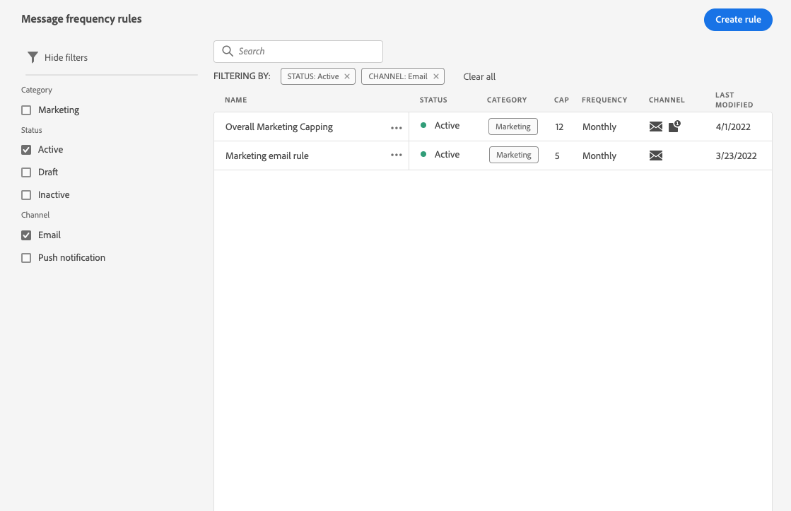
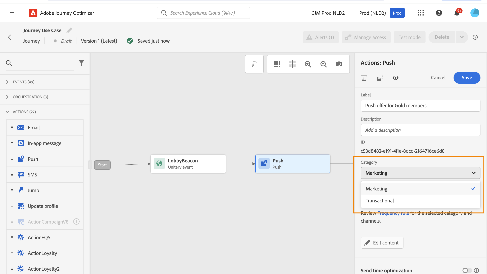
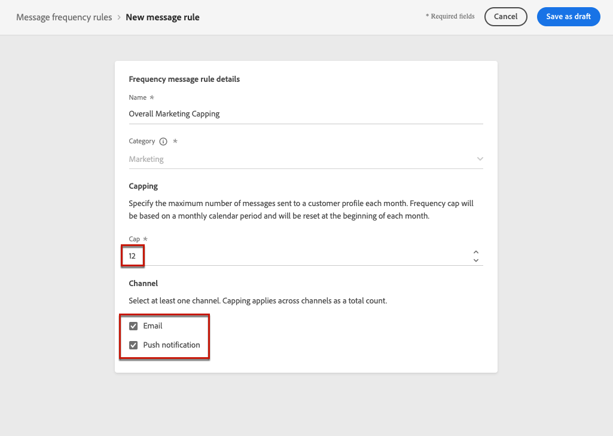
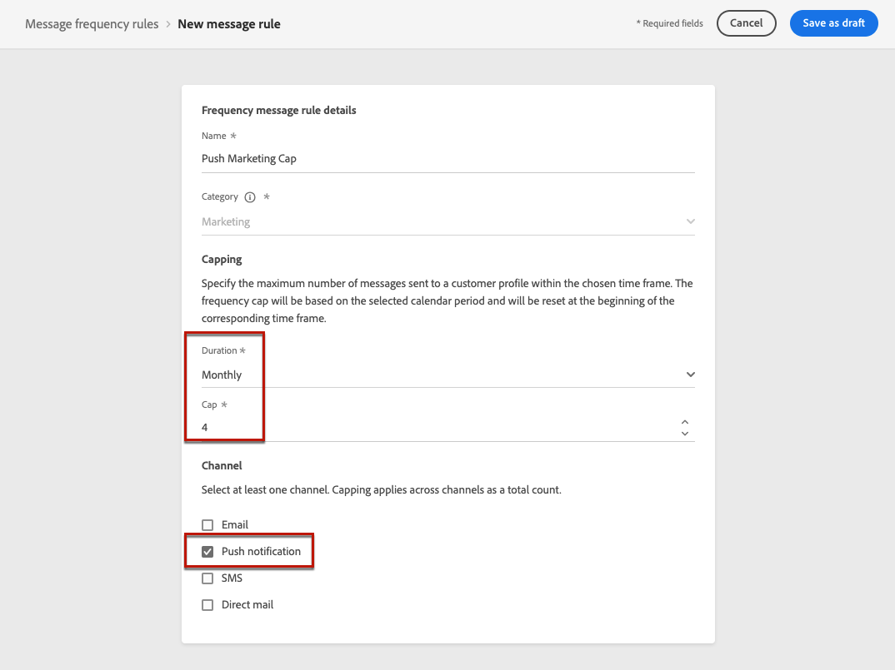

# Regels voor berichtfrequentie {#frequency-rules}

[!DNL Journey Optimizer] Hiermee kunt u bepalen hoe vaak gebruikers een bericht zullen ontvangen of een reis zullen betreden door kanaalregels in te stellen die automatisch overgevraagde profielen uitsluiten van berichten en acties.

Bijvoorbeeld, wilt u uw merk niet meer dan 3 marketing berichten per maand naar hun klanten verzenden.

Hiervoor kunt u een regel voor de frequentie gebruiken die het aantal verzonden berichten beperkt op basis van een of meer kanalen gedurende een maandelijkse kalenderperiode.

>[!NOTE]
>
>De regels van de berichtfrequentie zijn verschillend van opt-out beheer, dat gebruikers toestaat om van het ontvangen van mededelingen van een merk af te zien. [Meer informatie](../privacy/opt-out.md#opt-out-management)

➡️ [Ontdek deze functie in video](#video)

## Toegangsregels {#access-rules}

De regels zijn beschikbaar op **[!UICONTROL Administration]** > **[!UICONTROL Rules]** -menu. Alle regels worden weergegeven, gesorteerd op wijzigingsdatum.

Gebruik het filterpictogram om te filteren op de categorie, status en/of kanaal. U kunt ook op het berichtlabel zoeken.

### Toestemmingen{#permissions-frequency-rules}

Als u de regels voor berichtfrequentie wilt openen, maken, bewerken of verwijderen, moet u beschikken over **[!UICONTROL Manage frequency rules]** toestemming.

Gebruikers met de **[!UICONTROL View frequency rules]** de toestemming kan regels bekijken, maar niet om hen te wijzigen of te schrappen.

Meer informatie over machtigingen in [deze sectie](../administration/high-low-permissions.md).

## Een regel maken {#create-new-rule}

>[!CONTEXTUALHELP]
>id="ajo_rules_category"
>title="Selecteer de categorie voor berichtregels"
>abstract="Wanneer deze optie wordt geactiveerd en toegepast op een bericht, worden alle frequentieregels die overeenkomen met de geselecteerde categorie automatisch toegepast op dit bericht. Momenteel is alleen de marketingcategorie beschikbaar."

>[!CONTEXTUALHELP]
>id="ajo_rules_capping"
>title="De uitlijning van uw regel instellen"
>abstract="Geef het maximumaantal berichten op dat elke maand naar een klantprofiel wordt verzonden. Frequentiegrens wordt gebaseerd op een maandelijkse kalenderperiode en wordt aan het begin van elke maand opnieuw ingesteld."

>[!CONTEXTUALHELP]
>id="ajo_rules_channel"
>title="Bepaal de kanalen waarop de regel van toepassing is"
>abstract="Selecteer ten minste één kanaal. De bedekking wordt toegepast over kanalen als totale telling."

Volg onderstaande stappen om een nieuwe regel te maken.

1. Toegang krijgen tot **[!UICONTROL Message frequency rules]** lijst en klik vervolgens op **[!UICONTROL Create rule]**.

   

1. Definieer de regelnaam.

   

1. Selecteer de categorie van de berichtregel.

   >[!NOTE]
   >
   >Alleen de **[!UICONTROL Marketing]** -categorie is beschikbaar.

1. Plaats het in kaart brengen voor uw regel, betekenend het maximumaantal berichten dat naar een individueel gebruikersprofiel elke maand kan worden verzonden.

   

   >[!NOTE]
   >
   >Frequentiegrens is gebaseerd op een maandelijkse kalenderperiode. Deze wordt opnieuw ingesteld aan het begin van elke maand.

1. Selecteer het kanaal dat u voor deze regel wilt gebruiken: **[!UICONTROL Email]** of **[!UICONTROL Push notification]**.

   

   >[!NOTE]
   >
   >U moet ten minste één kanaal selecteren om de regel te kunnen maken.

1. Selecteer meerdere kanalen als u de afdekking op alle geselecteerde kanalen als een totaal aantal wilt toepassen.

   Stel de aftopping bijvoorbeeld in op 15 en selecteer het e-mailadres en het pushkanaal. Als een profiel al 10 marketingberichten en 5 pushmeldingen voor marketing heeft ontvangen, wordt dit profiel uitgesloten van de eerstvolgende levering van elke marketingmail of pushmelding.

1. Klikken **[!UICONTROL Save as draft]** om de regel te bevestigen. Uw bericht wordt toegevoegd aan de regellijst, met de **[!UICONTROL Draft]** status.

   

## Een regel activeren {#activate-rule}

Wanneer gecreeerd, heeft een regel van de berichtfrequentie **[!UICONTROL Draft]** status en heeft nog geen invloed op een bericht. Als u deze wilt inschakelen, klikt u op de ellips naast de regel en selecteert u **[!UICONTROL Activate]**.

Het activeren van een regel heeft invloed op berichten waarop deze van toepassing is bij de volgende uitvoering. Leer hoe u [past een frequentieregel op een bericht toe](#apply-frequency-rule).

>[!NOTE]
>
>Het kan 10 minuten duren voordat een regel volledig geactiveerd is. U hoeft geen berichten te wijzigen of ritten opnieuw te publiceren voordat een regel van kracht wordt.

Als u een berichtfrequentieregel wilt deactiveren, klikt u op de ellips naast de regel en selecteert u **[!UICONTROL Deactivate]**.

De status van de regel verandert in **[!UICONTROL Inactive]** en de regel zal niet op toekomstige berichtuitvoeringen van toepassing zijn. Berichten die momenteel worden uitgevoerd, worden niet beïnvloed.

>[!NOTE]
>
>Het deactiveren van een regel heeft geen invloed op tellingen van afzonderlijke profielen en stelt deze niet opnieuw in.

## Pas een frequentieregel toe op een bericht {#apply-frequency-rule}

Volg onderstaande stappen om een frequentieregel toe te passen op een bericht.

1. Wanneer u een [reis](../building-journeys/journey-gs.md), voeg een bericht toe door één van de kanalen te selecteren u voor uw regel bepaalde.

1. Selecteer de categorie die u voor de [regel die u hebt gemaakt](#create-new-rule).

   

   >[!NOTE]
   >
   >Alleen de **[!UICONTROL Marketing]** de categorie is beschikbaar voor berichtfrequentieregels.

1. U kunt op de knop **[!UICONTROL Frequency rule]** koppeling om het scherm met frequentieregels weer te geven in een nieuw tabblad. [Meer informatie](#access-rules)

   Alle frequentieregels die overeenkomen met de geselecteerde categorie en kanalen worden automatisch toegepast op dit bericht.

   >[!NOTE]
   >
   >Berichten waarbij de geselecteerde categorie is **[!UICONTROL Transactional]** niet worden getoetst aan de frequentievoorschriften.

1. U kunt het aantal profielen dat is uitgesloten van levering bekijken in het dialoogvenster [Algemeen rapport](../reports/global-report.md)en in de [Live-rapport](../reports/live-report.md), waarbij de frequentievoorschriften worden vermeld als mogelijke reden voor gebruikers die van levering zijn uitgesloten.

>[!NOTE]
>
>Verschillende regels kunnen op hetzelfde kanaal van toepassing zijn, maar wanneer het onderste hoofdlettergebruik is bereikt, wordt het profiel uitgesloten van de volgende leveringen.

## Voorbeeld: meerdere regels combineren {#frequency-rule-example}

U kunt verschillende regels voor berichtfrequentie combineren, zoals in het onderstaande voorbeeld wordt beschreven.

1. [Een regel maken](#create-new-rule) gebeld *Algemene marketinglimiet*:

   * Selecteer E-mail- en pushkanalen.
   * Afbeelding instellen op 12.

   

1. Als u het aantal op marketing gebaseerde pushmeldingen dat een gebruiker wordt verzonden verder wilt beperken, maakt u een tweede regel met de naam *Push Marketing Cap*:

   * Selecteer Push-kanaal.
   * Afbeelding instellen op 4.

   

1. Opslaan en [activate](#activate-rule) de regel.

1. Maak een e-mail en selecteer de **[!UICONTROL Marketing]** categorie voor dat bericht. [Meer informatie](../email/create-email.md)

1. Maak een pushmelding en selecteer de optie **[!UICONTROL Marketing]** categorie voor dat bericht. [Meer informatie](../push/create-push.md)

In dit scenario wordt een individueel profiel:
* per maand maximaal 12 marketingberichten kunnen ontvangen;
* maar worden uitgesloten van het in de handel brengen van pushberichten nadat ze 4 pushmeldingen hebben ontvangen.

>[!NOTE]
>
>Bij het testen van de frequentieregels wordt aanbevolen een nieuw [testprofiel](../segment/creating-test-profiles.md)Omdat er geen manier is om de teller opnieuw in te stellen tot de volgende maand wanneer de frequentie-instelling van een profiel is bereikt. Als u een regel deactiveert, kunnen beperkte profielen berichten ontvangen, maar worden er geen tellerverhogingen verwijderd of verwijderd.

## Hoe kan ik-video {#video}

Leer hoe u frequentieregels maakt, activeert, test en rapporteert.

>[!VIDEO](https://video.tv.adobe.com/v/344451?quality=12)
