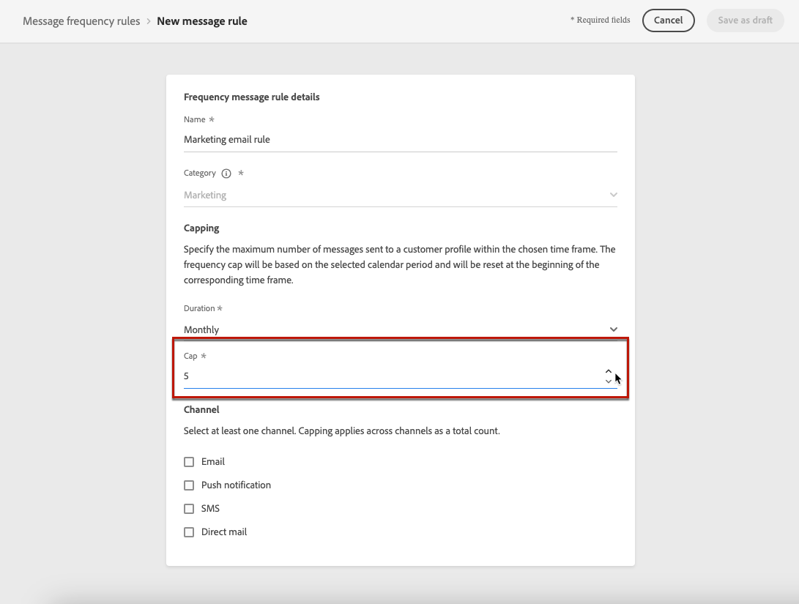
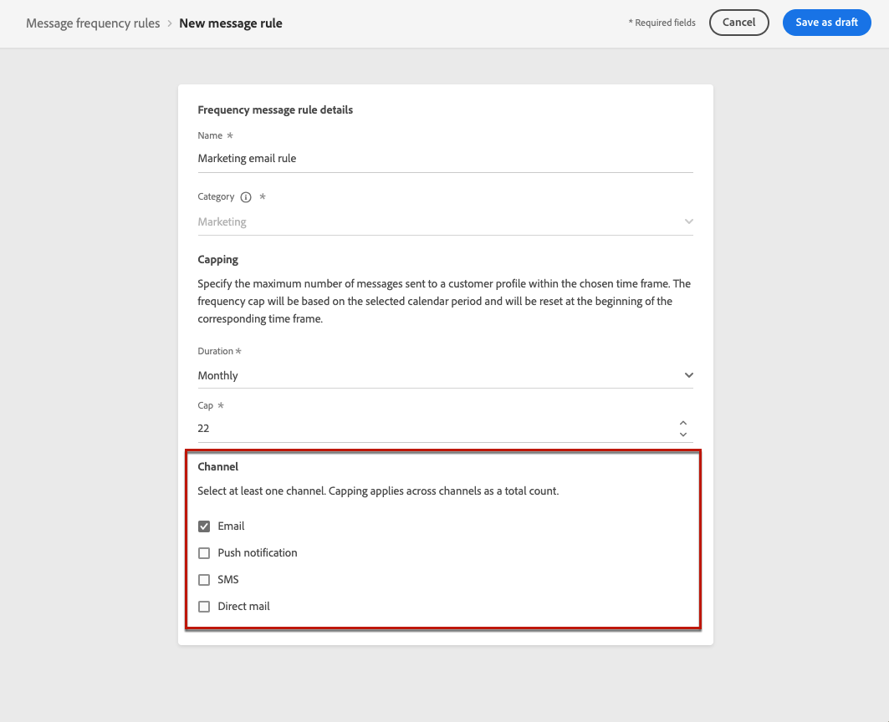

# Regels voor berichtfrequentie {#frequency-rules}

[!DNL Journey Optimizer] Hiermee kunt u bepalen hoe vaak gebruikers een bericht zullen ontvangen of een reis zullen betreden door kanaalregels in te stellen die automatisch overgevraagde profielen uitsluiten van berichten en acties.

Voor een merk kan het bijvoorbeeld de regel zijn dat niet meer dan 4 marketingberichten per maand naar hun klanten worden gestuurd. Hiervoor kunt u een regel voor de frequentie gebruiken die het aantal verzonden berichten beperkt op basis van een of meer kanalen gedurende een maandelijkse kalenderperiode.

>[!NOTE]
>
>De regels van de berichtfrequentie zijn verschillend van opt-out beheer, dat gebruikers toestaat om van het ontvangen van mededelingen van een merk af te zien. [Meer informatie](../privacy/opt-out.md#opt-out-management)

➡️ [Deze functie in video detecteren](#video)

## Toegangsregels {#access-rules}

De regels zijn beschikbaar op **[!UICONTROL Administration]** > **[!UICONTROL Rules]** -menu. Alle regels worden weergegeven, gesorteerd op wijzigingsdatum.

Gebruik het filterpictogram om te filteren op de categorie, status en/of kanaal. U kunt ook op het berichtlabel zoeken.

### Machtigingen{#permissions-frequency-rules}

Als u de regels voor berichtfrequentie wilt openen, maken, bewerken of verwijderen, moet u beschikken over **[!UICONTROL Manage frequency rules]** toestemming.

Gebruikers met de **[!UICONTROL View frequency rules]** de toestemming kan regels bekijken, maar niet om hen te wijzigen of te schrappen.

Meer informatie over machtigingen in [deze sectie](../administration/high-low-permissions.md).

## Een regel maken {#create-new-rule}

>[!CONTEXTUALHELP]
>id="ajo_rules_category"
>title="Selecteer de categorie voor berichtregels"
>abstract="Wanneer deze optie wordt geactiveerd en toegepast op een bericht, worden alle frequentieregels die overeenkomen met de geselecteerde categorie automatisch toegepast op dit bericht. Momenteel is alleen de marketingcategorie beschikbaar."

>[!CONTEXTUALHELP]
>id="ajo_rules_capping"
>title="De uitlijning van uw regel instellen"
>abstract="Geef het maximumaantal berichten op dat binnen de gekozen tijdsperiode naar een klantprofiel wordt verzonden. De maximale frequentie wordt gebaseerd op de geselecteerde kalenderperiode en wordt opnieuw ingesteld aan het begin van het corresponderende tijdkader."

>[!CONTEXTUALHELP]
>id="ajo_rules_channel"
>title="Bepaal de kanalen waarop de regel van toepassing is"
>abstract="Selecteer ten minste één kanaal. De bedekking wordt toegepast over kanalen als totale telling."

Volg onderstaande stappen om een nieuwe regel te maken.

1. Toegang krijgen tot de **[!UICONTROL Message frequency rules]** lijst en klik vervolgens op **[!UICONTROL Create rule]**.

   

1. Bepaal de regelnaam en selecteer de categorie van de berichtregel.

   >[!NOTE]
   >
   >Alleen de **[!UICONTROL Marketing]** -categorie is beschikbaar.

   

1. Van de **[!UICONTROL Duration]** selecteert u een tijdkader voor de bijschriften die u wilt toepassen. [Meer informatie](#frequency-cap)

1. Plaats het maximum voor uw regel, betekenend het maximumaantal berichten dat naar een individueel gebruikersprofiel elke maand, of week kan worden verzonden <!--or day--> - volgens de bovenstaande selectie.

   <!---->

1. Selecteer het kanaal dat u voor deze regel wilt gebruiken: **[!UICONTROL Email]**, **[!UICONTROL Push notification]**, **[!UICONTROL SMS]** of **[!UICONTROL Direct mail]**.

   

   >[!NOTE]
   >
   >U moet ten minste één kanaal selecteren om de regel te kunnen maken.

1. Selecteer meerdere kanalen als u de afdekking op alle geselecteerde kanalen als een totaal aantal wilt toepassen.

   Stel de aftopping bijvoorbeeld in op 15 en selecteer het e-mailadres en het pushkanaal. Als een profiel al 10 marketingberichten en 5 marketingpushmeldingen voor de geselecteerde periode heeft ontvangen, wordt dit profiel uitgesloten van de eerstvolgende levering van elke marketingmail of pushmelding.

1. Klikken **[!UICONTROL Save as draft]** om de regel te bevestigen. Uw bericht wordt toegevoegd aan de regellijst, met de **[!UICONTROL Draft]** status.

   

### Frequentiegrens {#frequency-cap}

Van de **[!UICONTROL Duration]** Selecteer deze optie in de vervolgkeuzelijst als u de afbeelding maandelijks of wekelijks wilt laten toewijzen.

>[!NOTE]
>
>Dagelijkse frequentiegrens is ook beschikbaar op verzoek. [Meer informatie](#daily-frequency-cap)

De frequentiegrens is gebaseerd op de geselecteerde kalenderperiode. Deze wordt opnieuw ingesteld aan het begin van het corresponderende tijdkader.

De teller loopt voor elke periode als volgt af:

* **[!UICONTROL Monthly]** De frequentie-instelling is geldig tot de laatste dag van de maand op 23:59:59 UTC De maandelijkse vervaldatum voor januari is bijvoorbeeld 01-31 23:59:59 UTC

* **[!UICONTROL Weekly]**: De frequentiekapitaal is geldig tot zaterdag 23:59:59 UTC van die week als de kalenderweek op zondag begint. De vervaldatum staat los van de instelling van de regel. Bijvoorbeeld, als de regel op Donderdag wordt gecreeerd, is deze regel geldig tot Zaterdag bij 23:59:59.

### Dagelijkse frequentie dop {#daily-frequency-cap}

Naast de maanden- en wekelijkse frequentie is ook de dagelijkse frequentie-limiet op aanvraag beschikbaar. Neem voor meer informatie contact op met uw Adobe.

De dagelijkse frequentiedop is geldig tot 23 dagen:59:59 UTC en wordt opnieuw ingesteld op 0 aan het begin van de volgende dag.

>[!NOTE]
>
>Wanneer u werkt met [batchsegmentatie](https://experienceleague.adobe.com/docs/experience-platform/segmentation/home.html#batch){target="_blank"}, the daily counters may not accurately reflect the current values as the daily counter snapshot is taken at midnight UTC the night before. Consequently, relying on daily counters in this scenario becomes impractical, as the snapshot does not reflect the most up-to-date counter values on the profile. To ensure accuracy for daily frequency capping rules, the use of [streaming segmentation](https://experienceleague.adobe.com/docs/experience-platform/segmentation/ui/streaming-segmentation.html){target="_blank"} wordt aanbevolen. Meer informatie over methoden voor publieksevaluatie vindt u in [deze sectie](../audience/about-audiences.md#evaluation-method-in-journey-optimizer).

## Een regel activeren {#activate-rule}

Wanneer gecreeerd, heeft een regel van de berichtfrequentie **[!UICONTROL Draft]** status en heeft nog geen invloed op een bericht. Als u deze wilt inschakelen, klikt u op de ellips naast de regel en selecteert u **[!UICONTROL Activate]**.

Het activeren van een regel heeft invloed op berichten waarop deze van toepassing is bij de volgende uitvoering. Leer hoe u [past een frequentieregel op een bericht toe](#apply-frequency-rule).

>[!NOTE]
>
>Het kan tot 10 minuten duren voordat een regel volledig geactiveerd is. U hoeft geen berichten te wijzigen of ritten opnieuw te publiceren voordat een regel van kracht wordt.

Als u een berichtfrequentieregel wilt deactiveren, klikt u op de ellips naast de regel en selecteert u **[!UICONTROL Deactivate]**.

De status van de regel verandert in **[!UICONTROL Inactive]** en de regel zal niet op toekomstige berichtuitvoeringen van toepassing zijn. Berichten die momenteel worden uitgevoerd, worden niet beïnvloed.

>[!NOTE]
>
>Het deactiveren van een regel heeft geen invloed op tellingen van afzonderlijke profielen en stelt deze niet opnieuw in.

## Pas een frequentieregel toe op een bericht {#apply-frequency-rule}

Volg onderstaande stappen om een frequentieregel toe te passen op een bericht.

1. Wanneer u een [reis](../building-journeys/journey-gs.md), voeg een bericht toe door één van de kanalen te selecteren u voor uw regel bepaalde.

1. Selecteer de categorie die u voor de [regel gemaakt](#create-new-rule).

   

   >[!NOTE]
   >
   >Momenteel alleen de **[!UICONTROL Marketing]** de categorie is beschikbaar voor berichtfrequentieregels.

1. U kunt op de knop **[!UICONTROL Frequency rule]** koppeling om het scherm met frequentieregels weer te geven in een nieuw tabblad. [Meer informatie](#access-rules)

   Alle frequentieregels die overeenkomen met de geselecteerde categorie en kanalen worden automatisch toegepast op dit bericht.

   >[!NOTE]
   >
   >Berichten waarbij de geselecteerde categorie is **[!UICONTROL Transactional]** niet worden getoetst aan de frequentievoorschriften.

1. U kunt het aantal profielen dat is uitgesloten van levering bekijken in het dialoogvenster [Algemeen rapport](../reports/global-report.md)en in de [Live-rapport](../reports/live-report.md), waarbij de frequentievoorschriften worden vermeld als mogelijke reden voor gebruikers die van levering zijn uitgesloten.

>[!NOTE]
>
>Verschillende regels kunnen op hetzelfde kanaal van toepassing zijn, maar wanneer het onderste hoofdlettergebruik is bereikt, wordt het profiel uitgesloten van de volgende leveringen.

## Voorbeeld: meerdere regels combineren {#frequency-rule-example}

U kunt verschillende regels voor berichtfrequentie combineren, zoals in het onderstaande voorbeeld wordt beschreven.

1. [Een regel maken](#create-new-rule) gebeld *Algemene marketinglimiet*:

   * Selecteer alle kanalen.
   * Afbeelding instellen op 12 per maand.

   

1. Om het aantal op marketing-gebaseerde pushberichten verder te beperken dat een gebruiker wordt verzonden, creeer een tweede regel genoemd *Push Marketing Cap*:

   * Selecteer Push-kanaal.
   * Afbeelding instellen op 4 per maand.

   

1. Opslaan en [activate](#activate-rule) de regel.

1. [Een bericht maken](../building-journeys/journeys-message.md) voor elk kanaal wilt u door communiceren en selecteren **[!UICONTROL Marketing]** categorie voor elk bericht. [Leer hoe u een frequentieregel toepast](#apply-frequency-rule)

   

<!--
Learn how to create a message for the different channels in the following sections:
* [Create an email](../email/create-email.md)
* [Create a push notification](../push/create-push.md)
* [Create an SMS](../sms/create-sms.md)
* [Create a direct mail](../direct-mail/create-direct-mail.md)

Create an email and select the **[!UICONTROL Marketing]** category for that message. [Learn more](../email/create-email.md)

Create a push notification and select the **[!UICONTROL Marketing]** category for that message. [Learn more](../push/create-push.md)

Create an SMS and select the **[!UICONTROL Marketing]** category for that message. [Learn more](../sms/create-sms.md)

Create a direct mail and select the **[!UICONTROL Marketing]** category for that message. [Learn more](../direct-mail/create-direct-mail.md)
-->

In dit scenario wordt een individueel profiel:
* per maand maximaal 12 marketingberichten kunnen ontvangen;
* maar worden uitgesloten van het in de handel brengen van pushberichten nadat ze 4 pushmeldingen hebben ontvangen.

>[!NOTE]
>
>Bij het testen van de frequentieregels wordt aanbevolen een nieuw [testprofiel](../audience/creating-test-profiles.md)Omdat er geen manier is om de teller opnieuw in te stellen tot de volgende maand wanneer de frequentie-instelling van een profiel is bereikt. Als u een regel deactiveert, kunnen beperkte profielen berichten ontvangen, maar worden er geen tellerverhogingen verwijderd of verwijderd.

## Hoe kan ik-video {#video}

Leer hoe u regels voor frequenties maakt, activeert, test en rapporteert.

>[!VIDEO](https://video.tv.adobe.com/v/344451?quality=12)
