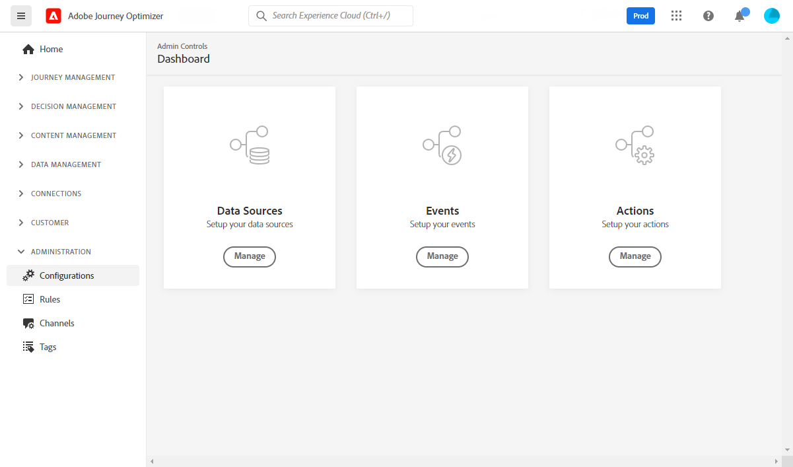

# Aan de slag met [!DNL Journey Optimizer] configuratie {#start-optimizer-configuration}

Bij toegang [!DNL Journey Optimizer] voor het eerst, bent u provisioned een productiesandbox en toegewezen een bepaald aantal IPs afhankelijk van uw contract.

Om uw reizen te kunnen tot stand brengen en berichten te verzenden, moet u door deze configuratiestappen gaan:

1. **Berichten en kanalen configureren**: voorinstellingen definiëren, e-mail- en pushberichten aanpassen en aanpassen

   * Instellingen voor pushmeldingen definiëren in beide [!DNL Adobe Experience Platform] en [!DNL Adobe Experience Platform Launch]. [Meer informatie](../messages/push-gs.md)

   * Maak voorinstellingen voor berichten om alle technische parameters te configureren die vereist zijn voor e-mail- en pushberichten. [Meer informatie](message-presets.md)

   * Bepaal welk e-mailadres u als prioriteit voor uw ontvangers wilt gebruiken wanneer in Adobe Experience Platform verschillende adressen beschikbaar zijn. [Meer informatie](primary-email-addresses.md)

   * Het aantal dagen beheren waarin opnieuw pogingen worden uitgevoerd voordat e-mailadressen naar de suppressielijst worden verzonden. [Meer informatie](manage-suppression-list.md)

   <!--
    * Understand push notification flow. [Learn more](../messages/push-gs.md)
    -->

1. **Subdomeinen delegeren**: voor om het even welk nieuw subdomain dat in Journey Optimizer moet worden gebruikt, zal de eerste stap het delegeren zijn. [Meer informatie](about-subdomain-delegation.md)

   

1. **IP-pools maken**: Verbeter uw e-mailleverbaarheid en reputatie door IP adressen te groeperen die aan uw instantie worden geleverd. [Meer informatie](ip-pools.md)

   

1. **Reizen configureren**: om reizen te bouwen, moet u vormen **[!UICONTROL Data Sources]**, **[!UICONTROL Events]** en **[!UICONTROL Actions]**. [Meer informatie](about-data-sources-events-actions.md)

   

   * De **Gegevensbron** De configuratie staat u toe om een verbinding aan een systeem te bepalen om extra informatie terug te winnen die in uw reizen zal worden gebruikt. Meer informatie over gegevensbronnen vindt u in deze [sectie](../datasource/about-data-sources.md)

   * **Gebeurtenissen** u toestaan om uw reizen te activeren om berichten, in real time, naar het individu te verzenden dat de reis overgaat. In de gebeurtenisconfiguratie, vormt u de gebeurtenissen die in de reizen worden verwacht. De gegevens van de binnenkomende gebeurtenissen worden genormaliseerd volgens het Adobe Experience Data Model (XDM). Gebeurtenissen zijn afkomstig van de streamingopname-API’s voor geverifieerde en niet-geverifieerde gebeurtenissen (zoals Adobe Mobile SDK-gebeurtenissen). Meer informatie over gebeurtenissen in deze [sectie](../event/about-events.md)

   * [!DNL Journey Optimizer] wordt geleverd met ingebouwde berichtmogelijkheden: u kunt uw inhoud ontwerpen en uw bericht publiceren. Als u een systeem van derden gebruikt om uw berichten te verzenden, maakt u een **aangepaste handeling**. Meer informatie over handelingen in deze [sectie](../action/action.md)