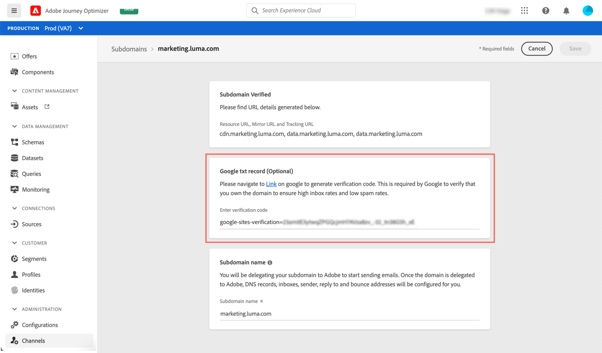

# Een Google TXT-record toevoegen aan een subdomein {#google-txt-record}

TXT-records zijn DNS-records die worden gebruikt om tekstgegevens over een domein te verstrekken en die kunnen worden gelezen door externe bronnen.

Om ervoor te zorgen dat de e-mails naar Gmail-adressen goed kunnen worden afgeleverd en succesvol kunnen worden verzonden, [!DNL Journey Optimizer] Hiermee kunt u speciale TXT-records voor verificatie van de Google-site toevoegen aan uw subdomeinen om te controleren of deze zijn geverifieerd.

>[!CAUTION]
>
> Deze bewerking kan alleen worden uitgevoerd als een subdomein het **[!UICONTROL Success]** status. Raadpleeg voor meer informatie over de status van subdomeinen [deze sectie](access-subdomains.md).

Ga als volgt te werk om een Google TXT-record aan uw subdomein toe te voegen:

1. Het subdomein openen vanuit het dialoogvenster **[!UICONTROL Channels]** / **[!UICONTROL Subdomains]** -menu.

1. In de **[!UICONTROL Google txt record]** de verificatiecode invoeren die is gegenereerd op basis van [Google Workspace](https://support.google.com/a/answer/183895){target=&quot;_blank&quot;}<!--G Suite Admin tools-->en klik vervolgens op **[!UICONTROL Save]**.

   

1. Nadat de TXT-record is toegevoegd, moet u deze door Google laten verifiëren. Navigeer om dit te doen naar [Google Workspace](https://support.google.com/a/answer/183895){target=&quot;_blank&quot;}<!--G Suite Admin tools-->en start vervolgens de verificatiestap.
