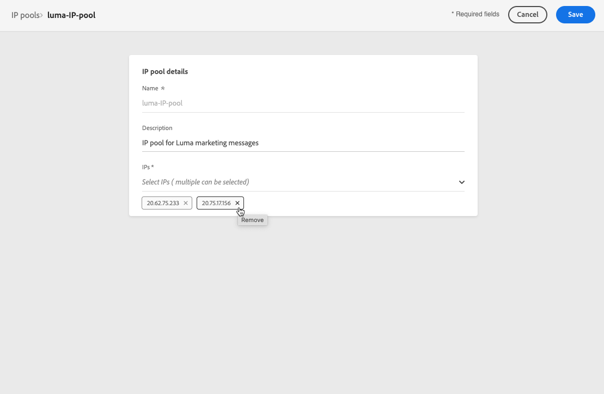

# IP-pools maken {#create-ip-pools}

>[!CONTEXTUALHELP]
>id="ajo_admin_ip_pool_header"
>title="Een IP-pool instellen"
>abstract="IP de pools verzamelen de IP adressen van uw subdomeinen voor betere e-mailleverbaarheid."

>[!CONTEXTUALHELP]
>id="ajo_admin_ip_pool"
>title="Een IP-pool instellen"
>abstract="Met Journey Optimizer kunt u IP-pools maken om de IP-adressen van uw subdomeinen te groeperen. Dit kan uw e-mailleverbaarheid beduidend verbeteren, omdat door dit te doen, kunt u de reputatie van subdomain verhinderen uw andere subdomeinen te beïnvloeden."

## IP-pools {#about-ip-pools}

Met [!DNL Journey Optimizer], kunt u IP pools tot stand brengen om de IP adressen van uw subdomeinen samen te groeperen.

Het maken van IP-pools wordt ten zeerste aanbevolen voor e-maillevering. Door dit te doen, kunt u de reputatie van subdomain verhinderen uw andere subdomeinen te beïnvloeden.

Bijvoorbeeld, moet één beste praktijk één IP pool voor uw marketing berichten, en een andere voor uw transactionele berichten hebben. Deze manier, als één van uw marketing berichten slecht presteert en als spam door een klant wordt verklaard, zal dit niet de transactionele berichten beïnvloeden die naar deze zelfde klant worden verzonden, die nog transactionele berichten (koopbevestigingen, de berichten van de wachtwoordterugwinning, enz.) zullen ontvangen.

>[!CAUTION]
>
>IP de poolconfiguratie is gemeenschappelijk voor alle milieu&#39;s. Daarom zal om het even welke IP groepsverwezenlijking of uitgave ook de productie zandbakken beïnvloeden.

## Een IP-pool maken {#create-ip-pool}

Ga als volgt te werk om een IP-pool te maken:

1. Toegang krijgen tot de **[!UICONTROL Administration]** > **[!UICONTROL Channels]** > **[!UICONTROL IP pools]** en klik vervolgens op **[!UICONTROL Create IP Pool]**.

   

1. Geef een naam en een beschrijving (optioneel) voor de IP-pool op.

   >[!NOTE]
   >
   >De naam moet beginnen met een letter (A-Z) en mag alleen alfanumerieke tekens of speciale tekens ( _, ., - ) bevatten.

1. Selecteer de IP adressen om in de pool van de drop-down lijst te omvatten, dan klik **[!UICONTROL Submit]**.

   

   >[!NOTE]
   >
   >Alle IP adressen provisioned met uw instantie zijn beschikbaar in de lijst.

Wanneer het selecteren van IPs, kunt u van de lijst de PTR verslagen zien verbonden aan IPs. Dit staat u toe om de branding informatie voor elk IP te verifiëren wanneer het creëren van een IP pool, en IPs met de zelfde branding informatie bijvoorbeeld te selecteren. [Meer informatie over PTR-records](ptr-records.md)

>[!NOTE]
>
>Als geen PTR verslag voor IP wordt gevormd, kunt u niet dat IP selecteren. Bereik uit aan uw vertegenwoordiger van de Adobe voor het vormen van het PTR verslag van dat IP.

Nadat een IP pool is gecreeerd, is de informatie PTR zichtbaar wanneer het hangen over de IP adressen die onder de IP pool drop-down lijst worden getoond.

De IP pool wordt nu gecreeerd en toont in de lijst. U kunt deze selecteren om toegang te krijgen tot de eigenschappen en het bijbehorende kanaaloppervlak weer te geven (d.w.z. de voorinstelling voor berichten). Voor meer op hoe te om een kanaaloppervlakte met een IP pool te associëren, verwijs naar [deze sectie](channel-surfaces.md).

## Een IP-pool bewerken {#edit-ip-pool}

Volg onderstaande stappen om een IP-pool te bewerken.

1. Klik in de lijst op de naam van de IP-pool om deze te openen.

   

1. Bewerk de eigenschappen naar wens. U kunt de beschrijving wijzigen en IP-adressen toevoegen of verwijderen.

   >[!NOTE]
   >
   >De naam van de IP-pool kan niet worden bewerkt. Als u het wilt wijzigen, moet u de IP pool schrappen en een andere met de naam van uw keus creëren.

   

   >[!CAUTION]
   >
   >Ga met extra zorg te werk wanneer het overwegen van het schrappen van IP, aangezien dit extra lading op andere IPs zal zetten en ernstige gevolgen voor uw leverbaarheid kan hebben. Neem in geval van twijfel contact op met een leverancier.

1. Sla uw wijzigingen op.

De update is onmiddellijk of asynchroon van kracht, afhankelijk van de IP pool die aan een wordt geassocieerd [kanaaloppervlak](channel-surfaces.md) of niet:

* Als de IP pool is **niet** wordt gekoppeld aan een kanaaloppervlak, wordt de update onmiddellijk uitgevoerd (**[!UICONTROL Success]** status).
* Als de IP pool **is** kan de update maximaal 3 uur duren (**[!UICONTROL Processing]** status).

>[!NOTE]
>
>Wanneer [een kanaaloppervlak maken](channel-surfaces.md#create-channel-surface), als u een IP pool selecteert die onder uitgave (**[!UICONTROL Processing]** status) en u bent nooit gekoppeld aan het subdomein dat voor dat oppervlak is geselecteerd, kunt u niet doorgaan met het maken van het oppervlak. [Meer informatie](channel-surfaces.md#subdomains-and-ip-pools)

Om de IP status van de poolupdate te controleren, klik **[!UICONTROL More actions]** en selecteert u **[!UICONTROL Recent updates]**.

>[!NOTE]
>
>Zodra een IP Groep met succes wordt bijgewerkt, kunt u moeten wachten:
>* een paar minuten voordat het wordt verbruikt door de eenheidspublicaties,
>* tot de volgende partij voor de IP pool om in partijberichten efficiënt te zijn.

U kunt ook de opdracht **[!UICONTROL Delete]** knoop om een IP pool te schrappen. Merk op dat u geen IP pool kunt schrappen die aan een kanaaloppervlakte is geassocieerd.

