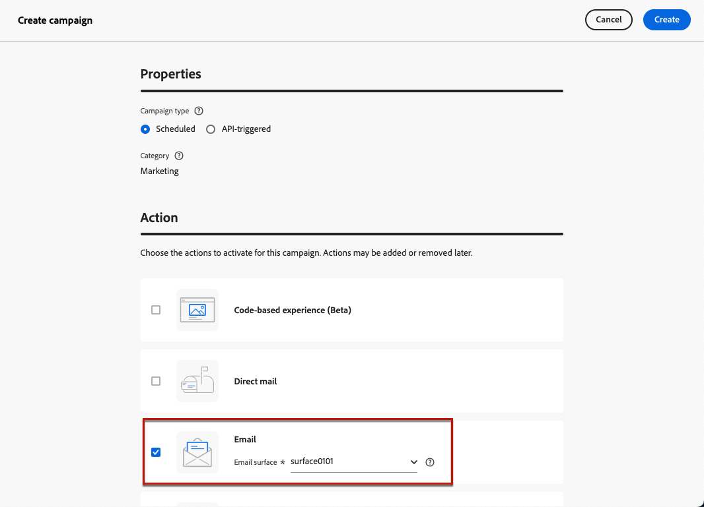

# IP-warmtecampagnes maken {#create-ip-warmup-campaign}

>[!CONTEXTUALHELP]
>id="ajo_campaign_ip_warmup"
>title="Activeer de IP optie van het warmlopingsplan"
>abstract="Wanneer u deze optie selecteert, kan de campagne in een IP warmlopingsplan worden gebruikt. Het campagneschema zal dan door het IP warmup plan worden aangedreven het met wordt geassocieerd."

Alvorens het IP warmup plan zelf in [!DNL Journey Optimizer] tot stand te brengen, moet u eerst één of meerdere campagnes tot stand brengen specifiek voor gebruik in een IP warmup plan <!--through a dedicated option--> worden ontworpen.

Om een IP warmup campagne tot stand te brengen, volg de hieronder stappen.

1. Creeer een e-mailkanaal [ configuratie ](channel-surfaces.md) voor het domein en IPs dat u voor uw warmlopingsplan hebt geïdentificeerd.

   Werk samen met uw leverancier om het domein en IPs te identificeren dat moet worden gebruikt. Leer hoe te om hen in een e-mailconfiguratie in [ te selecteren deze sectie ](../email/email-settings.md#subdomains-and-ip-pools).

   >[!CAUTION]
   >
   >Bewerk niet de configuratie van het e-mailkanaal nadat het IP warmup plan  is begonnen.

1. Creeer een geplande marketing [ campagne ](../campaigns/create-campaign.md) en selecteer de [ E-mail ](../email/create-email.md#create-email-journey-campaign) actie.

   <!--Select the Marketing category. The IP warmup plan activation option is only available for  marketing-type campaigns.-->

1. Selecteer de configuratie die u voor IP warmte-up creeerde.

   

   <!--You must use the same configuration as the one that will be used for the asociated IP warmup plan. [Learn how to create an IP warmup plan](#create-ip-warmup-plan)-->

1. Klik op **[!UICONTROL Create]**.

1. Selecteer in de sectie **[!UICONTROL Schedule]** de optie **[!UICONTROL IP warmup plan activation]**.

   

   Het campagne [ programma ](../campaigns/create-campaign.md#schedule) zal door het IP warmup plan worden gedreven het zal worden geassocieerd met, betekenend dat het programma niet meer in de campagne zelf wordt bepaald.

1. Voltooi de stappen om een e-mailcampagne tot stand te brengen, zoals het bepalen van de campagneeigenschappen, [ publiek ](../audience/about-audiences.md)<!--best practices for IP warmup in terms of audience?-->, en [ inhoud ](../email/get-started-email-design.md#key-steps).

   >[!IMPORTANT]
   >
   >Het publiek dat in een IP warmup campagne wordt toegestaan moet [ op segment-gebaseerd ](../audience/creating-a-segment-definition.md) zijn en tot stand gebracht gebruikend het [ standaardsamenvoegingsbeleid ](https://experienceleague.adobe.com/en/docs/experience-platform/profile/merge-policies/overview#default-merge-policy){target="_blank"}.

   Voor meer informatie over hoe te om een campagne te vormen, verwijs naar [ deze pagina ](../campaigns/get-started-with-campaigns.md).

1. [ activeer ](../campaigns/review-activate-campaign.md) de campagne. De status verandert in **[!UICONTROL Live]** .

   >[!NOTE]
   >
   >[ Bedrijfs regels ](../conflict-prioritization/rule-sets.md#apply-frequency-rule) zouden niet op IP warmup plannen moeten worden gebruikt. De toepassing van deze regels kan het bereiken van het gewenste aantal doelprofielen voor campagnes belemmeren.

   Voor een levende campagne met IP geactiveerd warmup plan, is de **[!UICONTROL Delete]** knoop beschikbaar tot het met een IP warmup plan wordt geassocieerd. Als de campagne eenmaal in een abonnement is gebruikt, kan deze niet meer worden verwijderd.

1. De campagne wordt weergegeven in de lijst **[!UICONTROL Campaigns]** . Om alle IP warmup campagnes gemakkelijk terug te winnen die op de huidige zandbak worden gecreeerd, kunt u op de **[!UICONTROL IP warmup]** campagneoptie filtreren.

   

Zodra levend, is de campagne klaar voor gebruik in een IP warmup plan. [Meer informatie](ip-warmup-plan.md)

Een IP warmup campagne kan slechts in één IP warmup plan worden gebruikt. Nochtans, kan de zelfde campagne in één of meerdere fasen van het zelfde IP warmup plan worden gebruikt. [Meer informatie](ip-warmup-plan.md#define-phases)

>[!NOTE]
>
>Wanneer een levende campagne in een IP warmup plan wordt gebruikt, nadat het plan [ zoals voltooid ](ip-warmup-execution.md#mark-as-completed) duidelijk is, verandert het statuut van die campagne in **[!UICONTROL Stopped]**.

