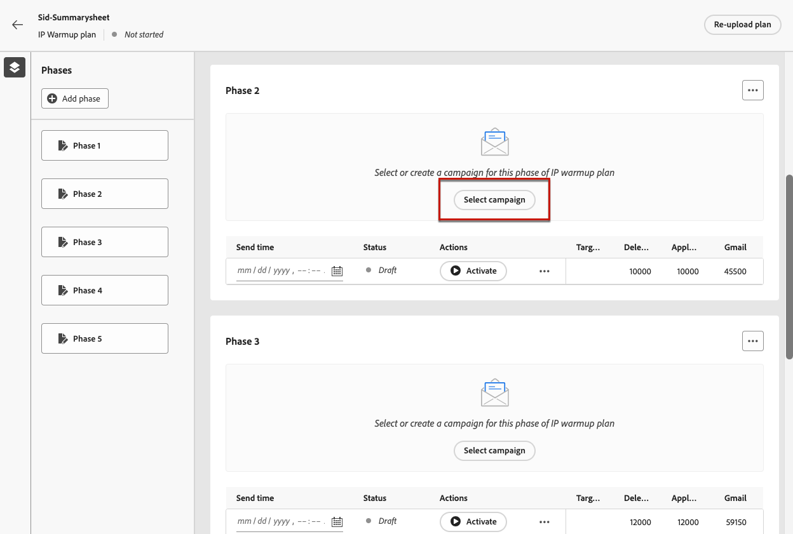
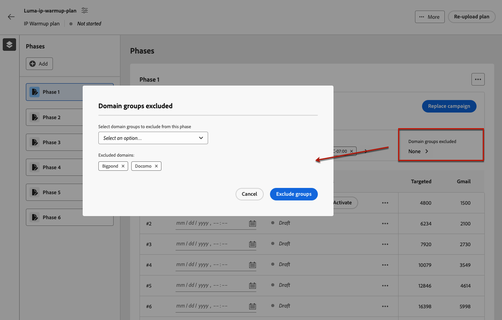
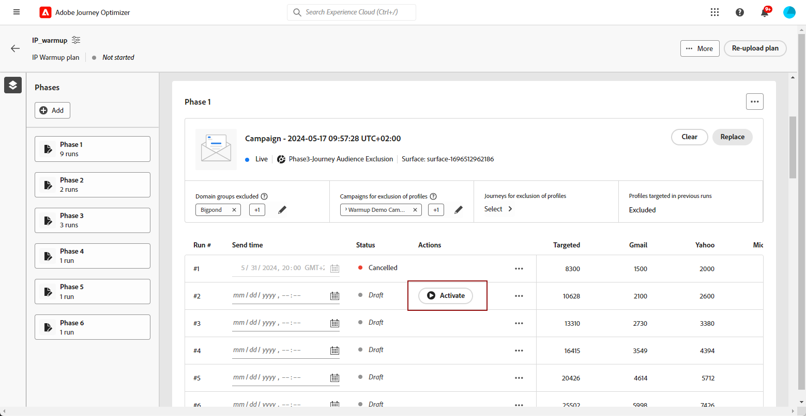
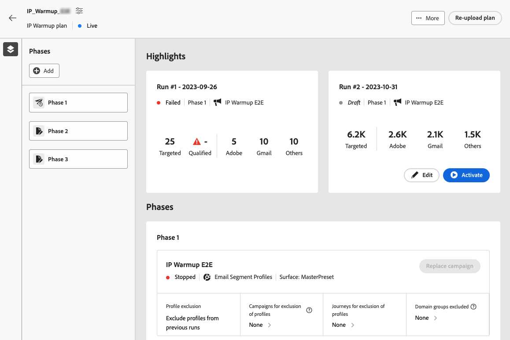

# Voer het IP warmlopingsplan uit {#ip-warmup-running}

Zodra u [ een IP warmup plan ](ip-warmup-plan.md) hebt gecreeerd en het dossier geüpload dat met uw leverbaarheidsadviseur wordt voorbereid, kunt u de fasen en looppas in uw plan bepalen.

Elke fase bestaat uit verschillende uitvoeringen, waaraan u één campagne toewijst.

## De fasen definiëren {#define-phases}

>[!CONTEXTUALHELP]
>id="ajo_admin_ip_warmup_campaigns_excluded"
>title="Campagnepubliek uitsluiten"
>abstract="Selecteer campagnes om hun publiek uit te sluiten van de huidige fase. Hierdoor wordt voorkomen dat eerder gecontacteerde profielen opnieuw worden aangewezen; alleen diegenen die via de reis hebben gecommuniceerd, worden uitgesloten."

>[!CONTEXTUALHELP]
>id="ajo_admin_ip_warmup_domains_excluded"
>title="Domeingroepen uitsluiten"
>abstract="Selecteer de domeinen die u van de huidige fase wilt uitsluiten. De uitsluiting van het domein vereist een niet-uitgevoerde fase, zodat kunt u een lopende fase moeten verdelen om uitsluitingen toe te voegen."
>additional-url="https://experienceleague.adobe.com/docs/journey-optimizer/using/configuration/implement-ip-warmup-plan/ip-warmup-execution.html#split-phase" text="Een fase splitsen"

>[!CONTEXTUALHELP]
>id="ajo_admin_ip_warmup_phases"
>title="Definieer de fasen van uw abonnement"
>abstract="Elke fase bestaat uit verschillende uitvoeringen, waaraan u één campagne toewijst."

<!--You need to associate the campaign and audience at phase level and turns on some settings as needed for all runs associated with a single creative/campaign

At phase level, system ensures that previously targeted + new profiles are picked up AND at iteration level, system ensures that each run is having unique profiles and the count matches what is stated in plan-->

<!---->

Om de fasen van uw IP warmup plan te bepalen, moet u een campagne voor elke fase selecteren, uitsluitingen voor domeinen en publiek vormen, en profiel het richten beheren. Elke fase kan veelvoudige looppas bevatten die in de volgende sectie zal worden gevormd. Voer de volgende stappen uit:

1. Selecteer de campagne u met de eerste fase van het IP opwarmingsplan wilt associëren.

   >[!NOTE]
   >
   >U kunt geen campagne selecteren die reeds in gebruik in een ander IP warmlopingsplan is. Nochtans, kan de zelfde campagne in één of meerdere fasen van het zelfde IP warmup plan worden gebruikt.

   

   >[!IMPORTANT]
   >
   >* Alleen de campagnes waarvoor de optie **[!UICONTROL IP warmup plan activation]** is ingeschakeld, zijn beschikbaar voor selectie. [Meer informatie](#create-ip-warmup-campaign)
   >
   >* Slechts zijn de campagnes die de zelfde configuratie zoals het geselecteerde IP warmup plan gebruiken beschikbaar voor selectie.

1. Wanneer een campagne voor de huidige fase is geselecteerd, worden de secties voor het uitsluiten van profielen, campagnepubliek en domeingroepen weergegeven.

   >[!NOTE]
   >
   >Zodra een looppas wordt geactiveerd, kunnen de uitsluitingen niet meer worden gewijzigd tenzij u [ de looppas ](#split-phase) aan een nieuwe fase splitst.

   1. Selecteer in de sectie **[!UICONTROL Domain groups excluded]** de domeinen die u van die fase wilt uitsluiten.

      >[!NOTE]
      >
      >De uitsluiting van het domein vereist een niet uitgevoerde fase, zodat zou u [ een lopende fase ](#split-phase) kunnen vereisen splitsen om uitsluitingen toe te voegen.

      

      Bijvoorbeeld, na het runnen van IP warmte voor sommige dagen, realiseert u dat uw ISP reputatie met een domein (bijvoorbeeld, Adobe) niet goed is en u wenst om het op te lossen zonder uw IP warmlopingsplan tegen te houden. In dat geval kunt u de Adobe-domeingroep uitsluiten.

      >[!NOTE]
      >
      >U kunt een groep van het douanedomein slechts uitsluiten die aan het [ IP malplaatje van het warmup plan ](ip-warmup-plan.md#prepare-file) werd toegevoegd. Als dit niet het geval is, werk het malplaatje met de groep van het douanedomein bij u wilt uitsluiten en [ herupload het plan ](#re-upload-plan).

      >[!CAUTION]
      >
      >Zodra het IP warmup plan loopt, als u het [ uitvoeringsadres ](../email/email-settings.md#execution-address) in de configuratie van het e-mailkanaal  bijwerkt die in de IP warmup campagne wordt gebruikt, kon de domeinuitsluiting ontbreken. Bewerk de configuratie van het e-mailkanaal niet nadat het IP-opwarmingsplan is gestart.

   1. Selecteer in de sectie **[!UICONTROL Campaign for exclusion of profiles]** de campagnes die het publiek dat u wilt uitsluiten van de huidige fase.

      

      Bijvoorbeeld, terwijl het uitvoeren van Fase 1, moest u het [ splitsen ](#split-phase) om het even welke reden. Daarom kunt u de campagne uitsluiten die in Fase 1 wordt gebruikt, zodat de eerder gecontacteerde profielen van Fase 1 niet inbegrepen in Fase 2 zijn. U kunt campagnes van andere IP warmteopnameplannen ook uitsluiten.

   1. Selecteer in de sectie **[!UICONTROL Journeys for exclusion of profiles]** de ritten met het publiek dat u wilt uitsluiten van de huidige fase.

      +++ Als u de optie Transparanten voor uitsluiten van profielen wilt gebruiken, moet u een relatie tot stand brengen tussen de schema&#39;s AJO Message Feedback Event en AJO Entity Record.

      1. Creeer een douane **Namespace** die als identiteitstype voor de hieronder stappen zal dienen.

      1. De toegang Adobe Experience Platform, van het **menu van Schema&#39;s**, selecteert het **Schema van het Verslag van de Entiteit van AJO** en plaatst het **_id** gebied als primaire identiteit, en selecteert eerder gecreeerde namespace als **Identiteit namespace**.

      1. Van het **menu van Schema&#39;s**, selecteer het **Schema van de Gebeurtenis van de Terugkoppeling van het Bericht van AJO**, en navigeer aan het **_messageID** gebied. Selecteer **verhouding** toevoegen en kies **het Schema van het Verslag van de Entiteit van AJO** als **schema van de Verwijzing** en uw eerder gecreeerd namespace als **Identiteit van de Verwijzing namespace**.
      +++

   1. In de sectie **[!UICONTROL Profiles targeted in previous runs]** ziet u dat de profielen uit de vorige versies van die fase altijd zijn uitgesloten. Als in Run #1 bijvoorbeeld een profiel in de eerste 4800 doelgroepen is opgenomen, zorgt het systeem er automatisch voor dat hetzelfde profiel de e-mail niet ontvangt in Run #2.

      >[!NOTE]
      >
      >Deze sectie kan niet worden bewerkt.

1. Indien nodig kunt u de campagne vervangen met de knop **[!UICONTROL Replace]** . U kunt de geselecteerde campagne ook **[!UICONTROL Clear]** met de knop **[!UICONTROL Clear]** . Deze actie zal niet alleen de campagne maar ook de andere faseniveau eigenschappen (domeingroepen sluiten uit, Campagne, de Uitsluiting van de Reis, en anderen. Na het ontruimen, kunt u of onmiddellijk of op een recentere tijd een nieuwe campagne kiezen.

   

   >[!NOTE]
   >
   >Deze handeling is alleen mogelijk voordat de eerste uitvoering van de fase wordt geactiveerd. Zodra een looppas wordt geactiveerd, kan de campagne niet worden vervangen, tenzij u [ de looppas ](#split-phase) aan een nieuwe fase splitst.

1. U kunt desgewenst een fase toevoegen. Het zal na de laatste fase worden toegevoegd.

   

1. Gebruik de knop **[!UICONTROL Delete phase]** om ongewenste fasen te verwijderen. Deze actie is alleen beschikbaar als er geen uitvoering wordt uitgevoerd in een fase. <!--Once a run is executed, deletion is not allowed.-->

   >[!CAUTION]
   >
   >U kunt de handeling **[!UICONTROL Delete phase]** niet ongedaan maken.

   

   >[!NOTE]
   >
   >Als u alle fasen van het IP warmlopingsplan schrapt, wordt het geadviseerd om een plan opnieuw te uploaden. [Meer informatie](#re-upload-plan)

## De uitvoeringen definiëren {#define-runs}

>[!CONTEXTUALHELP]
>id="ajo_admin_ip_warmup_run"
>title="Elke uitvoering definiëren"
>abstract="Definieer en activeer elke uitvoering voor alle fasen."

>[!CONTEXTUALHELP]
>id="ajo_admin_ip_warmup_last_engagement"
>title="Filter op betrokkenheid"
>abstract="Deze kolom is een filter dat alleen gericht is op de gebruikers die de afgelopen 20 dagen bijvoorbeeld met uw merk zijn verbonden. U kunt dit het plaatsen door **ook veranderen geef looppas** optie uit."

>[!CONTEXTUALHELP]
>id="ajo_admin_ip_warmup_retry"
>title="Een tijdvenster instellen"
>abstract="U kunt een tijdvenster bepalen waarin de IP warmup campagne kan worden uitgevoerd voor het geval dat er om het even welke vertragingen in de segmentatietaak zijn."

>[!CONTEXTUALHELP]
>id="ajo_admin_ip_warmup_pause"
>title="Uitvoeren annuleren met publieksfouten"
>abstract="Selecteer deze optie als u een uitvoering wilt annuleren als de gekwalificeerde profielen kleiner zijn dan de doelprofielen nadat het publiek voor die uitvoering is geëvalueerd."

>[!CONTEXTUALHELP]
>id="ajo_admin_ip_warmup_qualified"
>title="De gekwalificeerde profielen weergeven"
>abstract="In deze kolom wordt het aantal gekwalificeerde profielen weergegeven. Zodra het publiek voor een looppas is geëvalueerd, als er meer gerichte profielen dan gekwalificeerde profielen zijn, wordt de looppas nog uitgevoerd, tenzij **annuleert geactiveerde looppas in het geval van fouten** optie wordt toegelaten. In dit geval wordt de uitvoering geannuleerd."

Na het bepalen van de fasen van uw IP warmup plan, moet u de individuele looppas binnen elke fase vormen. Voor elke uitvoering is een planning vereist en u kunt optioneel betrokkenheidsfilters, foutafhandeling en opnieuw proberen voor een optimale uitvoering. Voer de volgende stappen uit:

1. Selecteer een schema voor elke looppas om ervoor te zorgen het op de gespecificeerde tijd wordt uitgevoerd.

   

1. Naar keuze, kunt u een tijdvenster bepalen waarin de IP warmup campagne kan worden uitgevoerd voor het geval dat er om het even welke vertragingen in de [ publieksevaluatie ](https://experienceleague.adobe.com/docs/experience-platform/segmentation/home.html#how-segmentation-works){target="_blank"} zijn. Klik hiertoe linksboven op het pictogram Eigenschappen naast de naam van het abonnement en gebruik de vervolgkeuzelijst **[!UICONTROL Retry run time]** om een duur te selecteren van maximaal 240 minuten (4 uur).

   >[!NOTE]
   >
   >De pogingen gebeuren elke 30 minuten tot het eind van het bepaalde tijdvenster.

   

   Als u bijvoorbeeld een verzendtijd instelt op een bepaalde dag om 9.00 uur en 120 minuten selecteert als de runtime voor opnieuw proberen, is het mogelijk dat de runtime wordt uitgevoerd met een periode van 2 uur (9.00 - 11.00 uur) voor onverwachte vertragingen in de publieksevaluatie.

   >[!NOTE]
   >
   >Als geen tijdvenster wordt gespecificeerd, wordt de looppas geprobeerd bij verzendt tijd en zal ontbreken als de publieksevaluatie niet wordt voltooid.

1. Selecteer indien nodig **[!UICONTROL Edit run]** in het pictogram Meer handelingen. Daar kunt u de aantallen adressen in elke kolom bijwerken. U kunt het veld **[!UICONTROL Last engaged]** ook bijwerken, zodat alleen gebruikers worden aangewezen die bijvoorbeeld de afgelopen 20 dagen met uw merk hebben gewerkt.

   >[!NOTE]
   >
   >U wordt aangeraden deze nummers aan te passen in overleg met uw leverancier.

   

   >[!NOTE]
   >
   >Als u geen betrokkenheidsperiode wilt toepassen op een uitvoering, voert u 0 in het veld **[!UICONTROL Last engaged]** in.

1. Selecteer de optie **[!UICONTROL Cancel activated runs in case of errors]** om een uitvoering te annuleren als de gekwalificeerde profielen kleiner zijn dan de doelprofielen nadat het publiek voor die uitvoering is geëvalueerd.

   

   Als het aantal gekwalificeerde profielen niet overeenkomt met het aantal doelprofielen (er worden bijvoorbeeld 1500 Gmail-adressen als doel opgegeven tijdens de uitvoering, maar er zijn slechts 700 Gmail-gekwalificeerde profielen):

   * Als de optie is ingeschakeld, mislukt de uitvoering en neemt de uitvoering de status **[!UICONTROL Failed]** aan. <!--You can then either choose to target less profiles in the next run, or to [split the run](#split-phase) to a new phase and select a new campaign for the new phase to target the same profiles again.-->

   * Als de optie niet is ingeschakeld, wordt de uitvoering uitgevoerd, maar wordt alleen het beschikbare aantal profielen als doel ingesteld.

1. **[!UICONTROL Activate]** de run. [Meer informatie](#activate-run)

1. De status van deze uitvoering verandert in **[!UICONTROL Live]** , wat betekent dat het systeem het verzoek om de uitvoering te plannen heeft geaccepteerd.

   >[!NOTE]
   >
   >De verschillende looppasstatussen zijn vermeld in [ deze sectie ](#monitor-plan).

1. Als de uitvoering van de campagne niet is gestart, kunt u een live uitvoering annuleren. Deze actie annuleert eigenlijk het runtime programma - het stopt niet het verzenden.

   

1. Selecteer **[!UICONTROL Duplicate run]** als u concepten, live of voltooide bewerkingen wilt dupliceren. Tijdens duplicatie wordt het menu Edit run weergegeven, waarmee gebruikers **[!UICONTROL Total target profiles]** en **[!UICONTROL Send time]** naar behoefte kunnen aanpassen.

   

## Runnen activeren {#activate-run}

Selecteer de knop **[!UICONTROL Activate]** om een uitvoering te activeren. Dan kunt u de volgende looppas op een dagelijkse basis activeren.

Wanneer het runnen van veelvoudige IP warmup plannen gelijktijdig, allen gericht de zelfde IP pool en domeinen, is het cruciaal om de potentiële gevolgen te voorzien. Bijvoorbeeld, als ISP een dagelijkse grens van 100 e-mail afdwingt, zou het runnen van verscheidene plannen die op de zelfde domeinen richten deze drempel kunnen overschrijden.

Zorg ervoor u genoeg tijd hebt gepland om voor de [ publieksevaluatie ](https://experienceleague.adobe.com/docs/experience-platform/segmentation/home.html#how-segmentation-works){target="_blank"} toe te staan om worden uitgevoerd.

>[!CAUTION]
>
>Elke run moet ten minste 12 uur vóór de werkelijke verzendtijd en vóór de dagelijkse batchsegmentatietaak worden geactiveerd. Anders is het mogelijk dat de publieksevaluatie niet is voltooid.

Wanneer u een run activeert, worden automatisch meerdere soorten publiek gemaakt.

* Indien de eerste uitvoering van een fase wordt geactiveerd:

   * Een [ publiek ](https://experienceleague.adobe.com/docs/experience-platform/segmentation/ui/segment-builder.html){target="_blank"} wordt gecreeerd voor de uitgesloten campagnepubliek (als om het even welk), met de volgende noemende overeenkomst: `<warmupName>-Phase<phaseNo>-Audience Exclusion`.

   * Er wordt een publiek gemaakt voor de (eventuele) domeingroepen die zijn uitgesloten, met de volgende naamgevingsconventie: `<warmupName>-Phase<phaseNo>-Domain Exclusion` .

   * Er wordt een ander publiek gemaakt voor het reispubliek dat (indien aanwezig) is uitgesloten, met de volgende naamgevingsconventie: `<warmupName>-Phase<phaseNo>-Journey Audience Exclusion` .

  >[!NOTE]
  >
  >Het publiek wordt opgeschoond nadat het warmtekrachtplan als voltooid is gemarkeerd.
  >
  >Het systeem creëert geen nieuw publiek voor het geval er geen wijziging optreedt in het uitgesloten campagnepubliek, het uitgesloten reispubliek of domeingroepen voor volgende fasen.

* Bij het activeren van een uitvoering:

   * Er wordt een ander publiek gemaakt voor het laatste betrokkenheidsfilter, met de volgende naamgevingsconventie: `<warmupName>-Phase<phaseNo>_Run<runNo>-Engagement Filter` .

     >[!NOTE]
     >
     >Het publiek wordt opgeruimd nadat het opwarmingsplan is voltooid.
     >
     >Het systeem maakt geen nieuw publiek voor het geval er geen wijziging optreedt in het laatste betrokkenheidsfilter voor volgende fasen.

   * Een [ publiekssamenstelling ](https://experienceleague.adobe.com/docs/experience-platform/segmentation/ui/audience-composition.html){target="_blank"} wordt gecreeerd die aan het publiek beantwoordt de campagne zal worden verzonden naar, met de volgende noemende overeenkomst: `<warmupName>-Phase<phaseNo>-Run<runNo>`.

     >[!NOTE]
     >
     >Voor elke run wordt een nieuwe publiekscompositie gemaakt. Met een grens van 10, moeten de gebruikers die veelvoudige campagnes, reizen, en IP warmup plannen gelijktijdig gebruiken gepubliceerde publiekssamenstellingen van plan zijn om binnen deze grens voor parallelle verrichtingen te blijven.
     >
     >De publiekssamenstelling (en vandaar het outputpubliek) wordt schoongemaakt wanneer de volgende herhaling wordt geactiveerd.

   * Er wordt een uitvoerpubliek gemaakt met de volgende naamgevingsconventie: `IP Warmup Audience-<warmupName>-Phase<phaseNo>-Run<runNo>` .

<!--How do you know when segmentation is complete? Is there a way to prevent user from scheduling less than 12 hours before the segmentation job?-->

<!--Sart to execute on every day basis by simply clicking the play button > for each run? do you have to come back every day to activate each run? or can you schedule them one after the other?)-->

<!--Upon activation, when the segment evaluation happens, more segments will be created by the IP warmup service and will be leveraged in an audience composition and a new audience will be created for each run splitted into the different selected domains.-->

## Het abonnement controleren {#monitor-plan}

Om uw IP warmup plan met succes uit te voeren, moet u de rapporten controleren, looppas activeren en hun status op een dagelijkse basis controleren.

### De sectie Hooglichten gebruiken {#highlights}

Nadat de eerste uitvoering voor een fase is geactiveerd, wordt de sectie **[!UICONTROL Highlights]** weergegeven.

Het biedt een snel overzicht van de huidige runtime en de komende run. Vanuit deze sectie kunt u ook de volgende uitvoering bewerken en activeren.

### De status van uitvoering controleren {#run-statuses}

Het IP warmup plan zelf dient als geconsolideerd rapport op één enkele plaats. U kunt elementen zoals het aantal **[!UICONTROL Live]** of **[!UICONTROL Completed]** looppas voor elke fase controleren, en bekijken hoe uw IP warmlopingsplan vordert.

>[!NOTE]
>
>Als beste praktijken, wordt het geadviseerd om uw IP opwarmingsplan op een dagelijkse basis te controleren.

Een run kan de volgende statussen hebben:

* **[!UICONTROL Draft]** : wanneer een looppas wordt gecreeerd, of wanneer [ creërend een nieuw plan ](ip-warmup-plan.md) of [ toevoegend a looppas ](#define-runs) van het gebruikersinterface, neemt het de **[!UICONTROL Draft]** status.
* **[!UICONTROL Live]**: wanneer u een uitvoering activeert, heeft deze de status **[!UICONTROL Live]** . Het betekent dat het systeem het verzoek om de runtime te plannen heeft aanvaard - niet dat het verzenden is begonnen. In dit stadium kunt u de status van de live run bekijken door op de knop **[!UICONTROL View status]** in de tabel te klikken. Zo kunt u bijhouden hoeveel doelprofielen daadwerkelijk zijn gekwalificeerd.
* **[!UICONTROL Completed]** : de uitvoering van de campagne voor deze uitvoering is voltooid. U kunt tot een gedetailleerd looppasrapport toegang hebben door de **[!UICONTROL View report]** knoop in de lijst te klikken. Met deze optie kunt u de status van de e-maillevering van de uitvoering bijhouden, inclusief de specifieke onderverdelingen voor domeingroepen voor uitgebreide controle. De bijbehorende campagne wordt ingesteld als Gestopt.[Meer informatie](#reports)
* **[!UICONTROL Cancelled]**: een **[!UICONTROL Live]** run is geannuleerd met de knop **[!UICONTROL Cancel]** .[Meer informatie](#define-runs)
* **[!UICONTROL Failed]**: er is een fout aangetroffen door het systeem of de campagne die voor de huidige fase is gebruikt, is gestopt, of u hebt de optie **[!UICONTROL Cancel activated runs in case of errors]** ingeschakeld en er is een fout opgetreden. Als een run mislukt, kunt u een andere run plannen voor de volgende dag.

### Rapporten gebruiken {#reports}

Meer in het algemeen, om het effect van uw plan te meten, kunt u de prestaties van uw IP warmup campagnes controleren gebruikend de [!DNL Journey Optimizer] campagnerapporten. U doet dit voor elke voltooide uitvoering door op de knop **[!UICONTROL View reports]** te klikken. Leer meer over het campagne-e-mail [ levende rapport ](../reports/campaign-live-report.md#email-live) en [ het rapport van Customer Journey Analytics ](../reports/campaign-global-report-cja-email.md).

U kunt tot de rapporten van het [ menu van Campagnes ](../campaigns/manage-campaigns.md#access) ook toegang hebben aangezien uw plan verschillende campagnes zou kunnen gebruiken.

## Uw abonnement beheren {#manage-plan}

Op om het even welk punt, als uw IP warmup plan niet zoals verwacht presteert, kunt u de hieronder acties nemen.

### Een fase splitsen {#split-phase}

Als u een nieuwe fase wilt toevoegen die begint bij een specifieke uitvoering, selecteert u de optie **[!UICONTROL Split runs to a new phase]** in het pictogram Meer acties.

Er wordt een nieuwe fase gemaakt voor de resterende uitvoeringen van de huidige fase.

Als u deze optie bijvoorbeeld selecteert voor Run #4, worden Runs #4 tot en met #8 verplaatst naar een nieuwe fase vlak na de huidige fase.

Volg de stappen [ hierboven ](#define-phases) om de nieuwe fase te bepalen.

* U kunt de opties **[!UICONTROL Replace]** of **[!UICONTROL Clear]** gebruiken voor die nieuwe fase.

* U kunt ook de vorige campagne uitsluiten, of een domein dat niet goed presteert. Leer hoe in [ deze sectie ](#define-phases).

<!--
You do not have to decide the campaign upfront. You can do a split later. It's a work in progress plan: you activate one run at a time with a campaign and you always have the flexibility to modify it while working on it.

But need to explain in which case you want to modify campaigns, provide examples
-->

### Upload een IP warmup plan opnieuw {#re-upload-plan}

Als uw IP warmup plan niet zoals verwacht uitvoert (bijvoorbeeld, als u opmerkt dat sommige ISPs uw berichten als spam) merkt, kunt u uw leverbaarheidsdeskundige vragen om opstelling een ander IP dossier van het warmup plan en herupload het gebruikend de overeenkomstige knoop.

Alle eerder uitgevoerde looppas zal read-only zijn. Het nieuwe plan wordt getoond onder het eerste plan.

Volg de stappen [ hierboven ](#define-phases) om de fasen van het nieuwe plan te bepalen.

>[!NOTE]
>
>De IP details van het warmup plan zullen veranderen zoals per het onlangs geupload dossier. De eerder uitgevoerde looppas (geen kwestie hun [ status ](#monitor-plan)) wordt niet beïnvloed.

Laten we een voorbeeld nemen:

* Met het aanvankelijke IP warmup plan, had Fase 2 9 looppas.

* 4 looppas werd uitgevoerd (maakt niet uit als ontbroken, voltooid of geannuleerd <!--as long as a run has been attempted, it is an executed run-->).

* Als u een nieuw plan opnieuw uploadt, zal Fase 2 met de eerste 4 uitgevoerde looppas op read-only wijze gaan.

* De resterende 5 looppas (die in ontwerpstaat zijn) wordt verplaatst naar een nieuwe fase (Fase 3) die volgens het onlangs geüploade plan verschijnt.

### Een abonnement markeren als voltooid {#mark-as-completed}

Als uw IPs met het gewenste volume werd opgewarmd, of als uw plan niet goed genoeg presteert of als u het wilt laten vallen om een andere te creëren, kunt u het merken zoals voltooid.

Klik hiertoe op de knop **[!UICONTROL More]** rechtsboven in het IP-warmteopnameplan en selecteer **[!UICONTROL Mark as completed]** .

Deze optie is alleen beschikbaar als alle uitvoeringen in het abonnement de status **[!UICONTROL Completed]** of **[!UICONTROL Draft]** hebben. Als een run **[!UICONTROL Live]** is, wordt de optie grijs weergegeven.

De verschillende looppasstatussen zijn vermeld in [ deze sectie ](#monitor-plan).

