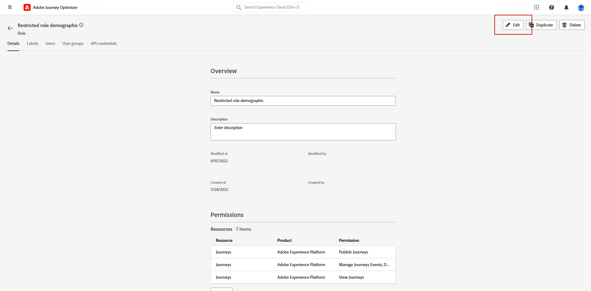

# Creeer een IP warmlopingsplan {#ip-warmup}

Zodra u één of meerdere [&#x200B; IP warmup campagnes &#x200B;](ip-warmup-campaign.md) met een specifieke configuratie en de overeenkomstige toegelaten optie creeerde, kunt u beginnen uw IP warmup plan te creëren.

Om tot de IP opwarmingsplannen toegang te hebben, te creëren, uit te geven en te schrappen, moet u de **[!UICONTROL Deliverability Consultant]** rol of IP opwarmingsplannen verwante toestemmingen hebben.

+++Leer hoe te om de rol van de Adviseur van de Leverbaarheid of IP warmup plannen verwante toestemmingen toe te wijzen

Met toegangsbeheer op objectniveau kunt u gegevens beschermen en specifieke toegang verlenen om uw plannen te bekijken en te beheren. Als geen etiket aan uw IP warmlopingsplan wordt toegewezen, zal het voor het bekijken en het uitgeven door alle gebruikers open zijn.

Als u de machtiging **[!UICONTROL View IP warmup plans]** verleent, beperkt u alleen toegang tot weergeven en publiceren. Als u de machtiging **[!UICONTROL Manage IP warmup plans]** toewijst, kunnen gebruikers het abonnement zowel weergeven als bewerken.

U kunt als volgt de corresponderende machtiging toewijzen aan een specifieke **[!UICONTROL Role]** :

1. Navigeer in het product [!DNL Permissions] naar het menu **[!UICONTROL Roles]** en selecteer de rol die u wilt bijwerken met de nieuwe **[!UICONTROL IP Warmup Configurations]** -machtigingen.

1. Klik op het dashboard van **[!UICONTROL Role]** **[!UICONTROL Edit]** .

   

1. Sleep de **[!UICONTROL IP Warmup Configurations]** -bron om deze toe te wijzen.

1. Selecteer in de vervolgkeuzelijst met **[!UICONTROL IP Warmup Configurations]** bronnen de machtigingen die uw gebruiker nodig heeft: **[!UICONTROL View IP Warmup Plans]** , **[!UICONTROL Manage IP Warmup Plans]** en/of **[!UICONTROL View IP Warmup Reports]** . U kunt ze allemaal tegelijk selecteren als dat nodig is.

   

1. Klik op **[!UICONTROL Save]**.

U kunt als volgt de corresponderende rol toewijzen aan een **[!UICONTROL User]** :

1. Navigeer in het product [!DNL Permissions] naar het menu **[!UICONTROL Roles]** en selecteer de ingebouwde rol **[!UICONTROL Deliverability Consultant]** .

1. Open het tabblad **[!UICONTROL Role]** via het **[!UICONTROL Users]** -dashboard.

   

1. Klik op **[!UICONTROL Add user]** om de ingebouwde **[!UICONTROL Deliverability Consultant]** rol toe te wijzen.

   

1. Selecteer uw **[!UICONTROL User]** en klik **[!UICONTROL Save]**.

   

+++

## Bereid het IP dossier van het warmlopingsplan voor {#prepare-file}

IP de warmte-up is een activiteit die in het geleidelijk verhogen van het volume van e-mails bestaat die van uw IPs en domein aan de belangrijkste dienstverleners van Internet (ISPs) gaan - om uw reputatie als wettige afzender te vestigen.

Deze activiteit wordt typisch uitgevoerd met de hulp van een leverbaarheidsdeskundige die helpt om een weloverwogen plan voor te bereiden dat op de industrieterreinen, gebruiksgevallen, gebieden, ISPs en diverse andere factoren wordt gebaseerd.

<!--When working with the [!DNL Journey Optimizer] IP warmup feature, this plan takes the form of an Excel file that must contain a number of predefined columns.-->

Alvorens een IP warmup plan in de [!DNL Journey Optimizer] interface te kunnen tot stand brengen, moet u een malplaatje van Excel met alle gegevens invullen die uw plan zullen voeren.

* Van het gebruikersinterface kunt u het lege malplaatje van het de opwarmingsplan van Excel [&#x200B; IP &#x200B;](assets/IPWarmupPlan-Template.xlsx) downloaden om in te vullen.

* U kunt a [&#x200B; steekproefIP warmteopwarmingsplan &#x200B;](assets/IPWarmupPlan-Sample.xlsx) ook downloaden reeds die met sommige gegevens wordt gevuld die u als voorbeeld kunt gebruiken.

<!--
* From the user interface you can download the blank Excel IP warmup plan template to fill in.

* You can also download a sample IP warmup plan already filled in with some data you can use as an example.
-->

>[!CAUTION]
>
>Werk met uw leverancier consultant om ervoor te zorgen dat uw IP-bestand met opwarmingsplannen correct is ingesteld.
>
>Gebruik de indeling die in de sjabloon is opgegeven.

Hieronder is een voorbeeld van een dossier dat een IP warmlopingsplan bevat.

### Tabblad Warmteplan {#ip-warmup-plan-tab}

Om uw IP warmup plan tot stand te brengen, vul het eerste lusje met de gegevens in u uw plan moet voeren.

* In het voorbeeld hierboven, is een plan voorbereid die over 17 dagen (genoemd &quot;**looppas**&quot;) overspannen om een doelvolume van meer dan één miljoen profielen te bereiken.

* Dit gepland wordt uitgevoerd door zes **fasen**, elk van hen die minstens één looppas bevatten.

* U kunt tot 6 kolommen (4 kolommen voor domeingroepen, voor **hebben anderen** kolom en voor **Dagen van de Betrokkenheid** kolom). In dit voorbeeld bestaat het plan uit zes kolommen:

   * Drie waarvan aan **uit-van-de-doos domeingroepen** aan gebruik in uw plan (Gmail, Yahoo, en Microsoft) beantwoorden. De uit-van-de-doos domeingroepen zijn allen vermeld in de [&#x200B; groepen van het Domein OTB &#x200B;](#ootb-domain-groups-tab) tabel.
   * Één kolom beantwoordt aan een groep van het douanedomein (die u het gebruiken van de [&#x200B; tabel van de Groep van het Domein 0&rbrace; moet toevoegen).](#custom-domain-group-tab)
   * De vijfde kolom, **anderen**, bevat alle resterende adressen van andere domeinen die niet uitdrukkelijk in het plan worden behandeld. Deze kolom is optioneel: als deze wordt weggelaten, gaan e-mails alleen naar de opgegeven domeinen.
   * De laatste kolom, **Dagen van de Betrokkenheid**, staat u toe om het aantal dagen te specificeren waarover de overeenkomst zou moeten worden gevolgd of worden beoordeeld.

Het idee moet het aantal gerichte adressen in elke looppas progressief verhogen, terwijl het verminderen van het aantal looppas voor elke fase.

### Tabblad Aangepaste domeingroep {#custom-domain-group-tab}

U kunt meer kolommen aan uw plan ook toevoegen door de groepen van het douanedomein te omvatten.

Gebruik het tabblad **[!UICONTROL Custom Domain Group]** om een nieuwe domeingroep te definiëren. Voor elk domein kunt u alle subdomeinen toevoegen waarop het betrekking heeft.

>[!IMPORTANT]
>
>Zorg ervoor dat elk domein aan zijn domeingroep uniek is en niet met andere domeingroepen of [&#x200B; uit-van-de-doos domeingroepen &#x200B;](#ootb-domain-groups-tab) overlapt.

Als u bijvoorbeeld het aangepaste domein Roadrunner toevoegt, wilt u de volgende subdomeinen opnemen, zoals in het onderstaande voorbeeld: roadrunner.com, nc.rr.com, tampabay.rr.com, rochester.rr.com, enzovoort.

>[!NOTE]
>
>Als u geen aangepaste domeinen nodig hebt, laat u de tab **[!UICONTROL Custom Domain Group]** leeg.

### Tabblad OTB-domeingroepen {#ootb-domain-groups-tab}

Het **lusje van de Groepen van het Domein OTB** van het IP planmalplaatje van de Warmup bevat alle uit-van-de-doos belangrijkste domeingroepen u aan uw plan kunt toevoegen.

>[!NOTE]
>
>Als een domeingroep niet op dit tabblad wordt vermeld, moet u een aangepaste domeingroep maken op het bijbehorende tabblad. [Meer informatie](#custom-domain-group-tab)

De uit-van-de-doos belangrijkste domeingroepen zijn ook hieronder vermeld:

+++ Gmail
gmail.com;google.com;googlemail.com;googlemail.co.uk
+++

+++Microsoft
hotmail.com.tr;live.de live.ru live.nl;live.jp;mts.net xbox.com;hotmail.fr;hotmail.cl;hotmail.jp;live.cl live.live.nl live.at;live.hk;hotmail.com.au;hotmail.com hotmail.co.th live.fr;hotmail;hotmail;hotmail.dl;hotmail;outlook.cl;live.cl;live.com.au.cl;restpost;live;hotmail.no;live.no;live.dk;hotmail.it;live.se;live.be;com live.hotmail.se;com;hotmail.ch;hotmail.ch;hotmail.get;hotmail.gr;live.it;hotmail.ca;hotmail.ca;de
+++

+++Yahoo
aol.fi;games.com;yahoo.com.in y7mail.com;yahoo.hu;yahoo.co.hu ahoo.cn;yahoogroups.com.sg;yahoogroups.com.au aol.es;yahoo.com.au;yahoo.com.vn;yahoo.co.uk;aahoo.ca;ca;aolahoo;aolahoo;aolahoo;aolahoo;aolahoo.hu;aolaolahoo.hu;aolaolahooahoo;ahoo;ahoo;ahoo;ahoo;ahoo;ahoo;ahoo;ahoo;ahoo;ahoo;ahoo;aolahoo;ahoo;ahoo;ahoo;ahoo;ahoo;aolaolahoo;ahoo;ahoo;ahoo;ahoo;aaol.cz;yahoo.ee;aol.be;aolcom.tr;yahoo.si;aol.it;yahoo.es;yahoo.dk;yahoo.dk;yahogroups.ca;document;aol.kr;yahoo.ie;aol.jp;yahoo.lt;aol.nl;document;yahoo.bg;document;aol.se;document;yahoo.de;document;document;document;yahoo.nl;document;aol.dk;document;aol.cl;document;yahoo.no;document;yahoo.cz;yahoo.cz;yayayo;sk;hoogroups.de;yahoo.gr;document;yahoo.ro;document;yahoo.at;document;document;aol.fr;yahoo.gr;aol.in;document;yahoo.rs;aol.de;aol.de;document;document;document;yahoo.se;myaol.jp;jp;;yahoo.pt;document;document;yahoogrupper.dk;yahoo.fr;document;aol.pl;document;aol.ch;yahoo.it;document;aolpolcka.pl;document;documen;yagroppi.it;yahoo.cl;alsmede;documenten;document;document;document;yahoo;yahoo;; ahoo.be;document;document;aol.tw;document;document;document;document;document;document;document;document;aol.ru;document;document;yahoo.lv;aolpolska.pl;aol.at;yahoo.pl
+++

+++Apple
mac.com;icloud.com;apple.com;me.com
+++

+++Comcast
comcast.net
+++

+++Oranje
voila.com;francetelecom.com;orange.com;orange.fr;wanadoo.fr;voila.fr
+++

+++La Poste
laposte.net
+++

+++Italia Online
inwind.it;blu.it;virgilio.it;giallo.it;iol.it;libero.it
+++

+++WP
wp.pl;o2.pl
+++

+++United Internet
gmx.de;1and1.com;gmx.fr;mail.com;1und1.de;gmx.com;gmx.net;gmx.at;web.de;gmx.ch
+++

+++Bigvijver
bigpond.com;bigpond.com.au;bigpond.net;telstra.com;bigpond.net.au
+++

+++Docomo
docomo.ne.jp
+++

+++Softbank
c.vodafone.ne.jp;jp-h.ne.jp;k.vodafone.ne.jp;jp-d.ne.jp;jp-c.ne.jp;t.vodafone.ne.jp h.vodafone.ne.jp;r.vodafone.ne.jp;jp-t.ne.jp;jp-q.ne.jp;q.vodafone.ne.jp;s.vodafone.ne.jp;gevangen;jp-s.ne.jp;geba;geborgerd;geremd;gem;aangetand;aangetast;aangetast;aangetast;aangetast;b
+++

+++KDDI
au.com;ezweb.ne.jp;uqmobile.jp
+++

### Voorbeeld {#example}

Stel dat u twee aangepaste domeingroepen wilt hebben:

* Eén voor alleen Hotmail-domeinen.
* Eén voor alle andere domeinen van de domeingroep Microsoft (dus exclusief alle Hotmail-domeinen).

Domeinen buiten Hotmail en van de domeingroep Microsoft worden verzameld in de kolom **[!UICONTROL Others]** .

1. In het **[!UICONTROL Custom Domain Group]** lusje, creeer de **Hotmail** domeingroep.

1. Voeg alle Hotmail-domeinen op dezelfde rij toe.

   U kunt [&#x200B; kopiëren en kleven alle Hotmail domeinen die in de &#x200B;](#copy-paste) worden vermeld OTB het lusje van Groepen van het Domein [&#x200B; sectie.](#ootb-domain-groups-tab)

1. Voeg nog een rij toe.

1. Creeer **Microsoft_X** domeingroep.

1. Voeg alle Microsoft-domeinen die geen Hotmail zijn toe aan dezelfde rij. Op dezelfde manier kunt u [&#x200B; kopiëren en &#x200B;](#copy-paste) hen van de bovenstaande lijst kleven.

1. Ga terug naar de tab **[!UICONTROL IP Warmup Plan]** .

1. Creeer drie kolommen: voor **Hotmail**, voor **Microsoft_X** en voor **anderen**.

1. Vul de kolommen naar wens in.

<!--Only the domain groups listed in the **[!UICONTROL IP Warmup Plan]** tab will be taken into account.-->

### Standaarddomeinen kopiëren en plakken {#copy-paste}

Als u een groep van het douanedomein wilt tot stand brengen die alle Hotmail domeinen bevat bijvoorbeeld, kunt u de domeinen van de **OOTB Groepen van het Domein** lusje van het [&#x200B; IP warmteopruimingsplan malplaatje &#x200B;](assets/IPWarmupPlan-Template.xlsx), of van de lijst kopiëren en kleven die [&#x200B; hierboven &#x200B;](#ip-warmup-plan-tab) wordt verstrekt.

Gebruik vervolgens het gereedschap voor Excel-omzetting om tekst om te zetten in kolommen:

1. Selecteer **[!UICONTROL Data]** > **[!UICONTROL Text to columns...]** , kies **[!UICONTROL Delimited]** en selecteer **[!UICONTROL Next]** .

1. Selecteer **[!UICONTROL Semicolon]** , klik op **[!UICONTROL Next]** en **[!UICONTROL Finish]** .

Elk domein wordt nu in een andere kolom op dezelfde rij weergegeven.

## Toegang en beheer IP-opwarmingsplannen {#manage-ip-warmup-plans}

1. Open het menu **[!UICONTROL Administration]** > **[!UICONTROL Channels]** > **[!UICONTROL Email settings]** > **[!UICONTROL IP warmup plans]** . Alle IP warmup die plannen tot nu toe worden gecreeerd worden getoond.

   

1. U kunt filteren op de status. De verschillende statussen zijn:

   * **niet begonnen**: Geen looppas is nog geactiveerd. [Meer informatie](ip-warmup-execution.md#define-runs)
   * **Levend**: het plan verandert in deze status zodra de eerste looppas in de eerste fase met succes is geactiveerd. [Meer informatie](ip-warmup-execution.md#define-runs)
   * **Voltooid**: het plan is duidelijk zoals voltooid. <!--This option is only available if all the runs in the plan are in **[!UICONTROL Completed]** or **[!UICONTROL Draft]** status (no run can be **[!UICONTROL Live]**).--> [Meer informatie](ip-warmup-execution.md#mark-as-completed)
     <!--* **Paused**: to check (user action)-->

1. Om een IP warmlopingsplan te schrappen, selecteer het **[!UICONTROL Delete]** pictogram naast de naam van een plan en bevestig schrapping.

   >[!NOTE]
   >
   >Slechts kunnen de plannen met **niet begonnen** status worden geschrapt.

   

   >[!CAUTION]
   >
   >Het geselecteerde IP warmup plan zal permanent worden geschrapt.

## Creeer een IP warmlopingsplan {#create-ip-warmup-plan}

>[!CONTEXTUALHELP]
>id="ajo_admin_ip_warmup_upload"
>title="Specificeer uw IP warmtekrachtplan"
>abstract="Vul het malplaatje van Excel met alle gegevens in die uw plan, zoals IP warmup fasen en doelaantal profielen zullen voeren, en upload het hier."
>additional-url="https://experienceleague.adobe.com/docs/journey-optimizer/using/configuration/implement-ip-warmup-plan/ip-warmup-plan.html#prepare-file" text="Bereid het IP dossier van het warmlopingsplan voor"

>[!CONTEXTUALHELP]
>id="ajo_admin_ip_warmup_surface"
>title="Een marketingconfiguratie selecteren"
>abstract="U moet de zelfde configuratie selecteren zoals die in de campagne wordt geselecteerd u met uw IP warmup plan wilt associëren."
>additional-url="https://experienceleague.adobe.com/docs/journey-optimizer/using/configuration/channel-surfaces.html" text="Kanaalconfiguraties instellen"
>additional-url="https://experienceleague.adobe.com/docs/journey-optimizer/using/configuration/channel-surfaces.html" text="IP-warmtecampagnes maken"

Om een IP warmup plan tot stand te brengen, volg de hieronder stappen.

1. Open het menu **[!UICONTROL Administration]** > **[!UICONTROL Channels]** > **[!UICONTROL Email settings]** > **[!UICONTROL IP warmup plans]** en klik op **[!UICONTROL Create IP warmup plan]** .

   

1. Vul de IP details van het warmlopingsplan in: geef het een naam en een beschrijving.

   

1. Selecteer de [&#x200B; configuratie &#x200B;](channel-surfaces.md) die u omhoog wilt opwarmen. Alleen marketingconfiguraties zijn beschikbaar voor selectie. [&#x200B; Leer meer over e-mailtype &#x200B;](../email/email-settings.md#email-type)

   >[!NOTE]
   >
   >De campagnes u met uw IP warmup plan wilt associëren moeten de zelfde configuratie gebruiken. [&#x200B; Leer hoe te om een IP warmup campagne tot stand te brengen &#x200B;](ip-warmup-campaign.md)

1. Upload het dossier van Excel dat uw IP warmup plan bevat. [Meer informatie](#prepare-file)

   <!--
    You can also download the Excel template from the [!DNL Journey Optimizer] user interface and upload it after filling it with the IP warmup details.-->

   

   >[!NOTE]
   >
   >Als het uploaden mislukt, controleert u of u de juiste opmaak en bestandsindeling (.xls of .xlsx) gebruikt. Gebruik het [&#x200B; malplaatje &#x200B;](assets/IPWarmupPlan-Template.xlsx) dat aan u door Adobe wordt verstrekt.

1. Klik op **[!UICONTROL Create]**. Alle fasen, looppas, kolommen en hun inhoud die in het dossier worden bepaald u uploadde worden automatisch getoond in de [!DNL Journey Optimizer] interface.

   

   >[!NOTE]
   >
   >De **[!UICONTROL Targeted]** kolom toont de som van alle profielen die voor elke looppas worden gericht, betekenend alle profielen van elke domeingroepen die u, met inbegrip van **anderen** kolom als om het even welk bepaalde.

U bent nu klaar om uw IP warmlopingsplan uit te voeren. [Meer informatie](ip-warmup-execution.md)
