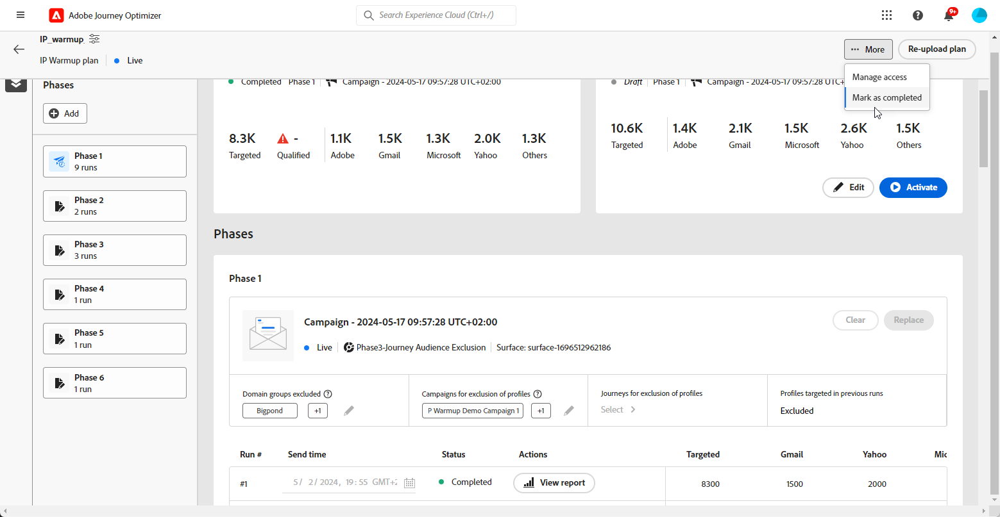

# Voer het IP-opwarmingsplan uit {#ip-warmup-running}

>[!BEGINSHADEBOX]

Wat u in deze documentatiehandleiding zult vinden:

* [Ga aan de slag met IP-opwarming](ip-warmup-gs.md)
* [IP-warmtecampagnes maken](ip-warmup-campaign.md)
* [Creeer een IP warmlopingsplan](ip-warmup-plan.md)
* **[Voer het IP-opwarmingsplan uit](ip-warmup-running.md)**

>[!ENDSHADEBOX]

Als u eenmaal [leidde tot een IP warmup plan](ip-warmup-plan.md) en het bestand geüpload dat u samen met uw leverancier hebt voorbereid, kunt u de fasen en uitvoering in uw abonnement definiëren.

Elke fase komt overeen met een periode die bestaat uit meerdere uitvoeringen, waaraan u één campagne toewijst.

Voor elke run hebt u een bepaald aantal ontvangers en u plant wanneer deze run wordt uitgevoerd.

## De fasen definiëren {#define-phases}

>[!CONTEXTUALHELP]
>id="ajo_admin_ip_warmup_campaigns_excluded"
>title="Soorten publiek selecteren om uit te sluiten"
>abstract="Selecteer het publiek uit andere campagnes die u van de huidige fase wilt uitsluiten."

>[!CONTEXTUALHELP]
>id="ajo_admin_ip_warmup_domains_excluded"
>title="Domeingroepen selecteren om uit te sluiten"
>abstract="Selecteer de domeinen die u van de huidige fase wilt uitsluiten."

U moet de campagne en het publiek op faseniveau associëren en zet sommige montages aan zoals nodig voor alle looppas verbonden aan één enkele creatieve/campagne

Op faseniveau, zorgt het systeem ervoor dat eerder gericht + nieuwe profielen worden opgenomen EN op iteratieniveau, zorgt het systeem ervoor dat elke looppas unieke profielen heeft en de telling past wat in plan wordt verklaard

1. Voor elke fase, selecteer de campagne u met deze fase van het IP warmup plan wilt associëren.

   

   Let op het volgende:

   * Alleen de campagnes met de **[!UICONTROL IP warmup plan activation]** optie ingeschakeld <!--and live?--> zijn beschikbaar voor selectie. [Meer informatie](#create-ip-warmup-campaign)

   * U moet een campagne selecteren die de zelfde oppervlakte gebruikt zoals die voor het huidige IP warmup plan wordt geselecteerd.

   * U kunt geen campagne selecteren die reeds in gebruik in een andere IP opwarmingscampagne is.

1. In de **[!UICONTROL Profile exclusion]** kunt u zien dat de profielen van de vorige reeksen van die fase altijd worden uitgesloten. Als in Run #1 bijvoorbeeld een profiel in de eerste 4800 doelgroepen is opgenomen, zorgt het systeem er automatisch voor dat hetzelfde profiel de e-mail niet ontvangt in Run #2.

1. Van de **[!UICONTROL Campaign audiences excluded]** selecteert u het publiek uit andere <!--executed/live?-->campagnes die u van de huidige fase wilt uitsluiten.

   

   Tijdens het uitvoeren van Fase 1 moest u bijvoorbeeld [splitsen](#split-phase) om welke reden dan ook. Daarom kunt u de campagne uitsluiten die in Fase 1 wordt gebruikt, zodat eerder gecontacteerde profielen van Fase 1 niet inbegrepen in Fase 2 zijn. U kunt campagnes van andere IP warmteopnameplannen ook uitsluiten.

1. Van de **[!UICONTROL Domains groups excluded]** selecteert u de domeinen die u van die fase wilt uitsluiten.

   

   Bijvoorbeeld, na het runnen van IP warmte voor sommige dagen, realiseert u dat ISP reputatie met een domein (d.w.z. Adobe) niet goed is en u wenst om het op te lossen zonder uw IP warmlopingsplan tegen te houden. In dat geval kunt u de Adobe-domeingroep uitsluiten.

   >[!NOTE]
   >
   >De uitsluiting van het domein vereist een niet-uitgevoerde fase, zodat kunt u een lopende fase moeten verdelen om uitsluitingen toe te voegen. Op dezelfde manier als domeingroep geen OOTB domeingroep is, moet u deze domeingroep aan het dossier van Excel toevoegen, het uploaden en dan het domein uitsluiten.

   

1. U kunt desgewenst een fase toevoegen. Het zal na de laatste huidige fase worden toegevoegd.

1. Gebruik de **[!UICONTROL Delete phase]** om ongewenste fase te verwijderen.

   

   >[!CAUTION]
   >
   >U kunt de opdracht **[!UICONTROL Delete]** handeling.
   >
   >Als u alle fasen van het IP warmlopingsplan schrapt, adviseren wij om een plan opnieuw te uploaden.

## De uitvoeringen definiëren {#define-runs}

1. Selecteer een schema voor elke run. <!--which is actually a window of opportunity. meaning? how many hours? shall we specify that to clarify?-->

   

1. Optioneel, selecteer het venster waarin de IP warmup campagne kan worden uitgevoerd voor het geval dat er vertragingen in de uitvoering van de publiekssegmentatie optreden. Als geen eindtijd wordt gespecificeerd, wordt de uitvoering geprobeerd bij de begintijd en zal ontbreken als de segmentatie niet werd voltooid.

1. Activeer elke run. Zorg ervoor u een tijd vroeg genoeg plant om voor de segmentatietaak toe te laten om worden in werking gesteld. <!--explain how you can evaluate a proper time-->

   >[!CAUTION]
   >
   >Elke run moet ten minste 12 uur voor de werkelijke verzendtijd worden geactiveerd. Anders kan de segmentatie niet worden voltooid. <!--How do you know when segmentation is complete? Is there a way to prevent user from scheduling less than 12 hours before the segmentation job?-->

   <!--Sart to execute on every day basis by simply clicking the play button > for each run? do you have to come back every day to activate each run? or can you schedule them one after the other?)-->

1. Als de uitvoering van de campagne niet is gestart, kunt u een uitvoering stoppen.<!--why?-->

   >[!NOTE]
   >
   >Nadat de uitvoering van de campagne is gestart, **[!UICONTROL Stop]** wordt niet meer beschikbaar. <!--TBC in UI-->

   

1. Als u een uitvoering wilt toevoegen, selecteert u **[!UICONTROL Add a run below]** van het pictogram met drie punten.

   

## Een fase splitsen {#split-phase}

Als u op elk gewenst moment een andere campagne wilt gebruiken die begint bij een specifieke uitvoering, selecteert u de optie **[!UICONTROL Split to a new phase option]** van het pictogram met drie punten.

Er wordt een nieuwe fase gemaakt voor de resterende uitvoeringen van de huidige fase. Voer de stappen uit [boven](#define-phases) de nieuwe fase te definiëren.

Als u deze optie bijvoorbeeld selecteert voor Run #4, worden Runs #4 tot en met #8 verplaatst naar een nieuwe fase.

<!--
You don't have to decide the campaign upfront. You can do a split later. It's a work in progress plan: you activate one run at a time with a campaign and you always have the flexibility to modify it while working on it.

But need to explain in which case you want to modify campaigns, provide examples
-->

## Een abonnement markeren als voltooid {#mark-as-completed}

Als uw plan niet goed genoeg presteert of als u het wilt laten vallen om een andere te creëren, kunt u het merken zoals voltooid.

Klik hiertoe op de knop **[!UICONTROL More]** knoop op bovenkant recht de IP warmup plan en selecteer **[!UICONTROL Mark as completed]**.

Deze optie is alleen beschikbaar als alle runnen in het abonnement zijn opgenomen **[!UICONTROL Succeeded]** of **[!UICONTROL Draft]** status. Er kan geen uitvoering worden uitgevoerd **[!UICONTROL Live]**.

De verschillende uitvoerstatussen worden vermeld in [deze sectie](#monitor-plan).

## Het abonnement controleren {#monitor-plan}

Om het effect van uw plan te meten, kunt u de prestaties van uw IP warmup campagnes controleren gebruikend rapporten. Meer informatie over de campagne-e-mail [live-rapport](../reports/campaign-live-report.md#email-live) en [algemeen rapport](../reports/campaign-global-report.md##email-global).

Het opwarmingsplan van het IP zelf dient ook als een geconsolideerd rapport op één enkele plaats. U kunt elementen controleren zoals het aantal **[!UICONTROL Live]** of **[!UICONTROL Succeeded]** looppas voor elke fase, en mening hoe uw IP warmup plan vordert.

Een run kan de volgende statussen hebben:

* **[!UICONTROL Draft]** : telkens wanneer een run wordt gemaakt, wanneer [Een nieuw abonnement uploaden](ip-warmup-plan.md) of [toevoegen, run](#define-runs) vanuit de gebruikersinterface **[!UICONTROL Draft]** status.
* **[!UICONTROL Live]**: wanneer u een run activeert, neemt deze de **[!UICONTROL Live]** status.
* **[!UICONTROL Succeeded]**<!--TBC-->: de uitvoering van de campagne voor deze run is voltooid. <!--i.e. campaign execution has started, no error happened and emails have reached users? to check with Sid-->
* **[!UICONTROL Cancelled]**: a **[!UICONTROL Live]** uitvoering is geannuleerd met de opdracht **[!UICONTROL Stop]** knop. Deze knop is alleen beschikbaar als de uitvoering van de campagne niet is gestart. [Meer informatie](#define-runs)
* **[!UICONTROL Failed]**: er is een fout aangetroffen door het systeem of de campagne die voor de huidige fase is gebruikt, is gestopt<!--what should the user do in that case?-->.
