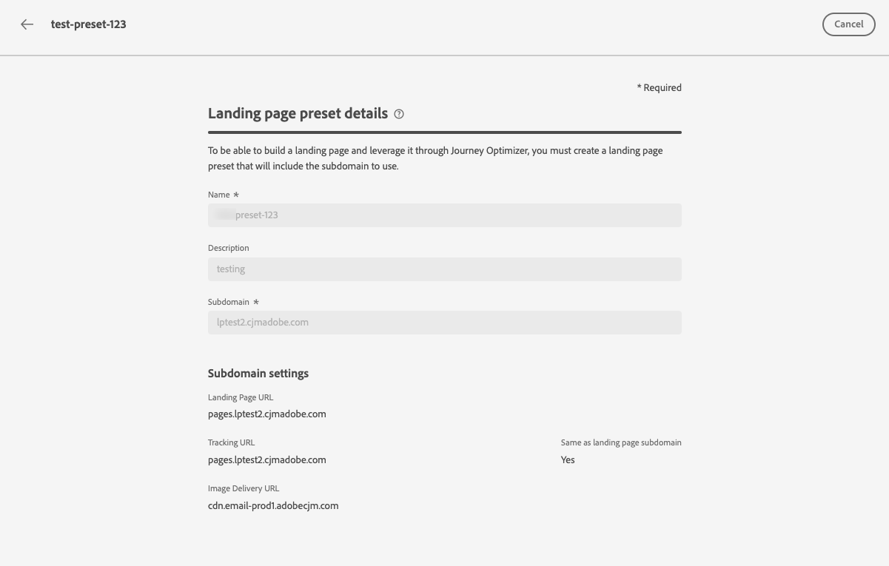

# Voorinstellingen voor openingspagina definiëren {#lp-presets}

>[!CONTEXTUALHELP]
>id="ajo_admin_config_lp_subdomain_header"
>title="Een voorinstelling voor een openingspagina maken"
>abstract="Als u een bestemmingspagina wilt maken en deze via Journey Optimizer wilt gebruiken, moet u een voorinstelling voor een bestemmingspagina maken die het te gebruiken subdomein bevat."

Wanneer [een openingspagina maken](../landing-pages/create-lp.md#create-a-lp), moet u een voorinstelling voor een bestemmingspagina selecteren om de bestemmingspagina te kunnen samenstellen en er doorheen te kunnen gaan **[!DNL Journey Optimizer]**.

## Voorinstellingen voor openingspagina&#39;s openen {#access-lp-presets}

Volg onderstaande stappen om voorinstellingen voor openingspagina&#39;s te openen.

1. Toegang krijgen tot **[!UICONTROL Administration]** > **[!UICONTROL Channels]** -menu.

1. Selecteer **[!UICONTROL Branding]** > **[!UICONTROL Landing page presets]**.

   

1. Klik op een vooraf ingesteld label voor toegang tot de details van de voorinstelling voor de openingspagina.

   

## Een voorinstelling voor een openingspagina maken {#lp-create-preset}

Volg onderstaande stappen om een voorinstelling voor een openingspagina te maken.

>[!NOTE]
>
>Als u een voorinstelling wilt maken, moet u ervoor zorgen dat u eerder ten minste één subdomein van de bestemmingspagina hebt geconfigureerd. [Meer informatie](lp-subdomains.md)

1. Toegang krijgen tot **[!UICONTROL Administration]** > **[!UICONTROL Channels]** menu, selecteert u vervolgens **[!UICONTROL Branding]** > **[!UICONTROL Landing page presets]**.

1. Selecteer **[!UICONTROL Create landing page preset]**.

   

1. Voer een naam en een beschrijving in voor de voorinstelling.

   >[!NOTE]
   >
   > Namen moeten beginnen met een letter (A-Z). Het mag alleen alfanumerieke tekens bevatten. U kunt ook het onderstrepingsteken gebruiken `_`, punt`.` en afbreekstreepje `-` tekens.

1. Selecteer een subdomein van een bestemmingspagina in de vervolgkeuzelijst.

   

   >[!NOTE]
   >
   >Om een subdomein te kunnen selecteren, zorg ervoor u eerder minstens één het landen paginasubdomain hebt gevormd. [Meer informatie](#lp-subdomains)

   De instellingen die overeenkomen met de geselecteerde subdomeinweergave.

1. Als u het subdomein van de bestemmingspagina voor het volgen URL wilt selecteren, controleer **[!UICONTROL Same as landing page subdomain]** optie. [Meer informatie over bijhouden](../design/message-tracking.md)

   

   Als de bestemmingspagina-URL bijvoorbeeld &#39;pages.mail.luma.com&#39; is en de URL voor bijhouden &#39;data.mail.luma.com&#39;, kunt u &#39;pages.mail.luma.com&#39; kiezen die u wilt gebruiken als subdomein voor bijhouden.

1. Klikken **[!UICONTROL Submit]** om het maken van de voorinstelling voor de bestemmingspagina te bevestigen. <!--You can also save the preset as draft and resume its configuration later on.-->

   <!---->

1. Nadat de voorinstelling voor de openingspagina is gemaakt, wordt deze in de lijst weergegeven met de **[!UICONTROL Active]** status. U kunt deze nu gebruiken voor uw bestemmingspagina&#39;s.

   

U kunt nu [bestemmingspagina&#39;s maken](../landing-pages/create-lp.md) in [!DNL Journey Optimizer].
<!--
>[!NOTE]
>
>Learn how to create channel surfaces for push notifications and emails in [this section](channel-surfaces.md).-->

**Verwante onderwerpen**:

* [Aan de slag met bestemmingspagina&#39;s](../landing-pages/get-started-lp.md)
* [Een landingspagina maken](../landing-pages/create-lp.md#create-a-lp)
