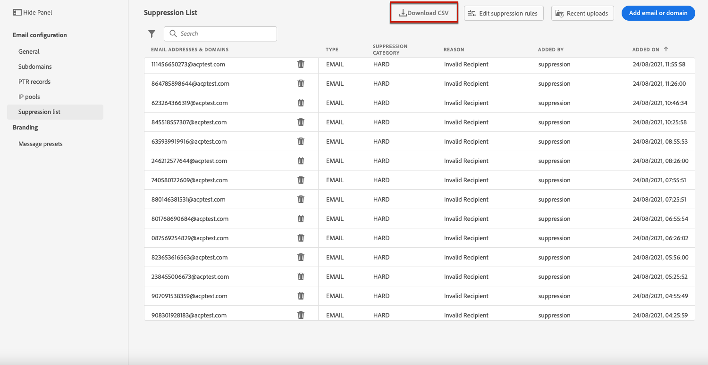

# De vervolgkeuzelijst beheren {#manage-suppression-list}

Met [!DNL Journey Optimizer], kunt u alle e-mailadressen controleren die automatisch van het verzenden van een reis worden uitgesloten, zoals:

* Adressen die ongeldig zijn (harde grenzen).
* Verwerkt deze voortdurend zachte stuit en kan een negatief effect hebben op de reputatie van uw e-mail als u deze blijft opnemen in uw leveringen.
* Ontvangers die op een of andere manier een spamklacht indienen tegen een van uw e-mailberichten.

Dergelijke e-mailadressen worden automatisch verzameld in de Journey Optimizer **onderdrukkingslijst**. Meer informatie over het concept en het gebruik van de suppressielijst in [deze sectie](../suppression-list.md).

## De lijst met onderdrukking openen {#access-suppression-list}

Ga naar **[!UICONTROL Administration]** > **[!UICONTROL Channels]** > **[!UICONTROL Email configuration]** en selecteert u **[!UICONTROL Suppression list]**.

>[!CAUTION]
>
>Machtigingen voor het weergeven, exporteren en beheren van de suppressielijst zijn beperkt tot [Reisbeheerders](../administration/ootb-product-profiles.md#journey-administrator). Meer informatie over beheren [!DNL Journey Optimizer] toegangsrechten van gebruikers in [deze sectie](../administration/permissions-overview.md).

<!--

You can also display the suppression list content using the **[!UICONTROL View suppression list]** link through the **[!UICONTROL Channels]** > **[!UICONTROL Email configuration]** > **[!UICONTROL General]** menu, but this view does not allow you to edit the list.-->


Er zijn filters beschikbaar waarmee u door de lijst kunt bladeren.

<!---->


U kunt filteren op de **[!UICONTROL Suppression category]**, **[!UICONTROL Address type]**, of **[!UICONTROL Reason]**. Selecteer de optie(s) van uw keuze voor elk criterium. Als deze optie is geselecteerd, kunt u elk filter of alle filters die boven op de lijst worden weergegeven, wissen.


Als u per ongeluk handmatig een e-mailadres of een domein toevoegt, **[!UICONTROL Delete]** kunt u dat item verwijderen.

>[!CAUTION]
>
>Gebruik nooit de **[!UICONTROL Delete]** om onderdrukte e-mailadressen of domeinen te verwijderen.


Als u een e-mailadres of een domein uit de suppressielijst verwijdert, wordt opnieuw begonnen met het leveren aan dit adres of domein. Dientengevolge, kan dit ernstige gevolgen op uw leverbaarheid en IP reputatie hebben, die uiteindelijk tot uw IP adres of verzendend domein zou kunnen leiden die worden geblokkeerd. Lees meer over het belang van het bijhouden van een onderdrukkingslijst in [deze sectie](../suppression-list.md).

>[!NOTE]
>
>Ga voorzichtig te werk wanneer u overweegt een e-mailadres of domein te verwijderen. Neem in geval van twijfel contact op met een leverancier.

Van de **[!UICONTROL Suppression list]** kunt u ook de onderdrukkingsregels bewerken. [Meer informatie](retries.md)

Als u de onderdrukkingslijst wilt exporteren als een CSV-bestand, selecteert u de optie **[!UICONTROL Download CSV]** knop.



## Onderdrukkingscategorieën en redenen {#suppression-categories-and-reasons}

Wanneer een bericht niet aan een e-mailadres kan worden bezorgd, [!DNL Journey Optimizer] bepaalt waarom de levering ontbrak en het met een associeert **[!UICONTROL Suppression category]**.

De onderdrukkingscategorieën zijn als volgt:

* **Hard**: Het e-mailadres wordt direct naar de onderdrukkingslijst verzonden.

   >[!NOTE]
   >
   >Wanneer de fout het resultaat van een spamklacht is, valt het ook in **Hard** categorie. Het e-mailadres van de ontvanger die de klacht heeft ingediend, wordt onmiddellijk naar de onderdrukkingslijst gezonden.

* **Zacht**: Zachte fouten verzenden een adres naar de onderdrukkingslijst zodra de foutenteller de grensdrempel bereikt. [Meer informatie over opnieuw proberen](retries.md)

   <!--
    **Ignored**:
    * When the error occurred for a valid email address but is known to be temporary, such as a failed connection attempt or a temporary technical issue, the email address is added to the suppression list once the error counter reaches the limit threshold. [Learn more on retries](retries.md).
    * When the error is the result of a spam complaint, the email address of the recipient who issued the complaint is immediately sent to the suppression list.
    -->

* **Handmatig**: U kunt ook handmatig een e-mailadres of een domein toevoegen aan de lijst met onderdrukking. [Meer informatie](#add-addresses-and-domains)

>[!NOTE]
>
>Meer informatie over zachte grenzen en harde golven in de [Typen leveringsfouten](../suppression-list.md#delivery-failures) sectie.

Voor elk e-mailadres dat wordt vermeld, kunt u ook de **[!UICONTROL Type]** (e-mail of domein), **[!UICONTROL Reason]** om het uit te sluiten, die het toevoegde, en de datum/tijd het aan de onderdrukkingslijst werd toegevoegd.


De mogelijke redenen van een leveringsfout zijn:

| Reden | Beschrijving | Onderdrukkingscategorie |
| --- | --- | --- |
| **[!UICONTROL Invalid Recipient]** | De ontvanger is ongeldig of bestaat niet. | Hard |
| **[!UICONTROL Soft Bounce]** | De berichtzachte die tegen een andere reden dan de zachte fouten in deze lijst worden vermeld, zoals wanneer het verzenden over het toegestane tarief door ISP wordt geadviseerd. | Zacht |
| **[!UICONTROL DNS Failure]** | Het bericht dat als gevolg van een DNS-fout is teruggestuurd. | Zacht |
| **[!UICONTROL Mailbox Full]** | Het bericht dat door de brievenbus van de ontvanger wordt teruggestuurd die volledig is en niet meer berichten kan goedkeuren. | Zacht |
| **[!UICONTROL Relaying Denied]** | Het bericht is geblokkeerd door de ontvanger omdat het opnieuw afspelen niet is toegestaan. | Zacht |
| **[!UICONTROL Challenge-Response]** | De boodschap is een uitdaging-antwoord sonde. | Zacht |
| **[!UICONTROL Spam Complaint]** | Het bericht werd geblokkeerd omdat duidelijk als spam door de ontvanger. | Hard |

>[!NOTE]
>
>Niet-geabonneerde gebruikers ontvangen geen e-mails van [!DNL Journey Optimizer]Daarom kunnen hun e-mailadressen niet naar de onderdrukkingslijst worden verzonden. Hun keuze wordt op het niveau van de Experience Platform behandeld. [Meer informatie over opt-out](../consent.md)

<!--
Removed from the table provided by SparkPost/Momentum:
| **[!UICONTROL Undetermined]** | The bounce reason received from the recipient domain Message Transfer Agent (MTA) could not be identified. | Ignored |
| **[!UICONTROL Too Large]** | The message bounced because it was too large for the recipient. [Retries](retries.md) will be performed: you can edit the message size and re-inject it for delivery. | Ignored |
| **[!UICONTROL Timeout]** | The message timed out, meaning it soft bounced and reached the message retry limit (3.5 days). | Ignored |
| **[!UICONTROL Admin Failure]** | The message was failed according to the policies configured by the sending system administrator. ///For example, if emails are blackholed at the global, domain or binding level using the "blackhole" directive, this bounce code is used. | Ignored |
| **[!UICONTROL Generic Bounce: No RCPT]** | No recipient could be determined for the message. | Ignored |
| **[!UICONTROL Generic Bounce]** | The message failed for unspecified reasons. | Ignored |
| **[!UICONTROL Mail Block]** | The message was blocked by the receiver (i.e. recipient MTA). | Ignored |
| **[!UICONTROL Spam Block]** | The message was blocked by the receiver as coming from a known spam source. It could be a sending IP block for example. | Ignored |
| **[!UICONTROL Spam Content]** | The message content was blocked by the receiver (recipient MTA) as spam. | Ignored |
| **[!UICONTROL Prohibited Attachment]** | The message was blocked by the receiver because it contained an attachment. | Ignored |
| **[!UICONTROL Auto-Reply]** | The message is an auto-reply/vacation mail. | Ignored |
| **[!UICONTROL Transient Failure]** | Message transmission has been temporarily delayed. | Ignored |
| **[!UICONTROL Subscribe]** | The message is a subscribe request. | Ignored |
| **[!UICONTROL Unsubscribe]** | The message is an unsubscribe request. | Hard |
-->

<!--Note to add eventually: If a user is subscribed and [!DNL Journey Optimizer] fails to send emails to their subscribed email address, they will get added to the suppression list.-->

## Voeg handmatig adressen en domeinen toe {#add-addresses-and-domains}

Wanneer een bericht niet aan een e-mailadres kan worden geleverd, wordt dit adres automatisch toegevoegd aan de suppressielijst die op de bepaalde suppressieregel of stuiterende telling wordt gebaseerd.

U kunt de opdracht [!DNL Journey Optimizer] suppressielijst om specifieke e-mailadressen en/of domeinen van uw verzending uit te sluiten.

U kunt e-mailadressen of domeinen toevoegen [één voor één](#add-one-address-or-domain), of [in bulkmodus](#upload-csv-file) via een CSV-bestandsupload.

Selecteer hiervoor de optie **[!UICONTROL Add email or domain]** en voert u een van de onderstaande methoden uit.


### Eén adres of domein toevoegen {#add-one-address-or-domain}

1. Selecteer **[!UICONTROL One by one]** optie.

   

1. Kies het adrestype: **[!UICONTROL Email address]** of **[!UICONTROL Domain address]**.

1. Voer het e-mailadres of domein in dat u van uw verzending wilt uitsluiten.

   >[!NOTE]
   >
   >Zorg ervoor dat u een geldig e-mailadres (zoals abc@company) of domein (zoals abc.company.com) opgeeft.

1. Geef indien nodig een reden op.

1. Klik op **[!UICONTROL Submit]**.

### Een CSV-bestand uploaden {#upload-csv-file}

1. Selecteer **[!UICONTROL Upload CSV]** optie.

   

1. Download de CSV-sjabloon die u wilt gebruiken, inclusief de onderstaande kolommen en indeling:

   ```
   TYPE,VALUE,COMMENT
   EMAIL,abc@somedomain.com,Comment
   DOMAIN,somedomain.com,Comment
   ```
   U kunt deze sjabloon ook downloaden via het menu **[!UICONTROL Suppression list]** hoofdweergave.

   >[!CAUTION]
   >
   >Wijzig de namen van de kolommen in de CSV-sjabloon niet.
   >
   >De bestandsgrootte mag niet groter zijn dan 1 MB.

1. Vul de CSV-sjabloon in met de e-mailadressen en/of domeinen die u wilt toevoegen aan de suppressielijst.

1. Wanneer u klaar bent, sleept u het CSV-bestand en klikt u op **[!UICONTROL Upload file]**.

   

1. Klik op **[!UICONTROL Submit]**.

### Status van recente uploads controleren {#recent-uploads}

U kunt de lijst controleren van de recentste CSV dossiers u uploadde.

Om dit te doen, van **[!UICONTROL Suppression list]** klik op de knop **[!UICONTROL Recent uploads]** knop.


De meest recente uploads die u hebt verzonden en de bijbehorende statussen worden weergegeven.

Als een foutenrapport met een dossier wordt geassocieerd, kunt u het downloaden om de gevonden fouten te controleren.


Hieronder ziet u een voorbeeld van het type items dat u kunt vinden in het foutrapport:

```
type,value,comments,failureReason
Email,examplemail.com,MANUAL,Invalid format for value: examplemail.com
Email,examplemail,MANUAL,Invalid format for value: examplemail
Email,example@mail,MANUAL,Invalid format for value: example@mail
Domain,example,MANUAL,Invalid format for value: example
Domain,example.!com,MANUAL,Invalid format for value: example.!com
Domain,!examplecom,MANUAL,Invalid format for value: !examplecom
```
