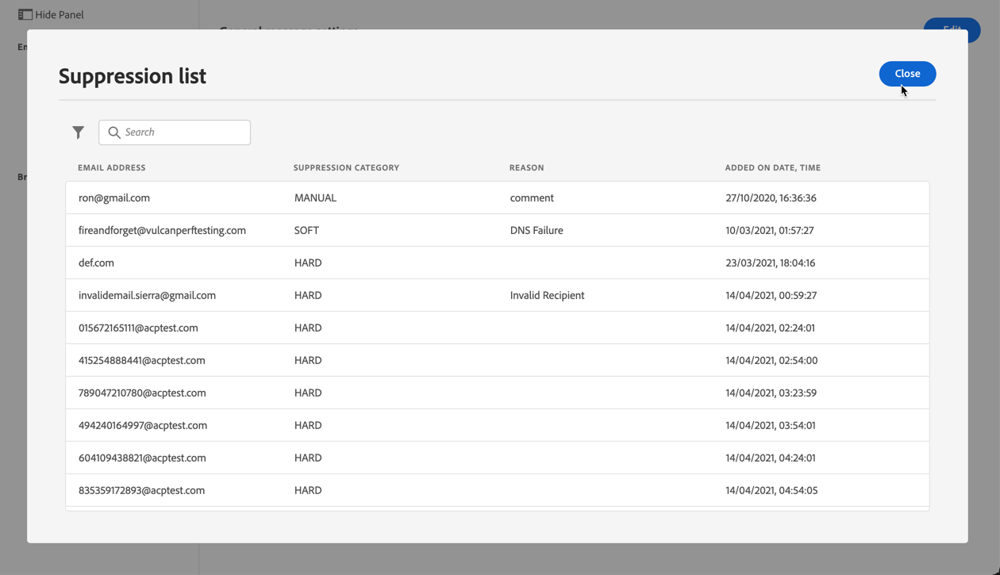

# De vervolgkeuzelijst beheren {#manage-suppression-list}

Met [!DNL Journey Optimizer] kunt u alle e-mailadressen controleren die automatisch van het verzenden van een reis worden uitgesloten, zoals:

* Adressen die ongeldig zijn (harde grenzen).
* Verwerkt deze voortdurend zachte stuit en kan een negatief effect hebben op uw e-mailreputatie als u deze in uw leveringen blijft opnemen.
* Ontvangers die op een of andere manier een spamklacht indienen tegen een van uw e-mailberichten.

Dergelijke e-mailadressen worden automatisch verzameld in de Journey Optimizer **suppressielijst**. Meer informatie vindt u in [deze sectie](../suppression-list.md).

## De lijst met onderdrukking openen {#access-suppression-list}

Als u de gedetailleerde lijst met uitgesloten e-mailadressen wilt openen, opent u het menu **[!UICONTROL Channels]** > **[!UICONTROL Email configuration]** > **[!UICONTROL General]** en klikt u op de koppeling **[!UICONTROL View suppression lists]**.


<!--To access the detailed list of excluded email addresses, go to **[!UICONTROL Administration]** > **[!UICONTROL Channels]** > **[!UICONTROL Email configuration]**, and select **[!UICONTROL Suppression list]**.
You can also display the suppression list content using the **[!UICONTROL View suppression list]** link through the **[!UICONTROL Channels]** > **[!UICONTROL Email configuration]** > **[!UICONTROL General]** menu, but this view does not allow you to edit the list.

-->

Er zijn filters beschikbaar waarmee u door de lijst kunt bladeren.


<!--

You can filter on the **[!UICONTROL Suppression category]**, **[!UICONTROL Address type]**, or **[!UICONTROL Reason]**. Select the option(s) of your choice for each criterion.


Once selected, you can clear each filter or all filters displayed on top of the list.-->

## Onderdrukkingscategorieën en redenen {#suppression-categories-and-reasons}

Wanneer een bericht niet aan een e-mailadres kan worden geleverd, bepaalt [!DNL Journey Optimizer] waarom de levering is mislukt en koppelt het aan een **[!UICONTROL Suppression category]**.

De onderdrukkingscategorieën zijn als volgt:

* **Hard**: Het e-mailadres wordt direct naar de onderdrukkingslijst verzonden.

   >[!NOTE]
   >
   >Wanneer de fout het resultaat van een spamklacht is, valt het ook in **Hard** categorie. Het e-mailadres van de ontvanger die de klacht heeft ingediend, wordt onmiddellijk naar de onderdrukkingslijst gezonden.

* **Zacht**: Zachte fouten verzenden een adres naar de onderdrukkingslijst zodra de foutenteller de grensdrempel bereikt. [Meer informatie over opnieuw proberen](retries.md)

   <!--
    **Ignored**:
    * When the error occurred for a valid email address but is known to be temporary, such as a failed connection attempt or a temporary technical issue, the email address is added to the suppression list once the error counter reaches the limit threshold. [Learn more on retries](retries.md).
    * When the error is the result of a spam complaint, the email address of the recipient who issued the complaint is immediately sent to the suppression list.
    -->

* **Handmatig**: U kunt ook handmatig een e-mailadres of een domein toevoegen aan de lijst met onderdrukking. [Meer informatie](#add-addresses-and-domains)

>[!NOTE]
>
>Meer informatie over zachte grenzen en harde stuitingen vindt u in de sectie [Typen leveringsfouten](../suppression-list.md#delivery-failures).

Voor elk e-mailadres dat wordt vermeld, kunt u **[!UICONTROL Type]** (e-mail of domein), **[!UICONTROL Reason]** ook controleren voor uitsluiting, die het toevoegden, en de datum/tijd het aan de suppressielijst werd toegevoegd.

<!---->

De mogelijke redenen van een leveringsfout zijn:

| Reden | Beschrijving | Onderdrukkingscategorie |
| --- | --- | --- |
| **[!UICONTROL Invalid Recipient]** | De ontvanger is ongeldig of bestaat niet. | Hard |
| **[!UICONTROL Soft Bounce]** | De berichtzachte die tegen een andere reden dan de zachte fouten in deze lijst worden vermeld, zoals wanneer het verzenden over het toegestane tarief door ISP wordt geadviseerd. | Zacht |
| **[!UICONTROL DNS Failure]** | Het bericht dat als gevolg van een DNS-fout is teruggestuurd. | Zacht |
| **[!UICONTROL Mailbox Full]** | Het bericht dat door de brievenbus van de ontvanger wordt teruggestuurd die volledig is en niet meer berichten kan goedkeuren. | Zacht |
| **[!UICONTROL Relaying Denied]** | Het bericht is geblokkeerd door de ontvanger omdat het opnieuw afspelen niet is toegestaan. | Zacht |
| **[!UICONTROL Challenge-Response]** | De boodschap is een uitdaging-antwoord sonde. | Zacht |

>[!NOTE]
>
>Gebruikers met een abonnement ontvangen geen e-mails van [!DNL Journey Optimizer]. Daarom kunnen hun e-mailadressen niet naar de onderdrukkingslijst worden verzonden. Hun keuze wordt op het niveau van de Experience Platform behandeld. Meer informatie over [opting-out](../consent.md).

<!--
Removed from the table provided by SparkPost/Momentum:
| **[!UICONTROL Undetermined]** | The bounce reason received from the recipient domain Message Transfer Agent (MTA) could not be identified. | Ignored |
| **[!UICONTROL Too Large]** | The message bounced because it was too large for the recipient. [Retries](retries.md) will be performed: you can edit the message size and re-inject it for delivery. | Ignored |
| **[!UICONTROL Timeout]** | The message timed out, meaning it soft bounced and reached the message retry limit (3.5 days). | Ignored |
| **[!UICONTROL Admin Failure]** | The message was failed according to the policies configured by the sending system administrator. ///For example, if emails are blackholed at the global, domain or binding level using the "blackhole" directive, this bounce code is used. | Ignored |
| **[!UICONTROL Generic Bounce: No RCPT]** | No recipient could be determined for the message. | Ignored |
| **[!UICONTROL Generic Bounce]** | The message failed for unspecified reasons. | Ignored |
| **[!UICONTROL Mail Block]** | The message was blocked by the receiver (i.e. recipient MTA). | Ignored |
| **[!UICONTROL Spam Block]** | The message was blocked by the receiver as coming from a known spam source. It could be a sending IP block for example. | Ignored |
| **[!UICONTROL Spam Content]** | The message content was blocked by the receiver (recipient MTA) as spam. | Ignored |
| **[!UICONTROL Prohibited Attachment]** | The message was blocked by the receiver because it contained an attachment. | Ignored |
| **[!UICONTROL Auto-Reply]** | The message is an auto-reply/vacation mail. | Ignored |
| **[!UICONTROL Transient Failure]** | Message transmission has been temporarily delayed. | Ignored |
| **[!UICONTROL Subscribe]** | The message is a subscribe request. | Ignored |
| **[!UICONTROL Unsubscribe]** | The message is an unsubscribe request. | Hard |
-->

<!--Note to add eventually: If a user is subscribed and [!DNL Journey Optimizer] fails to send emails to their subscribed email address, they will get added to the suppression list. (not sure it's possible to subscribe through AJO or need to find reference to Experience Platform doc?)-->

<!--## Manually add addresses and domains {#add-addresses-and-domains}

When a message fails to be delivered to an email address, this address is automatically added to the suppression list based on the defined suppression rule or bounce count.

However, you can also manually populate the [!DNL Journey Optimizer] suppression list to exclude specific email addresses and/or domains from your sending.

You may add email addresses or domains [one at a time](#add-one-address-or-domain), or [in bulk mode](#upload-csv-file) through a CSV file upload.

To do this, select the **[!UICONTROL Add email or domain]** button, then follow one of the methods below.


### Add one address or domain {#add-one-address-or-domain}

1. Select the **[!UICONTROL One by one]** option.

    

1. Choose the address type: **[!UICONTROL Email address]** or **[!UICONTROL Domain address]**.

1. Enter the email address or domain you want to exclude from your sending.

    >[!NOTE]
    >
    >Make sure you enter a valid email address (such as abc@company) or domain (such as abc.company.com).

1. Specify a reason if needed.

1. Click **[!UICONTROL Submit]**.

### Upload a CSV file {#upload-csv-file}

1. Select the **[!UICONTROL Upload CSV]** option.

    

1. Download the CSV template to use, which includes the columns and format below:

    ```
    TYPE,VALUE,COMMENT
    EMAIL,abc@somedomain.com,Comment
    DOMAIN,somedomain.com,Comment
    ```
    You can also download this template from the **[!UICONTROL Suppression list]** main view.

    >[!CAUTION]
    >
    >Do not change the names of the columns in the CSV template.
    >
    >The file size should not exceed 50 MB.

1. Fill in the CSV template with the email addresses and/or domains you want to add to the suppression list.

1. Once completed, drag and drop your CSV file, then click **[!UICONTROL Upload file]**.

    

1. Click **[!UICONTROL Submit]**.

### Check recent uploads status {#recent-uploads}

You can check the list of the latest CSV files you uploaded.

To do this, from the **[!UICONTROL Suppression list]** view, click the **[!UICONTROL Recent uploads]** button.


The latest uploads you submitted and their corresponding statuses are displayed.

If an error report is associated with a file, you can download it to check the errors encountered.


Below is an example of the type of entries you can find in the error report:

```
type,value,comments,failureReason
Email,examplemail.com,MANUAL,Invalid format for value: examplemail.com
Email,examplemail,MANUAL,Invalid format for value: examplemail
Email,example@mail,MANUAL,Invalid format for value: example@mail
Domain,example,MANUAL,Invalid format for value: example
Domain,example.!com,MANUAL,Invalid format for value: example.!com
Domain,!examplecom,MANUAL,Invalid format for value: !examplecom
```

-->


