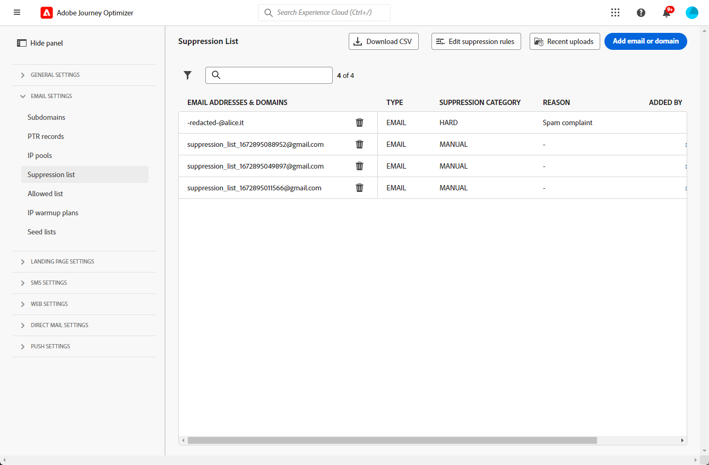
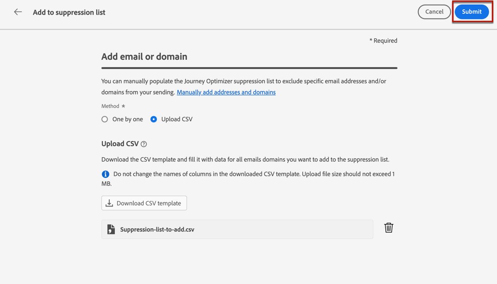

# De vervolgkeuzelijst beheren {#manage-suppression-list}

Met [!DNL Journey Optimizer] kunt u alle e-mailadressen controleren die automatisch worden uitgesloten van verzending tijdens een reis of een campagne, zoals harde stuiteringen, zachte stuiteringen en spamklachten.

Dergelijke e-mailadressen worden automatisch verzameld in de Journey Optimizer **suppressielijst**. Een suppressielijst bestaat uit adressen en domeinen die van uw publiek moeten worden uitgesloten. Het verzamelt e-mailadressen en domeinen die over alle post in één enkele cliëntmilieu worden onderdrukt, betekenend specifiek voor een organisatie ID verbonden aan een zandbak identiteitskaart

Leer meer over het concept en het gebruik van de suppressielijst in [&#x200B; deze sectie &#x200B;](../reports/suppression-list.md).

>[!NOTE]
>
>Adobe houdt een bijgewerkte lijst bij van bekende slechte adressen waarvan is aangetoond dat ze schadelijk zijn voor de service en de mailingreputatie, en zorgt ervoor dat er geen e-mailberichten aan hen worden bezorgd. Deze lijst wordt beheerd in een algemene suppressielijst die door alle Adobe-klanten wordt gebruikt. De adressen en domeinnamen in de globale suppressielijst worden verborgen. Alleen het aantal uitgesloten ontvangers wordt vermeld in de leveringsverslagen.

Bovendien kunt u hefboomwerking de Journey Optimizer **HULPMIDDELEN API van de Onderdrukking** om uw uitgaande berichten te controleren gebruikend onderdrukking en lijsten van gewenste personen. [&#x200B; Leer hoe te met de HULPMIDDEL te werken REST API &#x200B;](https://developer.adobe.com/journey-optimizer-apis/references/suppression/){target="_blank"}

## De lijst met onderdrukking openen {#access-suppression-list}

Blader naar **[!UICONTROL Administration]** > **[!UICONTROL Channels]** > **[!UICONTROL Email settings]** en selecteer **[!UICONTROL Suppression list]** om de gedetailleerde lijst met uitgesloten e-mailadressen en domeinen te openen.




>[!CAUTION]
>
>De toestemmingen om de suppressielijst te bekijken, uit te voeren en te beheren zijn beperkt tot [&#x200B; Beheerders van de Reis &#x200B;](../administration/ootb-product-profiles.md#journey-administrator). Leer meer over het beheren van [!DNL Journey Optimizer] de toegangsrechten van gebruikers in [&#x200B; deze sectie &#x200B;](../administration/permissions-overview.md).


Er zijn filters beschikbaar waarmee u door de lijst kunt bladeren.


U kunt filteren op **[!UICONTROL Suppression category]** , **[!UICONTROL Address type]** of **[!UICONTROL Reason]** . Selecteer een of meer opties voor elk criterium. Als deze optie is geselecteerd, kunt u elk filter of alle filters die boven op de lijst worden weergegeven, wissen.


## Redenen voor fouten begrijpen {#suppression-categories-and-reasons}

Wanneer een bericht niet aan een e-mailadres kan worden bezorgd, bepaalt [!DNL Journey Optimizer] waarom de levering is mislukt en koppelt het aan een **[!UICONTROL Suppression category]** .

De onderdrukkingscategorieën zijn als volgt:

* **Vast**: Een harde stuit wijst op een ongeldig e-mailadres (d.w.z. een e-mailadres dat niet bestaat). Dit omvat een stuitbericht van de ontvangende e-mailserver waarin expliciet wordt vermeld dat het adres ongeldig is. Het e-mailadres wordt direct naar de onderdrukkingslijst verzonden.

  Wanneer de fout het resultaat van een spamklacht is, valt het ook in de **Harde** categorie. Het e-mailadres van de ontvanger die de klacht heeft ingediend, wordt onmiddellijk naar de onderdrukkingslijst gezonden.

* **Zacht**: Een zachte stuit is een tijdelijke e-mailstuiter die voor een geldig e-mailadres voorkwam. Het e-mailadres wordt toegevoegd aan de suppressielijst nadat u het opnieuw hebt geprobeerd. Zachte fouten verzenden een adres naar de onderdrukkingslijst zodra de foutenteller de grensdrempel bereikt. [&#x200B; Leer meer over pogingen &#x200B;](retries.md)

* **Hand**: De handmatige fouten zijn manueel toegevoegd aan de onderdrukkingslijst. [Meer informatie](#add-addresses-and-domains)

Voor elk e-mailadres dat wordt vermeld, kunt u ook **[!UICONTROL Type]** (e-mail of domein), **[!UICONTROL Reason]** controleren om het uit te sluiten, die het heeft toegevoegd, en de datum/tijd het aan de onderdrukkingslijst werd toegevoegd.

Mogelijke oorzaken voor een mislukte levering zijn:

| Reden | Beschrijving | Categorie |
| --- | --- | --- |
| **[!UICONTROL Invalid Recipient]** | Het adres van de ontvanger is ongeldig of bestaat niet. | Hard |
| **[!UICONTROL Soft Bounce]** | De berichtzachte die tegen een andere reden dan de zachte fouten in deze lijst worden vermeld, zoals wanneer het verzenden over het toegestane tarief door ISP wordt geadviseerd. | Zacht |
| **[!UICONTROL DNS Failure]** | Het bericht dat als gevolg van een DNS-fout is teruggestuurd. | Zacht |
| **[!UICONTROL Mailbox Full]** | Het bericht dat door de brievenbus van de ontvanger wordt teruggestuurd die volledig is en niet meer berichten kan goedkeuren. | Zacht |
| **[!UICONTROL Relaying Denied]** | Het bericht is geblokkeerd door de ontvanger omdat het opnieuw afspelen niet is toegestaan. | Zacht |
| **[!UICONTROL Challenge-Response]** | De boodschap is een uitdaging-antwoord sonde. | Zacht |
| **[!UICONTROL Spam Complaint]** | Het bericht werd geblokkeerd omdat duidelijk als spam door de ontvanger. | Hard |

>[!NOTE]
>
>Gebruikers met een abonnement ontvangen geen e-mails van [!DNL Journey Optimizer]. Daarom kunnen hun e-mailadressen niet naar de onderdrukkingslijst worden verzonden. Hun keuze wordt op Experience Platform-niveau geregeld. [&#x200B; Leer meer over opting-out &#x200B;](../privacy/opt-out.md)


### Onderdrukkingsregels  {#suppression-rules}

In de weergave **[!UICONTROL Suppression list]** kunt u ook de parameter retry die aan de onderdrukkingsregels is gekoppeld, bewerken via de knop **[!UICONTROL Edit suppression rules]** . Gebruik deze optie om de drempel voor opnieuw proberen voor de huidige zandbak bij te werken. [&#x200B; Leer meer over herpogingen &#x200B;](retries.md).


## Voeg adressen en domeinen aan de onderdrukkingslijst toe{#add-addresses-and-domains}

>[!CONTEXTUALHELP]
>id="ajo_admin_suppression_list_header"
>title="E-mails of domeinen toevoegen aan de onderdrukkingslijst"
>abstract="U kunt de lijst met Journey Optimizer-suppressies handmatig invullen om specifieke e-mailadressen en/of domeinen van uw verzending uit te sluiten."

>[!CONTEXTUALHELP]
>id="ajo_admin_suppression_list"
>title="E-mails of domeinen toevoegen aan de onderdrukkingslijst"
>abstract="Als u de suppressielijst wilt vullen, kunt u handmatig e-mailadressen of domeinen toevoegen: een voor een, of in bulkmodus door een CSV-bestand te uploaden. Deze specifieke e-mailadressen en/of domeinen worden van uw verzending uitgesloten."

Wanneer een bericht niet aan een e-mailadres kan worden geleverd, wordt dit adres automatisch toegevoegd aan de suppressielijst die op de bepaalde suppressieregel of stuiterende telling wordt gebaseerd.

U kunt de suppressielijst [!DNL Journey Optimizer] echter ook handmatig vullen om specifieke e-mailadressen en/of domeinen van uw verzending uit te sluiten.

>[!NOTE]
>
>Het kan tot 60 minuten duren voordat [!DNL Journey Optimizer] de onderdrukte adressen in uitgaande e-mails in aanmerking neemt.

U kunt e-mailadressen of domeinen [&#x200B; tegelijkertijd &#x200B;](#add-one-address-or-domain), of [&#x200B; op bulkwijze &#x200B;](#upload-csv-file) door een Csv- dossierupload toevoegen.

### Eén adres of domein toevoegen {#add-one-address-or-domain}

>[!CONTEXTUALHELP]
>id="ajo_admin_suppression_list_address"
>title="Eén item toevoegen aan de onderdrukkingslijst"
>abstract="U kunt de suppressielijst vullen door e-mailadressen en/of domeinen een voor een toe te voegen."

Voer de onderstaande stappen uit om een e-mailadres of domein toe te voegen aan de lijst met onderdrukking:

1. Selecteer de knop **[!UICONTROL Add email or domain]**.

   

1. Kies de optie **[!UICONTROL One by one]**.

   

1. Selecteer het adrestype: **[!UICONTROL Email]** of **[!UICONTROL Domain]** .

1. Voer het e-mailadres of domein in dat u van uw verzending wilt uitsluiten.

   >[!NOTE]
   >
   >Controleer of u een geldig e-mailadres (zoals abc@company.com) of domein (zoals abc.company.com) invoert.

1. (optioneel) Voer een reden in. Alle afdrukbare ASCII-tekens tussen 32 en 126 zijn toegestaan in dit veld.

1. Bevestig met de knop **[!UICONTROL Submit]** .

### Een CSV-bestand uploaden {#upload-csv-file}

>[!CONTEXTUALHELP]
>id="ajo_admin_suppression_list_csv"
>title="CSV uploaden om items toe te voegen aan de onderdrukkingslijst"
>abstract="U kunt de suppressielijst vullen door een CSV-bestand te uploaden dat is ingevuld met de e-mailadressen/domeinen die u wilt uitsluiten."

Voer de onderstaande stappen uit om een groep e-mailadressen of domeinen toe te voegen aan de lijst met onderdrukking:

1. Selecteer de knop **[!UICONTROL Add email or domain]**.
1. Kies de optie **[!UICONTROL Upload CSV]**.

   

1. Download de CSV-sjabloon die u wilt gebruiken, inclusief de onderstaande kolommen en indeling:

   ```
   TYPE,VALUE,COMMENT
   EMAIL,abc@somedomain.com,Comment
   DOMAIN,somedomain.com,Comment
   ```

1. Vul de CSV-sjabloon in met de e-mailadressen en/of domeinen die u wilt toevoegen aan de suppressielijst. Alle ASCII bedrukbare karakters die tussen 32 en 126 worden samengesteld worden toegestaan in de **1&rbrace; kolom van de COMMENTAAR &lbrace;.**

   >[!CAUTION]
   >
   >Wijzig de naam van de kolommen in de CSV-sjabloon niet.
   >
   >De bestandsgrootte mag niet groter zijn dan 1 MB.
   >

1. Wanneer u klaar bent, sleept u het CSV-bestand en zet u de knop **[!UICONTROL Submit]** op om het bestand te bevestigen.

   

Zodra uploaden wordt gedaan, kunt u zijn status van [&#x200B; Recente uploads &#x200B;](#recent-uploads) knoop controleren, zoals hieronder gedetailleerd.

### Status van uploaden controleren {#recent-uploads}

Gebruik de knop **[!UICONTROL Recent uploads]** om de status van de meest recente geüploade CSV-bestanden te controleren.


Mogelijke statussen zijn:

* **[!UICONTROL Pending]**: het uploaden van het bestand wordt verwerkt.
* **[!UICONTROL Error]**: Het uploaden van het bestand is mislukt als gevolg van een technisch probleem of een fout in de bestandsindeling.
* **[!UICONTROL Complete]**: het uploadproces voor het bestand is voltooid.

Als tijdens het uploaden sommige adressen niet de juiste indeling hebben, worden ze niet toegevoegd aan de suppressielijst [!DNL Journey Optimizer] .

In dat geval, wanneer uploaden volledig is, wordt het geassocieerd met een rapport. U kunt het downloaden om de aangetroffen fouten te controleren <!-- and understand why they were not added to the suppression list-->.


Hieronder ziet u een voorbeeld van het type items dat u kunt vinden in het foutrapport:

```
type,value,comments,failureReason
Email,examplemail.com,MANUAL,Invalid format for value: examplemail.com
Email,examplemail,MANUAL,Invalid format for value: examplemail
Email,example@mail,MANUAL,Invalid format for value: example@mail
Domain,example,MANUAL,Invalid format for value: example
Domain,example.!com,MANUAL,Invalid format for value: example.!com
Domain,!examplecom,MANUAL,Invalid format for value: !examplecom
```

## Een adres uit de lijst met onderdrukking verwijderen {#remove-from-suppression-list}

U kunt de onderdrukkingslijst handmatig bijwerken. Het verwijderen van een e-mailadres uit quarantaine is een gevoelige verrichting en kan uw IP reputatie en leverbaarheidstarieven beïnvloeden. Wees voorzichtig.

Wanneer Adobe Journey Optimizer een e-mailadres of domein uit de suppressielijst verwijdert, kan het opnieuw leveren aan dit adres of domein.  Leer meer over leverability in [&#x200B; deze sectie &#x200B;](../reports/deliverability.md).

Als u een adres uit de lijst met onderdrukking wilt verwijderen, gebruikt u de knop **[!UICONTROL Delete]** .


>[!NOTE]
>
>Ga voorzichtig te werk wanneer u overweegt een e-mailadres of domein te verwijderen. Neem in geval van twijfel contact op met een leverancier.

Bijvoorbeeld in het geval van een stroomonderbreking van Internet Service Provider (ISP), worden de e-mails ten onrechte gemarkeerd als harde bruggen omdat zij niet met succes aan hun ontvanger kunnen worden geleverd. Deze e-mailadressen moeten uit de onderdrukkingslijst worden verwijderd.

Om die adressen terug te winnen, stel een specifieke vraag met douaneparameters in werking, die op de context van de stroomonderbreking worden gebaseerd. [&#x200B; leer meer in deze steekproef &#x200B;](../data/datasets-query-examples.md#isp-outage-query).

Wanneer de betrokken e-mailadressen zijn geïdentificeerd, filtert u de lijst met onderdrukking om deze weer te geven. Bijvoorbeeld als een ISP stroomonderbreking van 11 Nov, 2022 aan 13 Nov, 2022 op het **test.com** domein gebeurde, filter de adressen die aan de suppressielijst in dat timeframe worden toegevoegd, zoals hieronder:

Vervolgens kunt u met de knop **[!UICONTROL Delete]** in quarantaine geplaatste e-mailadressen verwijderen uit de lijst met onderdrukking.

## De suppressielijst downloaden {#download-suppression-list}

<!--
>[!CONTEXTUALHELP]
>id="ajo_admin_suppression_list_download"
>title="Export the list as a CSV file"
>abstract="To download the suppression list, Qou can either export the current list by generating a new file, or download the file that was previously generated."
-->

Voer de volgende stappen uit om de lijst met onderdrukking als een CSV-bestand te exporteren:

1. Selecteer de knop **[!UICONTROL Download CSV]**.

   

1. Wacht tot het bestand is gegenereerd.

   >[!NOTE]
   >
   >De downloadtijd is afhankelijk van de bestandsgrootte. Dit houdt in dat het aantal adressen in de lijst met downloads wordt weergegeven.
   >
   >Voor een bepaalde sandbox kan één downloadverzoek tegelijkertijd worden verwerkt.

1. Nadat het bestand is gegenereerd, ontvangt u een melding. Klik op het belpictogram rechtsboven op het scherm om het scherm weer te geven.

1. Klik op de melding zelf om het bestand te downloaden.

   

   >[!NOTE]
   >
   >De koppeling is 24 uur geldig.

<!--When downloading the CSV file, you can choose to either:

* Download the file that was previously generated by another user or yourself.

* Generate a new file in order to export the current suppression list.-->

