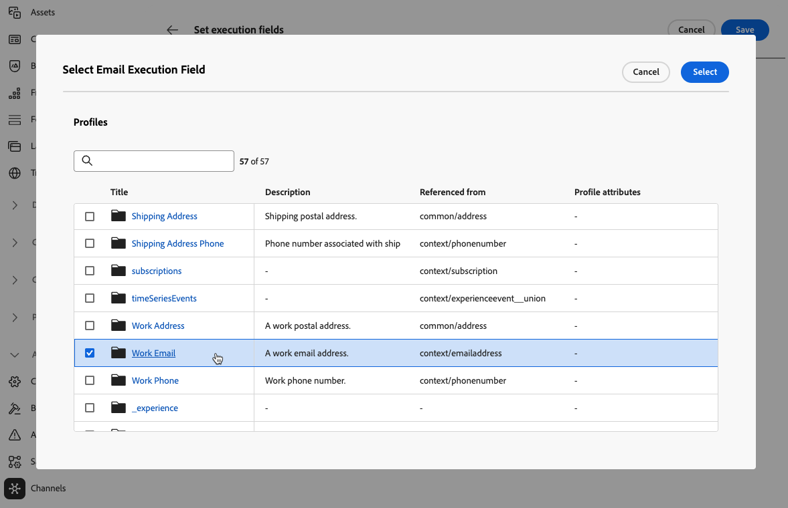

# De primaire adressen wijzigen {#change-primary-email}

>[!CONTEXTUALHELP]
>id="ajo_admin_execution_address"
>title="Bepaal welk adres moet worden gebruikt"
>abstract="Als er meerdere e-mailadressen of telefoonnummers beschikbaar zijn in de database (persoonlijk, professioneel, enz.), kunt u aangeven welke prioriteit u wilt geven aan het verzenden."

>[!CONTEXTUALHELP]
>id="ajo_admin_execution_address_header"
>title="Bepaal welk adres moet worden gebruikt"
>abstract="Bewerk de velden die worden gebruikt om het e-mailadres of telefoonnummer van het profiel te bepalen waaraan prioriteit moet worden gegeven bij het verzenden."

Wanneer u een profiel als doel instelt, zijn mogelijk verschillende e-mailadressen of telefoonnummers beschikbaar in de database (professioneel e-mailadres, persoonlijk telefoonnummer, enz.).

Met [!DNL Journey Optimizer], kunt u bepalen welk e-mailadres of telefoonnummer moet worden gebruikt van de profielservice en u kunt opgeven wanneer er meerdere adressen beschikbaar zijn. Volg de onderstaande stappen om dit te doen.

1. Open het menu **[!UICONTROL Channels]** > **[!UICONTROL General]** > **[!UICONTROL Executions fields]**.

   

1. De velden die standaard worden gebruikt om het e-mailadres en het telefoonnummer van de profielen op dit scherm te bepalen. Klikken **[!UICONTROL Edit]** om ze te wijzigen.

   

1. Klik op het huidige veld van uw keuze of op het pictogram Bewerken om een nieuw veld te selecteren.

   

1. De lijst met beschikbare XDM-velden van het e-mailtype wordt weergegeven. Selecteer het veld dat u wilt gebruiken.

   

1. Klikken **[!UICONTROL Save]** om uw keuze te bevestigen.

Het uitvoeringsveld wordt bijgewerkt en wordt nu gebruikt als primair adres.

<!--1. You can also select an additional field to use as secondary email address. This allows you to determine which field to use if the primary field is empty for a profile. -->
