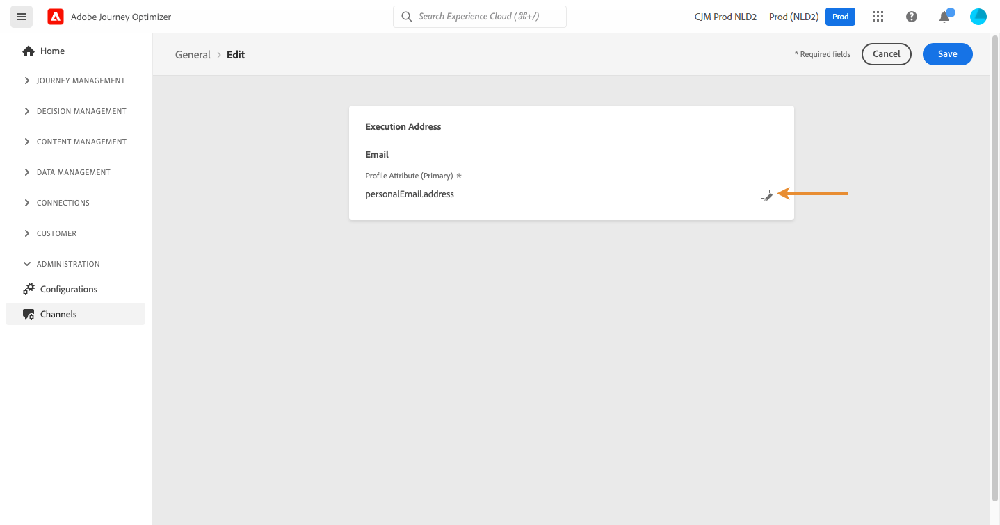

# Het primaire e-mailadres wijzigen {#change-primary-email}

Wanneer u een profiel als doel instelt, zijn mogelijk verschillende e-mailadressen beschikbaar in de database (persoonlijk, professioneel e-mailadres, enz.).

Met Journey Optimizer kunt u bepalen welk e-mailadres u wilt gebruiken via de profielservice en u kunt prioriteiten bepalen wanneer verschillende adressen beschikbaar zijn. Ga als volgt te werk om dit te doen:

1. Toegang krijgen tot  **[!UICONTROL Channels]** `>` **[!UICONTROL General]** -menu.
1. Het veld dat standaard wordt gebruikt om de e-mailadressen van de profielen te bepalen, wordt in dit scherm weergegeven. Klikken **[!UICONTROL Edit]** om deze te wijzigen.

   

1. Klik op de knop Wijzigen om het nieuwe veld te selecteren dat u als primair e-mailadres wilt gebruiken.

   

1. De lijst met beschikbare XDM-velden van het e-mailtype wordt weergegeven. Selecteer het veld dat u wilt gebruiken en klik op **[!UICONTROL Save]**.

   

<!--1. You can also select an additional field to use as secondary email address. This allows you to determine which field to use if the primary field is empty for a profile. >> will be done later on-->
