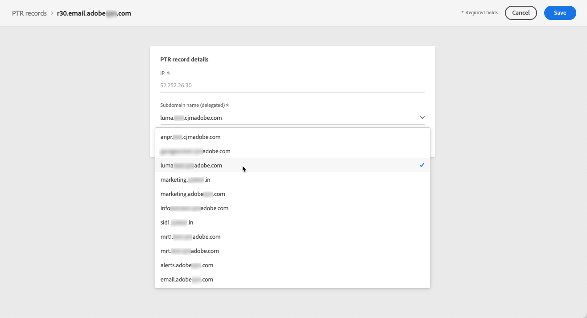

# PTR-records

## PTR-records

Een wijzerverslag (PTR) is een type van het verslag van het Systeem van de Naam van het Domein (DNS) dat de domeinnaam verbonden aan een IP adres verstrekt.

Met PTR verslagen, kunnen het ontvangen van postservers de authenticiteit van het verzenden van postservers controleren door te identificeren of hun IP adressen aan de namen beantwoorden waarmee de servers verbinden.

## De PTR-records van uw subdomeinen openen

Eenmaal [een subdomein wordt gedelegeerd](delegate-subdomain.md) in Adobe Journey Optimizer wordt automatisch een PTR-record gemaakt en gekoppeld aan dit subdomein. U hebt toegang tot dit bestand via het dialoogvenster **[!UICONTROL Channels]** > **[!UICONTROL Email configuration]** > **[!UICONTROL PTR records]** -menu.

In de lijst worden de PTR-records weergegeven die voor elk gedelegeerd subdomein zijn gegenereerd. Hierbij wordt de volgende syntaxis gebruikt:

* &quot;r&quot; voor opnamen,
* &quot;xx&quot; voor de twee laatste cijfers van het IP-adres,
* subdomeinnaam.

U kunt een PTR-record in de lijst openen om de bijbehorende subdomeinnaam en het IP-adres weer te geven.

## Een PTR-record bewerken {#edit-ptr-record}

U kunt een PTR-record wijzigen om het subdomein te bewerken dat aan een IP-adres is gekoppeld.

>[!CAUTION]
>
>U kunt een PTR-record dat is gekoppeld aan een subdomein dat aan Adobe is gedelegeerd, niet wijzigen met de opdracht [CNAME, methode](delegate-subdomain.md#cname-subdomain-delegation).

1. Klik in de lijst op de naam van een PTR-record om deze te openen.

   

1. Bewerk het subdomein naar wens.

   

   >[!NOTE]
   >
   >U kunt de **[!UICONTROL IP]** en **[!UICONTROL PTR record]** velden.

1. Klikken **[!UICONTROL Save]** om uw wijzigingen te bevestigen.

An **[!UICONTROL Updating]** wordt weergegeven naast de naam van de PTR-record in de lijst.

Klik op de knop **[!UICONTROL Updating]** of **[!UICONTROL Recent updates]** pictogram.

U kunt informatie zoals de updatestatus, en de gevraagde veranderingen zien.

## Statussen bijwerken

Een PTR-recordupdate kan de volgende statussen hebben:

* **[!UICONTROL Processing]**: De PTR-recordupdate is verzonden en wordt momenteel gecontroleerd.
* **[!UICONTROL Success]**: Het bijgewerkte PTR-record is geverifieerd en het nieuwe subdomein is nu gekoppeld aan het IP-adres.
* **[!UICONTROL Failed]**: Een of meer controles zijn mislukt tijdens de verificatie van de PTR-recordupdate.

### Verwerking

Verscheidene leveringscontroles zullen worden uitgevoerd om te verifiëren dat nieuwe subdomain aan vennoot met het IP adres geldig is. <!--The processing time is around **48h-72h**, and can take up to **7-10 days**. Learn more on the checks performed during the validation cycle in [this section](#create-message-preset).-->

>[!NOTE]
>
>U kunt een PTR-record niet wijzigen terwijl er een update wordt uitgevoerd. U kunt nog steeds op de naam klikken, maar wel op de knop **[!UICONTROL Subdomain]** veld wordt grijs weergegeven. De wijzigingen worden pas doorgevoerd als de update is gelukt.

Tijdens het validatieproces wordt het oude subdomein nog steeds gekoppeld aan het IP-adres.

### Succes

Wanneer het validatieproces is voltooid, wordt het nieuwe subdomein automatisch gekoppeld aan het IP-adres.

### Mislukt

Als het validatieproces mislukt, wordt de oudere PTR-record weergegeven. Het geldige subdomein dat eerder aan het IP adres werd geassocieerd blijft onveranderd.

De mogelijke updatefouten zijn als volgt:
* Fout bij het maken van een nieuwe, voorwaartse DNS voor de PTR-record
* Kan de record niet bijwerken
* Niet opnieuw aan boord gaan van de affinities

Als de update mislukt, kan de PTR-record opnieuw worden bewerkt. U kunt op de naam van het subdomein klikken en het subdomein opnieuw bijwerken.
