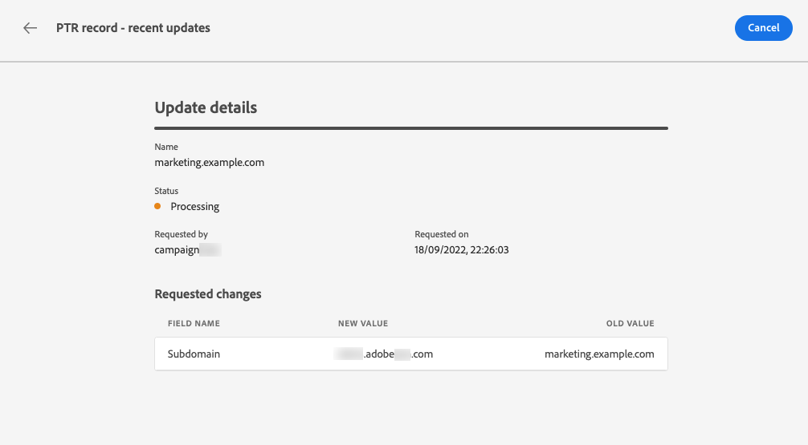

# PTR-records maken en bewerken {#ptr-records}

>[!CONTEXTUALHELP]
>id="ajo_admin_ptr_record"
>title="PTR-records van subdomeinen"
>abstract="Een wijzerverslag (PTR) is een type van DNS verslag dat de domeinnaam verbonden aan een IP adres verstrekt, dat de ontvangende postservers helpt om de IP van afzenders adressen te verifiëren. Bewerk een PTR-record alleen na afwegingen en bespreking met uw leverancier-expert."

>[!CONTEXTUALHELP]
>id="ajo_admin_ptr_record_header"
>title="PTR-records van subdomeinen"
>abstract="Wanneer het eerste subdomein in Journey Optimizer is gedelegeerd aan Adobe, worden automatisch PTR-records gemaakt."

## PTR-records {#about-ptr-records}

Een wijzerverslag (PTR) is een type van het verslag van het Systeem van de Naam van het Domein (DNS) dat de domeinnaam verbonden aan een IP adres verstrekt.

Met PTR verslagen, kunnen het ontvangen van postservers de authenticiteit van het verzenden van postservers controleren door te identificeren of hun IP adressen aan de namen beantwoorden die de servers verbinden met.

## De PTR-records van uw subdomeinen openen {#access-ptr-records}

Zodra u [ afgevaardigde ](delegate-subdomain.md) uw eerste subdomain aan Adobe in [!DNL Journey Optimizer], PTR- verslagen automatisch voor uw IPs wordt gecreeerd. U kunt ze openen via het menu **[!UICONTROL Administration]** > **[!UICONTROL Channels]** > **[!UICONTROL Email settings]** > **[!UICONTROL PTR records]** .

De lijst bevat de PTR-records die zijn gegenereerd met de onderstaande syntaxis:

* &quot;r&quot; voor opnamen,
* &quot;xx&quot; voor de twee laatste cijfers van het IP-adres,
* subdomeinnaam.

U kunt een PTR-record in de lijst openen om de bijbehorende subdomeinnaam en het IP-adres weer te geven.

## Een PTR-record bewerken {#edit-ptr-record}

In [!DNL Journey Optimizer] kunt u niet handmatig PTR-records maken. In plaats daarvan, zodra u [ afgevaardigde ](delegate-subdomain.md) uw eerste subdomain aan Adobe, PTR- verslagen automatisch voor uw IPs wordt gecreeerd.

Elk van uw IPs ontvangt één enkel PTR verslag. Alle PTR-records hebben de volgende indeling: &#39;rxx.subdomain&#39;, waarbij &#39;subdomain&#39; het eerste subdomein is dat u hebt gedelegeerd in [!DNL Journey Optimizer] .

Wanneer u extra subdomeinen creeert, moet u één of meerdere PTR verslagen wijzigen en die nieuwe subdomeinen aan hen toewijzen. Volg de onderstaande stappen om dit te doen.

>[!CAUTION]
>
>PTR-records worden in alle omgevingen gebruikt. Daarom zal elke wijziging van een PTR-record ook gevolgen hebben voor de productie-sandboxen.
>
>Ga voorzichtig verder met het bewerken van PTR-records. Neem in geval van twijfel contact op met een leverancier.

### Volledig gedelegeerde subdomeinen {#fully-delegated-subdomains}

Om een PTR- verslag met subdomain uit te geven die [ volledig ](delegate-subdomain.md#full-subdomain-delegation) aan Adobe wordt gedelegeerd, volg de hieronder stappen.

1. Klik in de lijst op de naam van een PTR-record om deze te openen.

   

1. Selecteer volledig subdomain  aan Adobe van de lijst wordt gedelegeerd.

   

1. Klik op **[!UICONTROL Save]** om uw wijzigingen te bevestigen.

>[!NOTE]
>
>U kunt de velden **[!UICONTROL IP]** en **[!UICONTROL PTR record]** niet wijzigen.

### Gedelegeerde subdomeinen die de methode CNAME gebruiken {#edit-ptr-subdomains-cname}

Om een PTR- verslag met subdomain uit te geven dat aan Adobe gebruikend de [ methode van de NAAM ](delegate-subdomain.md#cname-subdomain-setup) wordt afgevaardigd, volg hieronder de stappen.

1. Klik in de lijst op de naam van een PTR-record om deze te openen.

   

1. Selecteer subdomain die aan Adobe wordt gedelegeerd gebruikend de [ methode van de NAAM ](delegate-subdomain.md#cname-subdomain-setup) van de lijst.

   

1. U moet een nieuw voorwaarts DNS verslag op uw het ontvangen platform tot stand brengen. Hiervoor kopieert u de record die door Adobe is gegenereerd. Als u klaar bent, schakelt u het selectievakje &quot;Ik bevestig...&quot; in.

   

   >[!NOTE]
   >
   >Als u dit bericht krijgt: &quot;Maak eerst een forward DNS en probeer het opnieuw&quot;, volgt u de onderstaande stappen:
   >   * Controleer de DNS leverancier als het voorwaartse DNS verslag met succes werd gecreeerd.
   >   * Records in de DNS worden mogelijk niet meteen gesynchroniseerd. Wacht een paar minuten en probeer het opnieuw.

1. Klik op **[!UICONTROL Save]** om uw wijzigingen te bevestigen.

>[!NOTE]
>
>U kunt de velden **[!UICONTROL IP]** en **[!UICONTROL PTR record]** niet wijzigen.

## Details van PTR-recordupdate controleren {#check-ptr-record-update}

Nadat u de PTR-recordbewerking hebt bevestigd, wordt het pictogram **[!UICONTROL Processing]** weergegeven naast de naam van de PTR-record in de lijst.

>[!NOTE]
>
>De [ updateverwerking ](#processing) kan tot 3 uren vergen.

Als u de details van de PTR-recordupdate wilt controleren, klikt u op het pictogram ernaast. Leer meer over de statussen verbonden aan de verschillende pictogrammen in [ deze sectie ](#ptr-record-update-statuses).

U kunt informatie zoals de updatestatus, en de gevraagde veranderingen zien.

## PTR-recordupdatestatus {#ptr-record-update-statuses}

Een PTR-recordupdate kan de volgende statussen hebben:

*  **[!UICONTROL Processing]**: De PTR-recordupdate is verzonden en wordt door een verificatieproces uitgevoerd.
*  **[!UICONTROL Success]** : De bijgewerkte PTR-record is geverifieerd en het nieuwe subdomein is nu gekoppeld aan het IP-adres.
*  **[!UICONTROL Failed]**: een of meer controles zijn mislukt tijdens de verificatie van de PTR-recordupdate.

### Verwerking {#processing}

Verscheidene leveringscontroles zullen worden uitgevoerd om te verifiëren dat nieuwe subdomain aan vennoot met het IP adres geldig is. Dit kan tot 3 uur duren.

>[!NOTE]
>
>U kunt een PTR-record niet wijzigen terwijl er een update wordt uitgevoerd. U kunt nog steeds op de naam ervan klikken, maar het veld **[!UICONTROL Subdomain]** wordt grijs weergegeven. De wijzigingen worden pas doorgevoerd als de update is gelukt.

Tijdens het validatieproces wordt het oude subdomein nog steeds gekoppeld aan het IP-adres.

### Succes {#success}

Wanneer het validatieproces is voltooid, wordt het nieuwe subdomein automatisch gekoppeld aan het IP-adres.

### Mislukt {#failes}

Als het validatieproces mislukt, wordt de oudere PTR-record weergegeven. Het geldige subdomein dat eerder aan het IP adres werd geassocieerd blijft onveranderd.

De mogelijke updatefouten zijn als volgt:

* Fout bij het maken van een nieuwe, voorwaartse DNS voor de PTR-record
* Kan de record niet bijwerken
* Niet opnieuw aan boord gaan van de affinities

Als de update mislukt, kan de PTR-record opnieuw worden bewerkt. U kunt op de naam van het subdomein klikken en het subdomein opnieuw bijwerken.
