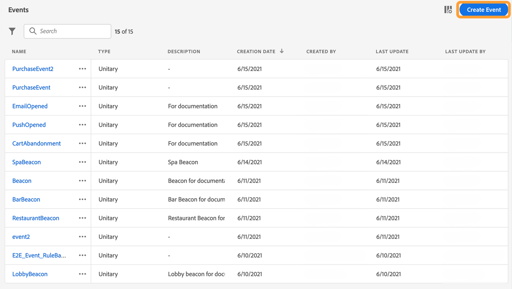
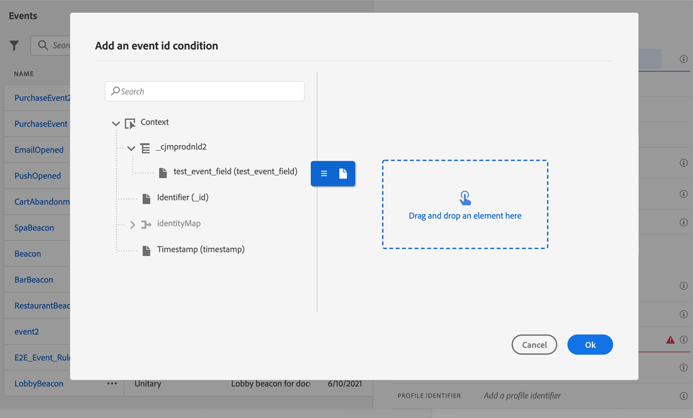

# Pushmeldingskanaal configureren {#push-notification-configuration}

[!DNL Journey Optimizer] kunt u uw reizen maken en berichten naar het beoogde publiek sturen. Voordat u pushmeldingen verzendt met [!DNL Journey Optimizer], dient u ervoor te zorgen dat configuraties en integratie aanwezig zijn op de mobiele app en voor tags in Adobe Experience Platform. Om inzicht te krijgen in de gegevensstroom van pushmeldingen in [!DNL Adobe Journey Optimizer] verwijzen naar [deze pagina](push-gs.md).

## Voordat u begint {#before-starting}

<!--
### Check provisioning

Your Adobe Experience Platform account must be provisioned to contain following schemas and datasets for push notification data flow to function correctly:

| Schema <br>Dataset                                                                       | Group of fields                                                                                                                                                                         | Operation                                                |
| -------------------------------------------------------------------------------------- | --------------------------------------------------------------------------------------------------------------------------------------------------------------------------------------- | -------------------------------------------------------- |
| CJM Push Profile Schema <br>CJM Push Profile Dataset                                     | Push Notification Details<br>Adobe CJM ExperienceEvent - Message Profile Details<br>Adobe CJM ExperienceEvent - Message Execution Details<br>Application Details<br>Environment Details | Register Push Token                                      |
| CJM Push Tracking Experience Event Schema<br>CJM Push Tracking Experience Event Dataset | Push Notification Tracking                                                                                                                                                              | Track interactions and provide data for the reporting UI |
-->

### Machtigingen instellen {#setup-permissions}

Voordat u een mobiele toepassing maakt, moet u er eerst voor zorgen dat u over de juiste gebruikersmachtigingen voor tags in Adobe Experience Platform beschikt of deze toewijst. Meer informatie in [Documentatie over tags](https://experienceleague.adobe.com/docs/experience-platform/tags/admin/user-permissions.html){target=&quot;_blank&quot;}.

>[!CAUTION]
>
>De duimconfiguratie moet door een deskundige gebruiker worden uitgevoerd. Afhankelijk van uw implementatiemodel en de personen die bij deze implementatie zijn betrokken, moet u mogelijk de volledige set machtigingen toewijzen aan één productprofiel of machtigingen delen tussen de ontwikkelaar van de app en de ontwikkelaar van de **Adobe Journey Optimizer** beheerder. Meer informatie over **Tags** machtigingen in [deze documentatie](https://experienceleague.adobe.com/docs/experience-platform/tags/admin/user-permissions.html#platform-launch-permissions){target=&quot;_blank&quot;}.

<!--ou need to your have access to perform following roles :

* Manage Datastreams
* Manage Client-side Properties
* Manage App Configurations
-->

Om **Eigenschap** en **Bedrijf** rechten, volgt u de onderstaande stappen:

1. Toegang krijgen tot **[!DNL Admin Console]**.

1. Van de **[!UICONTROL Products]** selecteert u de **[!UICONTROL Adobe Experience Platform Launch]** kaart.

   

1. Bestaande selecteren **[!UICONTROL Product Profile]** of maak een nieuwe met de **[!UICONTROL New profile]** knop. Leer hoe u een nieuwe **[!UICONTROL New profile]** in de [Documentatie beheerconsole](https://experienceleague.adobe.com/docs/experience-platform/access-control/ui/create-profile.html#ui){target=&quot;_blank&quot;}.

1. Selecteer op het tabblad **[!UICONTROL Permissions]** de optie **[!UICONTROL Property rights]**.

   

1. Klik op **[!UICONTROL Add all]**. Hiermee voegt u het volgende recht toe aan uw productprofiel:
   * **[!UICONTROL Approve]**
   * **[!UICONTROL Develop]**
   * **[!UICONTROL Manage Environments]**
   * **[!UICONTROL Manage Extensions]**
   * **[!UICONTROL Publish]**

   Deze machtigingen zijn vereist voor het installeren en publiceren van de Adobe Journey Optimizer-extensie en het publiceren van de app-eigenschap in Adobe Experience Platform Mobile SDK.

1. Selecteer vervolgens **[!UICONTROL Company rights]** in het linkermenu.

   

1. Voeg de volgende rechten toe:

   * **[!UICONTROL Manage App Configurations]**
   * **[!UICONTROL Manage Properties]**

   Deze machtigingen zijn vereist voor de ontwikkelaar van de mobiele app om pushgegevens in te stellen in **Adobe Experience Launch** en definieert u oppervlakken van het kanaal voor pushmeldingen (d.w.z. voorinstellingen voor berichten) in **Adobe Journey Optimizer**.

   

1. Klik op **[!UICONTROL Save]**.

Om dit toe te wijzen **[!UICONTROL Product profile]** aan gebruikers, volg de hieronder stappen:

1. Toegang krijgen tot **[!DNL Admin Console]**.

1. Van de **[!UICONTROL Products]** selecteert u de **[!UICONTROL Adobe Experience Platform Launch]** kaart.

1. Selecteer de eerder geconfigureerde **[!UICONTROL Product profile]**.

1. Klik op het tabblad **[!UICONTROL Users]** op **[!UICONTROL Add user]**.

   

1. Typ de naam of het e-mailadres van uw gebruiker en selecteer de gebruiker. Klik vervolgens op **[!UICONTROL Save]**.

   >[!NOTE]
   >
   >Als de gebruiker niet eerder in de Admin console werd gecreeerd, verwijs naar [Gebruikersdocumentatie toevoegen](https://helpx.adobe.com/enterprise/admin-guide.html/enterprise/using/manage-users-individually.ug.html#add-users).

   

### Uw app configureren {#configure-app}

De technische opstelling impliceert nauwe samenwerking tussen de toepassingsontwikkelaar en bedrijfsbeheerder. Voordat u begint met het verzenden van pushberichten met [!DNL Journey Optimizer], moet u instellingen definiëren in [!DNL Adobe Experience Platform Data Collection] en integreer uw mobiele app met Adobe Experience Platform Mobile SDK&#39;s.

Voer de implementatiestappen uit die in de onderstaande koppelingen worden beschreven:

* Voor **Apple iOS**: Leer hoe u uw app registreert bij APN&#39;s in [Apple-documentatie](https://developer.apple.com/documentation/usernotifications/registering_your_app_with_apns){target=&quot;_blank&quot;}
* Voor **Google Android**: Leer hoe u een Firebase Cloud Messaging-clienttoepassing op Android instelt in [Google-documentatie](https://firebase.google.com/docs/cloud-messaging/android/client){target=&quot;_blank&quot;}

### Uw mobiele app integreren met de SDK van Adobe Experience Platform {#integrate-mobile-app}

Adobe Experience Platform Mobile SDK biedt client-side integratie-API&#39;s voor uw mobiele apparaten via met Android en iOS compatibele SDK&#39;s. Volg [Adobe Experience Platform Mobile SDK-documentatie](https://aep-sdks.gitbook.io/docs/getting-started/overview){target=&quot;_blank&quot;} voor installatie met Adobe Experience Platform Mobile SDK&#39;s in uw app.

Tegen het einde van deze procedure had u ook een mobiele eigenschap moeten maken en configureren in [!DNL Adobe Experience Platform Data Collection]. Normaal gesproken maakt u een eigenschap mobile voor elke mobiele toepassing die u wilt beheren. Leer hoe u een mobiele eigenschap kunt maken en configureren in [Adobe Experience Platform Mobile SDK-documentatie](https://aep-sdks.gitbook.io/docs/getting-started/create-a-mobile-property){target=&quot;_blank&quot;}.


## Stap 1: Uw pushgegevens voor de app toevoegen in Adobe Experience Platform Data Collection {#push-credentials-launch}

Nadat u de juiste gebruikersmachtigingen hebt verleend, moet u nu uw pushgegevens voor mobiele toepassingen toevoegen in [!DNL Adobe Experience Platform Data Collection].

De registratie van de pushreferenties voor de mobiele app is vereist om Adobe te machtigen pushberichten namens u te verzenden. Raadpleeg de onderstaande stappen:

1. Van [!DNL Adobe Experience Platform Data Collection], selecteert u de **[!UICONTROL App Surfaces]** in het linkerdeelvenster.

1. Klikken **[!UICONTROL Create App Surface]** om een nieuwe configuratie te creëren.

   

1. Voer een **[!UICONTROL Name]** voor de configuratie.

1. Van **[!UICONTROL Mobile Application Configuration]** selecteert u het besturingssysteem:

   * **Voor iOS**

      

      1. Voer de mobiele app in **Bundel-id** in de **[!UICONTROL App ID (iOS Bundle ID)]** veld. De bundel-id van de app vindt u in het gedeelte **Algemeen** tabblad van het primaire doel in **XCode**.

      1. Schakelt op de **[!UICONTROL Push Credentials]** om uw referenties toe te voegen.

      1. Sleep het .p8 Apple Push Notification Authentication Key-bestand naar het bestand. Deze sleutel kan worden opgehaald uit de **Certificaten**, **Id&#39;s** en **Profielen** pagina.

      1. Geef de **Sleutel-id**. Dit is een tekenreeks van 10 tekens die wordt toegewezen tijdens het maken van de p8-auttoets. Het is te vinden onder **Toetsen** tab in **Certificaten**, **Id&#39;s** en **Profielen** pagina.

      1. Geef de **Team-id**. Dit is een tekenreekswaarde die u vindt op het tabblad Lidmaatschap.
   * **Voor Android**

      

      1. Geef de **[!UICONTROL App ID (Android package name)]**: doorgaans is de pakketnaam de toepassings-id in uw `build.gradle` bestand.

      1. Schakelt op de **[!UICONTROL Push Credentials]** om uw referenties toe te voegen.

      1. Sleep de FCM-pushgegevens en zet deze neer. Raadpleeg voor meer informatie over hoe u de pushreferenties kunt ophalen [Google-documentatie](https://firebase.google.com/docs/admin/setup#initialize-sdk){target=&quot;_blank&quot;}.


1. Klikken **[!UICONTROL Save]** om uw toepassingsconfiguratie te maken.

<!--
## Step 2: Set up a mobile property in Adobe Experience Platform Launch {#launch-property}

Setting up a mobile property allows the mobile app developer or marketer to configure the mobile SDKs attributes such as Session Timeouts, the [!DNL Adobe Experience Platform] sandbox to be targeted and the **[!UICONTROL Adobe Experience Platform Datasets]** to be used for mobile SDK to send data to.

For further details and procedures on how to set up a **[!UICONTROL Platform Launch property]**, refer to the steps detailed in [Adobe Experience Platform Mobile SDK documentation](https://aep-sdks.gitbook.io/docs/getting-started/create-a-mobile-property#create-a-mobile-property).


To get the SDKs needed for push notification to work you will need the following SDK extensions, for both Android and iOS:

* **[!UICONTROL Mobile Core]** (installed automatically)
* **[!UICONTROL Profile]** (installed automatically)
* **[!UICONTROL Adobe Experience Platform Edge]**
* **[!UICONTROL Adobe Experience Platform Assurance]**, optional but recommended to debug the mobile implementation.

Learn more about [!DNL Adobe Experience Platform Launch] extensions in [Adobe Experience Platform Launch documentation](https://experienceleague.adobe.com/docs/launch-learn/implementing-in-mobile-android-apps-with-launch/configure-launch/launch-add-extensions.html).
-->

## Stap 2: Adobe Journey Optimizer-extensie configureren in uw mobiele eigenschap {#configure-journey-optimizer-extension}

De **Adobe Journey Optimizer-extensie** voor Adobe Experience Platform Mobile SDK&#39;s kunt u pushmeldingen voor uw mobiele apps maken en gebruikers-pushtokens verzamelen en interactiemetingen beheren met Adobe Experience Platform-services.

Leer hoe u Journey Optimizer-extensies kunt instellen in [Adobe Experience Platform Mobile SDK-documentatie](https://aep-sdks.gitbook.io/docs/using-mobile-extensions/adobe-journey-optimizer){target=&quot;_blank&quot;}.


<!-- 
**[!UICONTROL Edge configuration]** is used by **[!UICONTROL Edge]** extension to send custom data from mobile device to [!DNL Adobe Experience Platform]. 
To configure [!DNL Adobe Experience Platform], you must provide the **[!UICONTROL Sandbox]** name and **[!UICONTROL Event Dataset]**.

For further details and procedures on how to create **[!UICONTROL Edge configuration]**, refer to the steps detailed in [Adobe Experience Platform Mobile SDK documentation](https://aep-sdks.gitbook.io/docs/getting-started/configure-datastreams).

1. From [!DNL Adobe Experience Platform Launch], select the **[!UICONTROL Edge Configurations]** tab and click **[!UICONTROL Edge Configurations]**.
    
1. Select **[!UICONTROL New Edge Configuration]** to add a new **[!UICONTROL Edge Configuration]**.
1. Enter a **[!UICONTROL Name]** and click **[!UICONTROL Save]**

1. Click the **[!UICONTROL Adobe Experience Platform]** toggle to enable it.

1. Fill in the **[!UICONTROL Sandbox]**, **[!UICONTROL Event dataset]** and **[!UICONTROL Profile Dataset]** fields. Then, click **[!UICONTROL Save]**.
    
    


1. From [!DNL Adobe Experience Platform Launch], ensure that **[!UICONTROL Client Side]** is selected in the drop-down menu.

1. select the **[!UICONTROL Properties]** tab and click **[!UICONTROL New Property]**.

    

1. Enter a **[!UICONTROL Name]** for your new property.

1. Select **[!UICONTROL Mobile]** as **[!UICONTROL Platform]**.

    

1. Click **[!UICONTROL Save]** to create your new property.

To configure **[!UICONTROL Adobe Experience Platform Edge Extension]** to send custom data from mobile devices to [!DNL Adobe Experience Platform].

1. Select your previously created property and select the **[!UICONTROL Extensions]** tab to view the extensions for this property.

    

1. Click **[!UICONTROL Configure]** under the **[!UICONTROL Adobe Experience Platform Edge]** Network' extension.

1. From the **[!UICONTROL Edge Configuration]** drop-down list, select the **[!UICONTROL Edge Configuration]** created in the previous steps. For more information on **[!UICONTROL Edge Configuration]**, refer to this [section](#edge-configuration).

1. Click **[!UICONTROL Save]**.

To configure **[!UICONTROL Adobe Experience Platform Messaging]** extension to send push profile and push interactions to the correct datasets, follow the same steps as above. Use **[!UICONTROL Sandbox]**, **[!UICONTROL Event dataset]** and **[!UICONTROL Profile Dataset]** created in the [Adobe Experience Platform setup](#edge-configuration).
-->

<!--
## Step 4: Publish the Property {#publish-property}

You now need to publish the property to integrate your configuration and to use it in the mobile app. 

To publish your property, refer to the steps detailed in [Adobe Experience Platform Mobile SDK documentation](https://aep-sdks.gitbook.io/docs/getting-started/create-a-mobile-property#publish-the-configuration)

## Step 5: Configure the ProfileDataSource {#configure-profiledatasource}

To configure the `ProfileDataSource`, use the `ProfileDCInletURL` from [!DNL Adobe Experience Platform] setup and add the following in the mobile app:

```
    MobileCore.updateConfiguration(
    mutableMapOf("messaging.dccs" to <ProfileDCSInletURL>)
```

-->

## Stap 3: Uw mobiele app testen met een gebeurtenis {#mobile-app-test}

Nadat u uw mobiele app hebt geconfigureerd in zowel Adobe Experience Platform als in [!DNL Adobe Experience Platform Data Collection], kunt u deze nu testen voordat u pushmeldingen naar uw profielen verzendt. In dit geval maken we een reis om onze mobiele app als doel in te stellen en een gebeurtenis in te stellen die de pushmelding activeert.

<!--
You can use a test mobile app for this use case. For more on this, refer to this [page](https://wiki.corp.adobe.com/pages/viewpage.action?spaceKey=CJM&title=Details+of+setting+the+mobile+test+app) (internal use only).
-->

Voor deze reis aan het werk, moet u een schema tot stand brengen XDM. Raadpleeg voor meer informatie [XDM-documentatie](https://experienceleague.adobe.com/docs/experience-platform/xdm/schema/composition.html#schemas-and-data-ingestion){target=&quot;_blank&quot;}.

1. Blader in het linkermenu naar **[!UICONTROL Schemas]**.

1. Klikken **[!UICONTROL Create schema]** Selecteer vervolgens **[!UICONTROL XDM ExperienceEvent]**.

   

1. Selecteer **[!UICONTROL Create a new field group]**.

1. Voer een **[!UICONTROL Display Name]** en **[!UICONTROL Description]**. Klik op **[!UICONTROL Add field groups]** wanneer u gereed bent. Voor meer informatie over het maken van veldgroepen raadpleegt u [XDM System-documentatie](https://experienceleague.adobe.com/docs/experience-platform/xdm/tutorials/create-schema-ui.html){target=&quot;_blank&quot;}.


   

1. Selecteer het schema aan de linkerkant. Voer in het rechterdeelvenster de naam van het schema en de beschrijving in. Dit schema inschakelen voor **[!UICONTROL Profile]**.

   


1. Selecteer links in het venster de veldgroep en klik op het pictogram + om een nieuw veld te maken. In de **[!UICONTROL Field groups properties]**, aan de rechterkant, typt u een **[!UICONTROL Field name]**, **[!UICONTROL Display name]** en selecteert u **[!UICONTROL String]** als **[!UICONTROL Type]**.

   

1. Controleren **[!UICONTROL Required]** en klik op **[!UICONTROL Apply]**.

1. Klik op **[!UICONTROL Save]**. Uw schema is nu gemaakt en kan in een gebeurtenis worden gebruikt.

Vervolgens moet u een gebeurtenis instellen.

1. Selecteer in het linkermenu van de startpagina, onder Beheer, de optie **[!UICONTROL Configurations]**. Klik **[!UICONTROL Manage]** in de **[!UICONTROL Events]** om uw nieuwe gebeurtenis te maken.

1. Klikken **[!UICONTROL Create Event]** Het deelvenster voor gebeurtenisconfiguratie wordt aan de rechterkant van het scherm geopend.

   

1. Voer de naam van de gebeurtenis in. U kunt ook een beschrijving toevoegen.

1. Selecteer in het veld **[!UICONTROL Event ID type]** de optie **[!UICONTROL Rule Based]**.

1. In de **[!UICONTROL Parameters]** selecteert u het eerder gemaakte schema.

   

1. Controleer in de lijst met velden of het veld dat in de schemaveldgroep is gemaakt, is geselecteerd.

   

1. Klikken **[!UICONTROL Edit]** in de **[!UICONTROL Event ID condition]** veld. Sleep het veld dat u eerder hebt toegevoegd om de voorwaarde te definiëren die door het systeem wordt gebruikt om de gebeurtenissen te identificeren die de reis activeren.

   

1. Typ de syntaxis die u moet gebruiken om uw pushmelding in uw testapp te activeren, in dit voorbeeld **orderbevestiging**.

   

1. Selecteren **[!UICONTROL ECID]** als uw **[!UICONTROL Namespace]**.

1. Klik op **[!UICONTROL Ok]** en vervolgens op **[!UICONTROL Save]**.

Uw gebeurtenis wordt nu gemaakt en kan nu op een reis worden gebruikt.

1. Klik in het linkermenu op **[!UICONTROL Journeys]**.

1. Klikken **[!UICONTROL Create Journey]** om een nieuwe reis te maken.

1. Bewerk de eigenschappen van de journey in het configuratievenster dat aan de rechterkant wordt weergegeven. Meer informatie in deze [sectie](../building-journeys/journey-gs.md#change-properties).

1. Begin door de gebeurtenis te slepen die in de vorige stappen van de **[!UICONTROL Events]** vervolgkeuzelijst.

   

1. Van de **[!UICONTROL Actions]** vervolgkeuzelijst, een **[!UICONTROL Push]** activiteit aan uw reis.

1. Configureer de pushmelding. Raadpleeg voor meer informatie over het maken van pushberichten de volgende [page](../messages/get-started-content.md).

1. Klik op de knop **[!UICONTROL Test]** schakelen om uw pushmeldingen te testen en klikken **[!UICONTROL Trigger an event]**.

   

1. Voer uw ECID in het dialoogvenster **[!UICONTROL Key]** veld en typ vervolgens in **orderbevestiging** in het tweede veld.

   

1. Klik op **[!UICONTROL Send]**.

Uw gebeurtenis wordt geactiveerd en u ontvangt uw pushmelding voor uw mobiele app.

## Stap 4: Een kanaaloppervlak maken voor duwen{#message-preset}

Zodra uw mobiele app is ingesteld in [!DNL Adobe Experience Platform Data Collection], moet u een oppervlak maken om pushmeldingen te kunnen verzenden vanuit **[!DNL Journey Optimizer]**.

Leer hoe u een kanaaloppervlak maakt en configureert in [deze sectie](../configuration/message-presets.md).

U bent nu klaar om pushmeldingen te verzenden met Journey Optimizer.

* Leer hoe u een pushbericht maakt in [deze pagina](../messages/create-push.md).
* Leer hoe u een bericht kunt toevoegen aan een rit in [deze sectie](../building-journeys/journeys-message.md).
