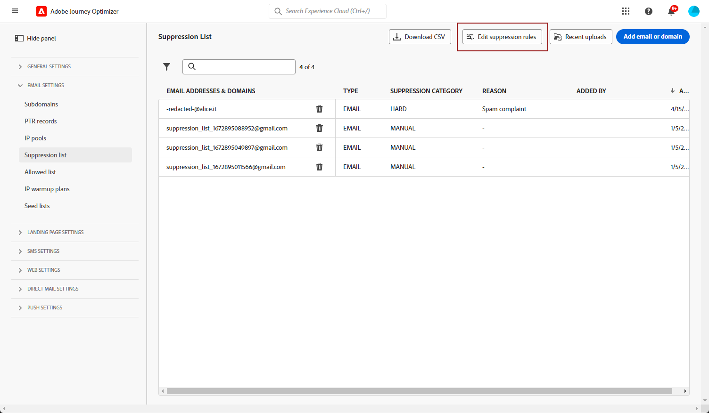

# Hernieuwde pogingen {#retries}

Wanneer een e-mailbericht mislukt als gevolg van een tijdelijke **Zachte stuit** fout. Er worden verschillende keren opnieuw geprobeerd. Elke fout verhoogt een foutenteller. Wanneer deze teller de grensdrempel bereikt, wordt het adres toegevoegd aan de onderdrukkingslijst.

>[!NOTE]
>
>Meer informatie over de fouttypen vindt u in het dialoogvenster [Typen leveringsfouten](../reports/suppression-list.md#delivery-failures) sectie.

In de standaardconfiguratie is de drempel ingesteld op 5 fouten.

* Bij dezelfde levering is bij de vijfde fout een fout opgetreden in het dialoogvenster [periode voor opnieuw uitproberen](#retry-duration), wordt het adres onderdrukt.

* Als er verschillende leveringen zijn en twee fouten minstens 24 uur uit elkaar voorkomen, wordt de foutenteller verhoogd op elke fout en het adres wordt ook onderdrukt bij de vijfde poging.

Als de levering succesvol is nadat opnieuw is geprobeerd, wordt de foutenteller van het adres opnieuw geïnitialiseerd.

Als de standaardwaarde 5 niet aan uw wensen voldoet, kunt u de foutdrempel wijzigen volgens de onderstaande stappen.

1. Ga naar **[!UICONTROL Channels]** > **[!UICONTROL Email configuration]** > **[!UICONTROL Suppression list]**.

1. Selecteer de knop **[!UICONTROL Edit suppression rules]**.

   

1. Pas het toegestane aantal opeenvolgende zachte grenzen aan uw wensen aan.

   

   U moet een geheel getal tussen 1 en 20 invoeren. Dit betekent dat het minimum aantal pogingen 1 is en het maximum aantal 20.

   >[!CAUTION]
   >
   >Om het even welke waarde hoger dan 10 kan de kwesties van de leveringsreputatie, evenals IP het vertragen of het voegend op lijst van gewenste personen door ISPs veroorzaken. [Meer informatie over te leveren items](../reports/deliverability.md)

## Periode voor opnieuw proberen {#retry-duration}

De **periode voor opnieuw uitproberen** Dit is het tijdsbestek waarin elk e-mailbericht van de levering waarbij een tijdelijke fout of een zachte stuit is opgetreden, opnieuw wordt geprobeerd.

Standaard worden nieuwe pogingen uitgevoerd voor **3,5 dagen** (of **84 uur**) vanaf het moment dat het bericht aan de e-mailwachtrij is toegevoegd.

Als u er echter voor wilt zorgen dat pogingen om opnieuw te proberen niet meer worden uitgevoerd wanneer ze niet meer nodig zijn, kunt u deze instelling naar wens wijzigen wanneer u een [kanaaloppervlak](channel-surfaces.md) (d.w.z. voorinstelling voor berichten) die wordt toegepast op het e-mailkanaal.

U kunt bijvoorbeeld de periode voor het opnieuw proberen instellen op 24 uur voor een transactie-e-mail die betrekking heeft op het opnieuw instellen van wachtwoorden en die een koppeling bevat die slechts een dag geldig is. Op dezelfde manier kunt u voor een uitverkoop in middernacht een uitzetperiode van 6 uur definiëren.

>[!NOTE]
>
>De periode van opnieuw proberen mag niet langer zijn dan 84 uur. De minimumperiode voor het opnieuw proberen is 6 uur voor marketing e-mails en 10 minuten voor transactie e-mails.

Leer hoe u de parameters voor het opnieuw proberen van e-mail aanpast bij het maken van een kanaaloppervlak in [deze sectie](channel-surfaces.md#create-channel-surface).

