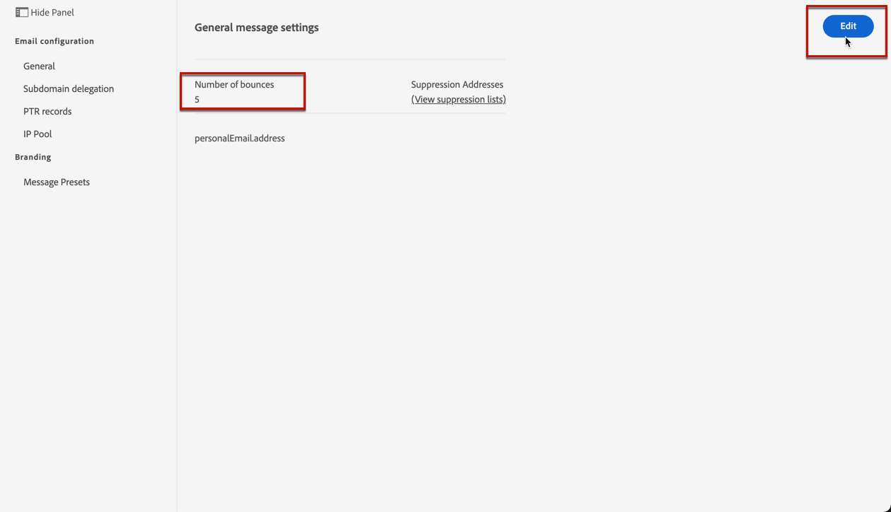

# Hernieuwde pogingen {#retries}

Wanneer een e-mailbericht mislukt als gevolg van een tijdelijke **Soft bounce** of **Genegeerde** fout, worden verschillende keren opnieuw geprobeerd. Elke fout verhoogt een foutenteller. Wanneer deze teller de grensdrempel bereikt, wordt het adres toegevoegd aan de onderdrukkingslijst.

>[!NOTE]
>
>Leer meer over de types van fouten in [de types van mislukkingen van de Levering](../suppression-list.md#delivery-failures) sectie.

In de standaardconfiguratie, wordt de drempel geplaatst bij drie fouten:

* Voor dezelfde levering, bij de derde aangetroffen fout, wordt het adres onderdrukt.

* Als er verschillende leveringen zijn en twee fouten minstens 24 uur uit elkaar voorkomen, wordt de foutenteller verhoogd op elke fout en het adres wordt ook onderdrukt bij de derde poging.

Als de levering succesvol is nadat opnieuw is geprobeerd, wordt de foutenteller van het adres opnieuw geïnitialiseerd.

U kunt de limietdrempel wijzigen met de knop **[!UICONTROL Edit]** in het menu **[!UICONTROL Channels]** > **[!UICONTROL Email configuration]** > **[!UICONTROL General]**.

<!--The minimum delay between retries and the maximum number of retries to be performed are based on how well an IP is performing, both historically and currently, at a given domain.-->

## Periode voor opnieuw proberen {#retry-duration}

De **retry time period** is het tijdkader waarin om het even welk e-mailbericht van de levering die een tijdelijke fout of een zachte stuit ondervond opnieuw zal worden geprobeerd.

Standaard worden opnieuw pogingen uitgevoerd gedurende **3,5 dagen** (of **84 uur**) vanaf het moment dat het bericht werd toegevoegd aan de e-mailwachtrij.

Als u er echter voor wilt zorgen dat pogingen om opnieuw te proberen niet meer worden uitgevoerd wanneer ze niet meer nodig zijn, kunt u deze instelling naar wens wijzigen wanneer u een [berichtvoorinstelling](message-presets.md) die op het e-mailkanaal wordt toegepast, maakt of bewerkt.

U kunt bijvoorbeeld de periode voor het opnieuw proberen instellen op 24 uur voor een transactie-e-mail die betrekking heeft op het opnieuw instellen van wachtwoorden en die een koppeling bevat die slechts een dag geldig is. Op dezelfde manier kunt u voor een uitverkoop in middernacht een uitzetperiode van 6 uur definiëren.

>[!NOTE]
>
>De periode van opnieuw proberen mag niet langer zijn dan 84 uur. De minimumperiode voor het opnieuw proberen is 6 uur voor marketing e-mails en 10 minuten voor transactie e-mails.

Leer hoe u de parameters voor het opnieuw proberen van e-mail aanpast bij het maken van een berichtvoorinstelling in [deze sectie](message-presets.md#create-message-preset).

<!--After 3.5 days, any message in the retry queue will be removed from the queue and sent back as a bounce.-->