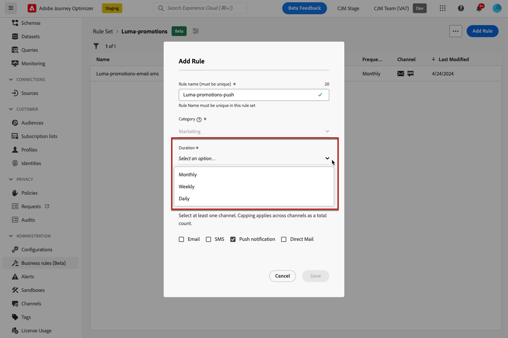

# Werken met regelsets {#rule-sets}

>[!CONTEXTUALHELP]
>id="ajo_business_rules_rule_sets"
>title="Regelsets"
>abstract="Regelsets gebruiken om frequentietoewijzing toe te passen op verschillende typen marketingcommunicatie. U kunt ook regelsets maken om ritten naar een deel van uw publiek uit te sluiten op basis van regels voor frequentiecontrole."

## Aan de slag met regelsets {#gs}

### Wat zijn regelsets? {#what}

Naast globale bedrijfsregels die het aantal tijden beperken ontvangen de gebruikers berichten over één of veelvoudige kanalen, staan de regelreeksen u toe om **samen veelvoudige regels in regelreeksen** te groeperen en hen op de campagnes van uw keus toe te passen. Dit verstrekt betere granulariteit om te controleren hoe vaak de gebruikers een bericht afhankelijk van het type van mededeling zullen ontvangen.

Bijvoorbeeld, kunt u een regel tot stand brengen die wordt geplaatst om het aantal **promotionele mededelingen** te beperken naar uw klanten en een andere die regel wordt verzonden om het aantal **nieuwsbrieven** te beperken naar hen wordt verzonden. Afhankelijk van het type campagne dat u creeert, kunt u dan verkiezen om of de promotionele mededeling of de nieuwsbrieven regelreeks toe te passen.

➡️ [Ontdek deze functie in video](#video)

### Machtigingen {#permissions-frequency-rules}

Om met bedrijfsregels te werken, hebt u de volgende toestemmingen nodig:

* **[!UICONTROL View Frequency Rules]**: Toegang tot en weergave van bedrijfsregels.
* **[!UICONTROL Manage Frequency Rules]**: Maak, bewerk of verwijder bedrijfsregels.

Leer meer over toestemmingen in [ deze sectie ](../administration/high-low-permissions.md).

### Algemene en aangepaste regelsets {#global-custom}

Wanneer de toegang tot van regelreeksen voor het eerst van **[!UICONTROL Administration]** > **[!UICONTROL Business rules]** menu, wordt een standaardregelreeks vooraf gecreeerd en actief: **Globale Reeks Standaard van de Regel**.

Deze regelreeks bevat globale regels die u kunt toepassen om te controleren hoe vaak de gebruikers berichten over één of veelvoudige kanalen ontvangen, gelijkend op hoe de huidige bedrijfsregels werken. Alle regels die in deze regel worden bepaald zijn op alle geselecteerde kanalen van toepassing, of de mededelingen van een reis of een campagne worden verzonden. [ Leer hoe te met bedrijfsregels te werken ](../conflict-prioritization/rule-sets.md)

Naast deze &quot;Globale Vastgestelde van de StandaardRegel&quot;regel, kunt u **reeksen van de douaneregel** tot stand brengen die u op om het even welke campagne kunt toepassen om het aantal berichten te beperken die binnen die campagne worden verzonden. [ Leer hoe te om de reeksen van de douaneregel tot stand te brengen ](#create)

### Regels voor aftopping van kanalen en reizen {#domain}

>[!CONTEXTUALHELP]
>id="ajo_rule_set_domain"
>title="Domein voor regelset"
>abstract="Wanneer het creëren van een regelreeks, moet u specificeren als de regels binnen de regelreeks het begrenzen regels zullen afdwingen die voor communicatiekanalen, of voor reizen specifiek zijn."

Wanneer het creëren van een regelreeks, moet u specificeren als de regels binnen de regelreeks het begrenzen regels zullen afdwingen die voor communicatiekanalen, of voor reizen specifiek zijn. Dit wordt gedaan door een Kanaal of domein van de Reis voor de regel te selecteren die wanneer het creëren van het wordt geplaatst. [ Leer hoe te om een regelreeks tot stand te brengen ](#create)

* **het domein van het Kanaal**: pas het begrenzen regels voor communicatiekanalen toe. Verzend bijvoorbeeld niet meer dan 1 e-mail- of sms-communicatie per dag.
* **Reis** domein: pas ingang en gelijktijdige het afschilderen regels op een reis toe. Voer bijvoorbeeld niet profielen in voor meer dan één reis tegelijk.

## Uw eerste aangepaste regelset maken {#create-rule-set}

### Maak de regelset en selecteer het domein ervan {#create}

Volg onderstaande stappen om een regelset te maken.

>[!NOTE]
>
>U kunt tot 10 actieve lokale regelreeksen voor elk kanaaldomein en voor het reisdomein tot stand brengen.

1. Open de lijst **[!UICONTROL Rules sets]** en klik vervolgens op **[!UICONTROL Create rule set]** .

   

1. Definieer een unieke naam voor de regelset en voeg een beschrijving toe.

1. Selecteer het domein van de regelset. Het domein staat u toe om te specificeren als de regelreeks het maximum regels zal bevatten die voor communicatiekanalen of voor reizen specifiek zijn. [ Leer meer over kanaal en reis die regels begrenzen ](#domain)

   

1. Klik op **[!UICONTROL Save]**.

1. Nu kunt u [ de regels ](#create-new-rule) bepalen u aan deze regelreeks wilt toevoegen.

### Regels toevoegen aan de regelset {#create-new-rule}

>[!CONTEXTUALHELP]
>id="ajo_rule_sets_category"
>title="Selecteer de categorie voor berichtregels"
>abstract="Wanneer deze optie wordt geactiveerd en toegepast op een bericht, worden alle frequentieregels die overeenkomen met de geselecteerde categorie automatisch toegepast op dit bericht. Momenteel is alleen de marketingcategorie beschikbaar."

<!--NOT USED?
[!CONTEXTUALHELP]
>id="ajo_rule_sets_capping"
>title="Set the capping for your rule"
>abstract="Specify the maximum number of messages sent to a customer profile within the chosen time frame. The frequency cap will be based on the selected calendar period and will be reset at the beginning of the corresponding time frame."-->

>[!CONTEXTUALHELP]
>id="ajo_rule_sets_channel"
>title="Bepaal de kanalen waarop de regel van toepassing is"
>abstract="Selecteer ten minste één kanaal. De bedekking wordt toegepast over kanalen als totale telling."

>[!CONTEXTUALHELP]
>id="ajo_rule_sets_duration"
>title="Selecteer de categorie voor berichtregels"
>abstract="Wanneer deze optie wordt geactiveerd en toegepast op een bericht, worden alle frequentieregels die overeenkomen met de geselecteerde categorie automatisch toegepast op dit bericht. Momenteel is alleen de marketingcategorie beschikbaar."

>[!CONTEXTUALHELP]
>id="ajo_rule_set_rule_capping"
>title="Regelbegrenzing"
>abstract="Plaats het maximum voor uw regel. Afhankelijk van het regelvastgestelde domein en de selectie op het gebied van het Type van Regel, kan dit gebied het maximumaantal berichten bepalen dat naar een profiel kan worden verzonden, of het maximumaantal reizen het profiel kan ingaan of worden ingeschreven gelijktijdig."

Als u een regel aan een regelset wilt toevoegen, opent u de regelset en klikt u op **[!UICONTROL Add rule]** .

De parameters beschikbaar voor de regel hangen van het regelvastgestelde domein af dat bij zijn verwezenlijking wordt geselecteerd.

+++vorm kanaal het in kaart brengen regels (**Kanaal** domein)

1. Definieer een unieke naam voor de regel.

1. Het **gebied van de Categorie** specificeert de categorie van bericht de regel op van toepassing is. Momenteel is dit veld alleen-lezen, aangezien alleen de categorie **[!UICONTROL Marketing]** beschikbaar is.

1. Selecteer in de vervolgkeuzelijst **[!UICONTROL Duration]** of u de uitlijning maandelijks, wekelijks of dagelijks wilt toepassen. De frequentiegrens is gebaseerd op de geselecteerde kalenderperiode. Deze wordt opnieuw ingesteld aan het begin van het corresponderende tijdkader.

   

   De teller loopt voor elke periode als volgt af:

   * **[!UICONTROL Monthly]**: Het frequentiekapitaal is geldig tot de laatste dag van de maand bij 23 :59: 59 UTC. Bijvoorbeeld, is de maandelijkse vervaldatum voor Januari 01-31 23 :59: 59 UTC.

   * **[!UICONTROL Weekly]**: Het frequentiekapitaal is geldig tot Zaterdag 23 :59: 59 UTC van die week aangezien de kalenderweek op zondag begint. De vervaldatum is van toepassing ongeacht wanneer de regel is gemaakt. Bijvoorbeeld, als de regel op Donderdag wordt gecreeerd, is deze regel geldig tot Zaterdag bij 23 :59: 59.

   * **[!UICONTROL Daily]**: Het dagelijkse frequentiekapitaal is geldig voor de dag tot 23 :59: 59 UTC en stelt aan 0 bij het begin van de volgende dag terug.

     >[!CAUTION]
     > 
     >Om ervoor te zorgen dat de regels voor dagelijkse frequentiecapping correct zijn, moet u de naamruimte met de hoogste prioriteit kiezen tijdens het ontwerpen van een campagne of een reis. Leer meer over namespace prioriteit in de [ gids van de Dienst van de Identiteit van het Platform ](https://experienceleague.adobe.com/nl/docs/experience-platform/identity/features/identity-graph-linking-rules/namespace-priority){target="_blank"}

   Houd er rekening mee dat de waarde van de profielteller wordt bijgewerkt wanneer de communicatie wordt geleverd. Begrijpt u dit wanneer u grote hoeveelheden communicatie verzendt aangezien de productie in de ontvanger zou kunnen resulteren die de e-mailnotulen of zelfs uren na de inleiding van de mededeling (in het geval dat u miljoenen mededelingen gelijktijdig verzendt) krijgen.

   Dit is van belang wanneer een ontvanger twee mededelingen dicht bij elkaar ontvangt. We stellen voor om communicatie met elkaar te scheiden met minstens twee uur, waar mogelijk, zodat de ontvanger voldoende tijd heeft om de communicatie te ontvangen en de tegenwaarde dienovereenkomstig bij te werken.

1. Stel de plafonnering voor uw regel in. Dit betekent het maximumaantal berichten dat naar een individueel gebruikersprofiel kan worden verzonden per maand, week of dag - volgens de bovenstaande selectie.

1. Selecteer het kanaal dat u voor deze regel wilt gebruiken: **[!UICONTROL Email]**, **[!UICONTROL SMS]**, **[!UICONTROL Push notification]** of **[!UICONTROL Direct mail]** .

   >[!NOTE]
   >
   >U moet ten minste één kanaal selecteren om de regel te kunnen maken.

1. Selecteer meerdere kanalen als u de afdekking op alle geselecteerde kanalen als een totaal aantal wilt toepassen.

   Stel de aftopping bijvoorbeeld in op 5 en selecteer zowel het e-mailadres als het sms-kanaal. Als een profiel al 3 marketingberichten en 2 marketingberichten voor de geselecteerde periode heeft ontvangen, wordt dit profiel uitgesloten van de eerstvolgende levering van een marketingbericht of -bericht.

+++

+++vorm de regels van het aftappen van de reis (**Reis** domein)

1. Geef de regel een unieke naam.

1. Geef in de vervolgkeuzelijst **[!UICONTROL Rule Type]** het type uitlijning voor de regel op.

   * **[!UICONTROL Journey Entry Cap]**: beperkt het aantal items dat gedurende een bepaalde periode voor een profiel wordt ingevoerd in de reis.
   * **[!UICONTROL Journey Concurrency Cap]**: hiermee wordt beperkt hoeveel ritten een profiel gelijktijdig kan worden ingeschreven.

1. De gedetailleerde informatie over hoe te om de regels van het aftappen van de reis te vormen is beschikbaar in de [ Aftappen van de Reis &amp; arbitrage ](../conflict-prioritization/journey-capping.md) sectie.

+++

1. Klik op **[!UICONTROL Save]** om het maken van de regel te bevestigen. Uw bericht wordt toegevoegd aan de regelset, met de status **[!UICONTROL Draft]** .

   

1. Herhaal bovenstaande stappen om zoveel regels toe te voegen als nodig zijn voor de regelset.

Nu moet u elke regel activeren alvorens het op om het even welke berichten kan worden toegepast. [Meer informatie](#activate-rule)

### De regels en regelset activeren {#activate-rule}

Wanneer een regel wordt gemaakt, heeft deze de status **[!UICONTROL Draft]** en heeft deze nog geen invloed op een bericht. Klik op de knop **[!UICONTROL More actions]** naast de regel en selecteer **[!UICONTROL Activate]** om deze in te schakelen.

U moet ook de regel activeren die is ingesteld om deze in campagnes/reizen te kunnen openen en toe te passen op uw berichten.

>[!NOTE]
>
>Het kan 10 minuten duren voordat een regel of regel volledig is geactiveerd. U hoeft geen berichten te wijzigen of ritten opnieuw te publiceren voordat een regel van kracht wordt.

<!--Currently, once a rule set is activated, no more rules can be added to that rule set.-->

Als u een regel of een regelset wilt deactiveren, klikt u op de knop **[!UICONTROL More actions]** naast het gewenste item en selecteert u **[!UICONTROL Deactivate]** .

De status verandert in **[!UICONTROL Inactive]** en de regel geldt niet voor toekomstige berichtuitvoeringen. Berichten die momenteel worden uitgevoerd, worden niet beïnvloed.

>[!NOTE]
>
>Het deactiveren van een regel of regelset heeft geen invloed op tellingen van afzonderlijke profielen en stelt deze niet opnieuw in.

## Regelsets openen en beheren {#access-rule-sets}

Alle gemaakte regelsets worden weergegeven in het menu **[!UICONTROL Administration]** > **[!UICONTROL Business rules]** . Ze worden gesorteerd op de laatste wijzigingsdatum.

Klik op de naam van een regelset om de inhoud ervan weer te geven en te bewerken. Alle regels inbegrepen in die regelreeks zijn vermeld. Met het contextmenu rechtsboven kunt u:

* De naam en beschrijving van de regelset bewerken
* Activeer de regelreeks - [ leer meer ](#activate-rule)
* De regelset verwijderen

Voor elke regel in de regelset kunt u met de knop **[!UICONTROL More actions]** het volgende doen:

* De regel bewerken
* Activeer de regel [ meer ](#activate-rule) leert
* De regel verwijderen

## Regelsets toepassen op een bericht of reis {#apply-frequency-rule}

U kunt een regel toepassen die op een bericht of een reis wordt geplaatst, afhankelijk van het geselecteerde domein wanneer het creëren van de regelreeks. Vouw de onderstaande secties uit voor meer informatie.

+++ Een regel toepassen die is ingesteld op een bericht

1. Wanneer het creëren van a [ campagne ](../campaigns/create-campaign.md), selecteer één van de kanalen u voor uw regelreeks en geef de inhoud van uw bericht uit.

1. Klik op de knop **[!UICONTROL Add Business Rule]** in het scherm voor de inhoudseditie.

1. Selecteer de [ regelreeks u ](#create-rule-set) creeerde.

   

   >[!NOTE]
   >
   >Slechts [ geactiveerde ](#activate-rule) regelreeksen tonen in de lijst.

   <!--Messages where the category selected is **[!UICONTROL Transactional]** will not be evaluated against business rules.-->

1. Voordat u uw campagne activeert, moet u ervoor zorgen dat de uitvoering ten minste 10 minuten in de toekomst in beslag wordt genomen.

   Dit staat voor voldoende tijd toe om de tellerwaarden op het profiel voor de bedrijfsregel te bevolken u selecteerde. Als u de campagne onmiddellijk activeert, zullen de de tellerwaarden van de regelreeks niet op de profielen van de ontvangers bevolken, en het bericht zal niet naar hun frequentie het begrenzen regels voor de reeksen van de douaneregel worden geteld.

   

1. U kunt het aantal profielen bekijken die van levering in het [ rapport van Customer Journey Analytics ](../reports/report-gs-cja.md) worden uitgesloten, en in het [ Levende rapport ](../reports/live-report.md), waar de frequentieregels als mogelijke reden voor gebruikers zullen worden vermeld die van levering worden uitgesloten.

>[!NOTE]
>
>Verschillende regels kunnen op hetzelfde kanaal van toepassing zijn, maar wanneer het onderste hoofdlettergebruik is bereikt, wordt het profiel uitgesloten van de volgende leveringen.

<!--
## Example: combine several rules {#frequency-rule-example}

You can combine several message frequency rules, such as described in the example below.

1. [Create a rule](#create-new-rule) called *Overall Marketing Capping*:

   * Select all channels.
   * Set capping to 12 monthly.

   

1. To further restrict the number of marketing-based push notifications that a user is sent, create a second rule called *Push Marketing Cap*:

   * Select Push channel.
   * Set capping to 4 monthly.

   

1. Save and [activate](#activate-rule) the rule.

1. [Create a message](../building-journeys/journeys-message.md) for every channel you want to communicate through and select the **[!UICONTROL Marketing]** category for each message. [Learn how to apply a frequency rule](#apply-frequency-rule)

   

In this scenario, an individual profile:
* can receive up to 12 marketing messages per month;
* but will be excluded from marketing push notifications after they have received 4 push notifications.-->

Wanneer het testen van frequentieregels, wordt het geadviseerd om een pas gecreeerd [ testprofiel ](../audience/creating-test-profiles.md) te gebruiken, omdat zodra de de frequentiedrempel van een profiel wordt bereikt, er geen manier is om de teller tot de volgende periode terug te stellen. Als u een regel deactiveert, kunnen beperkte profielen berichten ontvangen, maar worden er geen tellerverhogingen verwijderd of verwijderd.

+++

+++ Een regel toepassen die is ingesteld op een reis

Om een afluisterregel op een reis toe te passen, toegang tot de reis en open zijn eigenschappen. Selecteer in de vervolgkeuzelijst **[!UICONTROL Capping rules]** de desbetreffende regelset.

>[!IMPORTANT]
>
>Als een reis onmiddellijk wordt geactiveerd, kan het tot 10 minuten duren voordat het systeem begint met het onderdrukken van klanten. U kunt uw reis plannen om minstens 10 minuten in de toekomst te beginnen om deze mogelijkheid te verhinderen.

+++

## Hoe kan ik-video {#video}

>[!VIDEO](https://video.tv.adobe.com/v/3444732?quality=12&captions=dut)
