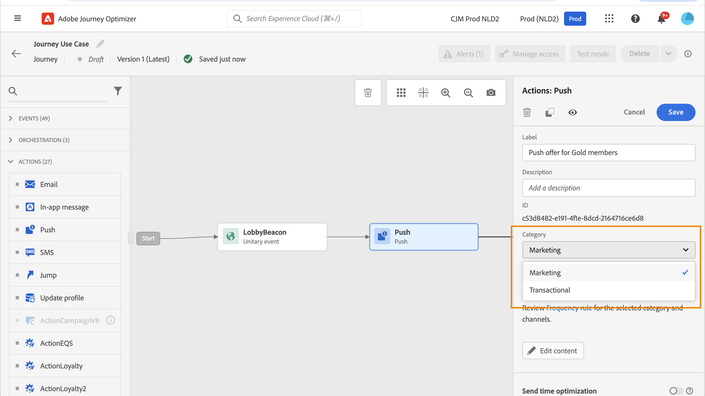

# Werken met regelsets {#rule-sets}

>[!CONTEXTUALHELP]
>id="ajo_business_rules_rule_sets"
>title="Regelsets"
>abstract="Regelsets gebruiken om frequentietoewijzing toe te passen op verschillende typen marketingcommunicatie. U kunt bijvoorbeeld een regelset maken om het aantal **promotionele communicatie** verzonden naar uw klanten, en creeer een andere die regel wordt geplaatst om het aantal te beperken **nieuwsbrieven** naar hen verzonden."

>[!AVAILABILITY]
>
>Regelsets zijn momenteel alleen beschikbaar als een bètaversie voor geselecteerde gebruikers. Neem contact op met uw Adobe die u wilt opnemen in de bètaversie.

## Wat zijn regelsets? {#what}

Naast globale bedrijfsregels die het aantal tijden beperken de gebruikers berichten over één of veelvoudige kanalen ontvangen, staan de regelreeksen u toe om **groeperen veelvoudige regels in regelreeksen** en past deze toe op de campagnes van uw keuze. Dit verstrekt betere granulariteit om te controleren hoe vaak de gebruikers een bericht afhankelijk van het type van mededeling zullen ontvangen.

U kunt bijvoorbeeld een regelset maken om het aantal **promotionele communicatie** verzonden naar uw klanten en een andere regel ingesteld om het aantal **nieuwsbrieven** naar hen verzonden. Afhankelijk van het type campagne dat u creeert, kunt u dan verkiezen om of de promotionele mededeling of de nieuwsbrieven regelreeks toe te passen.

## Algemene en aangepaste regelsets {#global-custom}

Wanneer het toegang tot van regelreeksen voor het eerst van **[!UICONTROL Administration]** > **[!UICONTROL Business rules (Beta)]** een standaardregelset wordt vooraf gemaakt en geactiveerd: **Algemene standaardregelset**.

Deze regelreeks bevat globale regels die u kunt toepassen om te controleren hoe vaak de gebruikers bericht over één of veelvoudige kanalen ontvangen, gelijkend op hoe de huidige bedrijfsregels werken. Alle regels die in deze regel worden bepaald zijn op alle geselecteerde kanalen van toepassing, of de mededelingen van een reis of een campagne worden verzonden. [Leer hoe u met bedrijfsregels werkt](frequency-rules.md)

Naast deze &quot;Globale Vastgestelde de regel van de Standaard van de Regel&quot;, kunt u tot stand brengen **aangepaste regel** sets die u kunt toepassen op elke campagne om het aantal berichten te beperken dat binnen die campagne wordt verzonden. [Leer hoe u aangepaste regelsets maakt](#create)

>[!IMPORTANT]
>
>Op dit moment kunnen aangepaste regelsets worden toegepast op **campagnes** alleen. Alleen de regels die zijn gedefinieerd in de regel Globale standaardregel die is ingesteld, gelden voor zowel de reis- als de campagnecommunicatie.

## Uw eerste aangepaste regelset maken {#create-rule-set}

### De regelset maken {#create}

Volg onderstaande stappen om een regelset te maken.

>[!NOTE]
>
>U kunt maximaal drie aangepaste regelsets maken.

1. Toegang krijgen tot de **[!UICONTROL Rules sets]** lijst en klik vervolgens op **[!UICONTROL Create rule set]**.

   

1. Bepaal de naam van de regelreeks, voeg indien gewenst een beschrijving toe en klik **[!UICONTROL Save]**.

   

   >[!NOTE]
   >
   >De naam van de regelset moet uniek zijn.

1. Nu kunt u [de regels](#create-new-rule) u wilt aan deze regelreeks toevoegen.

### Regels toevoegen aan de regelset {#create-new-rule}

>[!CONTEXTUALHELP]
>id="ajo_rule_sets_category"
>title="Selecteer de categorie voor berichtregels"
>abstract="Wanneer deze optie wordt geactiveerd en toegepast op een bericht, worden alle frequentieregels die overeenkomen met de geselecteerde categorie automatisch toegepast op dit bericht. Momenteel is alleen de marketingcategorie beschikbaar."

>[!CONTEXTUALHELP]
>id="ajo_rule_sets_capping"
>title="De uitlijning van uw regel instellen"
>abstract="Geef het maximumaantal berichten op dat binnen de gekozen tijdsperiode naar een klantprofiel wordt verzonden. De maximale frequentie wordt gebaseerd op de geselecteerde kalenderperiode en wordt opnieuw ingesteld aan het begin van het corresponderende tijdkader."

>[!CONTEXTUALHELP]
>id="ajo_rule_sets_channel"
>title="Bepaal de kanalen waarop de regel van toepassing is"
>abstract="Selecteer ten minste één kanaal. De bedekking wordt toegepast over kanalen als totale telling."

>[!CONTEXTUALHELP]
>id="ajo_rule_sets_duration"
>title="Selecteer de categorie voor berichtregels"
>abstract="Wanneer deze optie wordt geactiveerd en toegepast op een bericht, worden alle frequentieregels die overeenkomen met de geselecteerde categorie automatisch toegepast op dit bericht. Momenteel is alleen de marketingcategorie beschikbaar."

Volg onderstaande stappen om een regel aan een regelset toe te voegen.

1. Van de regelreeks u enkel creeerde, klik **[!UICONTROL Add rule]**.

   

1. Een uniek item definiëren **Naam van regel**.

1. De **Categorie** in het veld wordt de categorie van berichten aangegeven waarop de regel van toepassing is. Momenteel is dit veld alleen-lezen als het **[!UICONTROL Marketing]** -categorie is beschikbaar.

1. Van de **[!UICONTROL Duration]** vervolgkeuzelijst, selecteert u of u de plafonnering maandelijks, wekelijks of dagelijks wilt toepassen. De frequentiegrens is gebaseerd op de geselecteerde kalenderperiode. Deze wordt opnieuw ingesteld aan het begin van het corresponderende tijdkader.

   

   De teller loopt voor elke periode als volgt af:

   * **[!UICONTROL Monthly]** De frequentie-instelling is geldig tot de laatste dag van de maand op 23:59:59 UTC De maandelijkse vervaldatum voor januari is bijvoorbeeld 01-31 23:59:59 UTC

   * **[!UICONTROL Weekly]**: De frequentiekapitaal is geldig tot zaterdag 23:59:59 UTC van die week als de kalenderweek op zondag begint. De vervaldatum staat los van de instelling van de regel. Bijvoorbeeld, als de regel op Donderdag wordt gecreeerd, is deze regel geldig tot Zaterdag bij 23:59:59.

   * **[!UICONTROL Daily]** De dagelijkse frequentie dop is geldig tot 23:59:59 UTC en wordt opnieuw ingesteld op 0 aan het begin van de volgende dag.

     >[!CAUTION]
     >
     >Om ervoor te zorgen dat de dagelijkse regels voor frequentiecontrole correct zijn, moet het gebruik van [streamingsegmentatie](https://experienceleague.adobe.com/docs/experience-platform/segmentation/ui/streaming-segmentation.html){target="_blank"} is verplicht. Meer informatie over methoden voor publieksevaluatie vindt u in [deze sectie](../audience/about-audiences.md#evaluation-method-in-journey-optimizer).

   Houd er rekening mee dat de waarde van de profielteller wordt bijgewerkt wanneer de communicatie wordt geleverd. Begrijpt u dit wanneer u grote hoeveelheden communicatie verzendt aangezien de productie in de ontvanger zou kunnen resulteren die de e-mailnotulen of zelfs uren na de inleiding van de mededeling (in het geval dat u miljoenen mededelingen gelijktijdig verzendt) krijgen.

   Dit is van belang wanneer een ontvanger twee mededelingen dicht bij elkaar ontvangt. Wij stellen voor om de communicatie met elkaar te verdelen over minstens twee uur waar mogelijk om de ontvanger voldoende tijd te geven om de mededeling en de tellerwaarde te ontvangen om dienovereenkomstig bij te werken.

1. Stel de plafonnering voor uw regel in. Dit betekent het maximumaantal berichten dat naar een individueel gebruikersprofiel kan worden verzonden per maand, week of dag - volgens de bovenstaande selectie.

1. Selecteer het kanaal dat u voor deze regel wilt gebruiken: **[!UICONTROL Email]**, **[!UICONTROL SMS]**, **[!UICONTROL Push notification]** of **[!UICONTROL Direct mail]**.

   

   >[!NOTE]
   >
   >U moet ten minste één kanaal selecteren om de regel te kunnen maken.

1. Selecteer meerdere kanalen als u de afdekking op alle geselecteerde kanalen als een totaal aantal wilt toepassen.

   Stel de aftopping bijvoorbeeld in op 5 en selecteer zowel het e-mailadres als het sms-kanaal. Als een profiel al 3 marketingberichten en 2 marketingberichten voor de geselecteerde periode heeft ontvangen, wordt dit profiel uitgesloten van de eerstvolgende levering van een marketingbericht of -bericht.

1. Klikken **[!UICONTROL Save]** om de regel te bevestigen. Uw bericht wordt toegevoegd aan de regelreeks, met **[!UICONTROL Draft]** status.

   

1. Herhaal bovenstaande stappen om zoveel regels toe te voegen als nodig zijn voor de regelset.

Nu moet u elke regel activeren alvorens het op om het even welke berichten kan worden toegepast. [Meer informatie](#activate-rule)

### De regels en regelset activeren {#activate-rule}

Wanneer deze regel wordt gemaakt, heeft deze de **[!UICONTROL Draft]** status en heeft nog geen invloed op een bericht. Als u deze wilt inschakelen, klikt u op de knop **[!UICONTROL More actions]** naast de regel en selecteer **[!UICONTROL Activate]**.

U moet ook de regel activeren die is ingesteld om deze in campagnes/reizen te kunnen openen en toe te passen op uw berichten.

>[!NOTE]
>
>Het kan 10 minuten duren voordat een regel of regel volledig is geactiveerd. U hoeft geen berichten te wijzigen of ritten opnieuw te publiceren voordat een regel van kracht wordt.

<!--Currently, once a rule set is activated, no more rules can be added to that rule set.-->

Als u een regel of een regelset wilt deactiveren, klikt u op de knop **[!UICONTROL More actions]** naast het gewenste item en selecteer **[!UICONTROL Deactivate]**.

De status verandert in **[!UICONTROL Inactive]** en de regel zal niet op toekomstige berichtuitvoeringen van toepassing zijn. Berichten die momenteel worden uitgevoerd, worden niet beïnvloed.

>[!NOTE]
>
>Het deactiveren van een regel of regelset heeft geen invloed op tellingen van afzonderlijke profielen en stelt deze niet opnieuw in.

## Regelsets openen en beheren {#access-rule-sets}

Alle gemaakte regelsets worden weergegeven in het dialoogvenster **[!UICONTROL Administration]** > **[!UICONTROL Business rules (Beta)]** -menu. Ze worden gesorteerd op de laatste wijzigingsdatum.

Klik op de naam van een regelset om de inhoud ervan weer te geven en te bewerken. Alle regels inbegrepen in die regelreeks zijn vermeld. Met het contextmenu rechtsboven kunt u:

* De naam en beschrijving van de regelset bewerken
* De regelset activeren - [Meer informatie](#activate-rule)
* De regelset verwijderen

Voor elke regel in de regelset wordt de **[!UICONTROL More actions]** Met de knop kunt u:

* De regel bewerken
* De regel activeren [Meer informatie](#activate-rule)
* De regel verwijderen

<!--### Permissions{#permissions-frequency-rules}

To access, create, edit or delete message frequency rules, you must have the **[!UICONTROL Manage frequency rules]** permission. 

Users with the **[!UICONTROL View frequency rules]** permission are able to view rules, but not to modify or delete them.

Learn more about permissions in [this section](../administration/high-low-permissions.md).-->

## Een regel toepassen die is ingesteld op een bericht {#apply-frequency-rule}

Volg onderstaande stappen om een bedrijfsregel toe te passen op een bericht.

1. Wanneer u een [campagne](../campaigns/create-campaign.md)selecteert u een van de kanalen die u voor de regelset hebt gedefinieerd en bewerkt u de inhoud van het bericht.

1. Klik in het scherm voor de inhoudseditie op de knop **[!UICONTROL Add Business Rule]** knop.

1. Selecteer de [regelset gemaakt](#create-rule-set).

   

   >[!NOTE]
   >
   >Alleen [geactiveerd](#activate-rule) regelsets worden weergegeven in de lijst.

   <!--Messages where the category selected is **[!UICONTROL Transactional]** will not be evaluated against business rules.-->

1. Voordat u uw campagne activeert, moet u ervoor zorgen dat de uitvoering ten minste 10 minuten in de toekomst in beslag wordt genomen.

   Dit staat voor voldoende tijd toe om de tellerwaarden op het profiel voor de bedrijfsregel te bevolken u selecteerde. Als u de campagne onmiddellijk activeert, zullen de de tellerwaarden van de regelreeks niet op de profielen van de ontvangers bevolken, en het bericht zal niet naar hun frequentie het begrenzen regels voor de reeksen van de douaneregel worden geteld.

   

1. U kunt het aantal profielen dat is uitgesloten van levering bekijken in het dialoogvenster [Algemeen rapport](../reports/global-report.md)en in de [Live-rapport](../reports/live-report.md), waarbij de frequentievoorschriften worden vermeld als mogelijke reden voor gebruikers die van levering zijn uitgesloten.

>[!NOTE]
>
>Verschillende regels kunnen op hetzelfde kanaal van toepassing zijn, maar wanneer het onderste hoofdlettergebruik is bereikt, wordt het profiel uitgesloten van de volgende leveringen.

<!--
## Example: combine several rules {#frequency-rule-example}

You can combine several message frequency rules, such as described in the example below.

1. [Create a rule](#create-new-rule) called *Overall Marketing Capping*:

   * Select all channels.
   * Set capping to 12 monthly.

   

1. To further restrict the number of marketing-based push notifications that a user is sent, create a second rule called *Push Marketing Cap*:

   * Select Push channel.
   * Set capping to 4 monthly.

   

1. Save and [activate](#activate-rule) the rule.

1. [Create a message](../building-journeys/journeys-message.md) for every channel you want to communicate through and select the **[!UICONTROL Marketing]** category for each message. [Learn how to apply a frequency rule](#apply-frequency-rule)

   

In this scenario, an individual profile:
* can receive up to 12 marketing messages per month;
* but will be excluded from marketing push notifications after they have received 4 push notifications.-->

Bij het testen van de frequentieregels wordt aanbevolen een nieuw [testprofiel](../audience/creating-test-profiles.md)Omdat er geen manier is om de teller opnieuw in te stellen tot de volgende periode, wanneer de frequentiegrens van een profiel eenmaal is bereikt. Als u een regel deactiveert, kunnen beperkte profielen berichten ontvangen, maar worden er geen tellerverhogingen verwijderd of verwijderd.
