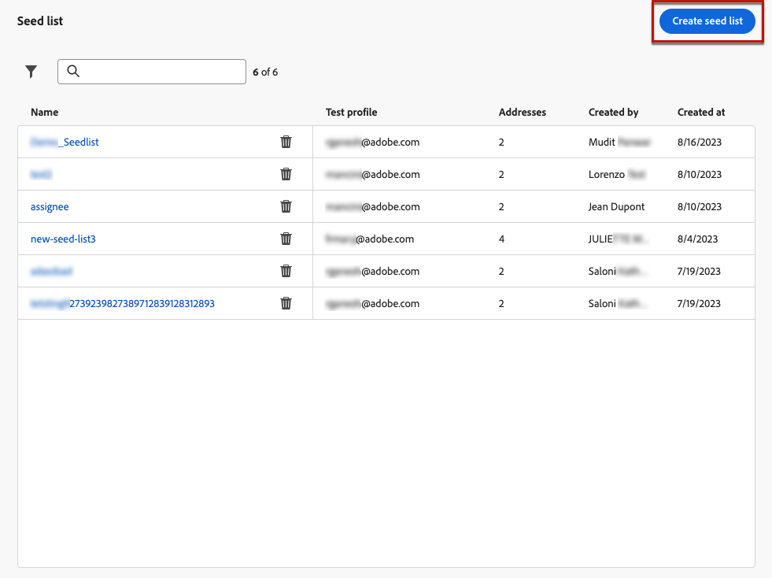

# zaadlijsten gebruiken {#seed-lists}

Zaadlijsten in [!DNL Journey Optimizer] kunt u toestaan om automatisch specifieke zaadadressen in uw leveringen te omvatten.

>[!CAUTION]
>
>Deze functie is momenteel alleen van toepassing op het e-mailkanaal.

Seed-adressen worden gebruikt om ontvangers die niet aan de gedefinieerde doelcriteria voldoen, doelgericht te benaderen. Op deze manier kunnen ontvangers die buiten het bereik van de levering vallen, de levering ontvangen, net als elke andere doelontvanger.

Zaadadressen zijn geen echte profielen en testprofielen, omdat deze geen profieldetails bevatten. Het zijn alleen ontvangers die behoren tot interne belanghebbenden die in het systeem zijn opgeslagen. Wanneer zij in een specifieke campagne of een specifieke reis worden geselecteerd, worden zij opgenomen op het tijdstip van uitvoering van de levering, wat betekent dat zij een kopie van de levering voor verzekeringsdoeleinden ontvangen.

* Door leveringen te ontvangen op hetzelfde moment en onder dezelfde voorwaarden als uw klanten, kunt u met zaadlijsten de e-mailkopieën controleren die worden verzonden om ervoor te zorgen dat alle weergaveformaten, afbeeldingen en koppelingen correct zijn. Bovendien kunt u de werkelijke berichten die aan uw ontvangers zijn verzonden, bijhouden.

  Bijvoorbeeld:

+++ Als u een marketingmanager bent:

  U wilt dat al uw teamleden tegelijkertijd met uw klanten kopieën van verzonden berichten ontvangen. Op deze manier kan uw team ervoor zorgen dat berichten worden verzonden met de verwachte lay-out, actieve URL&#39;s, correcte tekst en beelden - allen zoals gepland vóór uitvoering.

+++

+++ Als u eigenaar van het product bent:

  U moet het spoor van daadwerkelijke berichten houden die naar klanten worden verzonden. Uw team en de leiding zijn wellicht geïnteresseerd in bepaalde campagnes en moeten op ad-hocbasis worden toegevoegd om kopieën van de boodschap op het moment van levering te ontvangen.

+++

* Een andere reden voor het gebruik van zaadlijsten is de bescherming van uw mailinglijst. Door zaadadressen in te voegen in uw mailinglijst kunt u zien of het door een derde wordt gebruikt, aangezien de zaadadressen het bevat de leveringen ontvangen die naar uw mailinglijst worden verzonden.

## De zaadlijsten openen {#access-seed-lists}

Ga naar **[!UICONTROL Administration]** > **[!UICONTROL Channels]** > **[!UICONTROL Email configuration]** en selecteert u **[!UICONTROL Seed list]**.

<!--
>[!CAUTION]
>
>Permissions to view, export and manage the seed lists are restricted to [Journey Administrators](../administration/ootb-product-profiles.md#journey-administrator). Learn more on managing [!DNL Journey Optimizer] users' access rights in [this section](../administration/permissions-overview.md).-->

>[!CAUTION]
>
>Om zaadlijsten te kunnen bekijken, uitgeven en beheren, moet u hebben **[!UICONTROL Manage Seedlist]** toestemming.

U kunt zaadlijsten zoeken op naam en/of filteren op de gebruiker die de lijst heeft gemaakt of op de aanmaakdatum. Als deze optie is geselecteerd, kunt u het filter wissen dat boven op de lijst wordt weergegeven.

Gebruik de **[!UICONTROL Delete]** om een item permanent te verwijderen.

>[!CAUTION]
>
>Het is niet mogelijk een zaadlijst te verwijderen die in een actieve [campagne](../campaigns/review-activate-campaign.md) of [reis](../building-journeys/publishing-the-journey.md). U moet de campagne/reis deactiveren, of het uitgeven om een andere oppervlakte te gebruiken die niet de geselecteerde zaadlijst heeft. [Meer informatie over het gebruik van een lijst met zaden](#use-seed-list)

U kunt op de naam van een zaadlijst klikken om deze te bewerken. <!--Use the **[!UICONTROL Edit]** button to edit a seed list.-->

## Een zaadlijst maken {#create-seed-list}

>[!CONTEXTUALHELP]
>id="ajo_seed_list_details"
>title="Een zaadlijst definiëren"
>abstract="Gebruik een zaadlijst om specifieke interne adressen aan uw leveringspubliek voor verzekeringsdoeleinden automatisch toe te voegen. Met zaadlijsten kunt u de berichtkopieën controleren die worden verzonden om ervoor te zorgen dat alle weergave-elementen correct zijn en uw mailinglijst beveiligen. Deze functie is momenteel alleen van toepassing op het e-mailkanaal."
>additional-url="https://experienceleague.adobe.com/docs/journey-optimizer/using/configuration/seed-lists.html#use-seed-list" text="Wat zijn zaadlijsten?"

>[!CONTEXTUALHELP]
>id="ajo_seed_addresses"
>title="De zaadlijst invullen"
>abstract="Selecteer de adressen die op de leveringstijd zullen worden omvat en een nauwkeurige kopie van uw bericht zullen ontvangen. U kunt een CSV-bestand importeren of handmatig e-mailadressen invoeren."

Voer de onderstaande stappen uit om een zaadlijst te maken.

1. Toegang krijgen tot de **[!UICONTROL Administration]** > **[!UICONTROL Channels]** > **[!UICONTROL Email configuration]** > **[!UICONTROL Seed list]** -menu.

1. Selecteer de knop **[!UICONTROL Create seed list]**.

   

1. Vul de gegevens in. Begin door een naam toe te voegen.

   

   >[!NOTE]
   >
   >Namen moeten beginnen met een letter (A-Z) en alleen alfanumerieke tekens of speciale tekens ( _, ., -) bevatten.

1. Selecteer het kanaal. Momenteel is alleen het e-mailkanaal beschikbaar.

1. Selecteer een testprofiel. Omdat de zaadadressen geen profieldetails omvatten, zal dit testprofiel slechts worden gebruikt om de verpersoonlijkingsgegevens in het bericht te tonen dat naar de zaadadressen wordt verzonden.

   >[!NOTE]
   >
   >Er kan slechts één testprofiel tegelijk worden geselecteerd.

1. Voeg de zaadadressen toe u uw leveringen aan wilt verzenden. U kunt een CSV-bestand importeren of handmatig e-mailadressen invoeren.

   

   >[!NOTE]
   >
   >U kunt beide opties combineren, maar het totale aantal adressen in een zaadlijst mag niet groter zijn dan 50.

1. Klik op **[!UICONTROL Create]** om te bevestigen. De nieuwe zaadlijst wordt weergegeven in het dialoogvenster [Scherm zaadlijst](#access-seed-lists).

## Een zaadlijst gebruiken in een campagne of reis {#use-seed-list}

Nu uw zaadlijst wordt gecreeerd, kunt u het in om het even welke campagne of reis gebruiken om de overeenkomstige zaadadressen in uw leveringen te omvatten. Hiervoor voert u de volgende stappen uit.

>[!CAUTION]
>
>De berichten die naar zaadadressen worden verzonden zijn niet inbegrepen in rapporten.

1. Maak een oppervlak en selecteer de optie **[!UICONTROL Email]** kanaal. [Meer informatie](../email/email-settings.md)

1. Selecteer de zaadlijst van uw keus in [corresponderende sectie](../email/email-settings.md#seed-list).

   >[!NOTE]
   >
   >Er kan slechts één zaadlijst tegelijk worden geselecteerd.

   

1. Plaats het oppervlak.

1. Een [campagne](../campaigns/create-campaign.md) of [reis](../building-journeys/journey-gs.md).

1. Selecteer de **[!UICONTROL Email]** en selecteert u de [oppervlak](channel-surfaces.md) inclusief de zaadlijst die voor u relevant is.

   

1. Activeer uw [campagne](../campaigns/review-activate-campaign.md) of publiceer uw [reis](../building-journeys/publishing-the-journey.md).

Telkens wanneer een e-mailbericht naar uw klanten wordt verstuurd via die campagne of die reis, zullen de e-mailadressen op de geselecteerde zaadlijst het ook in de zelfde voorwaarden, tezelfdertijd en met de zelfde inhoud ontvangen zoals de beoogde ontvangers.

>[!NOTE]
>
>Voor reizen wordt de e-mailbezorging alleen op de eerste uitvoering van de reis naar het zaadadres verzonden.

