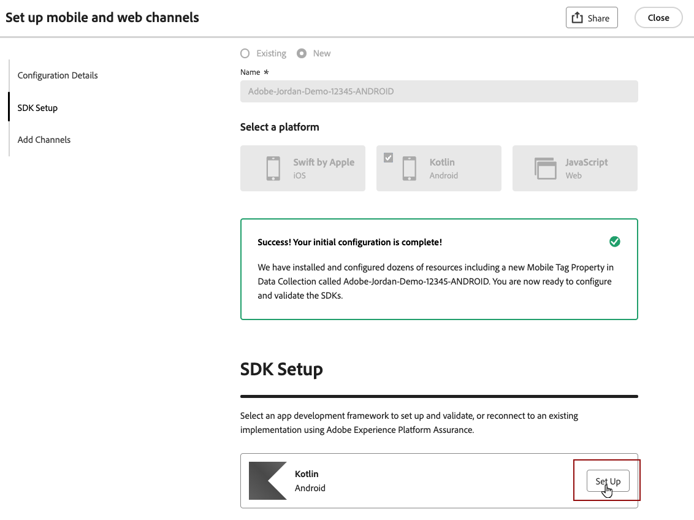
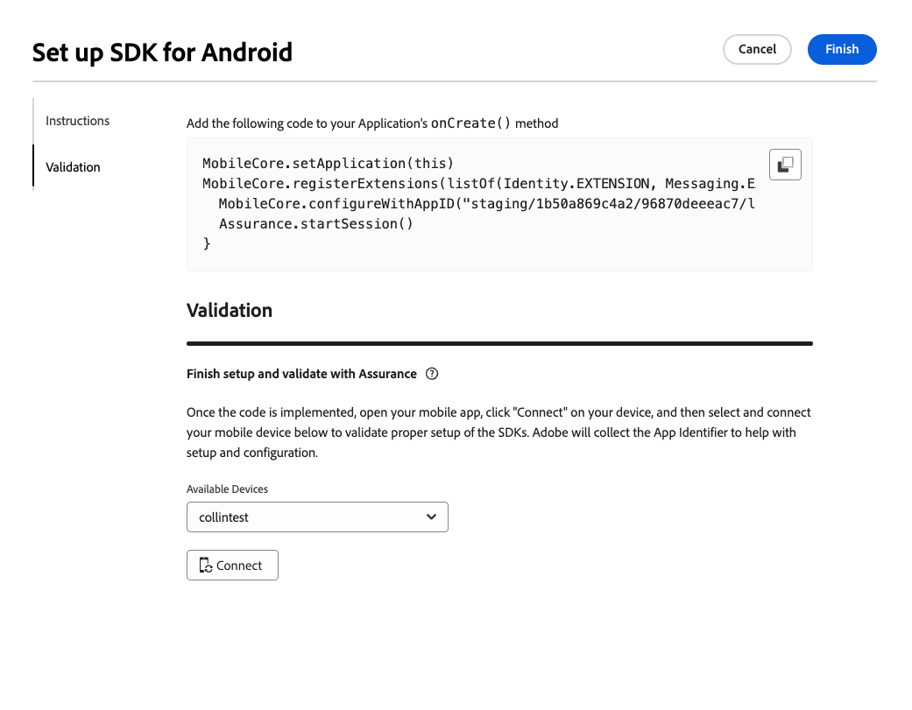

# Android mobiele configuratie instellen {#set-mobile-android}

>[!IMPORTANT]
>
>Voor compatibiliteit en optimale prestaties moet u de volgende SDK-versies gebruiken:
>
> * Core 3.1.0 of hoger
> * Berichten 3.1.0 of hoger

Deze Android-instelling stroomlijnt de snelle configuratie van marketingkanalen en zorgt ervoor dat alle benodigde bronnen gemakkelijk toegankelijk zijn in de Experience Platform-, Journey Optimizer- en Data Collection-apps. Hierdoor kan uw marketingteam direct beginnen met het maken van campagnes en reizen.

## Nieuwe Android-instelling maken {#new-setup-android}

>[!CONTEXTUALHELP]
>id="ajo_mobile_web_setup_android_initialization_code"
>title="Initialisatiecode toevoegen"
>abstract="TBC"

>[!CONTEXTUALHELP]
>id="ajo_mobile_web_setup_android_dependencies_add"
>title="Afhankelijkheden toevoegen"
>abstract="U moet de volgende bibliotheken aan uw project toevoegen met behulp van het Gradle-bestand van de app: Core, Assurance, Edge, Edge Identity en Messaging."

>[!CONTEXTUALHELP]
>id="ajo_mobile_web_setup_android_dependencies_import"
>title="Afhankelijkheden importeren"
>abstract="Importeer in de toepassingsklasse van uw app de volgende pakketten: Mobile Core, Assurance, Edge, Edge Identity en Messaging."
>additional-url="https://experienceleague.adobe.com/en/docs/platform-learn/implement-mobile-sdk/app-implementation/install-sdks#import-extensions" text="Zie Documentatie voor gegevensverzameling"

<!--
>[!CONTEXTUALHELP]
>id="ajo_mobile_web_setup_push_token_android"
>title="Retrieve the device token"
>abstract="TBC"

>[!CONTEXTUALHELP]
>id="ajo_mobile_web_setup_push_android_studio"
>title="Launch the application from Android Studio"
>abstract="TBC"
-->

1. Klik op de **[!UICONTROL Set up mobile and web channels]** -kaart op de Journey Optimizer-startpagina **[!UICONTROL Begin]** .

   

1. Maak een **[!UICONTROL New]** -configuratie.

   Als u reeds bestaande configuraties hebt, kunt u verkiezen om één te selecteren, of een nieuwe configuratie tot stand te brengen.

   

1. Voer een **[!UICONTROL Name]** in voor de nieuwe configuratie en selecteer of maak de **[!UICONTROL Datastream]** . Deze **[!UICONTROL Name]** wordt gebruikt voor elke automatisch gemaakte bron.

1. Als uw organisatie meerdere gegevensstromen heeft, selecteert u een van de bestaande opties. Als u geen DataStream hebt, zal automatisch worden gecreeerd voor u.

1. Selecteer het Android-platform dat u wilt instellen en klik op **[!UICONTROL Auto-create resources]** .

   

1. Om het installatieproces te stroomlijnen, worden de noodzakelijke middelen automatisch gecreeerd om u te helpen begonnen worden. Dit omvat het maken van een nieuwe **[!UICONTROL Mobile Tag Property]** en het installeren van extensies.

   Hieronder vindt u een uitgebreide lijst met alle bronnen die automatisch worden gegenereerd:

+++ Gemaakte bronnen

   <table>
    <thead>
    <tr>
    <th><strong>Oplossing</strong></th>
    <th><strong>Automatisch gemaakte bronnen</strong></th>
    </tr>
    </thead>
    <tbody>
    <tr>
    <td>
    
Journey Optimizer

    </td>
    <td>
    <ul>
    <li>Kanaalconfiguratie</li>
    <li>Push Credential (alleen mobiel pushbericht)</li>
    </ul>
    </td>
    </tr>
    <tr>
    <td>
    
Tags

    </td>
    <td>
    <ul>
    <li>Eigenschap van mobiele tag</li>
    <li>Regels</li>
    <li>Gegevenselementen</li>
    <li>Bibliotheek</li>
    <li>Milieu (staging, productie, ontwikkeling)</li>
    </ul>
    </td>
    </tr>
    <tr>
    <td>
    
Labelextensies

    </td>
    <td>
    <ul>
    <li>Adobe Experience Platform Edge Network</li>
    <li>Adobe Journey Optimizer</li>
    <li>AEP-betrouwbaarheid</li>
    <li>Toestemming (met standaard ingeschakeld toestemmingsbeleid)</li>
    <li>Identiteit (met standaard ECID, met standaard stitching-regels)</li>
    <li>Mobiele kern</li>
    </ul>
    </td>
    </tr>
    <tr>
    <td>
    
Betrouwbaarheid

    </td>
    <td>
    
Verzekeringssessie

    </td>
    </tr>
    <tr>
    <td>
    
Gegevensstromen

    </td>
    <td>
    
DataStream met services

    </td>
    </tr>
    <tr>
    <td>
    
Experience Platform

    </td>
    <td>
    <ul>
    <li>Gegevensset</li>
    <li>Schema</li>
    </ul>
    </td>
    </tr>
    </tbody>
    </table>

+++

1. Nadat de bronnen zijn gegenereerd, klikt u op **[!UICONTROL Set up]** om de SDK te configureren.

   

1. U moet eerst gebiedsdelen toevoegen en invoeren zoals die in het gebruikersinterface worden beschreven. [Meer informatie](https://experienceleague.adobe.com/en/docs/platform-learn/implement-mobile-sdk/app-implementation/install-sdks).

1. Kopieer en plak de volgende code naar de onCreate()-methode van uw toepassing.

1. Om uw SDK direct op uw mobiele toepassing te bevestigen, open eenvoudig uw mobiele toepassing en sta toegang tot [ Verzekering van de Adobe ](https://experienceleague.adobe.com/en/docs/experience-platform/assurance/home) toe. De verzekering is een krachtig hulpmiddel dat u toestaat om uw implementatie grondig te testen en te bevestigen, ervoor zorgen dat alles correct werkt.

   Nadat het apparaat is aangesloten, wordt het automatisch gedetecteerd en weergegeven in het vervolgkeuzemenu **[!UICONTROL Available Device]** , zodat u de installatie probleemloos kunt controleren en oplossen in real-time.

   

1. Klik op **[!UICONTROL Connect]**.

1. U kunt uw [ in-app ](#inapp-channel) en/of [ Push ](#push-channel) kanalen nu vormen.

1. Nadat u de configuratie hebt voltooid, deelt u de automatisch gegenereerde **[!UICONTROL Channel Configuration]** met de teamleden die verantwoordelijk zijn voor het maken van reizen en campagnes.

   Naar **[!UICONTROL Channel Configuration]** moet worden verwezen in de interface Campaigns or Journey, zodat een naadloze verbinding tussen uw instelling en het uitvoeren van gerichte reizen en campagnes voor uw publiek mogelijk is.

   

## Een bestaande configuratie wijzigen {#reconnect}

Nadat u de configuratie hebt gemaakt, kunt u deze op elk gewenst moment eenvoudig opnieuw bekijken om extra kanalen toe te voegen of verdere aanpassingen aan te brengen die aan uw behoeften voldoen

1. Klik op de **[!UICONTROL Set up mobile and web channels]** -kaart op de Journey Optimizer-startpagina **[!UICONTROL Begin]** .

   

1. Selecteer **[!UICONTROL Existing]** en kies de bestaande **[!UICONTROL Tag property]** in de vervolgkeuzelijst.

   

1. Wanneer het toegang tot van uw bestaande configuratie, moet u met de Verzekering van de Adobe opnieuw verbinden. Klik in het menu SDK-instelling op **[!UICONTROL Reconnect]** .

1. Selecteer het apparaat in de vervolgkeuzelijst **[!UICONTROL Available devices]** en klik op **[!UICONTROL Connect]** .

1. U kunt uw configuratie nu naar wens bijwerken.

## In-app-kanaal instellen {#inapp-channel}

>[!CONTEXTUALHELP]
>id="ajo_mobile_web_setup_inapp_tag_property"
>title="De eigenschap tag kiezen"
>abstract="TBC"

Voor het kanaal in de app is geen extra installatie vereist. Om te verifiëren dat uw configuratie nauwkeurig is, kunt u gemakkelijk een testbericht verzenden gebruikend de eigenschap van de Verzekering. Hierdoor wordt direct feedback gegeven over de bereidheid van het systeem om effectief in-app berichten te leveren.

Klik hiertoe gewoon op **[!UICONTROL Display In-app message]** .

Om het installatieproces te stroomlijnen, worden de noodzakelijke middelen automatisch gecreeerd om u te helpen begonnen worden. Dit omvat het creëren van een Configuratie van het Kanaal.

U kunt nu in-app berichten verzenden met de eerder geconfigureerde **[!UICONTROL Channel Configuration]** . [ Leer hoe te om binnen-app berichten tot stand te brengen ](../in-app/create-in-app.md)

## Push-kanaal instellen {#push-channel}

>[!CONTEXTUALHELP]
>id="ajo_mobile_web_setup_push_token"
>title="De apparaattoken ophalen"
>abstract="Om ervoor te zorgen dat het pushtoken van het apparaat correct wordt gesynchroniseerd met uw Adobe Experience Platform-profiel, moet u de volgende code in uw toepassing opnemen. Deze integratie is van essentieel belang voor het onderhouden van up-to-date communicatiemogelijkheden en het garanderen van een naadloze gebruikerservaring."

>[!CONTEXTUALHELP]
>id="ajo_mobile_web_setup_push_xcode"
>title="De toepassing starten vanuit Xcode"
>abstract="TBC"

>[!CONTEXTUALHELP]
>id="ajo_mobile_web_push_certificate_fcm"
>title="Een pushcertificaat opgeven"
>abstract="Sleep het .json-bestand met de persoonlijke sleutel en zet het neer. Dit bestand bevat verificatiegegevens die vereist zijn voor een veilige integratie en communicatie tussen uw toepassing en de server."

1. Zodra uw mobiele SDK is geconfigureerd, klikt u op **[!UICONTROL Add]** van de pushmeldingkaart.

1. Haal het teken van het Apparaat terug door de verstrekte code binnen de `FireBaseMessaging.getInstance.getToken ()` callback functie in het gebruikersinterface op te nemen.

1. Registreer de Berichtendienst door de verstrekte code in het gebruikersinterface aan uw `AndroidManifest.xml` dossier toe te voegen.

1. Sleep het .json-bestand met de persoonlijke sleutel en zet het neer.

1. Om te verifiëren dat uw configuratie nauwkeurig is, kunt u gemakkelijk een testbericht verzenden gebruikend de eigenschap van de Verzekering. Dit zal directe feedback geven over de bereidheid van het systeem om pushberichten effectief te leveren.

   Klik hiertoe gewoon op **[!UICONTROL Send push message]** .

Om het installatieproces te stroomlijnen, worden de noodzakelijke middelen automatisch gecreeerd om u te helpen begonnen worden. Dit omvat het maken van een **[!UICONTROL Channel Configuration]** en **[!UICONTROL Push Credential]** .

U kunt nu pushmeldingen verzenden met behulp van de eerder geconfigureerde **[!UICONTROL Channel Configuration]** . [ Leer hoe te om duw bericht ](../push/create-push.md) tot stand te brengen
