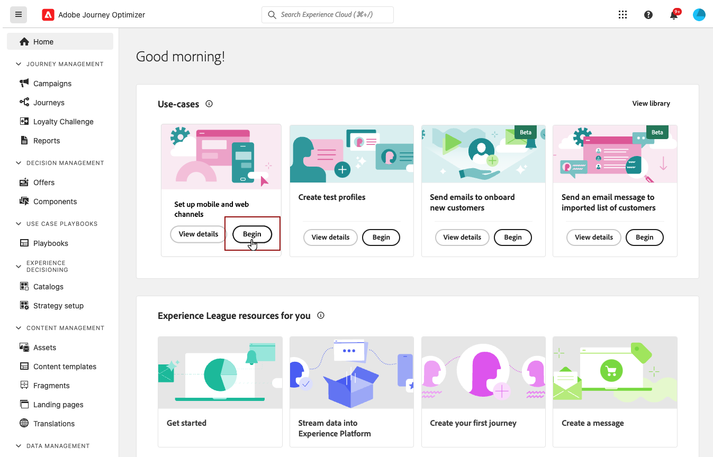

# IOS mobiele configuratie instellen {#set-mobile-ios}

>[!IMPORTANT]
>
>Voor compatibiliteit en optimale prestaties moet u de volgende SDK-versies gebruiken:
>
> * Core SDK: 5.2.0 of hoger
> * Berichten-SDK: 5.1.1 of hoger

Deze iOS-instelling vereenvoudigt de snelle configuratie van marketingkanalen, zodat alle essentiële bronnen gemakkelijk beschikbaar zijn in de Experience Platform-, Journey Optimizer- en Data Collection-apps. Hierdoor kan uw marketingteam snel beginnen met het maken van campagnes en reizen.

## Nieuwe iOS-instelling maken {#new-setup-ios}

>[!CONTEXTUALHELP]
>id="ajo_mobile_web_setup_swift_dependencies_add"
>title="Afhankelijkheden toevoegen"
>abstract="Voeg in Xcode het pakket Verzekering toe voor het inspecteren, controleren, simuleren en valideren van gegevensverzameling en ervaringen in uw app. Voeg ook AEP-berichten toe om pushberichttokens te verzenden en klik-via feedback naar Adobe Experience Platform."
>additional-url="https://experienceleague.adobe.com/en/docs/platform-learn/implement-mobile-sdk/app-implementation/install-sdks#swift-package-manager" text="Zie Documentatie voor gegevensverzameling"

>[!CONTEXTUALHELP]
>id="ajo_mobile_web_setup_swift_initialization_code"
>title="Initialisatiecode toevoegen"
>abstract="TBC"

>[!CONTEXTUALHELP]
>id="ajo_mobile_web_setup_swift_dependencies_import"
>title="Afhankelijkheden importeren"
>abstract="In de klasse van AppDelegate van uw toepassing ****, voer de volgende gebiedsdelen in: AEPCore, AEPAssurance, AEPEdge, AEPEdgeIdentity, en AEPMessaging."
>additional-url="https://experienceleague.adobe.com/en/docs/platform-learn/implement-mobile-sdk/app-implementation/install-sdks#import-extensions" text="Zie Documentatie voor gegevensverzameling"

1. Klik op de **[!UICONTROL Set up mobile and web channels]** -kaart op de Journey Optimizer-startpagina **[!UICONTROL Begin]** .

   

1. Maak een **[!UICONTROL New]** -configuratie.

   Als u reeds bestaande configuraties hebt, kunt u verkiezen om één te selecteren, of een nieuwe configuratie tot stand te brengen.

   

1. Voer een **[!UICONTROL Name]** in voor de nieuwe configuratie en selecteer of maak de **[!UICONTROL Datastream]** . Deze **[!UICONTROL Name]** wordt gebruikt voor elke automatisch gemaakte bron.

1. Als uw organisatie meerdere gegevensstromen heeft, selecteert u een van de bestaande opties. Als u geen DataStream hebt, zal automatisch worden gecreeerd voor u.

1. Selecteer het iOS-platform en klik op **[!UICONTROL Auto-create resources]** .

   

1. Om het installatieproces te stroomlijnen, worden de noodzakelijke middelen automatisch gecreeerd om u te helpen begonnen worden. Dit omvat het maken van een nieuwe **[!UICONTROL Mobile Tag Property]** en het installeren van extensies.

   Hieronder vindt u een uitgebreide lijst met alle bronnen die automatisch worden gegenereerd:

+++ Gemaakte bronnen

   <table>
    <thead>
    <tr>
    <th><strong>Oplossing</strong></th>
    <th><strong>Automatisch gemaakte bronnen</strong></th>
    </tr>
    </thead>
    <tbody>
    <tr>
    <td>
    <p>Journey Optimizer</p>
    </td>
    <td>
    <ul>
    <li>Kanaalconfiguratie</li>
    <li>Push Credential (alleen mobiel pushbericht)</li>
    </ul>
    </td>
    </tr>
    <tr>
    <td>
    <p>Tags</p>
    </td>
    <td>
    <ul>
    <li>Eigenschap van mobiele tag</li>
    <li>Regels</li>
    <li>Gegevenselementen</li>
    <li>Bibliotheek</li>
    <li>Milieu (staging, productie, ontwikkeling)</li>
    </ul>
    </td>
    </tr>
    <tr>
    <td>
    <p>Labelextensies</p>
    </td>
    <td>
    <ul>
    <li>Adobe Experience Platform Edge Network</li>
    <li>Adobe Journey Optimizer</li>
    <li>AEP-betrouwbaarheid</li>
    <li>Toestemming (met standaard ingeschakeld toestemmingsbeleid)</li>
    <li>Identiteit (met standaard ECID, met standaard stitching-regels)</li>
    <li>Mobiele kern</li>
    </ul>
    </td>
    </tr>
    <tr>
    <td>
    <p>Betrouwbaarheid</p>
    </td>
    <td>
    <p>Verzekeringssessie</p>
    </td>
    </tr>
    <tr>
    <td>
    <p>Gegevensstromen</p>
    </td>
    <td>
    <p>DataStream met services</p>
    </td>
    </tr>
    <tr>
    <td>
    <p>Experience Platform</p>
    </td>
    <td>
    <ul>
    <li>Gegevensset</li>
    <li>Schema</li>
    </ul>
    </td>
    </tr>
    </tbody>
    </table>

+++

1. Nadat de bronnen zijn gegenereerd, klikt u op **[!UICONTROL Set up]** om de SDK te configureren.

   

1. U moet eerst gebiedsdelen toevoegen en invoeren zoals die in het gebruikersinterface worden beschreven. [Meer informatie](https://experienceleague.adobe.com/en/docs/platform-learn/implement-mobile-sdk/app-implementation/install-sdks).

1. Voeg de initialisatiecode in de methode `onCreate()` van uw toepassing in. Met deze testcode kunt u verbinding maken met Betrouwbaarheid en de configuratie van uw app valideren voordat u naar de productie gaat.

   {zoomable="yes"}

1. Om uw SDK direct op uw mobiele toepassing te bevestigen, open eenvoudig uw mobiele toepassing en sta toegang tot [ Verzekering van de Adobe ](https://experienceleague.adobe.com/en/docs/experience-platform/assurance/home) toe. De verzekering is een krachtig hulpmiddel dat u toestaat om uw implementatie grondig te testen en te bevestigen, ervoor zorgen dat alles correct werkt.

   Nadat het apparaat is aangesloten, wordt het automatisch gedetecteerd en weergegeven in het vervolgkeuzemenu **[!UICONTROL Available Device]** , zodat u de installatie probleemloos kunt controleren en oplossen in real-time.

   {zoomable="yes"}

1. Klik op **[!UICONTROL Connect]**.

   {zoomable="yes"}

1. U kunt uw [ in-app ](#inapp-channel) en/of [ Push ](#push-channel) kanalen nu vormen.

1. Nadat u de configuratie hebt voltooid, deelt u de automatisch gegenereerde **[!UICONTROL Channel Configuration]** met de teamleden die verantwoordelijk zijn voor het maken van reizen en campagnes.

   Naar **[!UICONTROL Channel Configuration]** moet worden verwezen in de interface Campaigns or Journey, zodat een naadloze verbinding tussen uw instelling en het uitvoeren van gerichte reizen en campagnes voor uw publiek mogelijk is.

   {zoomable="yes"}

## Een bestaande configuratie wijzigen {#reconnect}

Nadat u de configuratie hebt gemaakt, kunt u deze op elk gewenst moment eenvoudig opnieuw bekijken om extra kanalen toe te voegen of verdere aanpassingen aan te brengen die aan uw behoeften voldoen

1. Klik op de **[!UICONTROL Set up mobile and web channels]** -kaart op de Journey Optimizer-startpagina **[!UICONTROL Begin]** .

   

1. Selecteer **[!UICONTROL Existing]** en kies de bestaande **[!UICONTROL Tag property]** in de vervolgkeuzelijst.

   

1. Wanneer het toegang tot van uw bestaande configuratie, moet u met de Verzekering van de Adobe opnieuw verbinden. Klik in het menu SDK-instelling op **[!UICONTROL Reconnect]** .

   

1. Selecteer het apparaat in de vervolgkeuzelijst **[!UICONTROL Available devices]** en klik op **[!UICONTROL Connect]** .

   {zoomable="yes"}

1. U kunt uw configuratie nu naar wens bijwerken.

## In-app-kanaal instellen {#inapp-channel}

Voor het kanaal in de app is geen extra installatie vereist. Om te verifiëren dat uw configuratie nauwkeurig is, kunt u gemakkelijk een testbericht verzenden gebruikend de eigenschap van de Verzekering. Hierdoor wordt direct feedback gegeven over de bereidheid van het systeem om effectief in-app berichten te leveren.

Klik hiertoe gewoon op **[!UICONTROL Display In-app message]** .

{zoomable="yes"}

Om het installatieproces te stroomlijnen, worden de noodzakelijke middelen automatisch gecreeerd om u te helpen begonnen worden. Dit omvat het creëren van een Configuratie van het Kanaal.

U kunt nu in-app berichten verzenden met de eerder geconfigureerde **[!UICONTROL Channel Configuration]** . [ Leer hoe te om binnen-app berichten tot stand te brengen ](../in-app/create-in-app.md)

## Push-kanaal instellen {#push-channel}

>[!CONTEXTUALHELP]
>id="ajo_mobile_web_setup_push_certificate"
>title="Een pushcertificaat opgeven"
>abstract="Het .p8-sleutelbestand bevat een persoonlijke sleutel die wordt gebruikt om uw app te verifiëren bij Apple-servers voor beveiligde pushberichten. U kunt deze sleutel van de pagina Certificates, Identifiers, en Profielen in uw ontwikkelaarsaccount verkrijgen."

>[!CONTEXTUALHELP]
>id="ajo_mobile_web_setup_push_key_id"
>title="Sleutel-id"
>abstract="Sleutelidentiteitskaart, een 10 karakterkoord dat tijdens de verwezenlijking van p8 authentificatiesleutel wordt toegewezen, kan onder het **lusje van Sleutels** op de Certificaten, de Herkenningstekens, en de pagina van Profielen in uw ontwikkelaarrekening worden gevonden."

>[!CONTEXTUALHELP]
>id="ajo_mobile_web_setup_push_team_id"
>title="Team-id"
>abstract="Identiteitskaart van het Team, een koordwaarde wordt gebruikt om uw team te identificeren, kan onder het **Lidmaatschap** lusje in uw ontwikkelaarsrekening worden gevestigd die."

1. Zodra uw mobiele SDK is geconfigureerd, klikt u op **[!UICONTROL Add]** van de pushmeldingkaart.

1. Voeg eerst binnen de methode `didRegisterForRemoteNotificationsWithDeviceToken` van uw `AppDelegate` de volgende code toe om het pushtoken van het apparaat te synchroniseren met het Adobe Experience Platform-profiel.

   ```
   MobileCore.setPushIdentifier(deviceToken)
   ```

1. Sleep het .p8 Apple Push Notification Authentication Key-bestand naar het bestand. Deze sleutel kan van de pagina van Certificaten, Herkenningstekens en Profielen worden verkregen.

1. Geef de volgende informatie op:

   * Sleutel-id: een tekenreeks van 10 tekens die is toegewezen tijdens het maken van de p8-auttoets. Deze vindt u onder het tabblad Toetsen op de pagina Certificaten, id&#39;s en profielen.

   * Team-id: een tekenreekswaarde die u vindt op het tabblad Lidmaatschap.

   {zoomable="yes"}

1. Om te verifiëren dat uw configuratie nauwkeurig is, kunt u gemakkelijk een testbericht verzenden gebruikend de eigenschap van de Verzekering. Dit zal directe feedback geven over de bereidheid van het systeem om pushberichten effectief te leveren.

   Klik hiertoe gewoon op **[!UICONTROL Send push message]** .

   {zoomable="yes"}

Om het installatieproces te stroomlijnen, worden de noodzakelijke middelen automatisch gecreeerd om u te helpen begonnen worden. Dit omvat het maken van een **[!UICONTROL Channel Configuration]** en **[!UICONTROL Push Credential]** .

U kunt nu pushmeldingen verzenden met behulp van de eerder geconfigureerde **[!UICONTROL Channel Configuration]** . [ Leer hoe te om duw bericht ](../push/create-push.md) tot stand te brengen
