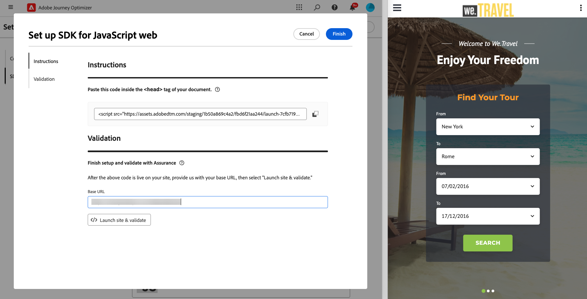

# Webconfiguratie instellen {#set-mobile-web}

>[!CONTEXTUALHELP]
>id="ajo_mobile_web_setup_javascript_code"
>title="Javascript-code"
>abstract="De <head><meta http-equiv="Content-Type" content="text/html; charset=UTF-16"> -tag bevat essentiële metagegevens en bronnen die vóór de hoofdinhoud van uw webpagina worden geladen. Door code in deze sectie te plaatsen, zorgt u ervoor dat deze op de juiste manier vroeg wordt geïnitialiseerd en uitgevoerd, zodat uw webpagina efficiënt kan worden geladen en uitgevoerd. Door code toe te voegen aan <head><meta http-equiv="Content-Type" content="text/html; charset=UTF-16"> kunt u de structuur, de prestaties en de algehele gebruikerservaring van uw site verbeteren."

Deze instelling vergemakkelijkt de snelle configuratie van marketingkanalen, waarbij alle vereiste middelen binnen Experience Platform, Journey Optimizer en gegevensverzameling gemakkelijk beschikbaar zijn. Hierdoor kan uw marketingteam direct beginnen met campagne en het creëren van reizen.

## Een nieuwe webinstelling maken {#new-setup}

1. Klik op de **[!UICONTROL Set up mobile and web channels]** -kaart op de Journey Optimizer-startpagina **[!UICONTROL Begin]** .

   

1. Maak een **[!UICONTROL New]** -configuratie.

   Als u reeds bestaande configuraties hebt, kunt u verkiezen om één te selecteren, of een nieuwe configuratie tot stand te brengen.

   

1. Voer een **[!UICONTROL Name]** in voor de nieuwe configuratie en selecteer of maak de **[!UICONTROL Datastream]** . Deze **[!UICONTROL Name]** wordt gebruikt voor elke automatisch gemaakte bron.

1. Als uw organisatie meerdere gegevensstromen heeft, selecteert u een van de bestaande opties. Als u geen DataStream hebt, zal automatisch worden gecreeerd voor u.

1. Selecteer het webplatform en klik op **[!UICONTROL Auto-create resources]** .

   

1. Om het installatieproces te stroomlijnen, worden de noodzakelijke middelen automatisch gecreeerd om u te helpen begonnen worden.

   Hieronder vindt u een uitgebreide lijst met alle bronnen die automatisch worden gegenereerd:

+++ Gemaakte bronnen

   <table>
    <thead>
    <tr>
    <th><strong>Oplossing</strong></th>
    <th><strong>Automatisch gemaakte bronnen</strong></th>
    </tr>
    </thead>
    <tbody>
    <tr>
    </tr>
    <tr>
    <td>
    
Tags

    </td>
    <td>
    <ul>
    <li>Eigenschap van mobiele tag</li>
    <li>Regels</li>
    <li>Gegevenselementen</li>
    <li>Bibliotheek</li>
    <li>Milieu (staging, productie, ontwikkeling)</li>
    </ul>
    </td>
    </tr>
    <tr>
    <td>
    
Labelextensies

    </td>
    <td>
    <ul>
    <li>Adobe Experience Platform Edge Network</li>
    <li>Adobe Journey Optimizer</li>
    <li>AEP-betrouwbaarheid</li>
    <li>Toestemming (met standaard ingeschakeld toestemmingsbeleid)</li>
    <li>Identiteit (met standaard ECID, met standaard stitching-regels)</li>
    <li>Mobiele kern</li>
    </ul>
    </td>
    </tr>
    <tr>
    <td>
    
Betrouwbaarheid

    </td>
    <td>
    
Verzekeringssessie

    </td>
    </tr>
    <tr>
    <td>
    
Gegevensstromen

    </td>
    <td>
    
DataStream met services

    </td>
    </tr>
    <tr>
    <td>
    
Experience Platform

    </td>
    <td>
    <ul>
    <li>Gegevensset</li>
    <li>Schema</li>
    </ul>
    </td>
    </tr>
    </tbody>
    </table>

+++

1. Nadat de bronnen zijn gegenereerd, klikt u op **[!UICONTROL Set up]** om de SDK te configureren.

   

1. Plak de code die op het scherm wordt weergegeven in de tag `<head>` van het document.

   {zoomable="yes"}

1. Als u de SDK rechtstreeks in uw mobiele toepassing wilt valideren, plakt u gewoon de basis-URL.

   {zoomable="yes"}

1. Selecteer **[!UICONTROL Launch site & validate]** om verbinding te maken met uw site.

   {zoomable="yes"}

1. Nadat u de configuratie hebt voltooid, deelt u de automatisch gegenereerde **[!UICONTROL Mobile Web Property]** met de teamleden die verantwoordelijk zijn voor het maken van reizen en campagnes.

   Naar **[!UICONTROL Mobile Web Property]** moet worden verwezen in de interface Campaigns or Journey, zodat een naadloze verbinding tussen uw instelling en het uitvoeren van gerichte reizen en campagnes voor uw publiek mogelijk is.

   

U kunt nu webpagina&#39;s maken met behulp van de eerder geconfigureerde **[!UICONTROL Mobile Web Property]** . [ Leer hoe te om Web-pagina ](../web/create-web.md) tot stand te brengen

## Een bestaande configuratie wijzigen {#reconnect}

Nadat u de configuratie hebt gemaakt, kunt u deze op elk gewenst moment eenvoudig opnieuw bekijken om extra kanalen toe te voegen of verdere aanpassingen aan te brengen die aan uw behoeften voldoen

1. Klik op de **[!UICONTROL Set up mobile and web channels]** -kaart op de Journey Optimizer-startpagina **[!UICONTROL Begin]** .

   

1. Selecteer **[!UICONTROL Existing]** en kies de bestaande **[!UICONTROL Tag property]** in de vervolgkeuzelijst.

   

1. U kunt uw configuratie nu naar wens bijwerken.
