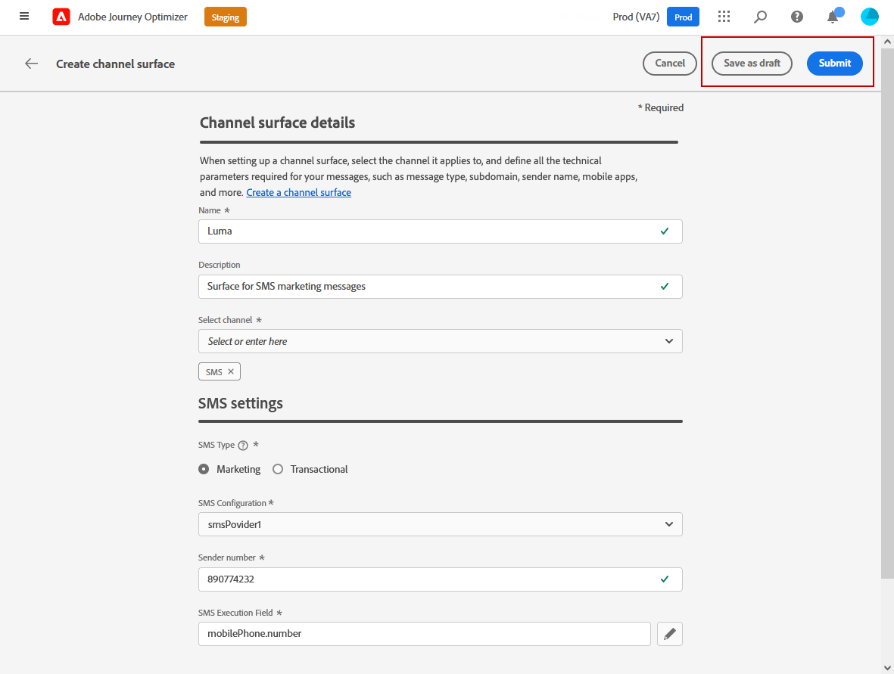

# Sms-kanaal configureren {#sms-configuration}

[!DNL Journey Optimizer] kunt u uw reizen maken en berichten naar het beoogde publiek sturen.

>[!NOTE]
>
>Het SMS-kanaal is momenteel alleen beschikbaar voor een aantal organisaties (Beperkte beschikbaarheid). Neem voor meer informatie contact op met uw Adobe-vertegenwoordiger.

## Nieuwe API-referentie maken {#create-api}

Voer de volgende stappen uit om uw SMS-leverancier te configureren met Journey Optimizer:

1. Toegang krijgen tot **[!UICONTROL Administration]** > **[!UICONTROL Channels]** > **[!UICONTROL API Credentials]** en klik vervolgens op **[!UICONTROL Create API credential]**.

   

1. Selecteer uw **[!UICONTROL SMS vendor]**:

   * [!DNL Sinch]. Als u uw **[!UICONTROL Service ID]** en **[!UICONTROL API Token]** hebt u toegang tot SMS > API&#39;s via uw Sinch-account.
   * [!DNL Twilio]. Als u uw **[!UICONTROL Service ID]** en **[!UICONTROL API Token]**, opent u het venster Accountinformatie van de pagina Dashboard van de console.

1. Voer een **[!UICONTROL Name]** voor uw API-referentie.

1. Voer uw **[!UICONTROL Service ID]** en **[!UICONTROL API Token]**.

   

1. Klikken **[!UICONTROL Submit]** wanneer u de configuratie van uw API-referenties hebt voltooid.

Nadat u de API-referentie hebt gemaakt en geconfigureerd, moet u nu een berichtvoorinstelling voor SMS-berichten maken.

## Een berichtvoorinstelling maken voor SMS-berichten {#message-preset-sms}

Zodra uw kanaal van SMS is gevormd, moet u een berichtvooraf ingesteld tot stand brengen om SMS berichten van te kunnen verzenden van **[!DNL Journey Optimizer]**.

Ga als volgt te werk om een berichtvoorinstelling te maken:

1. Toegang krijgen tot **[!UICONTROL Channels]** > **[!UICONTROL Branding]** > **[!UICONTROL Message presets]** en klik vervolgens op **[!UICONTROL Create Message preset]**.

   

1. Voer een naam en beschrijving (optioneel) voor de voorinstelling in en selecteer vervolgens het SMS-kanaal.

   

   >[!NOTE]
   >
   > Namen moeten beginnen met een letter (A-Z). Het mag alleen alfanumerieke tekens bevatten. U kunt ook het onderstrepingsteken gebruiken `_`, punt`.` en afbreekstreepje `-` tekens.

1. Configureer de **SMS** instellingen.

   

   * Selecteer **[!UICONTROL SMS Type]** die samen met de voorinstelling wordt verzonden: **[!UICONTROL Transactional]** of **[!UICONTROL Marketing]**.

   * Selecteer **[!UICONTROL SMS configuration]** aan de voorinstelling te koppelen.

      Voor meer over hoe te om uw milieu te vormen om de berichten van SMS te verzenden, verwijs naar [deze sectie](sms-configuration.md).

   * Voer de **[!UICONTROL Sender number]** &#x200B; u voor uw mededelingen wilt gebruiken.

   * Selecteer uw **[!UICONTROL SMS Execution Field]** om de **[!UICONTROL Profile attribute]** aan de telefoonaantallen van de profielen worden geassocieerd.

1. Zodra alle parameters zijn gevormd, klik **[!UICONTROL Submit]** ter bevestiging. U kunt de berichtvoorinstelling ook opslaan als concept en de configuratie ervan later hervatten.

   

1. Nadat de berichtvoorinstelling is gemaakt, wordt deze in de lijst weergegeven met de **[!UICONTROL Processing]** status.

   >[!NOTE]
   >
   >Als de controles niet succesvol zijn, leer meer over de mogelijke mislukkingsredenen in [deze sectie](#monitor-message-presets).

1. Als de controles zijn voltooid, wordt met de berichtvoorinstelling het volgende opgehaald **[!UICONTROL Active]** status. Het is klaar om te worden gebruikt om berichten te leveren.

   

Je kunt nu SMS-berichten verzenden met Journey Optimizer.

**Verwante onderwerpen**

* [Een SMS-bericht maken](../messages/create-sms.md)
* [Een bericht toevoegen in een journey](../building-journeys/journeys-message.md)
