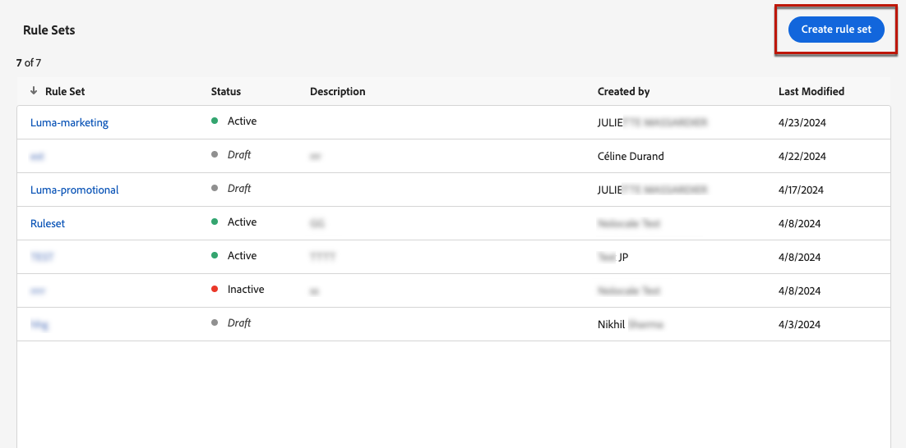

# Frequentiecapaciteit per kanaal en communicatietype {#rule-sets}

**de regelreeksen van het Kanaal** passen het afschilderen regels op communicatiekanalen toe. Verzend bijvoorbeeld niet meer dan 1 e-mail- of sms-communicatie per dag.

De reeksen van de kanaalregel van hefboomwerking staan u toe om frequentie het begrenzen door communicatie type te plaatsen om het overbelasten van klanten met gelijkaardige berichten te verhinderen. Bijvoorbeeld, kunt u een regel tot stand brengen die wordt geplaatst om het aantal **promotionele mededelingen** te beperken naar uw klanten en een andere die regel wordt verzonden om het aantal **nieuwsbrieven** te beperken naar hen wordt verzonden. Afhankelijk van het type campagne dat u creeert, kunt u dan verkiezen om of de promotionele mededeling of de nieuwsbrieven regelreeks toe te passen.

>[!IMPORTANT]
>
>Om ervoor te zorgen dat kanaalniveau het maximum correct werkt, zorg ervoor u de hoogste prioriteit namespace terwijl het ontwerpen van een campagne of een reis kiest. Leer meer over namespace prioriteit in de [&#x200B; gids van de Dienst van de Identiteit van het Platform &#x200B;](https://experienceleague.adobe.com/nl/docs/experience-platform/identity/features/identity-graph-linking-rules/namespace-priority){target="_blank"}

## Een regel voor kanaaluitlijning maken

>[!CONTEXTUALHELP]
>id="ajo_rule_sets_channel"
>title="Bepaal de kanalen waarop de regel van toepassing is"
>abstract="Selecteer ten minste één kanaal. De bedekking wordt toegepast over kanalen als totale telling."

Ga als volgt te werk om een kanaalregelset te maken:

>[!NOTE]
>
>U kunt tot 10 actieve lokale regelreeksen voor elk kanaaldomein en voor het reisdomein tot stand brengen.

1. Open de lijst **[!UICONTROL Rules sets]** en klik vervolgens op **[!UICONTROL Create rule set]** .

   

1. Selecteer de regelset waaraan u de afkapregel wilt toevoegen of maak een nieuwe regelset:

   * Om een bestaande regelreeks te gebruiken, selecteer het van de lijst. Regels voor kanaalbegrenzing kunnen alleen worden toegevoegd aan regelsets met het &#39;kanaal&#39;-domein. U kunt deze informatie controleren in de lijsten met regelsets in de kolom **[!UICONTROL Domain]** .

     

   * Als u een nieuwe regelset wilt maken met de uitlijningsregel, klikt u op **[!UICONTROL Create rule set]** , geeft u een unieke naam voor de regelset op en selecteert u &#39;Kanaal&#39; in de vervolgkeuzelijst **[!UICONTROL Rule Set Domain]** en klikt u vervolgens op **[!UICONTROL Save]** .

     

1. In het scherm van de regelreeks, klik de **[!UICONTROL Add Rule]** knoop en bepaal een unieke naam voor de regel.

1. Het **gebied van de Categorie** specificeert de categorie van bericht de regel op van toepassing is. Momenteel is dit veld alleen-lezen, aangezien alleen de categorie **[!UICONTROL Marketing]** beschikbaar is.

   

1. Stel in het veld **[!UICONTROL Capping count]** de aftopping voor de regel in. Dit is het maximum aantal berichten dat naar een individueel gebruikersprofiel kan worden verzonden per maand, week, dag of uur, afhankelijk van uw keuze in de volgende velden.

1. Selecteer in de vervolgkeuzelijst **[!UICONTROL Reset capping frequency]** of u de uitlijning wilt toepassen op een uur, dag, week of maand. De frequentiegrens is gebaseerd op de geselecteerde kalenderperiode. Deze wordt opnieuw ingesteld aan het begin van het corresponderende tijdkader.

   De teller loopt voor elke periode als volgt af:

   * **[!UICONTROL Hourly]** - De frequentiekapitaal is geldig voor het geselecteerde aantal uren. De teller wordt automatisch opnieuw ingesteld aan het begin van elk tijdvenster. Voor een frequentiegrens van 1 uur, herstelt het elk uur, die met het eind van een UTC uur samenvalt.
   * **[!UICONTROL Daily]** - het dagelijkse frequentiekapitaal is geldig voor de dag tot 23 :59: 59 UTC en stelt aan 0 bij het begin van de volgende dag terug.
   * **[!UICONTROL Weekly]** - het frequentiekapitaal is geldig tot Zaterdag 23 :59: 59 UTC van die week. De vervaldatum is van toepassing ongeacht wanneer de regel is gemaakt. Bijvoorbeeld, als de regel op Donderdag wordt gecreeerd, is deze regel geldig tot Zaterdag bij 23 :59: 59.
   * **[!UICONTROL Monthly]** - het frequentiekapitaal is geldig tot de laatste dag van de maand bij 23 :59: 59 UTC. Bijvoorbeeld, is de maandelijkse vervaldatum voor Januari 01-31 23 :59: 59 UTC.

   >[!IMPORTANT]
   >
   >* Om nauwkeurigheid te verzekeren, zorg ervoor u de hoogste prioriteit namespace terwijl het ontwerpen van een campagne of een reis kiest. Leer meer over namespace prioriteit in de [&#x200B; gids van de Dienst van de Identiteit van het Platform &#x200B;](https://experienceleague.adobe.com/nl/docs/experience-platform/identity/features/identity-graph-linking-rules/namespace-priority){target="_blank"}  
   >
   >* De waarde van de profielteller wordt bijgewerkt wanneer de mededeling wordt geleverd. Begrijpt u dit wanneer u grote hoeveelheden communicatie verzendt aangezien de productie in de ontvanger zou kunnen resulteren die de e-mailnotulen of zelfs uren na de inleiding van de mededeling (in het geval dat u miljoenen mededelingen gelijktijdig verzendt) krijgen. Dit is van belang wanneer een ontvanger twee mededelingen dicht bij elkaar ontvangt. We stellen voor om communicatie met elkaar te scheiden met minstens twee uur, waar mogelijk, zodat de ontvanger voldoende tijd heeft om de communicatie te ontvangen en de tegenwaarde dienovereenkomstig bij te werken.

1. In het veld **[!UICONTROL Every]** kunt u de regels voor frequentiecapping gedurende meerdere uren, dagen, weken of maanden herhalen, afhankelijk van de opgegeven duur. Voorbeeld: pas de regel voor de frequentiecalapping toe gedurende 2 weken.

   Zorg ervoor dat u een waarde invoert die overeenkomt met het geselecteerde duurtype: 1-23 voor Uur, 1-30 voor Dagelijks, 1-4 voor Wekelijks en 1-3 voor Maandelijks.

   De teller wordt automatisch teruggezet aan 0 wanneer een nieuw tijdvenster begint. Voor een frequentiegrens van 2 dagen, komt dit terug om de twee dagen om middernacht UTC.

1. Selecteer het kanaal dat u voor deze regel wilt gebruiken: **[!UICONTROL Email]**, **[!UICONTROL SMS]**, **[!UICONTROL Push notification]** of **[!UICONTROL Direct mail]** .

1. Selecteer meerdere kanalen als u de afdekking op alle geselecteerde kanalen als een totaal aantal wilt toepassen.

   Stel de aftopping bijvoorbeeld in op 5 en selecteer zowel het e-mailadres als het sms-kanaal. Als een profiel al 3 marketingberichten en 2 marketingberichten voor de geselecteerde periode heeft ontvangen, wordt dit profiel uitgesloten van de eerstvolgende levering van een marketingbericht of -bericht.

1. Klik op **[!UICONTROL Save]** om het maken van de regel te bevestigen. Uw bericht wordt toegevoegd aan de regelset, met de status **[!UICONTROL Draft]** .

   

1. Herhaal bovenstaande stappen om zoveel regels toe te voegen als nodig zijn voor de regelset.

1. Wanneer de begrenzingsregel klaar is om op berichten te worden toegepast, activeer de regelreeks en de regel waar het is toegevoegd. [&#x200B; Leer hoe te om regelreeksen te activeren &#x200B;](../conflict-prioritization/rule-sets.md#Create)

## Regelsets toepassen op een bericht {#apply-frequency-rule}

Voer de volgende stappen uit om een regel toe te passen die op een bericht is ingesteld:

1. Wanneer het creëren van een reis of campagnebericht, selecteer één van de kanalen u voor uw regelreeks bepaalde en geef de inhoud van uw bericht uit

1. Klik op de knop **[!UICONTROL Add Business Rule]** in het scherm voor de inhoudseditie.

1. Selecteer de regelset die u hebt gemaakt.

   

   >[!NOTE]
   >
   >Slechts [&#x200B; geactiveerde &#x200B;](#activate-rule) regelreeksen tonen in de lijst.

   <!--Messages where the category selected is **[!UICONTROL Transactional]** will not be evaluated against business rules.-->

1. Voordat u uw reis of campagne activeert, moet u ervoor zorgen dat de uitvoering ervan ten minste 10 minuten in de toekomst wordt gepland.

   Dit staat voor voldoende tijd toe om de tellerwaarden op het profiel voor de bedrijfsregel te bevolken u selecteerde. Als u de campagne onmiddellijk activeert, zullen de de tellerwaarden van de regelreeks niet op de profielen van de ontvangers bevolken, en het bericht zal niet naar hun frequentie het begrenzen regels voor de reeksen van de douaneregel worden geteld. Bovendien werkt de plafonnering mogelijk niet correct voor reizen en campagnes die onmiddellijk worden geactiveerd en door de API geïnitieerde campagnes.

   

1. U kunt het aantal profielen bekijken die van levering in het [&#x200B; rapport van Customer Journey Analytics &#x200B;](../reports/report-gs-cja.md) worden uitgesloten, en in het [&#x200B; Levende rapport &#x200B;](../reports/live-report.md), waar de frequentieregels als mogelijke reden voor gebruikers zullen worden vermeld die van levering worden uitgesloten.

>[!NOTE]
>
>Verschillende regels kunnen op hetzelfde kanaal van toepassing zijn, maar wanneer het onderste hoofdlettergebruik is bereikt, wordt het profiel uitgesloten van de volgende leveringen.

Wanneer het testen van frequentieregels, wordt het geadviseerd om een pas gecreeerd [&#x200B; testprofiel &#x200B;](../audience/creating-test-profiles.md) te gebruiken, omdat zodra de de frequentiedrempel van een profiel wordt bereikt, er geen manier is om de teller tot de volgende periode terug te stellen. Als u een regel deactiveert, kunnen beperkte profielen berichten ontvangen, maar worden er geen tellerverhogingen verwijderd of verwijderd.

>[!CAUTION]
>
>De het in kaart brengen van de frequentie regels zijn ook van toepassing wanneer het verzenden van [&#x200B; proeven &#x200B;](../content-management/proofs.md). Als een testprofiel de limiet voor de maximale frequentie al heeft bereikt, worden proefdrukken weergegeven als voltooid, maar wordt er geen e-mail verzonden.

<!--add a new section for default priority namespace.-->

<!--
## Example: combine several rules {#frequency-rule-example}

You can combine several message frequency rules, such as described in the example below.

1. [Create a rule](#create-new-rule) called *Overall Marketing Capping*:

   * Select all channels.
   * Set capping to 12 monthly.

   

1. To further restrict the number of marketing-based push notifications that a user is sent, create a second rule called *Push Marketing Cap*:

   * Select Push channel.
   * Set capping to 4 monthly.

   

1. Save and [activate](#activate-rule) the rule.

1. [Create a message](../building-journeys/journeys-message.md) for every channel you want to communicate through and select the **[!UICONTROL Marketing]** category for each message. [Learn how to apply a frequency rule](#apply-frequency-rule)

   

In this scenario, an individual profile:
* can receive up to 12 marketing messages per month;
* but will be excluded from marketing push notifications after they have received 4 push notifications.-->

## Hoe kan ik-video {#video}

>[!VIDEO](https://video.tv.adobe.com/v/3435531?quality=12)
