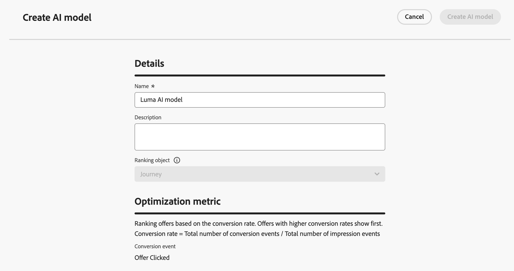

# AI-modellen gebruiken om reizen te rangschikken {#journey-ai-models}

>[!AVAILABILITY]
>
>Deze functie bevindt zich momenteel in Beperkte Beschikbaarheid. Neem contact op met uw Adobe-vertegenwoordiger voor toegang.

Met [!DNL Adobe Journey Optimizer] kunt u bepalen welke ritten een profiel kan invoeren wanneer ze in aanmerking komen voor meer dan het systeem toestaat. Om dit te doen, kunt u [ regelreeksen ](rule-sets.md) gebruiken om caps op reisingang of gelijktijdig te bepalen. Wanneer een profiel voor meer reizen in aanmerking komt dan het maximum toestaat, bepaalt de prioriteit die aan elke reis wordt toegekend welke ritten worden gekozen.

In plaats van prioriteit te gebruiken, kunt u **modellen AI** in uw rangschikkende formules ook gebruiken om ritten dynamisch te rangschikken die op getrainde modelscores worden gebaseerd.

## Een AI-model maken {#create-ai-model}

<!--Do you need specific permissions to create AI models?
>[!CAUTION]
>
>To create, edit, or delete AI models, you must have the **Manage Ranking Strategies** permission. [Learn more](../administration/high-low-permissions.md#manage-ranking-strategies)-->

Volg de onderstaande stappen om een AI-model voor de rangschikking van reizen te maken.

1. Maak een gegevensset waarin conversiegebeurtenissen worden verzameld. [ leer hoe ](../experience-decisioning/data-collection/create-dataset.md)

1. Open de sectie **[!UICONTROL Orchestration ranking]** en selecteer vervolgens de tab **[!UICONTROL AI models]** . De lijst met eerder gemaakte AI-modellen wordt weergegeven.

1. Klik op **[!UICONTROL Create AI model]**.

1. Geef een unieke naam en, indien nodig, een beschrijving voor het AI-model op.

   {width="85%"}

   >[!NOTE]
   >
   >Het rangschikkende object is de entiteit waarop de rangschikkingsformule van toepassing is. Standaard is de positie van het waarderingsobject ingesteld op **[!UICONTROL Journey]** .

<!--
1. Select the type of AI model you want to create:

    * **[!UICONTROL Auto-optimization]** optimizes based on past performance. [Learn more](../experience-decisioning/ranking/auto-optimization-model.md)
    * **[!UICONTROL Personalized optimization]** optimizes and personalizes based on audiences and performance. [Learn more](../experience-decisioning/ranking/personalized-optimization-model.md)-->

1. In de **[!UICONTROL Optimization metric]** sectie, alle metriek van uw standaard [!DNL Customer Journey Analytics] [ vertoning van de gegevensmening ](https://experienceleague.adobe.com/en/docs/analytics-platform/using/cja-dataviews/data-views){target="_blank"} in de lijst. Selecteer metrisch dat u uw model wilt optimaliseren.

   {width="70%"}

   [!DNL Journey Optimizer] ranks die op het **worden gebaseerd omzettingspercentage** (het tarief van de Omzetting = Totaal aantal omzettingsgebeurtenissen/Totaal aantal impressiegebeurtenissen). De omrekeningskoers wordt berekend aan de hand van:

   * **de gebeurtenissen van de Indrukking** (punten die worden getoond)
   * **de gebeurtenissen van de Omzetting** (punten die in kliks of omzettingen resulteren)

   Deze gebeurtenissen worden automatisch vastgelegd met de Web SDK of de Mobile SDK. Leer meer in het [ overzicht van SDK van het Web 0} Adobe Experience Platform.](https://experienceleague.adobe.com/docs/experience-platform/edge/home.html)

1. Selecteer de gegevensset(s) waar de conversie- en impressiefeedagen worden verzameld. Leer hoe te om dergelijke datasets in [ tot stand te brengen deze sectie ](../experience-decisioning/data-collection/create-dataset.md).

   {width="85%"}

   >[!CAUTION]
   >
   >Alleen de gegevenssets die zijn gemaakt op basis van schema&#39;s die zijn gekoppeld aan de veldgroep **[!UICONTROL Experience Event - Proposition Interactions]** , worden weergegeven in de vervolgkeuzelijst. U kunt maximaal vijf datasets selecteren.

1. <!--If you are creating a **[!UICONTROL Personalized optimization]** AI model, -->Selecteer de segmenten die u wilt gebruiken om het AI-model op te leiden.

   >[!NOTE]
   >
   >U kunt maximaal 50 soorten publiek selecteren.

1. Sla het AI-model op en activeer het.

Het AI-model is nu beschikbaar voor selectie wanneer u een waarderingsformule maakt.

## Verwijzing naar het AI-model in een formule om reizen te rangschikken {#reference-ai-model}

U kunt het AI-model nu instellen als een verwijzing om een rangschikkingsformule te maken, de formule vervolgens toewijzen aan een regelset en de regel die is ingesteld op uw reizen toepassen. Volg de onderstaande stappen om dit te doen.

1. Maak een waarderingsformule. [ leer hoe ](journey-ranking-formulas.md#create-journey-ranking-formula)

1. Gebruik de knop **[!UICONTROL Select AI model]** om het AI-model te selecteren dat u wilt gebruiken in de formule.

   {width="80%"}

1. Definieer in ten minste een van de secties van **[!UICONTROL Criterion]** een voorwaarde en selecteer **[!UICONTROL AI model score]** als waarderingsmethode. Als de reis bijvoorbeeld een &#39;Promo&#39;-tag heeft, is de rangschikkingsscore de score van het AI-model.

   {width="60%"} gebruikt

1. Klik op **[!UICONTROL Create]** om uw waarderingsformule te voltooien.

1. Maak nu een regelset en selecteer de formule die u als waarderingsmethode hebt gemaakt. [ leer hoe ](journey-ranking-formulas.md#assign-formula-to-ruleset)

1. Maak de regels voor het afdekken van reizen en sla de regelset op.

1. Pas de regel toe die op de gewenste reizen wordt geplaatst en bewaar hen. [ leer hoe ](journey-ranking-formulas.md#assign-rule-set-to-journey)

   >[!NOTE]
   >
   >Er kan slechts één regelset tegelijk op een reis worden toegepast.

Alle ritten die van deze regel gebruikmaken, worden gerangschikt met de formule die naar het geselecteerde AI-model verwijst wanneer de lampvoet wordt toegepast.
