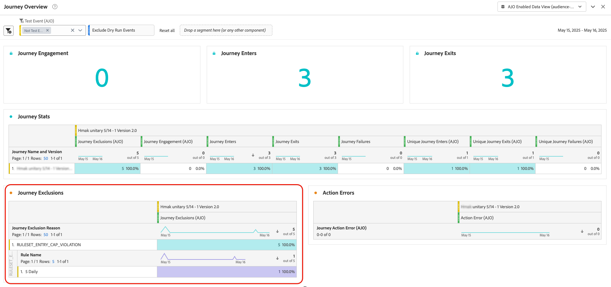

# Afbakening van reizen en arbitrage {#journey-capping}

Met de functie voor aftopping kunt u het aantal ritten beperken waarin een profiel kan worden ingeschreven, zodat overbelasting van communicatie wordt voorkomen. In Journey Optimizer kunt u twee typen uitlijningsregels instellen:

* **toegang begrensd** beperkt het aantal reisingangen over een bepaalde periode voor een profiel.
* **In samenloop het maximum** beperkt hoeveel reizen een profiel in gelijktijdig kan worden ingeschreven.

Beide typen aftopping maken gebruik van prioriteitsscores om items te scheiden.

➡️ [Ontdek deze functie in video](#video)

## Een regel voor het afdekken van reizen maken {#create-rule}

>[!CONTEXTUALHELP]
>id="ajo_rule_set_concurrency_prioritization"
>title="Prioritaire toekomst"
>abstract=" Als een reis met een hogere prioriteit binnen de hier gespecificeerde periode wordt gepland, dan zal de klant van het ingaan van deze reis worden onderdrukt. Voor situaties waarin u op de eerste dag reizen wilt maken, stellen wij voor om eerst de Daily-periode te kiezen en ervoor te zorgen dat de prioriteitsscore van andere reizen op die dag lager is dan de prioriteitsscore voor de reis. Een prioriteitsscore van 100 voor een reis zou er ook voor zorgen dat het wordt ingevoerd."

>[!CONTEXTUALHELP]
>id="ajo_rule_set_rule_type"
>title="Type regel"
>abstract="Geef het type uitlijnen voor de regel op. **[!UICONTROL Journey Entry Cap]** beperkt het aantal items in de reis over een bepaalde periode voor een profiel, terwijl **[!UICONTROL Journey Concurrency Cap]** beperkt hoeveel reizen een profiel tegelijkertijd kan inschrijven."

Voer de volgende stappen uit om een regel voor het afdekken van reizen te maken:

1. Navigeer naar het menu **[!UICONTROL Business rules]** voor toegang tot het overzicht van regelsets.

1. Selecteer de regelset waaraan u de afkapregel wilt toevoegen of maak een nieuwe regelset:

   * Om een bestaande regelreeks te gebruiken, selecteer het van de lijst. Regels voor het afdekken van reizen kunnen alleen worden toegevoegd aan regelsets met het domein &#39;reis&#39;. U kunt deze informatie controleren in de lijsten met regelsets in de kolom **[!UICONTROL Domain]** .

     

   * Klik op **[!UICONTROL Create rule set]** om de afkapregel binnen een nieuwe regelset te maken, geef een unieke naam voor de regelset op en selecteer &#39;Reis&#39; in de vervolgkeuzelijst **[!UICONTROL Rule Set Domain]** en klik vervolgens op **[!UICONTROL Save]** .

     

1. Klik in het scherm met de regelset op de knop **[!UICONTROL Add Rule]** en geef de regel een unieke naam.

1. Geef in de vervolgkeuzelijst **[!UICONTROL Rule Type]** het type uitlijning voor de regel op.

   * **[!UICONTROL Journey Entry Cap]**: beperkt het aantal items dat gedurende een bepaalde periode voor een profiel wordt ingevoerd in de reis.
   * **[!UICONTROL Journey Concurrency Cap]**: hiermee wordt beperkt hoeveel ritten een profiel gelijktijdig kan worden ingeschreven.

   

1. Vouw de onderstaande secties uit om te leren hoe u elk type uitvulling kunt configureren:

   +++Een regel voor het aftoppen van reisgegevens configureren

   1. Stel in het veld **[!UICONTROL Capping]** het maximum aantal ritten in dat een profiel kan invoeren.
   1. Definieer in het veld **[!UICONTROL Duration]** de tijdsperiode die u wilt overwegen. De duur is gebaseerd op de UTC-tijdzone. Zo wordt de Daily cap ingesteld op middernacht UTC.

   In dit voorbeeld willen we de profielen beperken om meer dan &quot;5&quot; reizen per maand in te voeren.

   

   >[!NOTE]
   >
   >In het systeem zal rekening worden gehouden met de prioriteit van komende geplande reizen waarop dezelfde regel van toepassing is.
   >
   >In dit voorbeeld, als de markteur reeds vier reizen heeft betreden en er een volgende geplande reis is deze maand met een hogere prioriteit, dan zullen de klanten van het ingaan van de lagere prioritaire reis worden onderdrukt.

   +++

   +++Een regel voor aftopping van de route configureren 

   1. Stel in het veld **[!UICONTROL Capping]** het maximumaantal ritten in waarin een profiel gelijktijdig kan worden ingeschreven.

   1. Gebruik het veld **[!UICONTROL Prioritization look ahead]** om te scheiden hoe items in de reis worden geplaatst op basis van prioriteitsscores gedurende een bepaalde periode (bijvoorbeeld 1 dag, 7 dagen, 30 dagen).

      Met deze optie worden de geplande reizen van het leespubliek gedurende de rest van de week gescand om te bepalen of het profiel moet worden onderdrukt van het betreden van de reis vanwege een reis met hogere prioriteit die naar voren komt. Het helpt om voorrang te geven aan het binnenkomen van duurdere reizen als een profiel in aanmerking komt voor meerdere reizen.

   In dit voorbeeld willen we profielen beperken van het betreden van de reis als ze al zijn ingeschreven voor een andere reis die dezelfde regel bevat. Als een andere reis binnen de volgende 7 dagen een hogere prioritaire score heeft, zal het profiel deze reis niet ingaan.

   {width="50%" zommable="yes"}

   +++

1. Herhaal bovenstaande stappen om zoveel regels toe te voegen als nodig zijn voor de regelset.

1. Wanneer de afkapregel klaar is om op reizen te worden toegepast, activeer de regel en de regel die is geplaatst waar het is toegevoegd. [ Leer hoe te om regelreeksen te activeren ](../conflict-prioritization/rule-sets.md#Create)

## Afdekkingsregels toepassen op reizen {#apply-capping}

>[!CONTEXTUALHELP]
>id="ajo_journey_capping_rule"
>title="Regel toepassen op reizen"
>abstract="Pas een Regelreeks toe om deze reis aan een deel van uw publiek uit te sluiten die op frequentie het begrenzen regels wordt gebaseerd."

Om een afluisterregel op een reis toe te passen, toegang tot de reis en open zijn eigenschappen. Selecteer in de vervolgkeuzelijst **[!UICONTROL Capping rules]** de desbetreffende regelset. Zodra de reis in werking wordt gesteld, zullen de plafondregels die in de vastgestelde regel worden bepaald van kracht worden.

>[!NOTE]
>
>Als een reis onmiddellijk wordt geactiveerd, kan het tot 10 minuten duren voordat het systeem begint met het onderdrukken van klanten. Dientengevolge, toont een bericht als u probeert om een reis met een begintijd te publiceren die minder dan 10 minuten is.

## Uitsluiting van monitorregelsets {#monitor}

Zodra een reis levend is, kunt u het reisrapport controleren als de vastgestelde regel tot om het even welke uitsluiting van de reis, in de **[!UICONTROL Journey Exclusions]** lijst heeft geleid. De tabel met uitsluitingen voor reizen bevat gedetailleerde uitsplitsingen van uitsluitingen naar regelreeks en regelnaam, die inzichten geven in waarom profielen zijn genegeerd. [ Leer hoe te met reisrapporten ](../reports/journey-global-report-cja.md) te werken

Bovendien kunt u de [ Dienst van de Vraag van Adobe Experience Platform ](https://experienceleague.adobe.com/docs/experience-platform/query/api/getting-started.html){target="_blank"} gebruiken om vragen te bouwen om te identificeren welke regel een profiel veroorzaakte om niet in een bepaalde reis binnen te gaan. Een vraagvoorbeeld is beschikbaar in [ deze sectie ](../reports/query-examples.md#common-queries).

## Hoe kan ik-video {#video}

>[!VIDEO](https://video.tv.adobe.com/v/3435530?quality=12)
