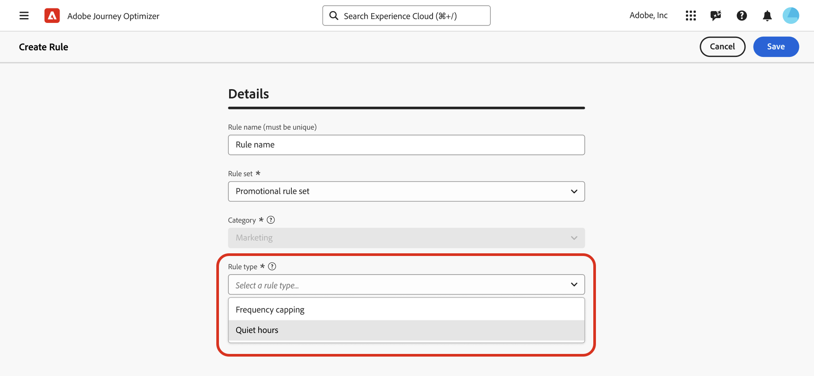

# Stille uren instellen {#quiet-hours}

## Wat zijn stille uren

**Stil uren** laat u op tijd-gebaseerde uitsluitingen voor **E-mail**, **SMS**, **Duw**, en **WhatsApp** kanalen bepalen. Zij zorgen ervoor dat geen berichten tijdens specifieke periodes worden verzonden, die u helpen klantenvoorkeur en nalevingsvereisten respecteren.

U kunt stille uren door **regelreeksen** toepassen, die aan individuele acties in campagnes of reizen voor nauwkeurige controle kunnen worden toegewezen.

Door deze processen te stroomlijnen, kunt u klantenervaring verbeteren, tijd besparen, en naleving van communicatie regels verzekeren:

* **wordt niet wakker uw klant** - *de juiste klant, het juiste kanaal, de juiste tijd* is mantra van vele marketers, zodat het steek houdt dat de timing een kritiek deel van de klantenreis is. Door een regel voor stille uren in te stellen, hebben merken meer controle over het tijdstip waarop contactpersonen berichten ontvangen, zodat ze deze ontvangen wanneer ze waarschijnlijk actie zullen ondernemen op uw bericht.
* **Handigheid** - onderschept gemakkelijk mededelingen over campagnes &amp; reizen wanneer u een publiek moet verhinderen een bericht te ontvangen zonder de volledige reis of de campagne te moeten tegenhouden.
* **Tijd die** bespaart - beheer uitsluitingen op één plaats door a **op tijd-gebaseerde regel** te creëren, in plaats van het toevoegen van veelvoudige voorwaardenknopen met douaneuitdrukkingen.\
  <!--* **Extra Safeguard** - Benefit from an extra safeguard in case audience criteria or time-window configurations were incorrectly set, ensuring individuals are still excluded when they should be.-->

>[!AVAILABILITY]
>
>De regels voor de korte uren zijn momenteel alleen beschikbaar voor een aantal organisaties (Beperkte Beschikbaarheid). Neem contact op met uw Adobe-vertegenwoordiger om aan de wachtlijst toe te voegen.

➡️ [Ontdek deze functie in video](#video)

## Afbeeldingen en beperkingen

* **Gesteunde kanalen** - E-mail, SMS, Duw, en WhatsApp.
  <!--* **Custom actions** – For custom actions, only quiet hours rules are enforced. If a rule set also includes other rules (e.g., frequency capping), those rules are ignored.-->
* {de vertraging van de Verspreiding 0} **- de Updates aan een stille urenregel kunnen tot 12 uren vergen om op kanaalacties worden toegepast die reeds die regel gebruiken.**
  <!--* **Pre-suppression window** – The system begins suppressing communications 30 minutes before quiet hours start, ensuring that no messages are delivered once the quiet period begins.-->
* **Hoog-volumelatentie** - in gevallen van hoog-volumemededelingen, kan het systeem extra tijd nemen beginnen met het met succes afdwingen van stille uuronderdrukking.

## Regels voor stille uren maken

Om stille uren te plaatsen, creeer een regel binnen een reeks van de douaneregel. Voer de volgende stappen uit:

1. Navigeer naar **[!UICONTROL Business rules]** om toegang te krijgen tot het overzicht van regelsets.

1. Kies een bestaande aangepaste regelset of maak een nieuwe set:

   +++Creeer een stille urenregel in een bestaande regelreeks

   Selecteer de regelset in het overzicht. De stille urenregels kunnen slechts aan regelreeksen met het &quot;kanaal&quot;domein worden toegevoegd. U kunt deze informatie controleren in de kolom **[!UICONTROL Domain]** .

   

   +++

   +++Creeer een stille urenregel in een nieuwe regelreeks

   Klik op **[!UICONTROL Create rule set]** , voer een unieke naam in en selecteer Kanaal in de vervolgkeuzelijst **[!UICONTROL Rule Set Domain]** .

   

   +++

   >[!NOTE]
   >
   >De stille uren kunnen slechts in **reeksen van de douaneregel** worden bepaald. De globale regelreeks steunt rustige uurconfiguratie niet.

1. Klik in het scherm met regelsets op **[!UICONTROL Add Rule]** en geef een unieke naam voor de regel op.

1. Het **gebied van de Categorie** specificeert de categorie van bericht de regel op van toepassing is. Momenteel is dit veld alleen-lezen en standaard ingesteld op **[!UICONTROL Marketing]** .

1. Selecteer **[!UICONTROL Rule type]** in de vervolgkeuzelijst **[!UICONTROL Quiet hours]** .

   

1. Definieer in de sectie **[!UICONTROL Dates & times]** wanneer u stille uren wilt toepassen:

   1. Kies de **[!UICONTROL Time zone]** die u wilt gebruiken:

      * **[!UICONTROL UTC/GMT]** - Pas een standaard GMT-tijdvenster toe op alle ontvangers in het publiek, ongeacht hun afzonderlijke tijdzones.
      * **[!UICONTROL Use recipients local time zone]** - Gebruik het veld Tijdzone van elk profiel. [ leer meer op het beheer van de tijdzone in reizen ](../building-journeys/timezone-management.md#timezone-from-profiles)

        >[!IMPORTANT]
        >
        >Als een profiel geen tijdzone heeft, worden de stille uren niet afgedwongen voor dat profiel.

   1. Geef de periode op waarop de stille uren moeten worden toegepast.

      * **[!UICONTROL Weekly]** - Kies specifieke dagen van de week en een tijdreeks. U kunt ook de regel **[!UICONTROL All day]** afdwingen (deze optie is alleen beschikbaar gedurende maximaal 3 opeenvolgende dagen).

        

      * **[!UICONTROL Custom date]** - Kies specifieke datums in de kalender en een tijdspad. U kunt ook de regel **[!UICONTROL All day]** afdwingen (deze optie is alleen beschikbaar gedurende maximaal 3 opeenvolgende dagen).

        

   1. Klik op de knop **[!UICONTROL Add more dates]** om maximaal vijf afzonderlijke punten toe te voegen.

      

1. Kies in de sectie **[!UICONTROL Handling actions during quiet hours]** hoe berichten tijdens de geselecteerde periode worden behandeld:

   

   * **[!UICONTROL Queue message]** - Berichten worden verzonden wanneer de stille tijdsperiode is voltooid, tenzij de status Gepauzeerd is.

     >[!NOTE]
     >
     >Deze optie is alleen beschikbaar voor reishandelingen. Als deze optie wordt toegepast op een actie in de campagne, gedraagt deze zich op dezelfde manier als wanneer u de optie **[!UICONTROL Discard message]** selecteert.

   * **[!UICONTROL Discard message]** - Berichten worden nooit verzonden. Selecteer **[!UICONTROL Discard and exit journey or campaign]** als u wilt dat de reis of campagne met het bericht eindigt met de annulering van het verzenden.

## Stil uur toepassen op reizen en campagnes {#apply}

Nadat u de regel hebt opgeslagen en de regelset hebt geactiveerd, kunt u deze toepassen op handelingen tijdens reizen en campagnes. Ondersteunde kanalen: **E-mail, SMS, Duw, WhatsApp**. Blader op de onderstaande tabbladen voor meer informatie.

>[!BEGINTABS]

>[!TAB  pas de acties van het het urenkanaal van de stilte in reizen toe ]

1. Open uw reis, selecteer de actie van het a [ kanaal ](../building-journeys/journeys-message.md) en geef de inhoud van uw bericht uit.
1. Klik op de knop **[!UICONTROL Add Business Rule]** en selecteer de regelset die de regel voor stille uren bevat.

   

   >[!NOTE]
   >
   >Slechts [ geactiveerde ](#activate-rule) regelreeksen tonen in de lijst.

1. Activeer je reis.

>[!TAB  pas stille uren op campagneacties toe ]

1. Bewerk uw campagne en open het tabblad **[!UICONTROL Actions]** .
1. Selecteer in de sectie **[!UICONTROL Business rules]** de regelset die de regel voor stille uren bevat.

   

   >[!NOTE]
   >
   >Slechts [ geactiveerde ](#activate-rule) regelreeksen tonen in de lijst.

1. Activeer uw campagne.

>[!ENDTABS]

## Volgende stappen

Zodra uw reis of campagnes zijn geactiveerd en uitgevoerd, kunt u het aantal profielen bekijken die van de mededeling in het [ rapport van Customer Journey Analytics ](../reports/report-gs-cja.md) worden uitgesloten, en in het [ Levende rapport ](../reports/live-report.md), waar de de urenregels van de Quiet als mogelijke reden voor gebruikers die van levering worden uitgesloten zullen worden vermeld.

<!--

>[!TAB Apply Quiet hours to custom actions]

1. Open your journey and add or select a custom action in the canvas.

1. In the **[!UICONTROL Business rules]** section, select the rule set containing the Quiet hours rule.

   

   >[!NOTE]
   >
   >Only [activated](#activate-rule) rule sets display in the list.

1. Activate your journey.

-->

## Hoe kan ik-video {#video}

Leer hoe u de functie voor stille uren in Adobe Journey Optimizer kunt gebruiken.

>[!VIDEO](https://video.tv.adobe.com/v/3475851?quality=12)
