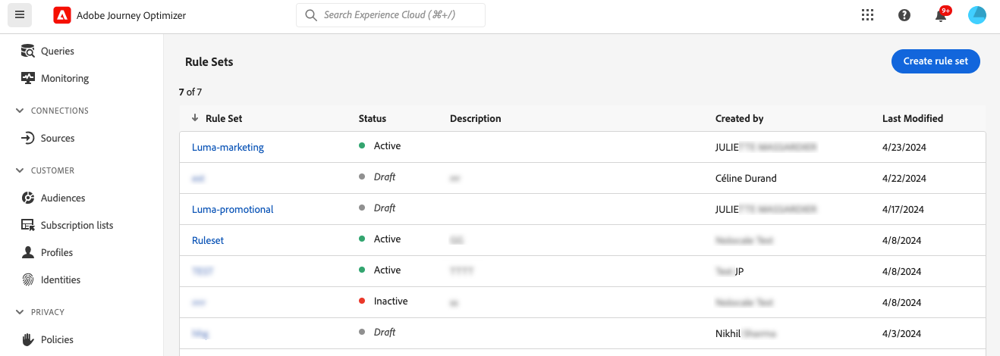

# Werken met regelsets {#rule-sets}

>[!CONTEXTUALHELP]
>id="ajo_business_rules_rule_sets"
>title="Regelsets"
>abstract="De regelreeksen van het gebruik om frequentie het begrenzen of rustige urenregels op verschillende soorten marketing mededelingen toe te passen. U kunt ook regelsets maken om ritten naar een deel van uw publiek uit te sluiten op basis van regels voor frequentiecontrole."

## Aan de slag met regelsets {#gs}

### Wat zijn regelsets? {#what}

De reeksen van de regel staan u toe om **samen veelvoudige regels in regelreeksen** te groeperen en hen op de reizen en de campagnes van uw keus toe te passen. Dit verstrekt betere granulariteit om te beperken hoe vaak en hoeveel reizen een klant binnen een bepaald tijdkader kan ingaan of te controleren hoe vaak de gebruikers een bericht afhankelijk van het type van mededeling zullen ontvangen.

U kunt twee typen regelsets maken:

* **de regelreeksen van het Kanaal** passen regels op communicatiekanalen toe. Met deze opties kunt u instellen:

   * **het begrenzen van de frequentie regels** - *verzendt niet meer dan 1 e-mail of sms- mededeling per dag.*
   * **de urenregels van de stilte** - *verzendt geen e-mailberichten buiten 8AM - 9PM timeslot.*

* **de regelreeksen van 0&rbrace; Reis &lbrace;passen ingang en gelijktijdige afschilderingsregels op een reis toe.** Voer bijvoorbeeld niet profielen in voor meer dan één reis tegelijk.

➡️ [Ontdek deze functie in video](#video)

### Machtigingen {#permissions-frequency-rules}

Om met bedrijfsregels te werken, hebt u de volgende toestemmingen nodig:

* **[!UICONTROL View Frequency Rules]**: Toegang tot en weergave van bedrijfsregels.
* **[!UICONTROL Manage Frequency Rules]**: Maak, bewerk of verwijder bedrijfsregels.

Leer meer over toestemmingen in [&#x200B; deze sectie &#x200B;](../administration/high-low-permissions.md).

### Algemene en aangepaste regelsets {#global-custom}

Wanneer de toegang tot van regelreeksen voor het eerst van **[!UICONTROL Administration]** > **[!UICONTROL Business rules]** menu, wordt een standaardregelreeks vooraf gecreeerd en actief: **Globale Reeks Standaard van de Regel**.

Deze regelreeks bevat globale regels die u kunt toepassen om te bepalen hoe vaak de gebruikers berichten over één of veelvoudige kanalen ontvangen. Alle regels die in deze regel worden bepaald zijn op alle geselecteerde kanalen van toepassing, of de mededelingen van een reis of een campagne worden verzonden.

Naast deze &quot;Globale Vastgestelde de regel van de Regel van het Standaard&quot;wordt geplaatst, kunt u **regelreeksen** tot stand brengen die u op om het even welke reis of campagne kunt toepassen om specifieke afschilderingsregels toe te passen. [&#x200B; Leer hoe te om de reeksen van de douaneregel tot stand te brengen &#x200B;](#create)

## Regelsets maken en activeren {#Create}

>[!CONTEXTUALHELP]
>id="ajo_rule_set_domain"
>title="Domein voor regelset"
>abstract="Wanneer het creëren van een regelreeks, moet u specificeren als de regels binnen de regelreeks het begrenzen regels zullen afdwingen die voor communicatiekanalen, of voor reizen specifiek zijn."

>[!CONTEXTUALHELP]
>id="ajo_rule_sets_category"
>title="Selecteer de categorie voor berichtregels"
>abstract="Wanneer deze optie wordt geactiveerd en toegepast op een bericht, worden alle frequentieregels die overeenkomen met de geselecteerde categorie automatisch toegepast op dit bericht. Momenteel is alleen de marketingcategorie beschikbaar."

<!--NOT USED?
[!CONTEXTUALHELP]
>id="ajo_rule_sets_capping"
>title="Set the capping for your rule"
>abstract="Specify the maximum number of messages sent to a customer profile within the chosen time frame. The frequency cap will be based on the selected calendar period and will be reset at the beginning of the corresponding time frame."-->

>[!CONTEXTUALHELP]
>id="ajo_rule_type"
>title="Type regel"
>abstract="Selecteer het gewenste regeltype voor uw geplaatste kanaalregel: Gebruik het **type dat van de het in kaart brengen van de Frequentie** wordt geplaatst om het begrenzen van regels op communicatiekanalen toe te passen. Verzend bijvoorbeeld niet meer dan 1 e-mail- of sms-communicatie per dag. Selecteer **stille uren** om op tijd-gebaseerde uitsluitingen te bepalen om ervoor te zorgen dat geen berichten tijdens specifieke periodes van tijd worden verzonden."

>[!CONTEXTUALHELP]
>id="ajo_rule_sets_duration"
>title="Selecteer de categorie voor berichtregels"
>abstract="Wanneer deze optie wordt geactiveerd en toegepast op een bericht, worden alle frequentieregels die overeenkomen met de geselecteerde categorie automatisch toegepast op dit bericht. Momenteel is alleen de marketingcategorie beschikbaar."

>[!CONTEXTUALHELP]
>id="ajo_rule_set_rule_capping"
>title="Regelbegrenzing"
>abstract="Plaats het maximum voor uw regel. Afhankelijk van het regelvastgestelde domein en de selectie op het gebied van het Type van Regel, kan dit gebied het maximumaantal berichten bepalen dat naar een profiel kan worden verzonden, of het maximumaantal reizen het profiel kan ingaan of worden ingeschreven gelijktijdig."

>[!CONTEXTUALHELP]
>id="ajo_journey_business_rules"
>title="Regelset"
>abstract="Selecteer de regel die u wilt toepassen op de aangepaste handeling."

Volg onderstaande stappen om een regelset te maken.

>[!NOTE]
>
>U kunt tot 10 regelreeksen voor het kanaaldomein en 10 regelreeksen voor het reisdomein, voor een totaal van 20 regelreeksen tot stand brengen.

1. Open de lijst **[!UICONTROL Rules sets]** en klik vervolgens op **[!UICONTROL Create rule set]** .

   

1. Definieer een unieke naam voor de regelset en voeg een beschrijving toe.

1. Selecteer het domein van de regelset en klik op **[!UICONTROL Save]** .

   * **het domein van het Kanaal**: pas het begrenzen van regels of rustige urenregels op communicatiekanalen toe.
   * **Reis** domein: pas ingang en gelijktijdige het afschilderen regels op een reis toe.

   

1. Bepaal de regels u aan deze regelreeks wilt toevoegen. Open hiertoe de regelset en klik op **[!UICONTROL Add rule]** .

1. Vorm de regelparameters om uw behoeften aan te passen. De parameters beschikbaar voor de regel hangen van het regelvastgestelde domein af dat bij zijn verwezenlijking wordt geselecteerd.

   De gedetailleerde informatie over hoe te om reis en kanaalregels te vormen is beschikbaar in deze secties:

   * [&#x200B; het in kaart brengen van de Reis &#x200B;](../conflict-prioritization/journey-capping.md)
   * [Frequentiecapaciteit per kanaal en communicatietype](../conflict-prioritization/channel-capping.md)
   * [Stil uur](../conflict-prioritization/quiet-hours.md)

1. Klik op **[!UICONTROL Save]** om het maken van de regel te bevestigen. Uw bericht wordt toegevoegd aan de regelset, met de status **[!UICONTROL Draft]** .

   

1. Herhaal bovenstaande stappen om zoveel regels toe te voegen als nodig zijn voor de regelset.

1. Wanneer een regel wordt gemaakt, heeft deze de status **[!UICONTROL Draft]** en heeft deze nog geen invloed op een bericht. Klik op de knop **[!UICONTROL More actions]** naast de regel en selecteer **[!UICONTROL Activate]** om deze in te schakelen.

   

1. Activeer de regel die is ingesteld om deze op uw reizen en berichten toe te passen.

   

   >[!NOTE]
   >
   >Het kan 10 minuten duren voordat een regel of regel volledig is geactiveerd. U hoeft geen berichten te wijzigen of ritten opnieuw te publiceren voordat een regel van kracht wordt.

<!--Currently, once a rule set is activated, no more rules can be added to that rule set.-->

1. U kunt een regel toepassen die op een bericht of een reis wordt geplaatst, afhankelijk van het geselecteerde domein wanneer het creëren van de regelreeks.

   De gedetailleerde informatie over hoe te om regelreeks toe te passen is beschikbaar in deze secties:

   * [Een regel toepassen die is ingesteld op een reis](../conflict-prioritization/journey-capping.md#apply-capping)
   * [Afdekkingsregels toepassen op reis- en campagneacties](../conflict-prioritization/channel-capping.md#apply-frequency-rule)
   * [Regels voor stille uren toepassen op reizen en campagne](../conflict-prioritization/quiet-hours.md#apply)

## Regelsets openen en beheren {#access-rule-sets}

Alle gemaakte regelsets worden weergegeven in het menu **[!UICONTROL Administration]** > **[!UICONTROL Business rules]** . Ze worden gesorteerd op de laatste wijzigingsdatum.

Klik op de naam van een regelset om de inhoud ervan weer te geven en te bewerken. Alle regels inbegrepen in die regelreeks zijn vermeld. In het contextmenu rechtsboven kunt u de naam en beschrijving van de regelset bewerken, activeren en verwijderen.

Voor elke regel in de regelset kunt u met de knop **[!UICONTROL More actions]** de regel bewerken, activeren en verwijderen.

Als u een regel of een regelset wilt deactiveren, klikt u op de knop **[!UICONTROL More actions]** naast het gewenste item en selecteert u **[!UICONTROL Deactivate]** .

De status verandert in **[!UICONTROL Inactive]** en de regel geldt niet voor toekomstige berichtuitvoeringen. Berichten die momenteel worden uitgevoerd, worden niet beïnvloed.

>[!NOTE]
>
>Het deactiveren van een regel of regelset heeft geen invloed op tellingen van afzonderlijke profielen en stelt deze niet opnieuw in.

## Hoe kan ik-video {#video}

>[!VIDEO](https://video.tv.adobe.com/v/3444732?captions=dut&quality=12)
