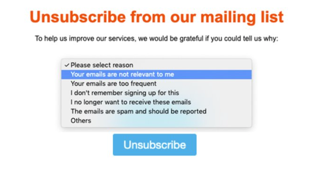

# Weigeren beheren {#consent}

Gebruik [!DNL Journey Optimizer] om de toestemming van uw ontvangers voor communicatie te volgen en te begrijpen hoe zij met uw merk willen werken door hun voorkeuren en abonnementen te beheren. <!--Their preferences and subscriptions are handled through Consent management.-->

Regels zoals de GDPR bepalen dat u aan specifieke vereisten moet voldoen voordat u informatie van de Onderwerpen van Gegevens kunt gebruiken. Bovendien moeten betrokkenen hun toestemming te allen tijde kunnen wijzigen.

**Waarom is het belangrijk?**

* Als u deze voorschriften niet naleeft, brengt u juridische risico&#39;s met zich mee voor uw merk.
* Het helpt u vermijden verzendend ongevraagde mededelingen naar uw ontvangers, die hen zouden kunnen maken uw berichten als spam merken en uw reputatie schaden.

Meer informatie over het beheren van Privacy en de toepasselijke verordeningen in [de documentatie van het Experience Platform](https://experienceleague.adobe.com/docs/experience-platform/privacy/home.html?lang=nl).

<!--* Recipients should be able to opt-in/opt-out from receiving electronic communication through one or more channel
* Recipients expect the brand to offer preference centre capability that controls how brand should engage with them (example: channel of communication, invasive and non-invasive tracking etc). This helps to fulfil regulatory obligations and also facilitates quality engagement with recipient. 
* The third category is the capability to offer subscription to recipients (newsletter, etc)-->

## Uitschakelen van beheer {#opt-out-management}

Het is een wettelijke vereiste dat ontvangers de mogelijkheid krijgen om zich af te melden voor het ontvangen van communicatie van een merk. Meer informatie over de toepasselijke wetgeving vindt u in de [documentatie van het Experience Platform](https://experienceleague.adobe.com/docs/experience-platform/privacy/regulations/overview.html?lang=en#regulations).

Daarom moet u een **unsubscribe verbinding** in elke e-mail altijd omvatten die aan ontvangers wordt verzonden:
* Nadat u op deze koppeling hebt geklikt, worden de ontvangers naar een bestemmingspagina geleid, inclusief een knop om te bevestigen dat ze het programma willen afsluiten.
* Nadat u op de knop Weigeren hebt geklikt, wordt een Adobe I/O-aanroep uitgevoerd om de profielgegevens bij te werken met deze gegevens. [Meer weten hierover](#consent-service-api)?

Voer de onderstaande stappen uit om een koppeling voor afmelden toe te voegen:

1. Bouw uw openingspagina voor abonnementen.
1. Plaats de bestemmingspagina op het externe systeem van uw keuze.
1. [Maak een ](../../help/using/create-message.md) bericht  [!DNL Journey Optimizer].

   <!--The link to your landing page should contain a static URL and the profile ID.-->

1. Selecteer tekst in de inhoud en voeg een koppeling in met behulp van de contextafhankelijke werkbalk.

   

1. Selecteer **[!UICONTROL Unsubscription link]** in de vervolgkeuzelijst **[!UICONTROL Link type]**.

   

1. Kopieer in het frame **[!UICONTROL Unsubscription page URL]** de koppeling naar de bestemmingspagina.

   

1. Klik op **[!UICONTROL Save]**.

1. Sla uw inhoud op en [publiceer uw bericht](../../help/using/publish-manage-message.md).

   >[!NOTE]
   >
   >De URL van de landingspagina van derden bevat drie parameters waarmee de voorkeuren van de profielen via een aanroep van Adobe I/O worden bijgewerkt. &#x200B; [Meer informatie vindt u in deze sectie](#consent-service-api).

1. Verzend uw bericht met de verbinding aan uw landende pagina door een [reis](building-journeys/journey.md).

1. Zodra het bericht wordt ontvangen, als de ontvanger de unsubscribe verbinding klikt, wordt uw landende pagina getoond.

   

1. Als de ontvanger de opt-out knoop in de landende pagina (hier, **Unsubscribe** knoop) klikt, worden de profielgegevens bijgewerkt door een [Adobe I/O vraag](#opt-out-api).

   De ontvanger van de optie-uit wordt dan opnieuw gericht aan een bevestigingsberichtscherm erop wijzend dat het kiezen uit succesvol was.

   

   Dit heeft tot gevolg dat deze gebruiker geen communicatie van uw merk ontvangt, tenzij hij opnieuw een abonnement neemt.

Als u wilt controleren of de keuze van het corresponderende profiel is bijgewerkt, gaat u naar het Experience Platform en opent u het profiel door een naamruimte voor identiteiten en een bijbehorende identiteitswaarde te selecteren. Meer informatie vindt u in de [documentatie van het Experience Platform](https://experienceleague.adobe.com/docs/experience-platform/profile/ui/user-guide.html?lang=en#getting-started).


Op het tabblad **[!UICONTROL Attributes]** ziet u de waarde voor **[!UICONTROL choice]** is gewijzigd in **[!UICONTROL no]**.

<!--The opt-out URL is resolved upon each recipient receiving the message. It is then personalized with the relevant encrypted parameters (profile ID, profile name, journey ID, sandbox ID, and message execution ID).-->

## Uitschakelen van API-aanroep {#opt-out-api}

Nadat de ontvanger heeft opgegeven dat deze niet meer aanwezig is door op de koppeling voor afmelden te klikken, wordt een Adobe I/O-API <!--Consent service API to capture the encrypted data and-->aangeroepen om de voorkeur van het corresponderende profiel bij te werken.

Deze vraag van de POST van Adobe I/O is als volgt:

Eindpunt: cjm.adobe.io/imp/consent/preferences

Parameters query:
* **param**: bevat de gecodeerde lading
* **sig**: handtekening  <!--which signature?-->
* **pid**: gecodeerde profiel-id

Deze parameters zijn beschikbaar via de unsubscribe-koppeling die naar de ontvanger is verzonden, bijvoorbeeld de URL waarmee de landingspagina van derden voor een bepaalde ontvanger wordt geopend:


<!--QUESTION: How do you get the URL built for each recipient? Do you have to wait until each targeted recipient receives the unsubscribe link or can you deduce it in advance? Is it done automatically upon the API call or do you have to do something manually for each profile? In other words will the LP automatically include the 3 parameters or do you have to insert something manually? Still not completely clear-->

Eisen voor koptekst:
* x-api-key
* x-gw-ims-org-id
* x-sandbox-name
* autorisatie (gebruikerstoken van uw technische account) <!--How do you find this information? And other header elements?-->

Instantie van aanvraag:

```
{
   "marketing": [
       {
            "type": "email",           
            "choice": "no",          
            "scope": "channel"       
        }
    ],
 
}
```

<!--The Consent service /-->[!DNL Journey Optimizer] will <!--decrypt and-->use these parameters to update the corresponding profile's choice. <!--and provide an answer back to the landing page.-->

## Koppeling in koptekst {#unsubscribe-email} opzeggen

Als de e-mailclient van de ontvangers ondersteuning biedt voor het weergeven van een niet-geabonneerde koppeling in de e-mailheader, wordt deze koppeling automatisch opgenomen in de e-mailberichten die met [!DNL Journey Optimizer] zijn verzonden.

De koppeling voor afmelden wordt bijvoorbeeld als volgt weergegeven in Gmail:


Afhankelijk van de e-mailclient heeft het klikken op de koppeling voor het afmelden van abonnementen in de header een van de volgende gevolgen:

* Het corresponderende profiel wordt direct uitgeschakeld en deze keuze wordt in het Experience Platform bijgewerkt. Meer informatie vindt u in de [documentatie van het Experience Platform](https://experienceleague.adobe.com/docs/experience-platform/profile/ui/user-guide.html?lang=en#getting-started).

* Dit heeft hetzelfde effect als klikken op de koppeling Abonnement opzeggen in de e-mailinhoud: de ontvanger wordt omgeleid naar een bestemmingspagina met een knop om te bevestigen dat hij of zij het programma afsluit. Meer informatie over opt-outbeheer in [deze sectie](#opt-out-management).

## Push opt-out management {#push-opt-out-management}

Push-ontvangers kunnen hun abonnement opzeggen via hun apparaten zelf.

Ze kunnen er bijvoorbeeld voor kiezen om meldingen te stoppen wanneer ze worden gedownload of wanneer ze uw app gebruiken. Op dezelfde manier kunnen ze de meldingsinstellingen wijzigen via het mobiele besturingssysteem.
