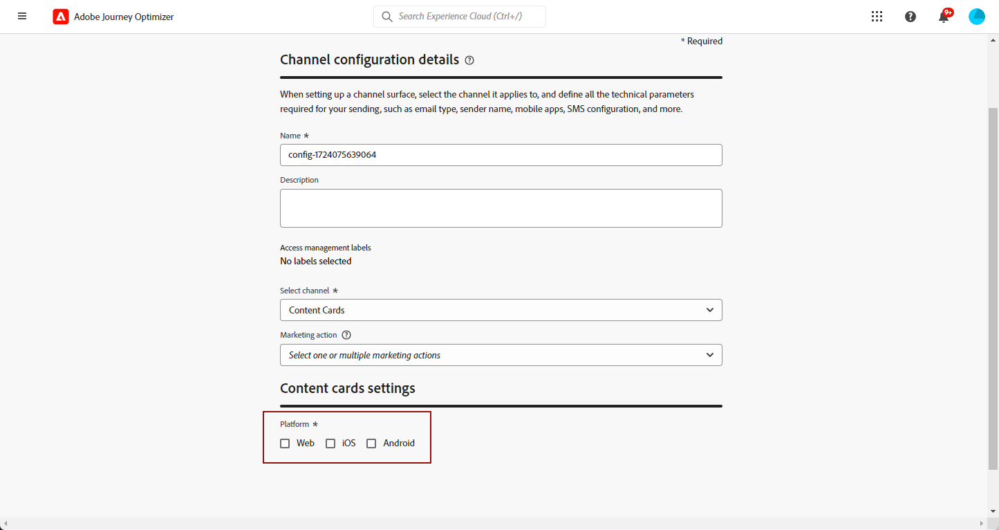

# Inhoudskaarten configureren {#content-card-configuration}

## Wat is een configuratie? {#surface-definition}

A **de ervaringsconfiguratie van de inhoudskaart** is om het even welke entiteit die voor gebruiker of systeeminteractie wordt ontworpen, die uniek door een **URI** wordt geïdentificeerd.

Met andere woorden, een oppervlak kan worden beschouwd als een container op elk hiërarchisch niveau met een bestaande entiteit (aanraakpunt).

* Dit kan een webpagina, een mobiele app, een bureaubladtoepassing, een specifieke inhoudslocatie binnen een grotere entiteit (bijvoorbeeld een `div` ) of een niet-standaard weergavepatroon (bijvoorbeeld een kiosk of een bureaubladtoepassingsbanner) zijn.

* Het kan zich ook uitstrekken tot specifieke stukken inhoudscontainers voor niet-display of abstracted-display doeleinden (bijvoorbeeld JSON-lobs die aan services worden geleverd).

* Dit kan ook een jokeroppervlak zijn dat overeenkomt met verschillende definities van het clientoppervlak (zo kan een locatie van een hoofdafbeelding op elke pagina van uw website bijvoorbeeld worden vertaald in een oppervlak-URI, zoals: web://mydomain.com/*#hero_image).

Een oppervlak-URI bestaat in principe uit meerdere secties:

1. **Type**: Web, mobileapp, atm, kiosk, tvcd, de dienst, enz.
1. **Bezit**: pagina URL of app bundel
1. **Container**: plaats op de pagina/app activiteit

In de onderstaande tabellen staan enkele voorbeelden van de oppervlakte-URI-definitie voor verschillende apparaten.

**Web en mobiel**

| Type | URI | Beschrijving |
| --------- | ----------- | ------- | 
| Web | `web://domain.com/path/page.html#element` | Vertegenwoordigt een individueel element binnen een specifieke pagina van een specifiek domein, waar een element een etiket zoals in de volgende voorbeelden kan zijn: hero_banner, top_nav, menu, footer, enz. |
| iOS-app | `mobileapp://com.vendor.bundle/activity#element` | Vertegenwoordigt een specifiek element binnen een inheemse toepassingsactiviteit, zoals een knoop of ander meningselement. |
| Android-app | `mobileapp://com.vendor.bundle/#element` | Vertegenwoordigt een specifiek element binnen een native app. |

**Andere apparatentypen**

| Type | URI | Beschrijving |
| --------- | ----------- | ------- | 
| Desktop | `desktop://com.vendor.bundle/#element` | Vertegenwoordigt een specifiek element binnen een toepassing, zoals een knoop, een menu, een heldenbanner, enz. |
| TV-app | `tvcd://com.vendor.bundle/#element` | Vertegenwoordigt een specifiek element binnen een apparaat dat op een slimme tv of tv is aangesloten - bundel-id. |
| Service | `service://servicename/#element` | Vertegenwoordigt een server-zijproces of andere handentiteit. |
| Kiosk | `kiosk://location/screen#element` | Voorbeeld van mogelijke extra oppervlaktetypen die gemakkelijk kunnen worden toegevoegd. |
| ATM | `atm://location/screen#element` | Voorbeeld van mogelijke extra oppervlaktetypen die gemakkelijk kunnen worden toegevoegd. |

**de oppervlakken van de Vervanging**

| Type | URI | Beschrijving |
| --------- | ----------- | ------- | 
| Jokertekenweb | `wildcard:web://domain.com/*#element` | Jokeroppervlak - vertegenwoordigt een afzonderlijk element op elke pagina onder een specifiek domein. |
| Jokertekenweb | `wildcard:web://*domain.com/*#element` | Jokeroppervlak - vertegenwoordigt een afzonderlijk element op elke pagina onder alle domeinen die eindigen met &quot;domain.com&quot;. |

## Een inhoudskaartconfiguratie maken {#create-config}

1. Open het menu **[!UICONTROL Channels]** > **[!UICONTROL Branding]** > **[!UICONTROL Channel configurations]** en klik op **[!UICONTROL Create channel configuration]** .

   

1. Voer een naam en beschrijving (optioneel) voor de configuratie in.

   >[!NOTE]
   >
   > Namen moeten beginnen met een letter (A-Z). Het mag alleen alfanumerieke tekens bevatten. U kunt ook onderstrepingsteken `_` -, punt `.` - en afbreekstreepjes `-` gebruiken.

1. Als u aangepaste of basislabels voor gegevensgebruik aan de configuratie wilt toewijzen, kunt u **[!UICONTROL Manage access]** selecteren. [&#x200B; leer meer over de Controle van de Toegang van het Niveau van Objecten (OLAC) &#x200B;](../administration/object-based-access.md).

1. Selecteer **[!UICONTROL Content card]** kanaal.

   

1. Selecteer **[!UICONTROL Marketing action]**(s) om het toestemmingsbeleid aan de berichten te associëren gebruikend deze configuratie. Alle toestemmingsbeleid verbonden aan de marketing actie wordt gebruikt om de voorkeur van uw klanten te respecteren. [Meer informatie](../action/consent.md#surface-marketing-actions)

1. Selecteer het platform waarop de ervaring met de inhoudskaart wordt toegepast.

   

1. Voor web:

   * Geef een **[!UICONTROL Page URL]** op om wijzigingen alleen toe te passen op één pagina.

   * U kunt ook een **[!UICONTROL Pages matching rule]** maken om meerdere URL&#39;s als doel in te stellen die overeenkomen met de opgegeven regel. Dit kan bijvoorbeeld worden gebruikt om wijzigingen overal op een website toe te passen, zoals het bijwerken van een hoofdbanner op alle pagina&#39;s of het toevoegen van een bovenste afbeelding aan weergave op elke productpagina. [Meer informatie](../web/web-configuration.md)

1. Voor iOS en Android:

   * Voer de **[!UICONTROL App id]** , **[!UICONTROL Location or path inside the app]** en **[!UICONTROL Preview URL]** in of selecteer deze.

1. Verzend uw wijzigingen.

U kunt nu de configuratie selecteren wanneer u uw ervaring met de inhoudskaart maakt.
