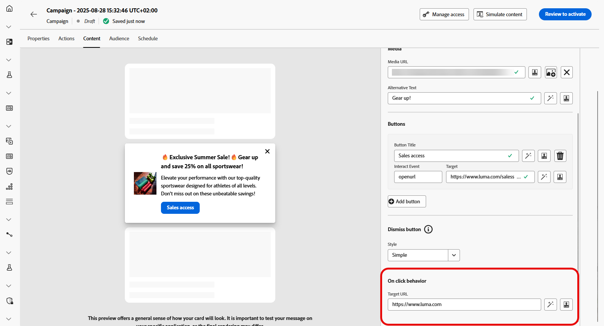

# Inhoud van inhoudskaarten ontwerpen {#design-content-card}

Het ontwerpconcept voor kaarten biedt een op formulieren gebaseerde ontwerpervaring die marketers basisinvoer biedt die kan worden gebruikt om door de ontwikkelaar te worden gerenderd.

Nadat de inhoud is gedefinieerd en gepersonaliseerd, kunt u deze controleren en activeren. Uw campagne wordt verzonden volgens het ingestelde schema. [&#x200B; leer meer op deze pagina &#x200B;](../campaigns/review-activate-campaign.md).

## Inhoudskaartlay-out

Kies in de sectie **[!UICONTROL Content card layout]** een van de drie opties voor de lay-out van afbeeldingen op basis van uw berichtvereisten.

* **[!UICONTROL Small image]**: geeft naast tekst een compacte afbeelding weer, ideaal voor berichten waarin inhoud voorrang heeft op visuele aspecten.

  Zie de Documentatie van Adobe Developer [&#x200B; voor iOS &#x200B;](https://developer.adobe.com/client-sdks/edge/adobe-journey-optimizer/content-card-ui/iOS/templates/smallimage-template/) en [&#x200B; voor Android &#x200B;](https://developer.adobe.com/client-sdks/edge/adobe-journey-optimizer/content-card-ui/Android/public-classes/state/smallimagecarduistate/) om meer te leren.

* **[!UICONTROL Large image]**: kenmerkt een opvallende afbeelding boven of naast de tekst, waardoor de visuele focus van uw bericht komt te liggen.

  Zie de Documentatie van Adobe Developer [&#x200B; voor iOS &#x200B;](https://developer.adobe.com/client-sdks/edge/adobe-journey-optimizer/content-card-ui/iOS/templates/largeimage-template/) en [&#x200B; voor Android &#x200B;](https://developer.adobe.com/client-sdks/edge/adobe-journey-optimizer/content-card-ui/Android/public-classes/state/largeimagecarduistate/) om meer te leren.

* **[!UICONTROL Image only]**: geeft de afbeelding weer zonder bijbehorende tekst, perfect voor visuele berichten of zelfstandige afbeeldingen.

  Zie de Documentatie van Adobe Developer [&#x200B; voor iOS &#x200B;](https://developer.adobe.com/client-sdks/edge/adobe-journey-optimizer/content-card-ui/iOS/templates/imageonly-template/) en [&#x200B; voor Android &#x200B;](https://developer.adobe.com/client-sdks/edge/adobe-journey-optimizer/content-card-ui/Android/public-classes/state/imageonlycarduistate/) om meer te leren.

## Inhoud, tabblad {#content-tab}

Via het tabblad **[!UICONTROL Content]** kunt u uw inhoudskaarten aanpassen door inhoud te definiëren en media en actieknoppen rechtstreeks vanuit dit tabblad toe te voegen.

### Tekstinhoud {#title-body}

Als u uw bericht wilt samenstellen, voert u de tekst in de velden **[!UICONTROL Title]** en **[!UICONTROL Body]** in.

Als u uw bericht verder wilt aanpassen, gebruikt u het pictogram **[!UICONTROL Personalization]** om gepersonaliseerde elementen toe te voegen. Voor gedetailleerde instructies op hoe te om de verpersoonlijkingseigenschappen te gebruiken, verwijs naar [&#x200B; deze sectie &#x200B;](../personalization/personalize.md).

### Media {#add-media}

Met het veld **[!UICONTROL Media]** kunt u uw inhoudskaarten verbeteren door media toe te voegen, waardoor uw presentatie aantrekkelijker kan worden voor eindgebruikers.

Als u media wilt opnemen, typt u de gewenste media in de URL of klikt u op het pictogram **[!UICONTROL Select Assets]** om te kiezen uit de elementen die zijn opgeslagen in de Assets-bibliotheek. [&#x200B; Leer meer over activabeheer &#x200B;](../integrations/assets.md).

+++Meer opties met geavanceerde opmaak

Als de **[!UICONTROL Advanced formatting mode]** is ingeschakeld, kunt u een **[!UICONTROL Alternative text]** voor schermlezingstoepassing en een ander element in het **[!UICONTROL Dark Mode Media URL]** -veld toevoegen.

+++

### Knoppen {#add-buttons}

Voeg knoppen toe waarmee gebruikers kunnen communiceren met uw inhoudskaarten.

1. Klik op **[!UICONTROL Add button]** om een nieuwe actieknop te maken.

1. Bewerk het knopveld **[!UICONTROL Title]** om het label op te geven dat op de knop wordt weergegeven.

1. Selecteer een **[!UICONTROL Interact event]** om te bepalen welke actie wordt teweeggebracht wanneer de gebruikers klikken of met de knoop in wisselwerking staan.

1. Voer in het veld **[!UICONTROL Target]** de URL of de koppeling in waarnaar gebruikers worden geleid na interactie met de knop.

<!--
+++More options with advanced formatting

If the **[!UICONTROL Advanced formatting mode]** is switched on, you can choose for your **[!UICONTROL Buttons]**:

* the **[!UICONTROL Font]**
* the **[!UICONTROL Pt size]**
* the **[!UICONTROL Font Color]**
* the **[!UICONTROL Alignment]**

+++
-->

### Knop Afwijzen {#close-button}

Kies de **[!UICONTROL Style]** voor de **[!UICONTROL Dismiss button]** om de weergave ervan aan te passen.

U kunt uit de volgende stijlen selecteren:

* **[!UICONTROL None]**
* **[!UICONTROL Simple]**
* **[!UICONTROL Circle]**

<!--
+++More options with advanced formatting

If the **[!UICONTROL Advanced formatting mode]** is switched on, you can choose for your **[!UICONTROL Header]** and **[!UICONTROL Body]**:

* the **[!UICONTROL Font]**
* the **[!UICONTROL Pt size]**
* the **[!UICONTROL Font Color]**
* the **[!UICONTROL Alignment]**
+++
-->

### Bij klikken, gedrag

Voer in het veld **[!UICONTROL Target URL]** de URL of de koppeling in die gebruikers naar het gewenste doel stuurt nadat ze met de inhoudskaart hebben gewerkt. Dit kan een externe website, een specifieke pagina in uw app of een andere locatie zijn waarnaar gebruikers op basis van hun interactie moeten verwijzen.

## Tabblad Gegevens

## Aangepaste gegevens {#custom-data}

Klik in de sectie **[!UICONTROL Custom data]** op **[!UICONTROL Add Key/Value pair]** om aangepaste variabelen in de payload op te nemen. Deze sleutel/waardeparen staan u toe om extra gegevens, afhankelijk van uw specifieke configuratie over te gaan. Zo kunt u gepersonaliseerde of dynamische inhoud, het volgen informatie, of andere gegevens toevoegen relevant voor uw opstelling.
