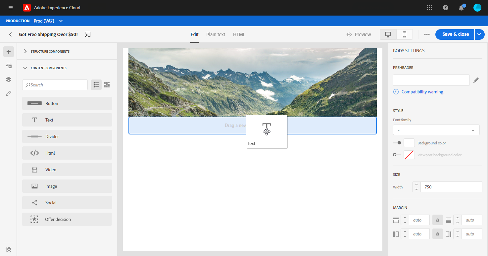
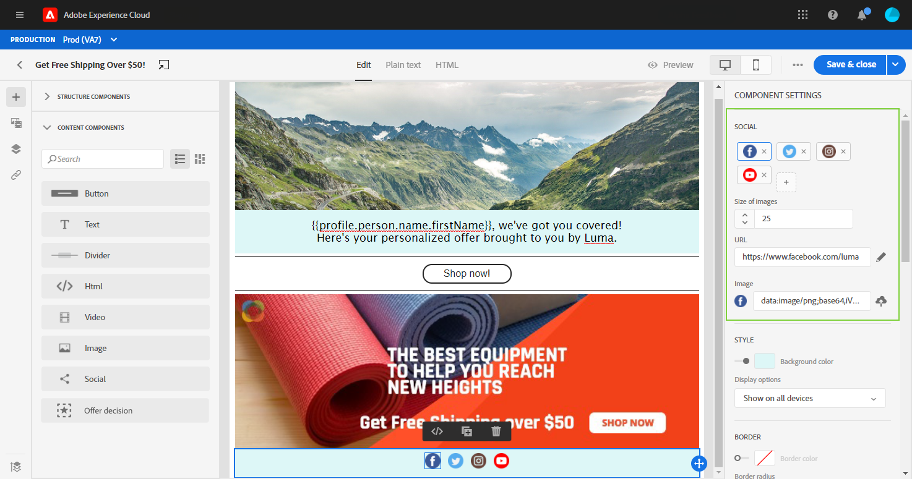

# De inhoudcomponenten {#content-components} van de e-mailontwerper gebruiken

>[!CONTEXTUALHELP]
>id="ac_content_components"
>title="Informatie over inhoudscomponenten"
>abstract="Inhoudscomponenten zijn lege plaatsaanduidingen voor inhoud die u kunt gebruiken om de lay-out van een e-mail te maken."

Als u uw e-mailinhoud helemaal zelf maakt, kunt u **[!UICONTROL Content components]** uw e-mail verder aanpassen met onbewerkte, lege onderdelen die u kunt gebruiken wanneer u deze eenmaal in een e-mail hebt geplaatst.
U kunt zo veel **[!UICONTROL Content components]** toevoegen aangezien u binnen **[!UICONTROL Structure component]** vereist die de lay-out van uw e-mail bepaalt.

## Knop {#buttons}

Met de component **[!UICONTROL Button]** kunt u meerdere knoppen in uw e-mail invoegen en het e-mailpubliek omleiden naar een andere pagina.

1. Vanaf **[!UICONTROL Content components]** slepen en neerzetten **[!UICONTROL Button]** in een **[!UICONTROL Structure component]**.

   

1. Klik op de knop die u net hebt toegevoegd om de tekst aan te passen en om toegang te krijgen tot **[!UICONTROL Components Settings]** in het rechterdeelvenster van de e-mailontwerper.

   

1. Voeg in het veld **[!UICONTROL Link]** van **[!UICONTROL Components Settings]** de URL toe waarnaar uw publiek moet worden omgeleid wanneer u op de knop klikt.

1. Kies hoe de doelgroep wordt omgeleid met de vervolgkeuzelijst **[!UICONTROL Target]**:

   * **[!UICONTROL None]**: Hiermee opent u de koppeling in hetzelfde frame als waarop u hebt geklikt (standaard).
   * **[!UICONTROL Blank]**: Hiermee opent u de koppeling in een nieuw venster of op een nieuw tabblad.
   * **[!UICONTROL Self]**: Hiermee opent u de koppeling in hetzelfde frame als waarop u hebt geklikt.
   * **[!UICONTROL Parent]**: Hiermee opent u de koppeling in het bovenliggende frame.
   * **[!UICONTROL Top]**: Hiermee opent u de koppeling in de volledige tekst van het venster.

   

1. U kunt uw knoop nu verder personaliseren door **[!UICONTROL Style]**, **[!UICONTROL Margin]** en **[!UICONTROL Border]** bijvoorbeeld te veranderen.

## Tekst {#text}

Met de component **[!UICONTROL Text]** kunt u tekst in uw e-mail invoegen. U kunt de kleur, stijl en grootte van de tekst aanpassen in **[!UICONTROL Component Settings]**.

1. Sleep **[!UICONTROL Text]** in **[!UICONTROL Content Components]** in een **[!UICONTROL Structure component]**.

   

1. Klik op de zojuist toegevoegde component om de tekst aan te passen en toegang te hebben tot **[!UICONTROL Components Settings]** in het rechterdeelvenster van de e-mailontwerper.

1. Wijzig de tekst met de volgende opties beschikbaar op de werkbalk:

   

   * **[!UICONTROL Change text style]**: u kunt uw tekst vet, cursief, onderstrepen of doorhalen.
   * **Uitlijning** wijzigen: kiest u tussen links, rechts, centreren of uitvullen voor de tekst.
   * **[!UICONTROL Create list]**: Voeg opsommingstekens of nummers toe aan uw tekst.
   * **[!UICONTROL Set heading]**: Voeg maximaal zes kopniveaus aan uw tekst toe.
   * **Tekengrootte**: Selecteer de tekengrootte van de tekst in pixels.
   * **[!UICONTROL Edit image]**: Voeg een afbeelding of een element toe aan uw tekstcomponent. [Meer informatie over middelenbeheer](assets-essentials.md).
   * **[!UICONTROL Show the source code]**: de broncode van de tekst weergeven. Het kan niet worden gewijzigd.
   * **[!UICONTROL Duplicate]**: Voeg een kopie van de tekstcomponent toe.
   * **[!UICONTROL Delete]**: Verwijder de geselecteerde tekstcomponent uit uw e-mail.
   * **[!UICONTROL Add personalization]**: Voeg verpersoonlijkingsgebieden toe om de inhoud van uw profielgegevens aan te passen. [Meer weten over content personalization](personalization/personalize.md)?

1. Voor een betere gebruikerservaring kunt u verpersoonlijkingsgebieden toevoegen om uw publiek te richten. Raadpleeg deze [sectie](personalization/personalize.md) voor meer informatie.

1. Pas **[!UICONTROL Text color]**, **[!UICONTROL Font family]** en **[!UICONTROL Size]** in **[!UICONTROL Components Settings]** aan.

   

## Scheidingslijn {#divider}

Gebruik de component **[!UICONTROL Divider]** om een scheidingslijn in te voegen om de lay-out en inhoud van uw e-mail te organiseren.
U kunt de kleur, de stijl en de grootte van de eindlijn selecteren in **[!UICONTROL Component Settings]**.

## HTML {#HTML}

Gebruik **[!UICONTROL HTML]** om de verschillende delen van uw bestaande HTML te kopiëren-kleven. Hierdoor kunt u gratis modulaire HTML-componenten maken.

Om een externe inhoud eenvoudig compatibel te maken met de e-mailontwerper, raadt Adobe u aan een geheel nieuw bericht te maken en de inhoud van uw bestaande e-mail naar componenten te kopiëren.

1. Sleep **[!UICONTROL HTML]** in **[!UICONTROL Content Components]** in een **[!UICONTROL Structure component]**.

   

1. Klik op de zojuist toegevoegde component en **[!UICONTROL Show the source code]** om de HTML toe te voegen.

   

1. Kopieer en plak de HTML-code die u aan uw e-mail wilt toevoegen en klik op **[!UICONTROL Save]**.

   

1. U kunt uw HTML nu verder aanpassen door **[!UICONTROL Style]**, **[!UICONTROL Margin]** en **[!UICONTROL Border]** bijvoorbeeld te veranderen of een verbinding toe te voegen om uw publiek aan een andere inhoud te richten.

## Afbeelding {#image}

Met de component **[!UICONTROL Image]** kunt u een afbeeldingsbestand van uw computer invoegen in uw e-mailbericht.

1. Sleep **[!UICONTROL Image]** in **[!UICONTROL Content Components]** in een **[!UICONTROL Structure component]**.

   

1. Klik **[!UICONTROL Browse]** om een beelddossier van uw computer te kiezen.

   U kunt ook op **[!UICONTROL Asset Picker]** klikken om elementen aan uw e-mail toe te voegen. Raadpleeg dit [gedeelte](assets-essentials.md) voor meer informatie over Elementen.

1. Klik op de toegevoegde component om uw **[!UICONTROL Content Components]** te configureren en toegang te krijgen tot **[!UICONTROL Components Settings]** in het rechterdeelvenster van de e-mailontwerper.

1. Stel de afbeeldingseigenschappen in:

   * **[!UICONTROL Image Title]** Hiermee kunt u een titel voor de afbeelding definiëren.
   * **[!UICONTROL Alt text]** Hiermee kunt u het bijschrift definiëren dat aan de afbeelding is gekoppeld. Dit komt overeen met het alt HTML-kenmerk.

   

1. U kunt uw afbeelding nu verder aanpassen door bijvoorbeeld **[!UICONTROL Style]**, **[!UICONTROL Margin]** en **[!UICONTROL Border]** te wijzigen of een koppeling toe te voegen om uw publiek om te leiden naar andere inhoud.

## Video {#Video}

>[!CONTEXTUALHELP]
>id="ac_edition_video"
>title="Video-instellingen"
>abstract="Gebruik deze component om een video in te voegen in uw e-mail. Video&#39;s werken niet voor alle e-mailclients. We raden u aan een fallback-afbeelding in te stellen."
>additional-url="https://www.emailonacid.com/blog/article/email-development/a_how_to_guide_to_embedding_html5_video_in_email/" text="Aanvullende informatie"

Met de component **[!UICONTROL Video]** kunt u een video in uw e-mail invoegen via een URL-koppeling.

1. Sleep **[!UICONTROL Video]** in **[!UICONTROL Content Components]** in een **[!UICONTROL Structure component]**.

   

1. Klik op de toegevoegde component om uw **[!UICONTROL Content Components]** te configureren en toegang te krijgen tot **[!UICONTROL Components Settings]** in het rechterdeelvenster van de e-mailontwerper.

1. Voeg uw video-URL toe in het veld **[!UICONTROL Video link]** van **[!UICONTROL Components Settings]**.

   

1. U kunt een **[!UICONTROL Poster image]** aan uw video toevoegen om een beeld te specificeren dat moet worden getoond tot uw publiek de spelknoop klikt.

1. U kunt uw afbeelding nu verder aanpassen door bijvoorbeeld **[!UICONTROL Style]**, **[!UICONTROL Margin]** en **[!UICONTROL Border]** te wijzigen.

## Sociaal {#social}

Met de component **[!UICONTROL Social]** kunt u koppelingen naar pagina&#39;s met sociale media in uw e-mail invoegen.

1. Sleep **[!UICONTROL Social]** in **[!UICONTROL Content Components]** in een **[!UICONTROL Structure component]**.

   

1. Klik op de toegevoegde component om uw **[!UICONTROL Content Components]** te configureren en toegang te krijgen tot **[!UICONTROL Components Settings]** in het rechterdeelvenster van de e-mailontwerper.

1. Kies in het veld **[!UICONTROL Social]** van **[!UICONTROL Components Settings]** welke sociale media u wilt toevoegen of verwijderen.

   

1. Kies de grootte van de pictogrammen in het veld **[!UICONTROL Size of images]**.

1. Klik op elk van uw pictogrammen voor sociale media om **[!UICONTROL URL]** te configureren waarnaar uw publiek wordt omgeleid.

   

1. U kunt de pictogrammen van elk van uw sociale media desgewenst ook wijzigen in het veld **[!UICONTROL Image]**.

1. U kunt uw pictogrammen voor sociale media nu verder aanpassen door **[!UICONTROL Style]**, **[!UICONTROL Margin]** en **[!UICONTROL Border]** te wijzigen.

## Besluit {#offer-decision} aanbieden

Gebruik de **[!UICONTROL Offer decision]** component om besluiten (die eerder als aanbiedingsactiviteiten worden bekend) in uw berichten op te nemen. Besluiten maken gebruik van Beslissingsbeheer om de beste aanbieding aan uw klanten te kiezen.

Verwante onderwerpen:

* [Aan de slag met Beslissingsbeheer](offers/get-started/starting-offer-decisioning.md).
* [Voeg gepersonaliseerde voorstellen in berichten](deliver-personalized-offers.md) toe.

