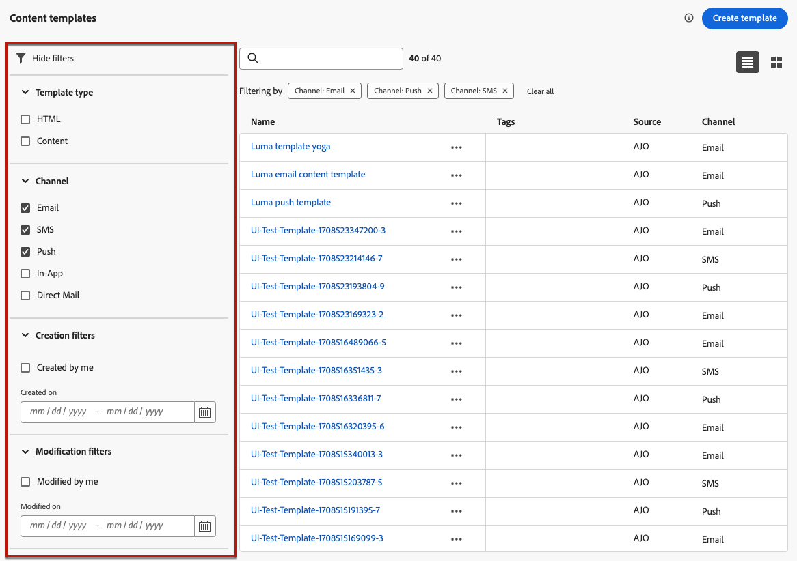
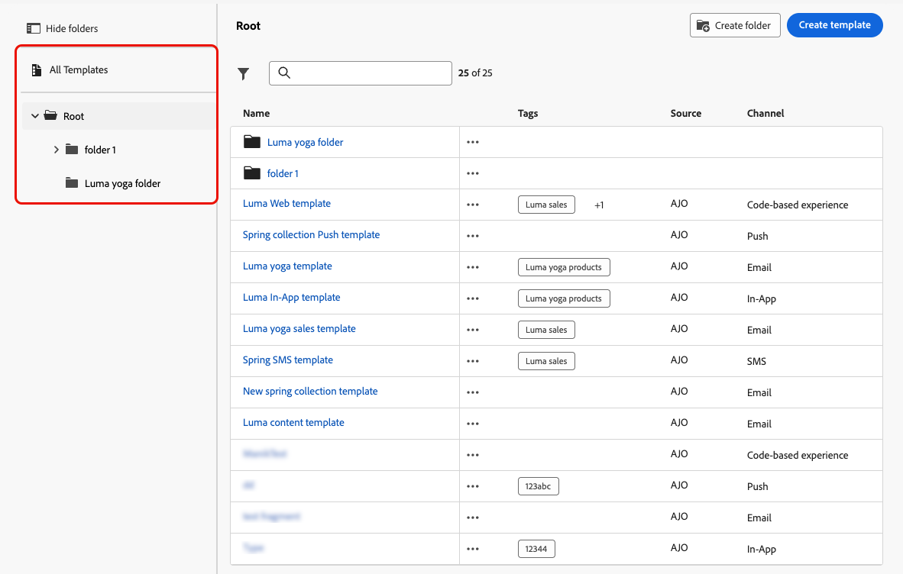
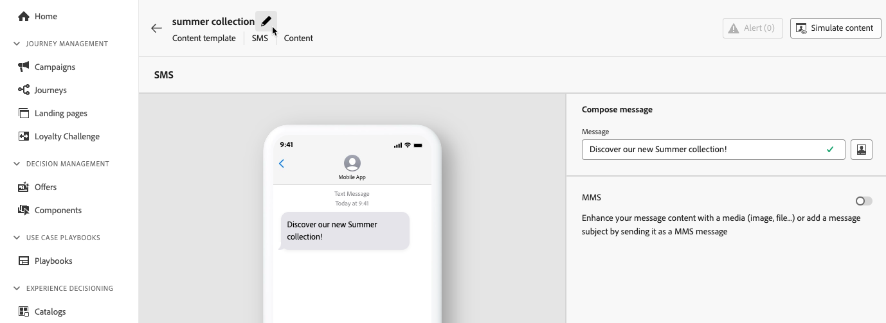

# Inhoudssjablonen openen en beheren {#access-manage-templates}

## Vereisten {#prerequisites}

Als u inhoudssjablonen wilt openen en beheren, moet u het volgende doen:

* {de toestemming van de Malplaatjes van 0} Inhoud **— Uw rol moet de** toestemming (onder het **[!UICONTROL Manage content templates]** 4&rbrace; middel van het Beheer van de Inhoud) omvatten. **&#x200B;**&#x200B;Zonder het, is het **menu van de Malplaatjes van de Inhoud** niet zichtbaar in de linkernavigatie. [&#x200B; Leer hoe te om toestemmingen te beheren &#x200B;](../administration/permissions.md)
* **Sandbox werkingsgebied** — De malplaatjes van de inhoud zijn zandbak-specifiek. Sjablonen die in een sandbox zijn gemaakt, zijn niet beschikbaar in een andere sandbox. Zorg ervoor dat u zich in de juiste sandbox bevindt voordat u naar een sjabloon zoekt.
* **de malplaatjes van HTML (afgekeurd)** — Beginnend Maart 2025, HTML-type inhoudsmalplaatjes worden afgekeurd. Bestaande HTML-sjablonen blijven toegankelijk, maar er kunnen geen nieuwe worden gemaakt.

## Sjablonen voor inhoud openen {#access}

Als u de lijst met inhoudssjablonen wilt openen, selecteert u **[!UICONTROL Content Management]** > **[!UICONTROL Content Templates]** in het linkermenu.

Alle sjablonen die in de huidige sandbox zijn gemaakt (dus van een rit of een campagne met de optie **[!UICONTROL Save as template]** of vanuit het menu **[!UICONTROL Content Templates]** ), worden weergegeven. [&#x200B; Leer hoe te om malplaatjes &#x200B;](#create-content-templates) tot stand te brengen

In het linkerdeelvenster kunt u inhoudssjablonen indelen in mappen. Standaard worden alle sjablonen weergegeven. Wanneer u een map selecteert, worden alleen de sjablonen en mappen weergegeven die in de geselecteerde map staan. [Meer informatie](#folders)

Als u een specifiek item wilt zoeken, typt u een naam in het zoekveld. Wanneer de a [&#x200B; omslag &#x200B;](#folders) wordt geselecteerd, is het onderzoek op alle inhoudsmalplaatjes of omslagen in het eerste niveau van hiërarchie van die omslag <!--(not nested items)--> van toepassing.

U kunt inhoudssjablonen sorteren op:

* Type
* Kanaal
* Aanmaakdatum of wijzigingsdatum
* De markeringen - [&#x200B; leren meer over markeringen &#x200B;](../start/search-filter-categorize.md#tags)

U kunt er ook voor kiezen alleen de items weer te geven die door u zijn gemaakt of gewijzigd.

>[!NOTE]
>
>Vanaf maart 2025 zijn inhoudssjablonen van het HTML-type afgekeurd. U kunt nog steeds bestaande HTML-inhoudssjablonen openen die eerder in [!DNL Journey Optimizer] zijn gemaakt.

## Mappen gebruiken om inhoudssjablonen te beheren {#folders}

Om uw inhoudsmalplaatjes gemakkelijk te navigeren, gebruik omslagen om hen effectiever in een gestructureerde hiërarchie te organiseren. Hierdoor kunt u de items indelen en beheren op basis van de behoeften van uw organisatie.

1. Klik op de knop **[!UICONTROL All content templates]** om alle items weer te geven die eerder zijn gemaakt zonder de mapgroep.

1. Klik op de map **[!UICONTROL Root]** om alle gemaakte mappen weer te geven.

   >[!NOTE]
   >
   >Als u nog geen mappen hebt gemaakt, worden alle inhoudssjablonen weergegeven.

1. Klik op een willekeurige map in de map **[!UICONTROL Root]** om de inhoud ervan weer te geven.

1. Als u op de map **[!UICONTROL Root]** of een andere map klikt, wordt de knop **[!DNL Create folder]** weergegeven. Selecteer het.

   

1. Typ een naam voor de nieuwe map en klik op **[!UICONTROL Save]** . De nieuwe map wordt boven op de lijst met inhoudssjablonen weergegeven in de map **[!UICONTROL Root]** of in de map die momenteel is geselecteerd.

1. U kunt op de knop **[!UICONTROL More actions]** klikken om de map een andere naam te geven of te verwijderen.

   

1. Met de knop **[!UICONTROL More actions]** kunt u de inhoudssjabloon ook naar een andere bestaande map verplaatsen.

   

1. Navigeer naar de map die u net hebt gemaakt. Elk nieuw inhoudsmalplaatje u [&#x200B; creeert &#x200B;](create-content-templates.md) van hier wordt bewaard in de huidige omslag.

   

## Inhoudssjablonen bewerken en verwijderen {#edit}

* Als u sjablooninhoud wilt bewerken, klikt u op het gewenste item in de lijst en brengt u de gewenste wijzigingen aan. U kunt de eigenschappen van de inhoudssjabloon ook bewerken door op de knop Bewerken naast de naam van de sjabloon te klikken.

  

* Als u een sjabloon wilt verwijderen, selecteert u de knop **[!UICONTROL More actions]** naast de gewenste sjabloon en selecteert u **[!UICONTROL Delete]** .

  

>[!NOTE]
>
>Wanneer een sjabloon wordt bewerkt of verwijderd, hebben campagnes of reizen met inbegrip van inhoud die met deze sjabloon is gemaakt, geen invloed op deze sjabloon.

## [!BADGE &#x200B; Beperkte malplaatjes van de Vertoning van de Beschikbaarheid &#x200B;]{type=Informative} als duimnagels {#template-thumbnails}

Selecteer de modus **[!UICONTROL Grid view]** om elke sjabloon als een miniatuur weer te geven.

>[!AVAILABILITY]
>
>Dit vermogen wordt vrijgegeven in Beperkte Beschikbaarheid (LA) voor een kleine reeks klanten.

>[!NOTE]
>
>U kunt alleen juiste miniaturen genereren voor e-mailinhoudssjablonen van het HTML-type.

Wanneer u inhoud bijwerkt, wacht u een paar seconden totdat de wijzigingen in de miniatuur worden doorgevoerd.

## Problemen oplossen {#troubleshooting}

+++Ik kan het menu Inhoudssjablonen niet zien in de linkernavigatie

Uw rol mist **inhoudsmalplaatjes** toestemming beheren. Vraag uw beheerder om het **1&rbrace; middel van het Beheer van de Inhoud met** toe te voegen leidt inhoudsmalplaatjes **toestemming aan uw rol.** [Meer informatie](../administration/permissions.md)

+++

+++Een sjabloon die ik heb gemaakt, wordt niet weergegeven in de lijst

Controleer of u zich in de juiste sandbox bevindt. Sjablonen zijn specifiek voor de sandbox. Controleer ook of een map is geselecteerd in het linkerdeelvenster. Wanneer een map is geselecteerd, worden alleen sjablonen in die map weergegeven. Klik op **[!UICONTROL All content templates]** om alle sjablonen ongeacht de map weer te geven.

+++

+++Ik heb een sjabloon bewerkt, maar mijn campagne- of reisinhoud is niet bijgewerkt

Als u een sjabloon bewerkt of verwijdert, worden campagnes of reizen die met de sjabloon zijn gemaakt, niet retroactief bijgewerkt. Inhoud wordt gekopieerd op het moment van gebruik. Als u bestaande inhoud wilt bijwerken, bewerkt u de campagne of de reis rechtstreeks.

+++

## Inhoudssjablonen exporteren naar een andere sandbox {#export}

Met Journey Optimizer kunt u een inhoudssjabloon van de ene naar de andere sandbox kopiëren. U kunt bijvoorbeeld een sjabloon van de zandbakomgeving van het werkgebied kopiëren naar de productiefasen.

Het exemplaarproces wordt uitgevoerd via de uitvoer en de invoer van het a **pakket** tussen de bron en doelzandbakken. De gedetailleerde informatie over hoe te om voorwerpen uit te voeren en hen in een doelzandbak in deze sectie in te voeren is beschikbaar: [&#x200B; de voorwerpen van het Exemplaar aan een andere zandbak &#x200B;](../configuration/copy-objects-to-sandbox.md)

