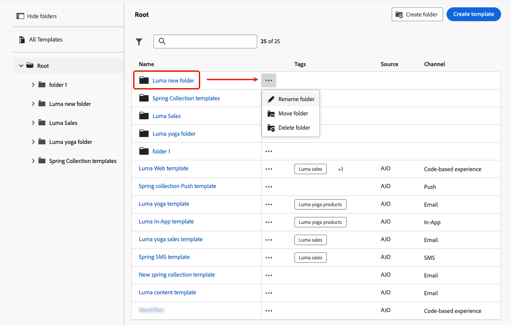
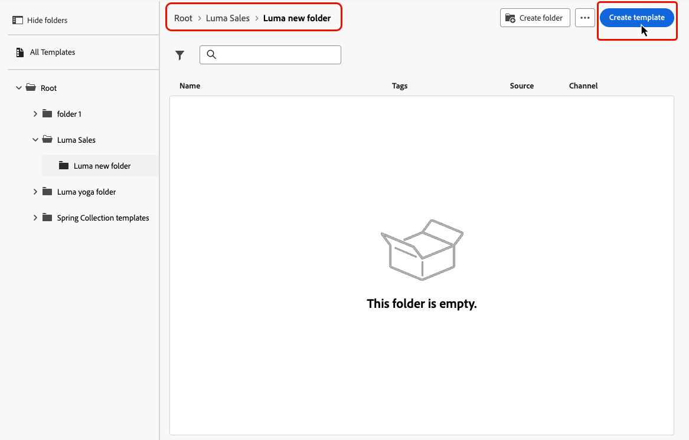

# Inhoudssjablonen openen en beheren {#access-manage-templates}

## Sjablonen voor inhoud openen {#access}

Als u de lijst met inhoudssjablonen wilt openen, selecteert u **[!UICONTROL Content Management]** > **[!UICONTROL Content Templates]** in het linkermenu.

Alle sjablonen die in de huidige sandbox zijn gemaakt (van een rit of een campagne met de optie **[!UICONTROL Save as template]** in het menu **[!UICONTROL Content Templates]** ), worden weergegeven. [ Leer hoe te om malplaatjes ](#create-content-templates) tot stand te brengen

In het linkerdeelvenster kunt u inhoudssjablonen indelen in mappen. Standaard worden alle sjablonen weergegeven. Wanneer u een map selecteert, worden alleen de sjablonen en mappen weergegeven die in de geselecteerde map staan. [Meer informatie](#folders)

Als u een specifiek item wilt zoeken, typt u een naam in het zoekveld. Wanneer de a [ omslag ](#folders) wordt geselecteerd, is het onderzoek op alle inhoudsmalplaatjes of omslagen in het eerste niveau van hiërarchie van die omslag <!--(not nested items)--> van toepassing.

U kunt inhoudssjablonen sorteren op:
* Type
* Kanaal
* Aanmaakdatum of wijzigingsdatum
* De markeringen - [ leren meer over markeringen ](../start/search-filter-categorize.md#tags)

U kunt er ook voor kiezen om alleen de zelf gemaakte of gewijzigde items weer te geven.

>[!NOTE]
>
>Vanaf maart 2025 zijn de sjablonen voor HTML-inhoud nu vervangen. U kunt nog steeds bestaande HTML-inhoudssjablonen openen die eerder in [!DNL Journey Optimizer] zijn gemaakt.

## Mappen gebruiken om inhoudssjablonen te beheren {#folders}

Om uw inhoudsmalplaatjes gemakkelijk te navigeren, kunt u omslagen gebruiken om hen effectiever in een gestructureerde hiërarchie te organiseren. Hierdoor kunt u de items indelen en beheren op basis van de behoeften van uw organisatie.

1. Klik op de knop **[!UICONTROL All content templates]** om alle items weer te geven die eerder zijn gemaakt zonder de mapgroep.

1. Klik op de map **[!UICONTROL Root]** om alle gemaakte mappen weer te geven.

   >[!NOTE]
   >
   >Als u nog geen mappen hebt gemaakt, worden alle inhoudssjablonen weergegeven.

1. Klik op een willekeurige map in de map **[!UICONTROL Root]** om de inhoud ervan weer te geven.

1. Als u op de map **[!UICONTROL Root]** of een andere map klikt, wordt de knop **[!DNL Create folder]** weergegeven. Selecteer het.

   

1. Typ een naam voor de nieuwe map en klik op **[!UICONTROL Save]** . De nieuwe map wordt boven op de lijst met inhoudssjablonen weergegeven in de map **[!UICONTROL Root]** of in de map die momenteel is geselecteerd.

1. U kunt op de knop **[!UICONTROL More actions]** klikken om de map een andere naam te geven of te verwijderen.

   

1. Met de knop **[!UICONTROL More actions]** kunt u de inhoudssjabloon ook naar een andere bestaande map verplaatsen.

   

1. Nu kunt u naar de map navigeren die u net hebt gemaakt. Elk nieuw inhoudsmalplaatje u [ creeert ](create-content-templates.md) van hier wordt bewaard in de huidige omslag.

   

## Inhoudssjablonen bewerken en verwijderen {#edit}

* Als u sjablooninhoud wilt bewerken, klikt u op het gewenste item in de lijst en brengt u de gewenste wijzigingen aan. U kunt de eigenschappen van de inhoudssjabloon ook bewerken door op de knop Bewerken naast de naam van de sjabloon te klikken.

  

* Als u een sjabloon wilt verwijderen, selecteert u de knop **[!UICONTROL More actions]** naast de gewenste sjabloon en selecteert u **[!UICONTROL Delete]** .

  

>[!NOTE]
>
>Wanneer een sjabloon wordt bewerkt of verwijderd, hebben campagnes of reizen met inbegrip van inhoud die met deze sjabloon is gemaakt, geen invloed op deze sjabloon.

## [!BADGE  Beperkte malplaatjes van de Vertoning van de Beschikbaarheid ]{type=Informative} als duimnagels {#template-thumbnails}

Selecteer de modus **[!UICONTROL Grid view]** om elke sjabloon als een miniatuur weer te geven.

>[!AVAILABILITY]
>
>Dit vermogen wordt vrijgegeven in Beperkte Beschikbaarheid (LA) voor een kleine reeks klanten.

>[!NOTE]
>
>Er kunnen momenteel alleen juiste miniaturen worden gegenereerd voor e-mailinhoudssjablonen van het HTML-type.

Wanneer u inhoud bijwerkt, moet u mogelijk een paar seconden wachten voordat de wijzigingen in de miniatuur worden doorgevoerd.

## Inhoudssjablonen exporteren naar een andere sandbox {#export}

Met Journey Optimizer kunt u een inhoudssjabloon van de ene naar de andere sandbox kopiëren. U kunt bijvoorbeeld een sjabloon van de zandbakomgeving van het werkgebied kopiëren naar de productiefasen.

Het exemplaarproces wordt gedragen via de uitvoer en de invoer van het a **pakket** tussen de bron en doelzandbakken. De gedetailleerde informatie over hoe te om voorwerpen uit te voeren en hen in een doelzandbak in deze sectie in te voeren is beschikbaar: [ de voorwerpen van het Exemplaar aan een andere zandbak ](../configuration/copy-objects-to-sandbox.md)
