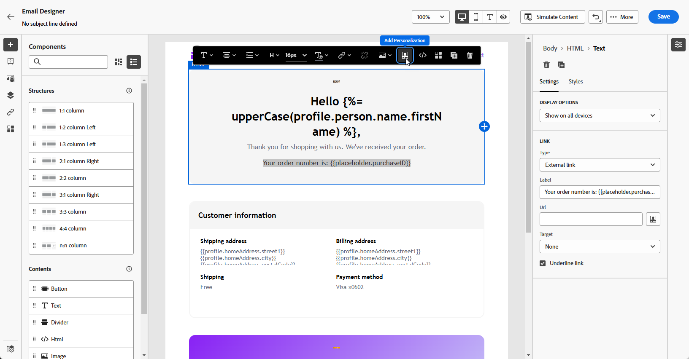
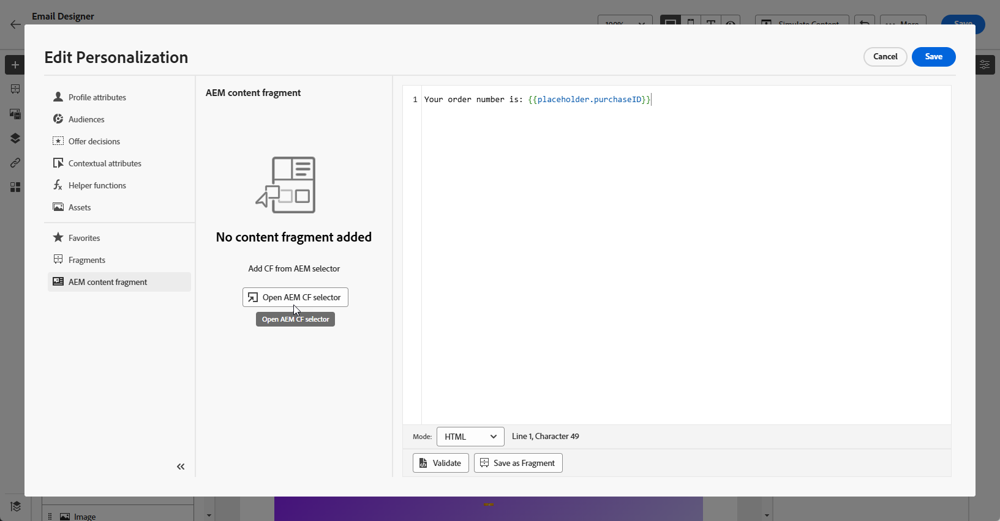
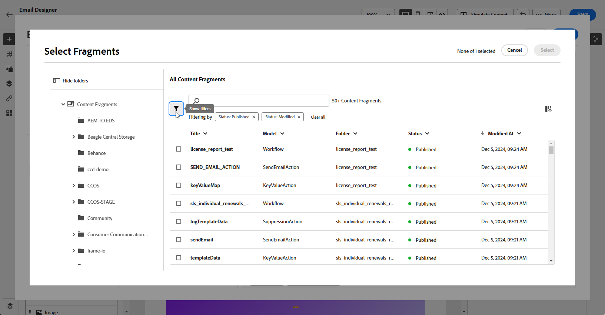
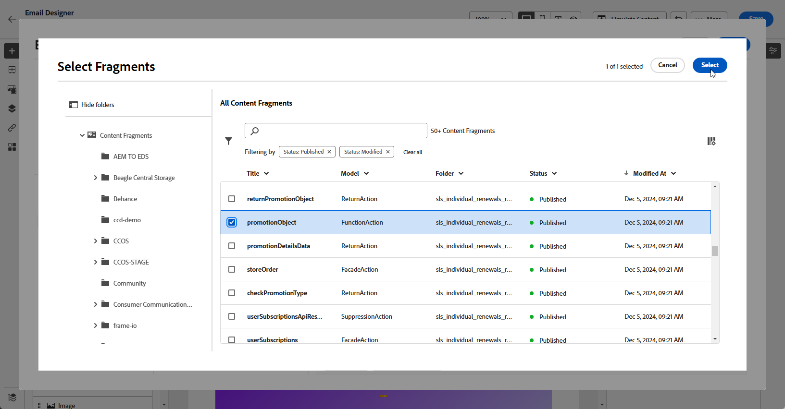

# Adobe Experience Manager-inhoudsfragmenten {#aem-fragments}

Door Adobe Experience Manager te integreren met Adobe Journey Optimizer kunt u nu uw AEM inhoudsfragmenten naadloos opnemen in uw Journey Optimizer-e-mailinhoud. Deze gestroomlijnde verbinding vereenvoudigt het proces van toegang tot en hefboomwerking van AEM inhoud, toelatend de verwezenlijking van gepersonaliseerde en dynamische campagnes en reizen.

Om meer op AEM het Fragment van de Inhoud te leren, verwijs naar [ documentatie van de Experience Manager ](https://experienceleague.adobe.com/en/docs/experience-manager-cloud-service/content/sites/authoring/fragments/content-fragments).

## Beperkingen {#limitations}

* Alleen beschikbaar voor e-mailkanaal.

* Gebruikers kunnen momenteel niet wisselen met de AEM instantie waarmee ze zijn verbonden, aangezien elke sandbox tot één instantie is beperkt.

* Het wordt aanbevolen het aantal gebruikers dat toegang heeft tot het publiceren van inhoudsfragmenten te beperken om het risico op onopzettelijke fouten in e-mails te verminderen.

* Voor meertalige inhoud wordt alleen de handmatige stroom ondersteund.

* Varianten worden momenteel niet ondersteund.

* U moet een specifieke tag voor Journey Optimizer maken.

+++ Meer informatie over het maken van je Journey Optimizer-tag

   1. Heb toegang tot uw **Experience Manager** milieu.

   1. Van het **menu van Hulpmiddelen**, navigeer aan het **Algemene** lusje en selecteer **Tags**.

   1. Klik **creeer een Nieuwe Markering**.

   1. Controleer of de id voldoet aan de volgende syntaxis: `ajo-enabled:{AJO-OrgId}/{AJO-SandboxName}` .

   1. Klik **creëren**.

  U kunt deze Journey Optimizer-tag nu toewijzen aan inhoudsfragmenten.
+++

## AEM inhoudsfragmenten toevoegen {#aem-add}

Na het creëren van en het personaliseren van uw [ AEM de Fragmenten van de Inhoud ](https://experienceleague.adobe.com/en/docs/experience-manager-cloud-service/content/sites/authoring/fragments/content-fragments), kunt u het aan uw campagne of reis van de optimalisator van de Reis nu invoeren.

1. Na het creëren van uw [ Campagne ](../email/create-email.md) of [ Reis ](../email/create-email.md) met een e-mailactie, heb toegang tot de e-mailontwerper om de e-mailinhoud te vormen. [Meer informatie](../email/get-started-email-design.md)

1. Klik in een tekstblok of in de onderwerpregel en selecteer **[!UICONTROL Add Personalization]** in de contextuele werkbalk.

   

1. Klik in het menu **[!UICONTROL AEM Content Fragment]** in het linkerdeelvenster op **[!UICONTROL Open AEM CF selector]** .

   

1. Selecteer een **[!UICONTROL Content Fragment]** in de lijst met beschikbare items om deze te importeren in uw Journey Optimizer-inhoud.

1. Klik op **[!UICONTROL Show filters]** om de lijst met inhoudsfragmenten te verfijnen.

   Standaard is het filter Inhoudsfragment vooraf ingesteld om alleen goedgekeurde inhoud weer te geven.

   

1. Nadat u **[!UICONTROL Content Fragment]** hebt geselecteerd, klikt u op **[!UICONTROL Select]** om het te openen.

   

1. Kies de gewenste velden in uw **[!UICONTROL Content Fragment]** om aan uw inhoud toe te voegen. U kunt inhoud toevoegen of de waarde ervan kopiëren.

   Als u ervoor kiest de waarde te kopiëren, worden toekomstige updates van **[!UICONTROL Content Fragment]** niet weerspiegeld in uw campagne of reis.

   

1. Klik op **[!UICONTROL Save]** en controleer uw bericht in de voorvertoning. U kunt nu uw berichtinhoud zoals die in [ wordt gedetailleerd deze sectie ](preview.md) testen en controleren.

Zodra u uw tests hebt uitgevoerd en de inhoud bevestigd, kunt u uw e-mail naar uw publiek met uw [ Campagne ](../campaigns/review-activate-campaign.md) of [ Reis ](../building-journeys/publishing-the-journey.md) verzenden.
