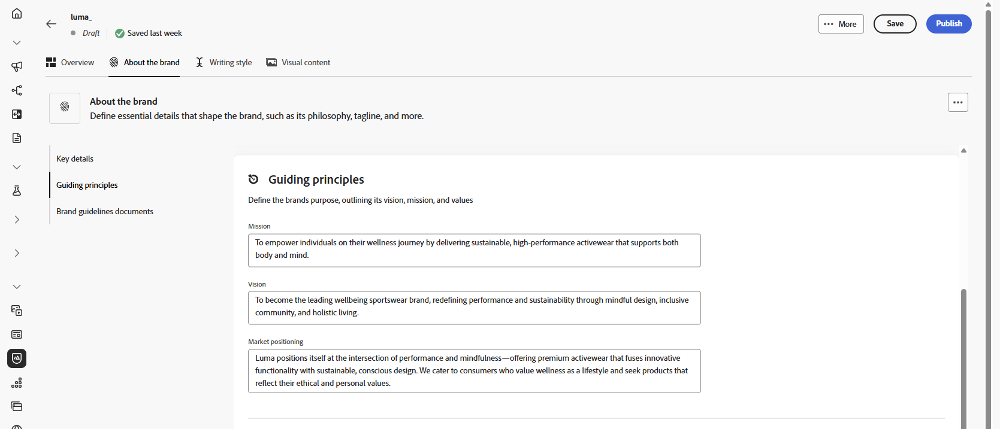
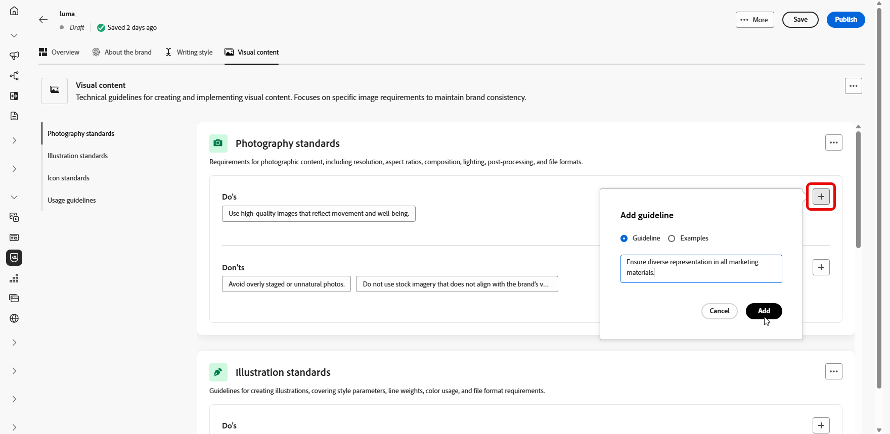

# Uw merk aanpassen {#brands-personalize}

## Informatie over het merk {#about-brand}

Gebruik het tabblad **[!UICONTROL About the brand]** om de belangrijkste identiteit van uw merk vast te stellen: het doel, de persoonlijkheid, de taglijn en andere definiërende kenmerken.

1. Begin door de basisinformatie voor uw merk in te vullen in de categorie **[!UICONTROL Key details]** :

   * **[!UICONTROL Brand Kit Name]**: voer de naam van de merkkit in.

   * **[!UICONTROL When to Use]**: geef scenario&#39;s of contexten op waarop deze merkkit moet worden toegepast.

   * **[!UICONTROL Brand Name]**: voer de officiële naam van het merk in.

   * **[!UICONTROL Brand Description]**: geef een overzicht van wat dit merk vertegenwoordigt.

   * **[!UICONTROL Default Tagline]**: voeg de primaire coderegel toe die aan het merk is gekoppeld.

     

1. Geef in de categorie **[!UICONTROL Guiding principles]** uitleg over de kernrichting en filosofie van uw merk:

   * **[!UICONTROL Mission]**: Geef het doel van uw merk op.

   * **[!UICONTROL Vision]**: beschrijf uw langetermijndoel of gewenste toekomstige staat.

   * **[!UICONTROL Market Positioning]**: leg uit hoe uw merk zich op de markt bevindt.

     

1. Van de **[!UICONTROL Core brand values]** categorie, klik  toevoegen om de kernwaarden van het merk toe te voegen en de details in te vullen:

   * **[!UICONTROL Value]**: geef een naam op voor een kernmerk.

   * **[!UICONTROL Description]**: leg uit wat deze waarde aan uw merk betekent.

   * **[!UICONTROL Behaviors]**: schets de handelingen of houdingen die deze waarde in de praktijk weerspiegelen.

   * **[!UICONTROL Manifestations]**: geef voorbeelden van hoe deze waarde wordt uitgedrukt in echte branding.

     

1. Indien nodig, klik het  pictogram om één van uw waarde van het kernmerk bij te werken of te schrappen.

   

U kunt uw merk verder personaliseren of [&#x200B; uw merk &#x200B;](brands.md#create-brand-kit) publiceren.

## Schrijfstijl {#writing-style}

>[!CONTEXTUALHELP]
>id="ajo_brand_writing_style"
>title="Stijluitlijningsscore schrijven"
>abstract="De sectie Schrijfstijl definieert normen voor taal, opmaak en structuur om te zorgen voor duidelijke, consistente inhoud. De uitlijningsscore, van hoog naar laag, laat zien hoe goed uw inhoud deze richtlijnen volgt en geeft gebieden voor verbetering aan."

In de sectie **[!UICONTROL Writing style]** worden de standaarden voor het schrijven van inhoud beschreven, met een gedetailleerde beschrijving van de manier waarop taal, opmaak en structuur moeten worden gebruikt voor het behoud van helderheid, coherentie en consistentie in alle materialen.

+++ Beschikbare categorie en voorbeelden

<table>
  <thead>
    <tr>
      <th>Categorie</th>
      <th>Subcategorie</th>
      <th>Voorbeeld van richtlijnen</th>
      <th>Voorbeeld van uitsluitingen</th>
    </tr>
  </thead>
  <tbody>
    <tr>
      <td rowspan="4">Normen voor het maken van inhoud</td>
      <td>Merk Messaging-standaarden</td>
      <td>Benadruk innovatie en klant-eerste overseinen.</td>
      <td>U mag de productmogelijkheden niet overbelasten.</td>
    </tr>
    <tr>
      <td>Taglinegebruik</td>
      <td>Plaats de tag onder het logo op alle digitale marketingmiddelen.</td>
      <td>Wijzig of vertaal de taglijn niet.</td>
    </tr>
    <tr>
      <td>Core Messaging</td>
      <td>Benadruk de belangrijkste voordeel verklaring-zulke als verbeterde productiviteit.</td>
      <td>Gebruik geen ongerelateerde waardevoorstellen.</td>
    </tr>
    <tr>
      <td>Naamgevingsstandaarden</td>
      <td>Gebruik eenvoudige, beschrijvende namen, zoals "ProScheduler".</td>
      <td>Gebruik geen complexe termen of speciale tekens.</td>
    </tr>
    <tr>
      <td rowspan="5">Merk Communication-stijl</td>
      <td>Merk Persoonlijke kenmerken</td>
      <td>Vriendelijk en toegankelijk.</td>
      <td>Wees geen nederlaag.</td>
    </tr>
    <tr>
      <td>Schrijfmiddelen</td>
      <td>Zorgt dat zinnen kort en ondoeltreffend blijven.</td>
      <td>Gebruik geen overdreven jargon.</td>
    </tr>
    <tr>
      <td>Situatietoon</td>
      <td>Houd een professionele toon in crisiscommunicatie.</td>
      <td>Wees niet afwijzend bij het ondersteunen van communicatie.</td>
    </tr>
    <tr>
      <td>Richtlijnen voor woordkeuze</td>
      <td>Gebruik woorden als "innovatief" en "slim".</td>
      <td>Vermijd woorden als "goedkoop" of "hack".</td>
    </tr>
    <tr>
      <td>Taalstandaarden</td>
      <td>Volg de Amerikaanse conventies in het Engels.</td>
      <td>Vermeng Brits en Amerikaans spelletje niet.</td>
    </tr>
    <tr>
      <td rowspan="3">Normen voor juridische naleving</td>
      <td>Handelsmerkstandaarden</td>
      <td>Gebruik altijd het symbool ™ of ®.</td>
      <td>Laat juridische symbolen niet weg wanneer dat nodig is.</td>
    </tr>
    <tr>
      <td>Copyrightstandaarden</td>
      <td>Inclusief copyrightkennisgevingen over marketingmaterialen.</td>
      <td>Gebruik geen inhoud van derden zonder toestemming.</td>
    </tr>
    <tr>
      <td>Disclaimingstandaarden</td>
      <td>Dislaimers leesbaar weergeven op digitale middelen.</td>
      <td>Verberg disclaimers niet in onzichtbare gebieden.</td>
    </tr>
</table>

+++

 

U past de **[!UICONTROL Writing Style]** als volgt aan:

1. Klik op het tabblad **[!UICONTROL Writing Style]** op  om een hulplijn, uitzondering of uitsluiting toe te voegen.

1. Voer uw richtlijn, uitzondering of uitsluiting in. U kunt ook **[!UICONTROL Examples]** opnemen om beter aan te geven hoe deze toepassing moet worden toegepast.

   

1. Specificeer de **context van het Gebruik** voor uw richtlijn, uitzondering of uitsluiting:

   * **[!UICONTROL Channel type]**: kies waar deze richtlijn, uitzondering of uitsluiting van toepassing moet zijn. U wilt bijvoorbeeld dat een specifieke schrijfstijl alleen wordt weergegeven in e-mail, mobiel, Afdrukken of andere communicatiekanalen.

   * **[!UICONTROL Element type]**: geef op op op welk inhoudselement de regel van toepassing is. Dit kan elementen bevatten zoals koppen, knoppen, koppelingen of andere componenten in de inhoud.

     

1. Klik op **[!UICONTROL Add]** als uw hulplijn, uitzondering of uitsluiting is ingesteld.

1. Selecteer zo nodig een van de hulplijnen of uitsluitingen die u wilt bijwerken of verwijderen.

1. Klik het  om uw voorbeeld of het  pictogram uit te geven om het te schrappen.

   

U kunt uw merk verder personaliseren of [&#x200B; uw merk &#x200B;](#create-brand-kit) publiceren.

## Visuele inhoud {#visual-content}

>[!CONTEXTUALHELP]
>id="ajo_brand_imagery"
>title="Alignment score voor visuele inhoud"
>abstract="De visuele Score van de Uitlijning van Inhoud wijst erop hoe goed uw inhoud uw gevormde merkrichtlijnen aanpast. Met scores van hoog naar laag kunt u de uitlijning in één oogopslag beoordelen. Verken de verschillende categorieën om gebieden voor verbetering te identificeren en elementen te identificeren die buiten merknaam kunnen zijn."

In de sectie **[!UICONTROL Visual Content]** worden de standaarden voor afbeeldingen en ontwerpen gedefinieerd, waarin de specificaties worden beschreven die nodig zijn om een uniform en consistent merkgebruik te behouden.

+++ Beschikbare categorieën en voorbeelden

<table>
  <thead>
    <tr>
      <th>Categorie</th>
      <th>Voorbeeld van richtlijnen</th>
      <th>Voorbeeld van uitsluitingen</th>
    </tr>
  </thead>
  <tbody>
    <tr>
      <td>Fotostandaarden</td>
      <td>Gebruik natuurlijke belichting voor buitenschoten.</td>
      <td>Vermijd te veel bewerkte of gepixeleerde afbeeldingen.</td>
    </tr>
    <tr>
      <td>Illustratienormen</td>
      <td>Gebruik schone, minimalistische stijlen.</td>
      <td>Vermijd al te complex.</td>
    </tr>
    <tr>
      <td>Pictogramstandaarden</td>
      <td>Gebruik een consistent rastersysteem van 24 px.</td>
      <td>U kunt pictogramafmetingen niet mengen, inconsistente lijndikten gebruiken of van rasterregels afwijken.</td>
    </tr>
    <tr>
      <td>Richtlijnen voor gebruik</td>
      <td>Kies levensstijlafbeeldingen die overeenkomen met echte klanten die het product in professionele omgevingen gebruiken.</td>
      <td>Gebruik geen afbeeldingen die de toon van het merk tegenspreken of die uit de context vallen.</td>
    </tr>
</table>

+++

 

U past de **[!UICONTROL Visual content]** als volgt aan:

1. Klik op het tabblad **[!UICONTROL Visual content]** op  om een hulplijn, uitsluiting of voorbeeld toe te voegen.

1. Voer uw richtlijn, uitsluiting of voorbeeld in.

   

1. Specificeer de **context van het Gebruik** voor uw richtlijn of uitsluiting:

   * **[!UICONTROL Channel type]**: kies waar deze richtlijn, uitzondering of uitsluiting van toepassing moet zijn. U wilt bijvoorbeeld dat een specifieke schrijfstijl alleen wordt weergegeven in e-mail, mobiel, Afdrukken of andere communicatiekanalen.

   * **[!UICONTROL Element type]**: geef op op op welk inhoudselement de regel van toepassing is. Dit kan elementen bevatten zoals koppen, knoppen, koppelingen of andere componenten in de inhoud.

     

1. Klik op **[!UICONTROL Add]** als uw hulplijn, uitzondering of uitsluiting is ingesteld.

1. Als u een afbeelding met het juiste gebruik wilt toevoegen, selecteert u **[!UICONTROL Example]** en klikt u op **[!UICONTROL Select image]** . U kunt ook een afbeelding toevoegen waarin onjuist gebruik wordt getoond als uitsluitingsvoorbeeld.

   

1. Selecteer zo nodig een van de hulplijnen of uitsluitingen die u wilt bijwerken of verwijderen.

1. Selecteer één uw voorbeeld om het bij te werken, vervang het beeld of klik het  pictogram om het te schrappen.

   

U kunt uw merk verder personaliseren of [&#x200B; uw merk &#x200B;](brands.md#create-brand-kit) publiceren.

<!--
## Colors {#colors}

The **[!UICONTROL Colors]** section the standards for your brand's color system, outlining how colors are selected, organized, and applied across experiences. It ensures consistent use of primary, secondary, accent, and neutral colors to maintain a cohesive, accessible, and recognizable brand identity.

+++ Available categories and examples

<table>
  <thead>
    <tr>
      <th>Category</th>
      <th>Guidelines Example</th>
      <th>Exclusions Example</th>
    </tr>
  </thead>
  <tbody>
    <tr>
      <td>Primary colors</td>
      <td>Use primary brand colors for logos, headers, and main call-to-action elements.</td>
      <td>Do not substitute or modify primary brand colors.</td>
    </tr>
    <tr>
      <td>Secondary colors</td>
      <td>Use secondary colors to support layouts, illustrations, and UI components.</td>
      <td>Do not let secondary colors overpower primary brand colors.</td>
    </tr>
    <tr>
      <td>Accent colors</td>
      <td>Use accent colors sparingly for buttons, links, and alerts.</td>
      <td>Do not use accent colors for large background areas.</td>
    </tr>
    <tr>
      <td>Neutral colors</td>
      <td>Use neutral colors for text, dividers, borders, and subtle UI elements.</td>
      <td>Avoid using neutrals with poor contrast or heavy color casts.</td>
    </tr>
    <tr>
      <td>Background colors</td>
      <td>Use light or neutral backgrounds to ensure readability and visual clarity.</td>
      <td>Do not place text or logos on low-contrast backgrounds.</td>
    </tr>
    <tr>
      <td>Additional colors</td>
      <td>Use additional colors only for data visualization or approved campaigns.</td>
      <td>Do not introduce unapproved or off-brand colors.</td>
    </tr>
    <tr>
      <td>Color scales</td>
      <td>Use approved tints and shades for UI states such as hover, active, and disabled.</td>
      <td>Do not create unofficial shades or gradients.</td>
    </tr>
    <tr>
      <td>Usage guidelines</td>
      <td>Maintain consistent color usage and accessible contrast across all assets.</td>
      <td>Do not mix conflicting palettes or apply colors inconsistently.</td>
    </tr>
</table>

+++

 

To personalize your **[!UICONTROL Colors]**:

1. From the **[!UICONTROL Colors]** tab, click  to add a color, guideline or exclusion. 

1. Enter your color information to define it accurately:

    * **Color name**: Provide a clear, descriptive name to identify the color within your brand system.

    * **Color value**: Choose your color using the hue picker or enter precise values using RGB, HEX, or Pantone name/code to ensure consistency across digital and print assets.

    

1. Review your selection to confirm accuracy and visual consistency and click **[!UICONTROL Add]** to save your color.

1. Then, enter your guideline or exclusion.

1. Specify the Usage context for your guideline or exclusion:

    * **[!UICONTROL Channel type]**: Choose where this guideline, exception, or exclusion should apply. For example, you may want a specific writing style to appear only in Email, Mobile, Prints, or other communication channels.

    * **[!UICONTROL Element type]**: Specify which content element the rule applies to. This could include elements such as Headings, Buttons, Links, or other components within your content.

      
  
1. Once your guideline, exception, or exclusion is set up, click **[!UICONTROL Add]**. 

1. If needed, select one of your guideline or exclusion to update or delete.

1. Select one your guideline or exclusion to update it. Click the icon to delete it. 

    

1. Click **[!UICONTROL Add group]** to define additional colors for your brand or to add a color scale group.

You can now further personalize your brand or [publish your brand](brands.md#create-brand-kit).

-->